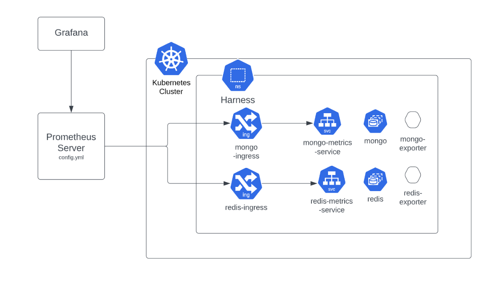
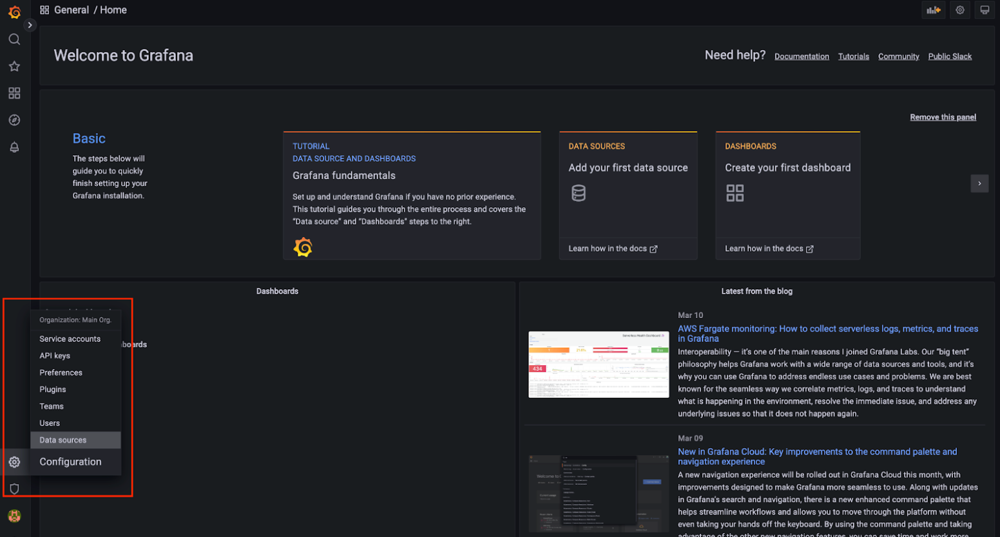

```mdx-code-block
import Tabs from '@theme/Tabs';
import TabItem from '@theme/TabItem';
```

Monitor the infrastructure components of your Harness Self-Managed Enterprise Edition installation by bringing your own open-source monitoring system, such as Prometheus, and integrating with observability tools, such as Grafana.

To demonstrate how you can monitor database applications, like MongoDB, Postgres, or Redis, for the Harness Self-Managed Enterprise Edition, this topic describes how you can use a Prometheus server installed in a Kubernetes cluster outside of Harness services. In this example, the monitored target application is present in one cluster, and Prometheus and Grafana are installed in another cluster.

The example setup uses two clusters to demonstrate the use of an ingress controller using LoadBalancer with an external Prometheus server.

<figure>



<figcaption>Figure 1: Example monitoring setup</figcaption>

</figure>

## Requirements

This example setup requires:
- Kubernetes 1.22+ (Harness recommends 1.23)
- Helm 3.2.0+
- Prometheus version: Bitnami/kube-prometheus 8.4.0+
- Istio version 1.15.3
- Nginx version v1.0.0-alpha.2

:::info note
For this example, we use the Prometheus operator packaged by Bitnami as an external Prometheus setup.
:::

## Configure metrics and ingress rules

Follow the steps below on the Kubernetes cluster where you deploy your Harness instance:

1. Add the following overrides to enable database metrics. This updates your Harness installation and your existing overrides.

   ```
   platform:
      mongodb:
        metrics:
          enabled: true
      timescaledb:
        prometheus:
          enabled: true
      redis:
        metrics:
          enabled: true
   ```

2. Create an ingress file for `metrics`, with defined routing rules that forward requests to an internal service exposing metrics with a similar configuration.

   ```
     apiVersion: networking.k8s.io/v1
     kind: Ingress
     metadata:
       name: mongo-metrics
       namespace: gcloud
       annotations:
         nginx.ingress.kubernetes.io/whitelist-source-range: "10.116.1.26"
         nginx.ingress.kubernetes.io/rewrite-target: /$2
     spec:
       ingressClassName: harness
     rules: 
      - http:
         paths: 
         - path: /mongo-metrics
           pathType: ImplementationSpecific
           backend:
             service:
               name: mongodb-replicaset-chart-metrics
               port:
                 number: 9216
   ```
  :::info note
   Add your IPs to your allow list so the metrics exposed by the ingress are only accessible internally. The IP included in the allow list is the external IP for the node where you host Prometheus in a separate cluster.
  :::

## Configure Prometheus to integrate with Harness

To integrate Prometheus with your Harness instance, follow the instructions below for your type of installation:

```mdx-code-block
<Tabs>
  <TabItem value="Kubernetes operator by Bitnami" default>
```

To use a Kubernetes operator by Bitnami, do the following:

1. Go to [Bitnami kube-prometheus charts](https://github.com/bitnami/charts/tree/main/bitnami/kube-prometheus).

2. Under **Custom Resources → monitoring.coreos.com → Prometheus**, make the following changes to the CRD to enable adding additional scrape configs under `spec.additionalScrapeConfigs`.

3. Provide the name of the secret you want to add in the `config.yaml` file.

   ```
   spec:
     additionalScrapeConfigs:
       key: config.yml
       name:harness-metrics
   ```

4. Create a `harness-metrics` secret in the same namespace where the Prometheus operator is installed. This secret passes a `config.yaml` file as the data. The data contains the job for the `additionalScrapeConfigs` in the following manner.

   ```
   - job_name:mongo-metrics-test
     scrape_interval:30s
     metrics_path: /mongo-metrics/metrics
     static_configs:
     - targets:
       - <LB-IP>
   - job_name:redis-metrics-test
     scrape_interval:30s
     metrics_path: /redis-metrics/metrics
     static_configs:
     - targets:
       - <LB-IP>
   - job_name:postgres-metrics-test
     scrape_interval:30s
     metrics_path: /postgres-metrics/metrics
     static_configs:
   - targets:
     - <LB-IP>
  ```

5. Run the following command to create the secret:

   ```
   kubectl create secret generic harness-metrics --from-file config.yml -n <Namespace>
   ```

  Prometheus can now scrape the metrics for MongoDB on the URL:
  `http://<LB-IP>/mongo-metrics/metrics`.

 :::info note
   Because the URL is on your allow list, other users are not able to view the internal metrics of specific infra components, such as MongoDB.
 :::

```mdx-code-block
  </TabItem>
  <TabItem value="Standalone prometheus">
```

If you have Prometheus installed, you can make changes directly to your Prometheus `config.yaml` file by adding fields under scrape configs.

To use a standalone Prometheus installation with a customer configuration, do the following:

1. Update your `config.yaml` file with the following settings:

    ```
    scrape_configs:
    - job_name:mongo-metrics-test
      scrape_interval:30s
      metrics_path:/mongo-metrics/metrics
      static_configs:
      - targets:
        - <LB-IP>
    - job_name:redis-metrics-test
      scrape_interval:30s
      metrics_path:/redis-metrics/metrics
      static_configs:
      - targets:
        - <LB-IP>
    - job_name:postgres-metrics-test
      scrape_interval:30s
      metrics_path:/postgres-metrics/metrics
      static_configs:
      - targets:
        -<LB-IP>
  ```

```mdx-code-block
  </TabItem>
</Tabs>
```

## View metrics on the Granfana dashboard

To visualize metrics from various sources, you can import Grafana dashboards.

Follow the below steps on your Kubernetes cluster to deploy Grafana:

1.  Install Grafana using the Helm chart.

  ```
  helm repo add grafana https://grafana.github.io/helm-charts
  helm repo update
  helm install grafana grafana/grafana -n <Namespace>
  ```

2. Using Grafana operator - Install a bitnami packaged Grafana Operator, documentation steps are mentioned here - Grafana Operator Installation.

## Open the Grafana dashboard

1. Decode the secret. The login username is `admin` by default.
2. Execute the port-forward command to host Grafana locally on port 3000.

  ```
  kubectl get secret --namespace <Namespace> grafana -o jsonpath="{.data.admin-password}" | base64 --decode ; echo

  export POD_NAME=$(kubectl get pods --namespace <Namespace> -l "app.kubernetes.io/name=grafana,app.kubernetes.io/instance=grafana" -o jsonpath="{.items[0].metadata.name}")

  kubectl --namespace default port-forward $POD_NAME 3000
  ```

3. Sign in to the Grafana dashboard home page.

4. Set Prometheus as the datasource:
  
  Go to settings, select **Data sources**. Then, select **Add data source**. Select **Prometheus**.

  
 
5. Configure the URL settings to connect to your locally-hosted Prometheus setup, with the locally-hosted Grafana instance. 

6. Deploy prometheus and grafana on the same cluster, and use kubeDNS resolution. For example, if you want to connect pod A to pod B, on pod A, the hostname of B should be:

  `http://serviceNameOfPodB.<namespaceOfPodB>.svc.cluster.local:<port>`

  This requires the following information: 

    - Service name of where prometheus is hosted. 
    - Namespace in which prometheus is hosted. 
    - Port at  which prometheus is hosted.

  This makes our present URL look like: 

  `http://my-release-kube-prometheus-prometheus.default.svc.cluster.local:9090/`

  :::caution
  The final URL should be similar to the above URL, according to your system specifications. Any extra space or character in the URL field causes the data source testing to fail. 
  :::

7. Configure the **Prometheus type** and **Prometheus version** fields.

8. Select **Save & test**. A confirmation that the data source is working displays. 

### Add a Grafana dashboard

Now you can add a dashboard to view metrics via query.

- To add a dashboard, go to Go to **Dashboards** and then select **New Dashboard** and **Add a new panel**. 

Here are some sample open source dashboards:

- [MongoDB](https://github.com/dcu/mongodb_exporter/blob/master/grafana_dashboards/dashboard.json)

- [Redis](https://github.com/oliver006/redis_exporter/blob/master/contrib/grafana_prometheus_redis_dashboard.json)

- [Timescale/Postgres](https://github.com/prometheus-community/postgres_exporter/blob/master/postgres_mixin/dashboards/postgres-overview.json)
