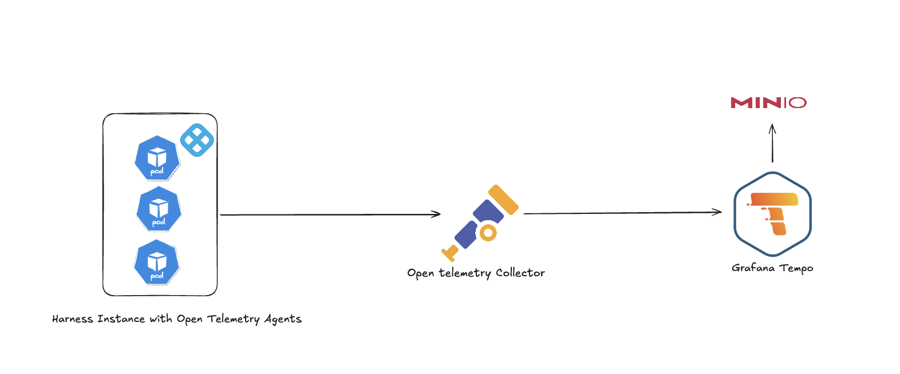
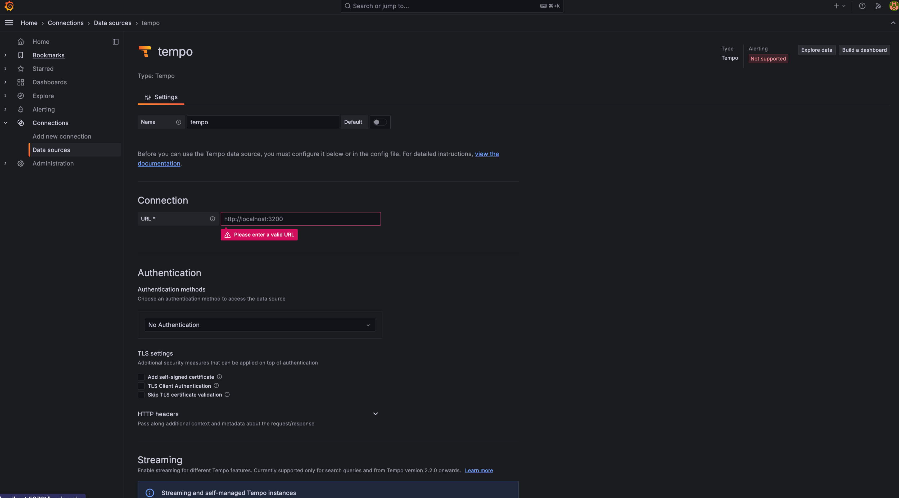
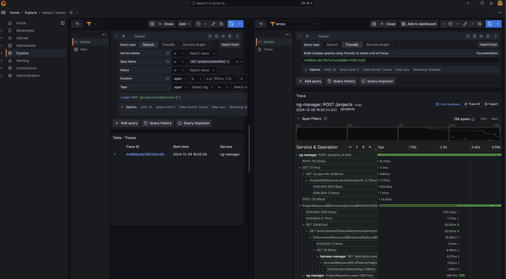
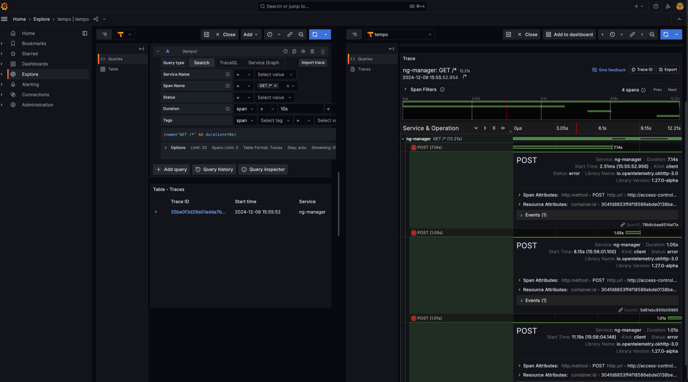

## Enable Tracing in Harness Services

The following Harness services(Platform, CD, CI, IACM, SSCA) support OpenTelemetry tracing:

- access-control, harness-manager, ng-manager, platform-service, pipeline-service, ci-manager, sto-manager, cv-nextgen, iacm-manager, audit-event-streaming, debezium-service, template-service, idp-service, ssca-manager.

### Common Global Configuration

  ```yaml
  global:
    monitoring:
      otel:
        enabled: true
        collectorEndpoint: http://opentelemetry-collector.otel.svc.cluster.local:4317/
  ```

## Overview of Tracing Architecture

The tracing setup for Harness leverages OpenTelemetry to capture distributed traces across services, enabling deeper observability and troubleshooting. 

<figure>



<figcaption> Overview of Tracing Architecture for Harness Self-Managed Enterprise Edition.</figcaption>

</figure>

The architecture follows this flow:

  1. Harness Instance with OpenTelemetry Agents: Each service in the Harness cluster is instrumented with OpenTelemetry agents to generate trace data.

  2. OpenTelemetry Collector: Trace data is sent to the collector, which processes, batches, and exports it to supported backends.

  3. Grafana Tempo: The collector forwards the traces to Grafana Tempo, a high-scale distributed tracing backend.

  4. MinIO: Tempo stores the trace data in an object store, such as MinIO, for durability and querying.

## Install Grafana Tempo (Optional)

Grafana Tempo is used to store and query trace data collected via OTel.

### Step 1: Install MinIO for Trace Storage (Optional)

- Create a file named `minio.yaml`:

    ```yaml
    fullnameOverride: "minio"
    mode: standalone
    provisioning:
      enabled: true
      buckets:
      - name: tempo
        region: us-east-1
        lifecycle:
          - id: 7dRetention
            expiry:
              days: 7
              nonconcurrentDays: 3
        tags:
          owner: tempo
    persistence:
      size: 20Gi
    auth:
      rootUser: admin
      rootPassword: "admin123"
    ```

- Install MinIO:

    ```bash
    helm repo add bitnami https://charts.bitnami.com/bitnami
    helm install minio bitnami/minio -f minio.yaml -n tempo --create-namespace
    ```

### Step 2: Install Tempo Distributed

- Create a file `tempo.yaml` with appropriate overrides.

- Install Tempo:

    ```bash
    helm repo add grafana https://grafana.github.io/helm-charts
    helm install tempo-distributed grafana/tempo-distributed -f tempo.yaml -n tempo
    ```

## Configure Grafana with Tempo as Trace Datasource

<figure>



<figcaption> Configure Tempo in Grafana</figcaption>

</figure>

In Grafana:

- Go to **Settings > Data Sources**
- Add a new **Tempo** data source
- If everything is deployed in the same namespace, set the URL as:

  ```http
  http://tempo-distributed-gateway.tempo.svc.cluster.local:80/
  ```

## Install OpenTelemetry Collector (Optional)

This step allows fine-grained control over trace ingestion, processing, and exporting.

### Step 1: Create a Collector Override

Create a file `otel-collector.yaml` and define the receivers, exporters, and pipelines.

### Step 2: Install Collector

  ```bash
    helm repo add open-telemetry https://open-telemetry.github.io/opentelemetry-helm-charts
    helm install opentelemetry-collector open-telemetry/opentelemetry-collector -f otel-collector.yaml -n otel --create-namespace
  ```

## Visualize Traces in Grafana

Once traces flow from Harness services through the OTel Collector and are stored in Tempo, you can use the **Traces** tab in Grafana to:

- Query traces by service name
- Explore duration, calls, and trace sizes
- Debug performance bottlenecks and error spikes

<figure>



<figcaption> Example of browsing traces</figcaption>

</figure>

<figure>



<figcaption> Example of browsing traces</figcaption>

</figure>

## Summary

This setup provides end-to-end distributed tracing visibility into Harness using:

- OpenTelemetry for instrumentation
- Tempo for trace storage and query
- Grafana for visualization

With minimal effort, you now gain deep insight into request flows across services, aiding performance debugging and reliability engineering.

