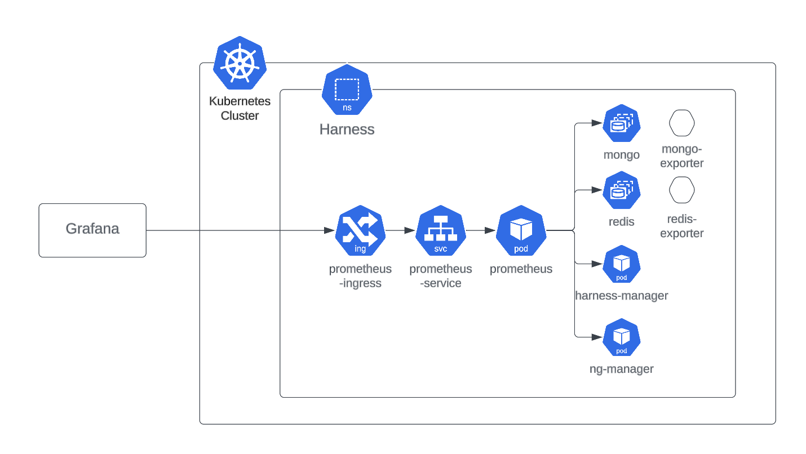

# Monitoring Options

You can monitor the infrastructure components of your Harness Self-Managed Enterprise Edition installation by bringing your own open-source monitoring system, such as Prometheus, and integrating with observability tools like Grafana.

Harness monitoring options enable you to collect and view system and service metrics, visualize them using dashboards, and configure alerts to proactively detect issues in your deployment.

---

## Requirements

Before getting started, ensure that the following requirements are met:

- Your services expose a `/metrics` endpoint, for example: `ng-manager:8889/metrics`.
- Prometheus is installed in the same Kubernetes cluster as your Harness services.
- You have access to configure Prometheus either internally or via an ingress-based endpoint for external tools like Grafana.

<figure>



<figcaption>Figure 1: Example of a monitoring setup for Harness Self-Managed Enterprise Edition.</figcaption>

</figure>

---

## Enabling Prometheus Metrics in Harness Services

To make your Harness components and databases export metrics to Prometheus, add the following values to your Helm release using a `monitoring.yaml` override file. You can find the base example in the [Harness Helm charts repository](https://github.com/harness/helm-charts/blob/main/src/harness/monitoring.yaml).

> :::info
> This example uses the Bitnami-packaged Prometheus operator as the metrics collection engine.
> :::

```yaml
bootstrap:
  database:
    mongodb:
      metrics:
        enabled: true
      podAnnotations:
        prometheus.io/path: /metrics
        prometheus.io/port: '9216'
        prometheus.io/scrape: 'true'
    redis:
      metrics:
        enabled: true
      podAnnotations:
        prometheus.io/path: /metrics
        prometheus.io/port: '9121'
        prometheus.io/scrape: 'true'
    timescaledb:
      prometheus:
        enabled: true
      podAnnotations:
        prometheus.io/path: /metrics
        prometheus.io/port: '9187'
        prometheus.io/scrape: 'true'
    postgresql:
      metrics:
        enabled: true
      primary:
        podAnnotations:
          prometheus.io/path: /metrics
          prometheus.io/port: '9187'
          prometheus.io/scrape: 'true'
global:
  monitoring:
    enabled: true
    port: 8889
    path: /metrics
```

Once these values are applied and Prometheus is set up using the [Install Prometheus](./install-prometheus.md) guide, metrics will be automatically scraped and visualized using your chosen observability tools.
