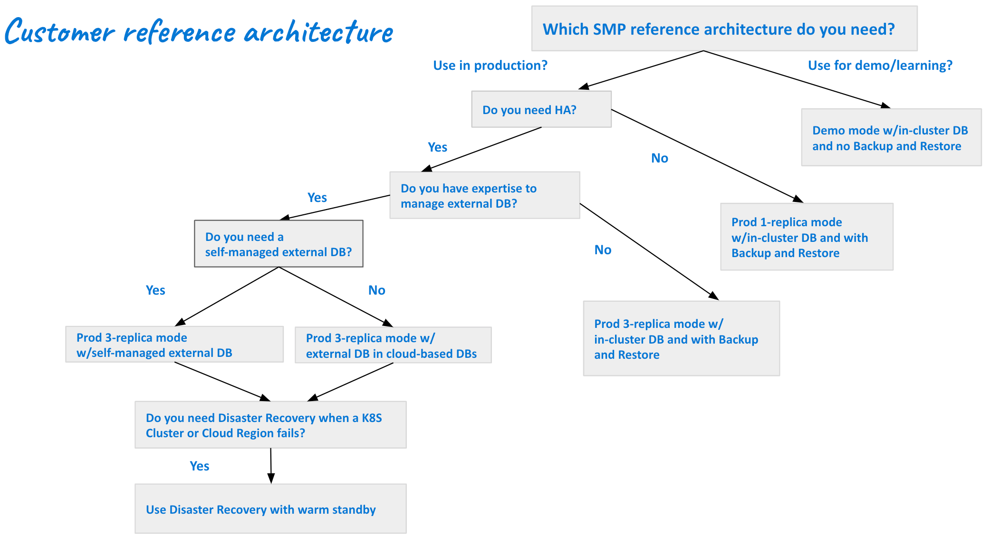

import Tabs from '@theme/Tabs';
import TabItem from '@theme/TabItem';

Harness Self-Managed Enterprise Edition brings a robust and flexible software delivery platform to organizations seeking control over their deployment infrastructure. This topic describes user profiles and reference architectures, outlining the key components and best practices for implementing Harness Self-Managed Enterprise Edition. Organizations can optimize their software delivery platform with these architectures, ensuring reliability, scalability, and consistent software deployments.

## User profiles

There are four user profiles for Harness Self-Managed Enterprise Edition.

- **Demo:** This profile for up to 10 users is for demonstration purposes to allow you to test Harness Self-Managed Enterprise Edition before onboarding. This profile enables you to run up to four simultaneous executions across two modules, CI and CD.
- **Small:** This profile for up to 200 users requires a licensed version of Harness Self-Managed Enterprise Edition. This profile enables you to run up to 100 simultaneous executions across two modules, CI and CD.
- **Medium:** This profile for up to 1000 users requires a licensed version of Harness Self-Managed Enterprise Edition. This profile enables you to run up to 500 simultaneous executions across two modules, CI and CD.
- **Large:** This profile for up to 3000 users requires a licensed version of Harness Self-Managed Enterprise Edition. This profile enables you to run up to 1000 simultaneous executions across two modules, CI and CD.

### Profile size and module execution details

| **Size** | **# of users** | **Parallel executions (CD)** | **Parallel executions (CI)** |
| :-- | :-- | :-- | :--
| Demo|Up to 10|2|2
| Small|Up to 200|50|50
| Medium|Up to 1000|250|250
| Large|Up to 3000|500|500

### Demo user requirements

Core CPU and memory requirements depend on the modules you use for demo purposes. CI and CD require a minimum of 3 core CPUs and 14-Gi of memory.

### Override files

Override files are available in the Harness [Helm chart repo](https://github.com/harness/helm-charts/blob/main/src/harness/).

- Demo: `override-demo.yaml`
- Small: `override-small.yaml`
- Medium: `override-medium.yaml`
- Large: `override-large.yaml`

#### Example installation and upgrade commands

You can use the following commands to upgrade/install via Helm for each profile. For complete Helm installation instructions, go to [Install using Helm](/docs/self-managed-enterprise-edition/install/install-using-helm).

##### Demo

   ```
   helm install my-release harness/harness-prod -n <namespace> -f your-override.yaml -f override-demo.yaml
   ```

   ```
   helm upgrade my-release harness/harness-prod -n <namespace> -f your-override -f override-demo.yaml
   ```

##### Small

```
helm install my-release harness/harness-prod -n <namespace> -f your-override -f override-small.yaml
```

```
helm upgrade my-release harness/harness-prod -n <namespace> -f your-override -f override-small.yaml
```

#### Medium

```
helm install my-release harness/harness-prod -n <namespace> -f your-override -f override-medium.yaml
```

```
helm upgrade my-release harness/harness-prod -n <namespace> -f your-override -f override-medium.yaml
```

##### Large

```
helm install my-release harness/harness-prod -n <namespace> -f your-override -f override-large.yaml
```

```
helm upgrade my-release harness/harness-prod -n <namespace> -f your-override -f override-large.yaml
```

## Customer reference architectures

Reference architectures enable organizations to fully utilize Harness Self-Managed Enterprise Edition for a customized, secure, and scalable continuous delivery process.

These architectures aim to simplify the process of setting up Harness Self-Managed Enterprise Edition. However, the determination of the architecture that best suits your organization's specific requirements can be difficult. Careful consideration and evaluation of the requirements are necessary to determine the optimal reference architecture for the intended setup.

### Scalability and performance

Harness Self-Managed Enterprise Edition is designed to scale with your organization's growing needs. This reference architecture details strategies to ensure optimal performance and scalability, allowing you to handle varying workloads and deploy applications efficiently.

### High availability and fault tolerance

Achieving high availability and fault tolerance is paramount for mission-critical applications. The reference architecture outlines deployment patterns and configurations to ensure continuous availability, even in the face of unexpected failures.

### Customization and extensibility

Recognizing that each organization has unique requirements, this reference architecture explores customization options and extensibility features. It empowers users to tailor the Harness platform to specific workflows and integrations, ensuring a personalized and efficient continuous delivery pipeline.



<Tabs>

  <TabItem value="Demo mode" label="Demo mode">

The demo mode reference architecture is designed for demonstration and learning purposes and includes an in-cluster database, but doesn't include backup and restore.

</TabItem>
  <TabItem value="Prod 1 replica mode w/in-cluster DB and Backup and Restore" label="Prod 1 replica mode w/in-cluster DB and Backup and Restore">

Prod 1 replica mode w/in-cluster DB and Backup and Restore is designed for organizations that use Harness Self-Managed Enterprise Edition in production but do not require HA.

</TabItem>
  <TabItem value="Prod 3 replica mode w/in-cluster DB and Backup and Restore" label="Prod 3 replica mode w/in-cluster DB and Backup and Restore">

Prod 3 replica mode w/in-cluster DB and Backup and Restore is designed for organizations that:

- Use Harness Self-Managed Enterprise Edition in production
- Require HA
- Do not have the ability to manage external DBs

</TabItem>
  <TabItem value="Prod 3 replica mode w/self-managed external DB" label="Prod 3 replica mode w/self-managed external DB">

Prod 3 replica mode w/self-managed external DB is designed for organizations that:

- Use Harness Self-Managed Enterprise Edition in production
- Require HA
- Have the need and ability to manage external DBs

## Database options

You can configure any of the following external databases with Harness Self-Managed Enterprise Edition:

- [Cloud-based MongoDB](/docs/self-managed-enterprise-edition/advanced-configurations/external-db/use-an-external-mongodb-database)
- [Self-managed MongoDB](/docs/self-managed-enterprise-edition/advanced-configurations/external-db/use-an-external-self-managed-mongodb)
- [Self-managed PostgreSQL](/docs/self-managed-enterprise-edition/advanced-configurations/external-db/use-an-external-postgres-database)
- [Self-managed Redis](/docs/self-managed-enterprise-edition/advanced-configurations/external-db/use-an-external-redis-database)
- [Self-managed TimescaleDB](/docs/self-managed-enterprise-edition/advanced-configurations/external-db/use-an-external-sm-timescaledb)

</TabItem>
  <TabItem value="Prod 3 replica mode w/external cloud-based DBs" label="Prod 3 replica mode w/external cloud-based DBs">

Prod 3 replica mode w/external cloud-based DBs is designed for organizations that:

- Use Harness Self-Managed Enterprise Edition in production
- Require HA
- Don't need self-managed external DBs.

</TabItem>
  <TabItem value="Disaster recovery w/warm standby" label="Disaster recovery w/warm standby">

Disaster recovery w/warm standby is designed for organizations that:

- Use Harness Self-Managed Enterprise Edition in production
- Require HA
- Have the expertise to manage external DBs
- Require self-managed external DBs
- Require DR when a Kubernetes cluster or cloud region fails

For more information, go to [Set up disaster recovery](/docs/self-managed-enterprise-edition/advanced-configurations/set-up-disaster-recovery).

</TabItem>
</Tabs>

## Benefits of the reference architectures

- **Best practices guidance:** Leverage industry standards and Harness's expertise to improve your workflows.

- **Optimized performance:** Implement configurations and optimizations that ensure optimal performance, enabling your organization to deploy applications quickly and reliably.

- **Ease of maintenance:** Set up a robust architecture that minimizes downtime and simplifies maintenance tasks, ensuring an efficient environment.
