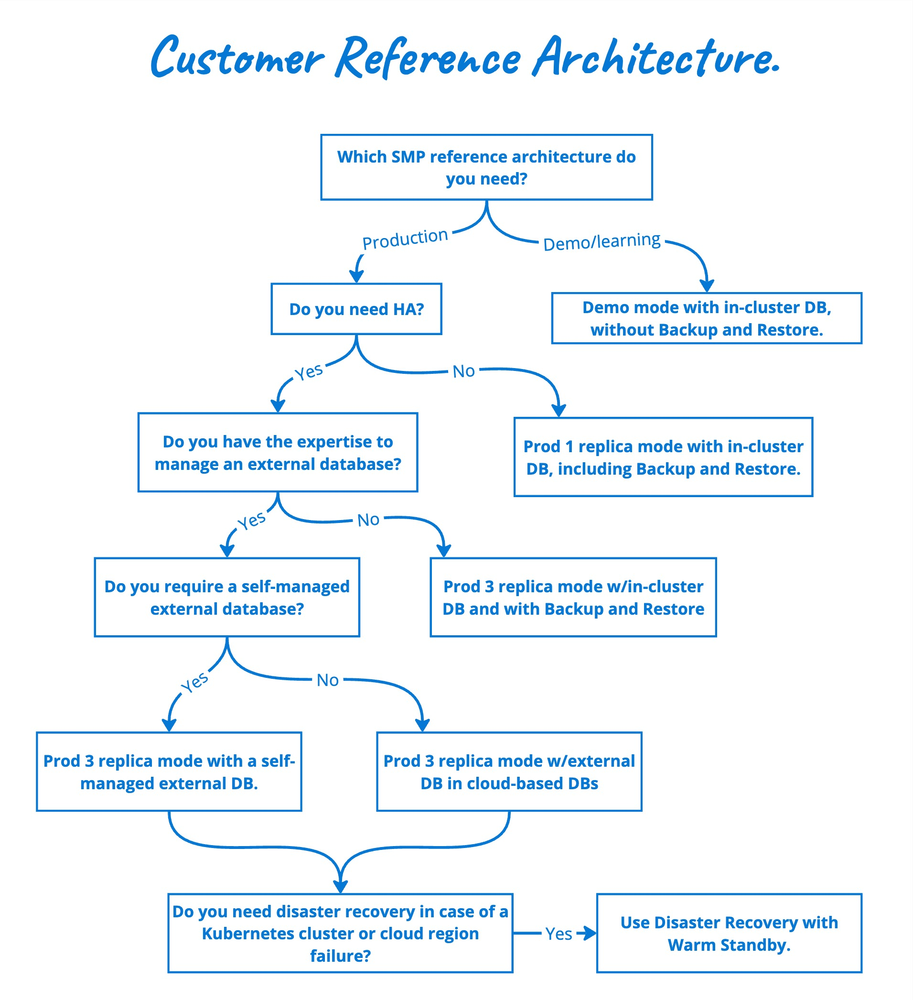

import Tabs from '@theme/Tabs';
import TabItem from '@theme/TabItem';

Harness Self-Managed Enterprise Edition brings a robust and flexible software delivery platform to organizations seeking control over their deployment infrastructure. This topic describes user profiles and reference architectures, outlining the key components and best practices for implementing Harness Self-Managed Enterprise Edition. 

Organizations can optimize their software delivery platform with these architectures, ensuring reliability, scalability, and consistent software deployments.

## Environment Profiles  

Harness Self-Managed Enterprise Edition offers four environment profiles based on team size and execution capacity:  

| **Environment** | **Users**  | **Parallel Executions (CI)** | **Parallel Executions (CD)** |
|-----------------|------------|------------------------------|------------------------------|
| **Demo**        | Up to 10   | 2                            | 2                            |
| **Small**       | Up to 200  | 50                           | 50                           |
| **Medium**      | Up to 1000 | 250                          | 250                          |
| **Large**       | Up to 3000 | 500                          | 500                          |

The **Demo** environment is for testing, while **Small, Medium, and Large** require a licensed version.

### Demo user requirements

Core CPU and memory requirements depend on the modules you use for demo purposes. CI and CD require a minimum of 3 core CPUs and 14-Gi of memory.

### Override files

Override files are available in the Harness [Helm chart repo](https://github.com/harness/helm-charts/blob/main/src/harness/).

- Demo: `override-demo.yaml`
- Small: `override-small.yaml`
- Medium: `override-medium.yaml`
- Large: `override-large.yaml`

### Installation and Upgrade commands

You can use the following commands to upgrade/install via Helm for each profile. For complete Helm installation instructions, go to [Install using Helm](/docs/self-managed-enterprise-edition/install/install-using-helm).

As shown below, you can replace the file name `<OVERRIDE-FILE>` placeholder with one of the override files listed above.
 
<Tabs>
<TabItem value="Dinstall" label="Install">
  
   ```
   helm install my-release harness/harness-prod -n <namespace> -f your-override.yaml -f <OVERRIDE-FILE>.yaml
   ```
</TabItem>
<TabItem value="DUpgrade" label="Upgrade">
  
   ```
   helm upgrade my-release harness/harness-prod -n <namespace> -f your-override -f <OVERRIDE-FILE>.yaml
   ```
</TabItem>
</Tabs>

**For Example**, Let's use the **`Demo`** override file.

<Tabs>
<TabItem value="Demo install" label="Install">
  
   ```
   helm install my-release harness/harness-prod -n <namespace> -f your-override.yaml -f override-demo.yaml
   ```
</TabItem>
<TabItem value="Demo Upgrade" label="Upgrade">
  
   ```
   helm upgrade my-release harness/harness-prod -n <namespace> -f your-override -f override-demo.yaml
   ```
</TabItem>
</Tabs>


## Customer reference architectures

Reference architectures enable organizations to fully utilize Harness Self-Managed Enterprise Edition for a customized, secure, and scalable continuous delivery process.

These architectures aim to simplify the process of setting up Harness Self-Managed Enterprise Edition. However, the determination of the architecture that best suits your organization's specific requirements can be difficult. Careful consideration and evaluation of the requirements are necessary to determine the optimal reference architecture for the intended setup.

### Scalability and performance

Harness Self-Managed Enterprise Edition is designed to scale with your organization's growing needs. This reference architecture details strategies to ensure optimal performance and scalability, allowing you to handle varying workloads and deploy applications efficiently.

### High availability and fault tolerance

Achieving high availability and fault tolerance is paramount for mission-critical applications. The reference architecture outlines deployment patterns and configurations to ensure continuous availability, even in the face of unexpected failures.

### Customization and extensibility

Recognizing that each organization has unique requirements, this reference architecture explores customization options and extensibility features. It empowers users to tailor the Harness platform to specific workflows and integrations, ensuring a personalized and efficient continuous delivery pipeline.



<details>
  <summary>
    Demo mode
  </summary>
  The demo mode reference architecture is designed for demonstration and learning purposes and includes an in-cluster database, but doesn't include backup and restore.
</details>

<details>
  <summary>
    Prod 1 replica mode w/in-cluster DB and Backup and Restore
  </summary>
  Prod 1 replica mode w/in-cluster DB and Backup and Restore is designed for organizations that use Harness Self-Managed Enterprise Edition in production but do not require HA.
</details>

<details>
  <summary>
    Prod 3 replica mode w/in-cluster DB and Backup and Restore
  </summary>
  Prod 3 replica mode w/in-cluster DB and Backup and Restore is designed for organizations that:

    - Use Harness Self-Managed Enterprise Edition in production
    - Require HA
    - Do not have the ability to manage external DBs
</details>

<details>
  <summary>
    Prod 3 replica mode w/self-managed external DB
  </summary>
    Prod 3 replica mode w/self-managed external DB is designed for organizations that:

    - Use Harness Self-Managed Enterprise Edition in production
    - Require HA
    - Have the need and ability to manage external DBs

    ## Database options

    You can configure any of the following external databases with Harness Self-Managed Enterprise Edition:

    - [Cloud-based MongoDB](/docs/self-managed-enterprise-edition/advanced-configurations/external-db/use-an-external-mongodb-database)
    - [Self-managed MongoDB](/docs/self-managed-enterprise-edition/advanced-configurations/external-db/use-an-external-self-managed-mongodb)
    - [Self-managed PostgreSQL](/docs/self-managed-enterprise-edition/advanced-configurations/external-db/use-an-external-postgres-database)
    - [Self-managed Redis](/docs/self-managed-enterprise-edition/advanced-configurations/external-db/use-an-external-redis-database)
    - [Self-managed TimescaleDB](/docs/self-managed-enterprise-edition/advanced-configurations/external-db/use-an-external-sm-timescaledb)
</details>

<details>
  <summary>
    Disaster recovery w/warm standby
  </summary>
    Disaster recovery w/warm standby is designed for organizations that:

    - Use Harness Self-Managed Enterprise Edition in production
    - Require HA
    - Have the expertise to manage external DBs
    - Require self-managed external DBs
    - Require DR when a Kubernetes cluster or cloud region fails

    For more information, refer [Set up disaster recovery](/docs/self-managed-enterprise-edition/advanced-configurations/set-up-disaster-recovery).
</details>

## Benefits of the reference architectures

- **Best practices guidance:** Leverage industry standards and Harness's expertise to improve your workflows.

- **Optimized performance:** Implement configurations and optimizations that ensure optimal performance, enabling your organization to deploy applications quickly and reliably.

- **Ease of maintenance:** Set up a robust architecture that minimizes downtime and simplifies maintenance tasks, ensuring an efficient environment.
