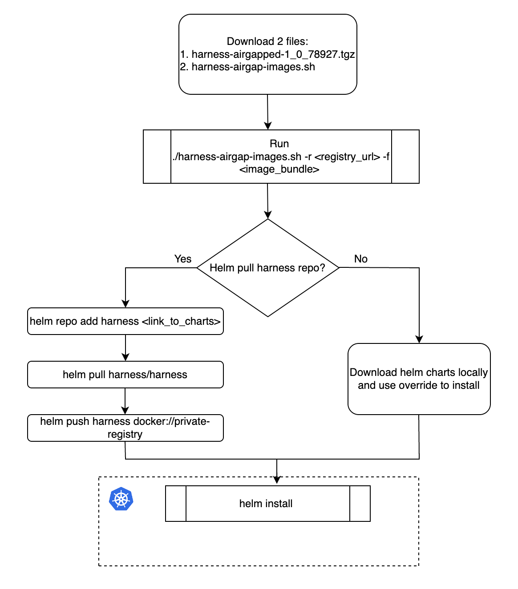

This topic explains how to use Helm to install the Harness Self-Managed Enterprise Edition in an air-gapped environment and how to obtain and transfer Docker images to a private registry with secure access. The steps include pulling Docker images, saving images as .tgz files, uploading to Google Cloud storage, downloading Helm charts, and pushing charts to your private repositories. This process ensures secure and seamless deployment of the Harness Self-Managed Enterprise Edition in restricted, offline environments.

Air-gapped environments are characterized by a lack of direct access to the internet, which provides an added layer of security for sensitive data and systems. This isolation poses unique challenges to deploy and update software applications, as standard methods of accessing resources, such as Docker images, are not possible.

The Harness Self-Managed Platform is designed to cater to various deployment scenarios, including an air-gapped environment. To facilitate this, the platform provides a secure and efficient method for obtaining and transferring Docker images to a private registry. This ensures that you can access, download, and push the required resources within your restricted network.

## Workstation requirements

- A minimum of 150GB of free disk space to download and extract the Harness airgap bundle

- ECR/GCR/private registry details to tag and push images

- Kubernetes cluster

- Latest version of Helm 

- Access to Helm charts or [download locally](https://github.com/harness/helm-charts/releases)

- Access to [the Harness airgap bundle on GCP](https://storage.googleapis.com/smp-airgap-bundles/harness-airgapped-1_0_78927.tgz) 

- Kubernetes version 1.22+ (Harness recommends v1.23.x)

## Required images

If your cluster is in an air-gapped environment, your deployment requires the following images:

- docker.io/harness/gitops-service-signed:v0.62.4
- docker.io/harness/learning-engine-onprem-signed:66700
- docker.io/bitnami/minio:2022.8.22-debian-11-r0
- docker.io/bitnami/mongodb:4.4.15
- docker.io/bitnami/postgresql:14.4.0-debian-11-r9
- docker.io/harness/accesscontrol-service-signed:78001
- docker.io/harness/batch-processing-signed:78605-000
- docker.io/harness/cdcdata-signed:78426
- docker.io/harness/ce-anomaly-detection-signed:12
- docker.io/harness/ce-cloud-info-signed:0.22.0
- docker.io/harness/ce-nextgen-signed:78700-000
- docker.io/harness/ci-manager-signed:2804
- docker.io/harness/ci-scm-signed:release-114-ubi
- docker.io/harness/cv-nextgen-signed:78426
- docker.io/harness/dashboard-service-signed:v1.53.0.0
- docker.io/harness/delegate-proxy-signed:78312
- docker.io/harness/error-tracking-signed:5.14.2
- docker.io/harness/et-collector-signed:5.14.0
- docker.io/harness/event-service-signed:77317
- docker.io/harness/ff-pushpin-signed:1.0.3
- docker.io/harness/ff-pushpin-worker-signed:1.945.0
- docker.io/harness/ff-server-signed:1.945.0
- docker.io/harness/gateway-signed:2000149
- docker.io/harness/helm-init-container:latest
- docker.io/harness/le-nextgen-signed:67500
- docker.io/harness/looker-signed:23.2.31
- docker.io/harness/manager-signed:78426
- docker.io/harness/mysql:enterprise-server-8.0.32
- docker.io/harness/ng-ce-ui:0.26.3
- docker.io/harness/policy-mgmt:v1.49.0
- docker.io/harness/stocore-signed:v1.31.3
- docker.io/harness/stomanager-signed:79001-000
- docker.io/harness/telescopes-signed:10100
- docker.io/harness/ti-service-signed:release-149
- docker.io/harness/ui-signed:78400
- docker.io/harness/verification-service-signed:78426
- docker.io/ubuntu:20.04
- docker.io/harness/template-service-signed:78426
- docker.io/harness/ff-postgres-migration-signed:1.945.0
- docker.io/harness/ff-timescale-migration-signed:1.945.0
- docker.io/harness/helm-init-container:latest
- docker.io/harness/log-service-signed:release-18
- docker.io/harness/nextgenui-signed:0.339.19
- docker.io/harness/ng-auth-ui-signed:1.3.3
- docker.io/harness/ng-manager-signed:78426
- docker.io/harness/pipeline-service-signed:1.21.13
- docker.io/harness/platform-service-signed:78202
- docker.io/harness/redis:6.2.7-alpine
- docker.io/harness/ti-service-signed:release-149
- docker.io/timescale/timescaledb-ha:pg13-ts2.9-oss-latest
- docker.io/harness/ci-addon:1.16.4
- docker.io/harness/gitops-agent:v0.42.0
- docker.io/haproxy:2.0.25-alpine
- docker.io/redis:6.2.6-alpine
- docker.io/harness/delegate:latest
- docker.io/harness/upgrader:latest
- docker.io/harness/delegate:23.03.78312
- docker.io/harness/ci-lite-engine:1.16.4
- docker.io/bewithaman/s3:latest
- docker.io/harness/sto-plugin:latest
- docker.io/harness/upgrader:latest
- docker.io/curlimages/curl:latest

## Installation workflow

The flowchart below shows the air-gapped environment installation workflow steps.



## Download required files

To begin your installation, download the following files:
- Harness air-gapped bundle [harness-airgapped-1_0_78927.tgz](https://storage.googleapis.com/smp-airgap-bundles/harness-airgapped-1_0_78927.tgz)
- Harness airgap images [harness-airgap-images.sh](https://storage.googleapis.com/smp-airgap-bundles/harness-airgap-images.sh)

## Set Docker architecture

Air-gapped environment installation requires Docker build architecture amd64.

Run the following command before you save Docker images to your private registry.

 `export DOCKER_DEFAULT_PLATFORM=linux/amd64`

## Save Docker images to your private registry

To save Docker images, do the following:

1. Sign in to your private registry.
    ```
    #Authenticate with Docker for Docker Registry
    docker login <registry-url>

    #Authenticate with Google Cloud Platform for GCR
    gcloud auth login

    #Authenticate with AWS for ECR
    aws ecr get-login-password --region <region> | docker login --username AWS --password-
    ```
    All Docker files required to deploy Harness are stored in `harness-airgapped.tgz`.
2. Add the `harness-airgapped.tgz` and `harness-docker-images.txt` to your air-gapped network. You can now push your images locally.
3. Run `harness-airgap-images.sh`.
    ```
    ./harness-airgap-images.sh -r <REGISTRY.YOURDOMAIN.COM:PORT> -f harness-airgapped.tgz
    ````
    
## Download and push Helm charts
After you save Docker images to your private registry, you must download the Helm charts and push them to your repository.

To download and push Helm charts:

You can use Helm to pull the chart and push it to your private repository or download the chart directly.

- 
    ``` 
    helm repo add harness https://harness.github.io/helm-charts
    helm pull harness/harness 
    helm push harness docker://private-repo
    ```

To download the Helm chart:
 
 - Download the chart from the [Harness repository](https://github.com/harness/helm-charts/releases).

## Install via Helm
Next, you are ready to install via Helm by updating your `override.yaml` file with your private registry information.

To install via Helm, do the following:

1. Update the `override.yaml` file with your private registry information.
    ```
    global:
      imageRegistry: "private-123.com"
    ```
2. Run the Helm install command.
    ```
    helm install my-release harness/harness -n <namespace> -f override.yaml
    ```
