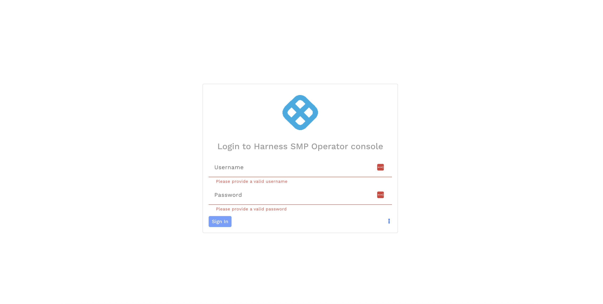
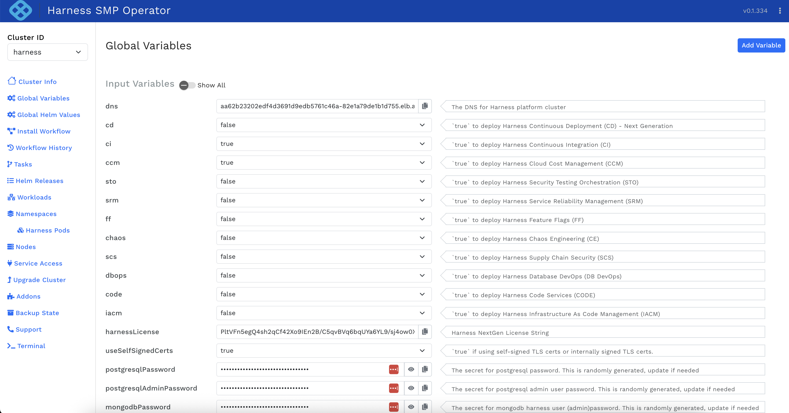
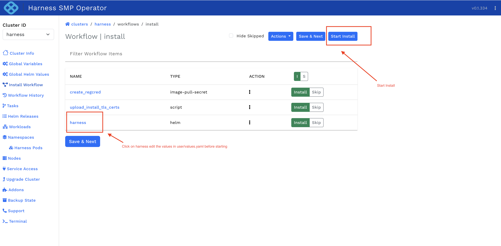
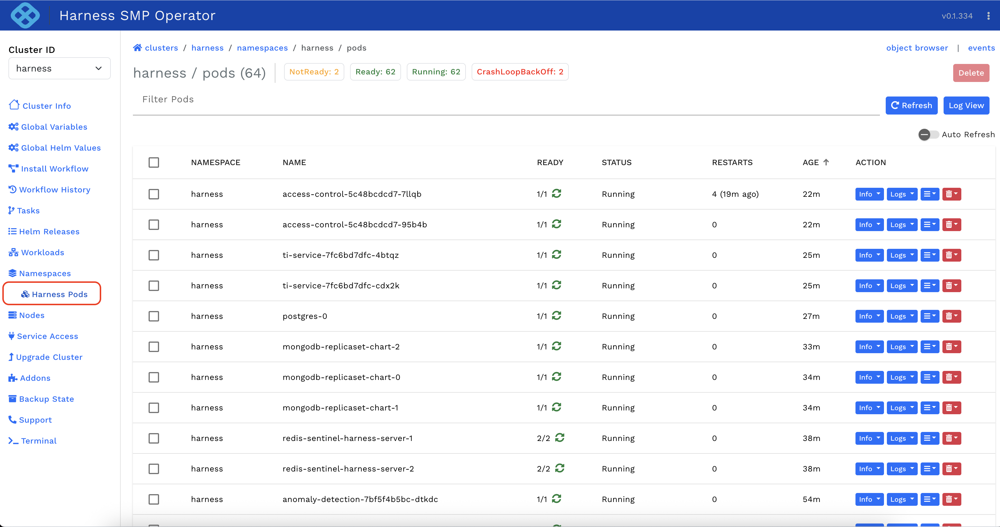

import Tabs from '@theme/Tabs';
import TabItem from '@theme/TabItem';

This topic covers deploying the Harness SMP Operator into an existing Kubernetes cluster using either **helm** or the **clustermgr** CLI.

You can install the Harness SMP Operator in two ways:

- **helm** - Use the `platform-installer` Helm chart directly with `helm install`.
- **clustermgr** - Use the `clustermgr` CLI, which bootstraps the Helm chart for you.

Both methods deploy the same underlying Helm chart. Choose the method that fits your operational workflow.

---

## Prerequisites

The following table lists what each installation method requires, since `kubectl` and `helm` are mandatory for a Helm install but optional with clustermgr.

| Requirement | Helm | clustermgr | Description |
| --- | --- | --- | --- |
| **kubectl** | Required | Optional | Configured with cluster admin access |
| **helm** | Required | Optional | for Helm install |
| **Storage Class** | Required | Required | Dynamic volume provisioning |
| **DNS** | Required | Required | Externally resolvable hostname |
| **Registry Access** | Required | Required | Access to `pkg.harness.io` (online) or private registry (air-gap) |

---

## Step 1: Get the Installer

<Tabs>
<TabItem value="helm-t1" label="helm" default>

The `platform-installer` Helm chart can be downloaded in one of two ways:

**Option 1: Pull the chart and store it on the VM**

From a machine with internet access:

```bash
helm pull oci://pkg.harness.io/g_ix-gj_sisgiituoe06eq/cxe-public-helm/platform-installer --version <VERSION> -d .
```

This downloads `platform-installer-<VERSION>.tgz`. Transfer the `.tgz` to your jump box / VM that can reach the target cluster.

**Option 2: Push the chart to your own Helm repository**

```bash
helm pull oci://pkg.harness.io/g_ix-gj_sisgiituoe06eq/cxe-public-helm/platform-installer --version <VERSION> -d .
helm push platform-installer-<VERSION>.tgz oci://<your-registry>/<repo>
```

Then install from your own repository:

</TabItem>
<TabItem value="clustermgr-t1" label="clustermgr">

Download and extract the `clustermgr` CLI:

```bash
curl -L -o harness-clustermgr.tgz \
  "https://pkg.harness.io/pkg/G_iX-gJ_SiSGIITUoe06eQ/platform-installer/files/harness-clustermgr/<VERSION>/harness-clustermgr-<VERSION>-linux-amd64.tgz"

tar -xzf harness-clustermgr.tgz
cd harness-clustermgr
```

**Package contents:**

```text
harness-clustermgr/
├── clustermgr                    # CLI binary
├── config.yaml
├── harness/
│   ├── pi-values.yaml            # Go template, resolved at install time
│   └── platform-installer-*.tgz  # Helm chart
├── values-migrator/
│   └── generate-harness-values.sh  # Migration script for existing Harness installs
└── tools/
    ├── kubectl
    ├── helm
    └── yq
```

</TabItem>
</Tabs>

---

## Step 2: Configure and Install

<Tabs>
<TabItem value="helm-t2" label="helm" default>

Create `override.yaml` with your base settings:

```yaml
# override.yaml
cluster:
  version: <WORKFLOW_VERSION>
  name: harness
  profile: <PROFILE>
  tfi:
    dns: <DNS>
    userEmail: <EMAIL>
    userPassword: <PASSWORD>
    storageClass: <STORAGE_TYPE>
    ingressType: <INGRESS_TYPE>
```

</TabItem>
<TabItem value="clustermgr-t2" label="clustermgr">

Replace the placeholders with your actual values:

```bash
./clustermgr install-pi \
  --dns <DNS> \
  --namespace <NAMESPACE> \
  --email <EMAIL> \
  --password '<PASSWORD>' \
  --version <WORKFLOW_VERSION> \
  --pi-set cluster.tfi.storageClass=<STORAGE_TYPE> \
  --pi-set cluster.profile=<PROFILE_TYPE>
```

</TabItem>
</Tabs>

---

### Install with Nginx

There are two Nginx scenarios depending on whether you want the installer to deploy `harness-nginx` or use an existing ingress controller.

#### Scenario 1: Deploy harness-nginx

Use this when you do not already have an ingress controller for the platform. The installer deploys `harness-nginx` for you, and by default it is exposed as LoadBalancer.

<Tabs>
<TabItem value="helm-t3" label="helm" default>

```yaml
# override-nginx-deploy.yaml
harness-nginx:
  enabled: true
ingressClassName: harness
```

```bash
helm install platform-installer ./platform-installer-<VERSION>.tgz -n harness --create-namespace \
  -f override.yaml \
  -f override-nginx-deploy.yaml
```

</TabItem>
<TabItem value="clustermgr-t3" label="clustermgr">

```bash
./clustermgr install-pi \
  --dns platform.example.com \
  --namespace harness \
  --email admin@example.com \
  --password 'SecurePassword123!' \
  --version 0.43.0 \
  --pi-set cluster.tfi.storageClass=gp2 \
  --pi-set cluster.profile=medium
```

</TabItem>
</Tabs>

#### Scenario 2: Use existing nginx ingress controller

Use this when your cluster already has an nginx ingress controller and you want to reuse it. In this case, keep `harness-nginx` disabled and point the installer to your existing ingress class (for example, `nginx`).

<Tabs>
<TabItem value="helm-t4" label="helm" default>

```yaml
# override-nginx-existing.yaml
ingressClassName: nginx
```

```bash
helm install platform-installer ./platform-installer-<VERSION>.tgz -n harness --create-namespace \
  -f override.yaml \
  -f override-nginx-existing.yaml
```

</TabItem>
<TabItem value="clustermgr-t4" label="clustermgr">

Use the same install command and set the existing ingress class:

```bash
./clustermgr install-pi \
  --dns platform.example.com \
  --namespace harness \
  --email admin@example.com \
  --password 'SecurePassword123!' \
  --version 0.43.0 \
  --pi-set cluster.tfi.storageClass=gp2 \
  --pi-set cluster.profile=medium \
  --pi-set ingressClassName=nginx
```

</TabItem>
</Tabs>

### Install with Istio

There are three Istio deployment scenarios depending on your cluster state.

#### Scenario 1: Fresh Istio install

No Istio exists in the cluster. The installer deploys the full Istio stack (istio-base, istiod, ingressgateway) along with the Gateway and VirtualService.

<Tabs>
<TabItem value="helm-t5" label="helm" default>

Use `override-istio-full.yaml` and install with Helm:

```yaml
# override-istio-full.yaml
cluster:
  workflows:
    IstioInstall:
      items:
        - name: istio-base
          initCfg:
            runOnInit: true
        - name: istiod
          initCfg:
            runOnInit: true
        - name: istio-ingressgateway
          initCfg:
            runOnInit: true
        - name: istio-gateway
          initCfg:
            runOnInit: true
        - name: istio-virtualservice
          initCfg:
            runOnInit: true
```

```bash
helm install platform-installer ./platform-installer-<VERSION>.tgz -n harness --create-namespace \
  -f override.yaml \
  -f override-istio-full.yaml
```

</TabItem>
<TabItem value="clustermgr-t5" label="clustermgr">

```bash
./clustermgr install-pi \
  --dns platform.example.com \
  --email admin@example.com \
  --password 'SecurePassword123!' \
  --version 0.43.0 \
  --pi-set cluster.profile=medium \
  -i ingressType=istio \
  -i istioInstall=true
```

</TabItem>
</Tabs>

#### Scenario 2: Existing Istio, no Gateway/VirtualService

Istio is already installed in the cluster but there is no Gateway or VirtualService configured for the platform. The installer skips Istio deployment and creates only the Gateway and VirtualService resources.

For certificate handling requirements with existing Istio, see [User has existing Istio](/docs/self-managed-enterprise-edition/smp-operator/prerequisites/dns-and-tls-certificates#scenario-2-you-have-existing-istio).

<Tabs>
<TabItem value="helm-t6" label="helm" default>

Use `override-istio-gateway-vs.yaml` and install with Helm:

```yaml
# override-istio-gateway-vs.yaml
cluster:
  workflows:
    IstioInstall:
      items:
        - name: istio-gateway
          initCfg:
            runOnInit: true
        - name: istio-virtualservice
          initCfg:
            runOnInit: true
```

```bash
helm install platform-installer ./platform-installer-<VERSION>.tgz -n harness --create-namespace \
  -f override.yaml \
  -f override-istio-gateway-vs.yaml
```

</TabItem>
<TabItem value="clustermgr-t6" label="clustermgr">

```bash
./clustermgr install-pi \
  --dns platform.example.com \
  --email admin@example.com \
  --password 'SecurePassword123!' \
  --version 0.43.0 \
  --pi-set cluster.profile=medium \
  -i ingressType=istio
```

</TabItem>
</Tabs>

#### Scenario 3: Existing Istio + Gateway

Istio and a Gateway already exist. The installer only creates the VirtualService, using the existing Gateway by name.

For certificate handling requirements with existing Istio, see [User has existing Istio](/docs/self-managed-enterprise-edition/smp-operator/prerequisites/dns-and-tls-certificates#scenario-2-you-have-existing-istio).


<Tabs>
<TabItem value="helm-t7" label="helm" default>

Use `override-istio-vs.yaml` and install with Helm:

```yaml
# override-istio-vs.yaml
cluster:
  tfi:
    istioGatewayName: my-gateway
    istioGatewayNamespace: istio-system
  workflows:
    IstioInstall:
      items:
        - name: istio-virtualservice
          initCfg:
            runOnInit: true
```

```bash
helm install platform-installer ./platform-installer-<VERSION>.tgz -n harness --create-namespace \
  -f override.yaml \
  -f override-istio-vs.yaml
```

</TabItem>
<TabItem value="clustermgr-t7" label="clustermgr">

```bash
./clustermgr install-pi \
  --dns platform.example.com \
  --email admin@example.com \
  --password 'SecurePassword123!' \
  --version 0.43.0 \
  --pi-set cluster.profile=medium \
  -i ingressType=istio \
  -i istioGatewayName=my-gateway \
  -i istioGatewayNamespace=istio-system
```

</TabItem>
</Tabs>

### Air-Gapped Install

After [mirroring images](/docs/self-managed-enterprise-edition/smp-operator/prerequisites/registry-setup) to your private registry:

<Tabs>
<TabItem value="helm-t8" label="helm" default>

Set private registry values in `override.yaml`:

```yaml
cluster:
  version: <WORKFLOW_VERSION>
  name: harness
  profile: <PROFILE>
  airGapEnabled: true
  imageRegistryHost: <YOUR_REGISTRY_HOST>
  imageRegistryPathPrefix: <YOUR_REGISTRY_PREFIX>
  imageRegistryUsername: <YOUR_REGISTRY_USERNAME>
  imageRegistryPassword: <YOUR_REGISTRY_PASSWORD>
  tfi:
    dns: <DNS>
    userEmail: <EMAIL>
    userPassword: <PASSWORD>
    storageClass: <STORAGE_TYPE>
    ingressType: <INGRESS_TYPE>
```

Then run:

```bash
helm install platform-installer ./platform-installer-<VERSION>.tgz -n harness --create-namespace \
  -f override.yaml \
  -f override-<ingress>.yaml
```

Replace `override-<ingress>.yaml` with one of: `override-nginx-deploy.yaml`, `override-nginx-existing.yaml`, `override-istio-full.yaml`, `override-istio-gateway-vs.yaml`, or `override-istio-vs.yaml`.

</TabItem>
<TabItem value="clustermgr-t8" label="clustermgr">

For nginx ingress:

```bash
./clustermgr install-pi \
  --dns platform.internal.example.com \
  --namespace harness \
  --registry-host harbor.internal.example.com \
  --registry-prefix harness-platform \
  --registry-user admin \
  --registry-password 'Harbor@123' \
  --email admin@example.com \
  --password 'SecurePass123!' \
  --version 0.43.0 \
  --pi-set cluster.triggerInstall=false \
  --pi-set cluster.tfi.storageClass=local-path \
  --pi-set cluster.profile=medium \
  -i airgap=true
```

For Istio:

```bash
./clustermgr install-pi \
  --dns platform.internal.example.com \
  --registry-host harbor.internal.example.com \
  --registry-prefix harness-platform \
  --registry-user admin \
  --registry-password 'Harbor@123' \
  --version 0.43.0 \
  --pi-set cluster.triggerInstall=false \
  --pi-set cluster.profile=medium \
  -i ingressType=istio \
  -i istioInstall=true \
  -i airgap=true
```

</TabItem>
</Tabs>

---

## Step 3: Access the Installer UI

After successful installation, access the UI at:

```text
https://<YOUR_DNS>/pi
```

Login with the email and password provided during installation.

---

## Step 4: Verify Installation

```bash
# Check pods
kubectl get pods -n harness | grep platform-installer

# Check statefulset
kubectl get statefulset -n harness

# View logs
kubectl logs -n harness platform-installer-0 -c pi
```

If all pods are **Running** and the UI is reachable over HTTPS at `/pi`, the installation is complete.

---

## Step 5: Configure and Deploy Harness

### Login to the Operator

In the browser, open `https://<YOUR_DNS>/pi` and enter the username and password provided during installation.

[](./static/operator-login.png)

### Enable Modules and Add License

Once logged in, navigate to **Global Variables**. Enable the required modules (e.g., `ci`, `ccm`, `cd`, etc.) and add the license key in the `harnessLicense` field.

[](./static/global-variables.png)

### Start the Install Workflow

Save the details and proceed to **Install Workflow**. If any updates are needed to the Harness `values.yaml`, click on **harness** and edit the values in `user/values.yaml` before starting.

Click **Start Install** to begin the Harness platform deployment.

[](./static/install-workflow.png)

### Monitor Progress

View the progress in **Harness Pods**. Wait for all pods to reach `Running` status.

[](./static/harness-pods.png)

### Create Harness Account

Once all pods are running, open the following URL in your browser to sign up and create credentials:

```text
https://<YOUR_DNS>/auth/#/signup
```

Once the account is created successfully, it redirects to the sign-in page to log in.

---

## Uninstall the operator

Remove the `platform-installer` Helm release when you no longer need the operator. Deleting the release preserves your data, so delete the persistent volume claim as well only if you want to remove the data too.

```bash
# Uninstall the installer (preserves data)
helm uninstall platform-installer -n harness

# Uninstall and delete PVC (removes all data)
helm uninstall platform-installer -n harness
kubectl delete pvc data-platform-installer-0 -n harness
```
