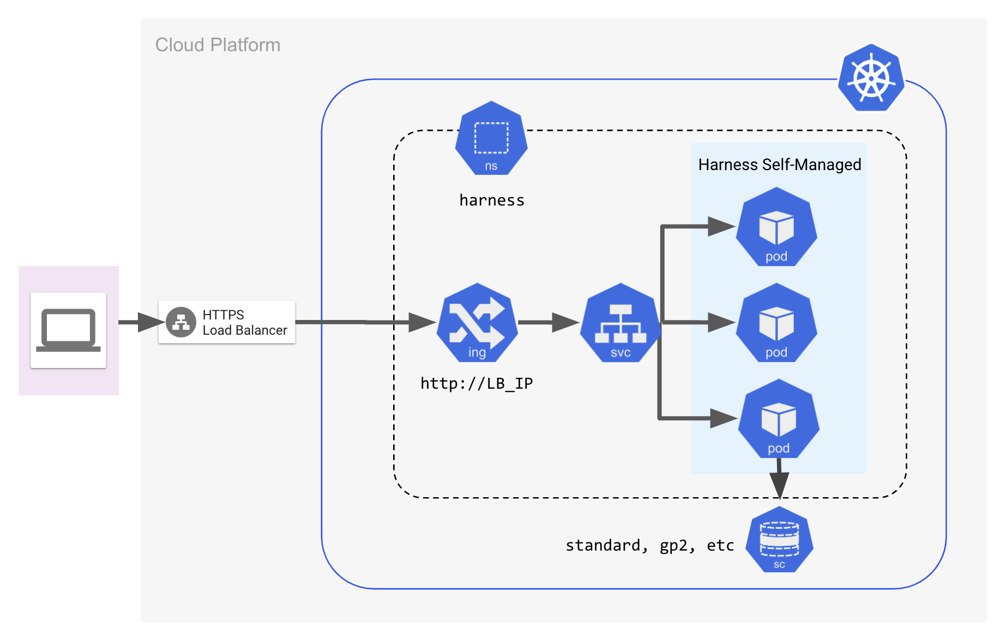

## Overview

Harness Self-Managed Platform (SMP) lets you install and run Harness on your own infrastructure. It gives you full control over data, security, and compliance while using Harness's powerful software delivery tools.

## What Does SMP Include?

Harness SMP consists of multiple microservices and databases deployed using Kubernetes. Installation is simple—just download Helm charts and Docker images, configure settings, and deploy using Helm.

## Architecture Overview

You can install Harness Self-Managed Enterprise Edition on a Kubernetes cluster or directly on virtual machines. Choose the installation method that best fits your infrastructure needs.

Refer to the following diagrams for a visual guide on your installation type.

### Kubernetes Cluster Configuration

    

## Harness SaaS vs. SMP

| Feature                        | SaaS                               | SMP                                                               |
|--------------------------------|------------------------------------|-------------------------------------------------------------------|
| **Infrastructure Provider**    | GCP                                | GCP, AWS, Azure, OpenShift, Rancher, Bare Metal. |
| **Networking**                 | Nginx Ingress                      | Istio, Nginx Ingress, Airgapped.                                   |
| **Databases**                  | Externally Managed                 | Installed by SMP and managed by customer.                          |
| **Self-Signed Certificates**   | Support required only in delegates | Support required for all resources (delegates and services).       |
| **Upgrades**                   | Pushed Weekly                      | Pulled by Customer.                                                |
| **Release Cycle**              | Weekly                             | Every 4-6 weeks.                                                   |
| **Monitoring & Observability** | Various third-party tools          | In-cluster integration with Prometheus and Grafana.                |

