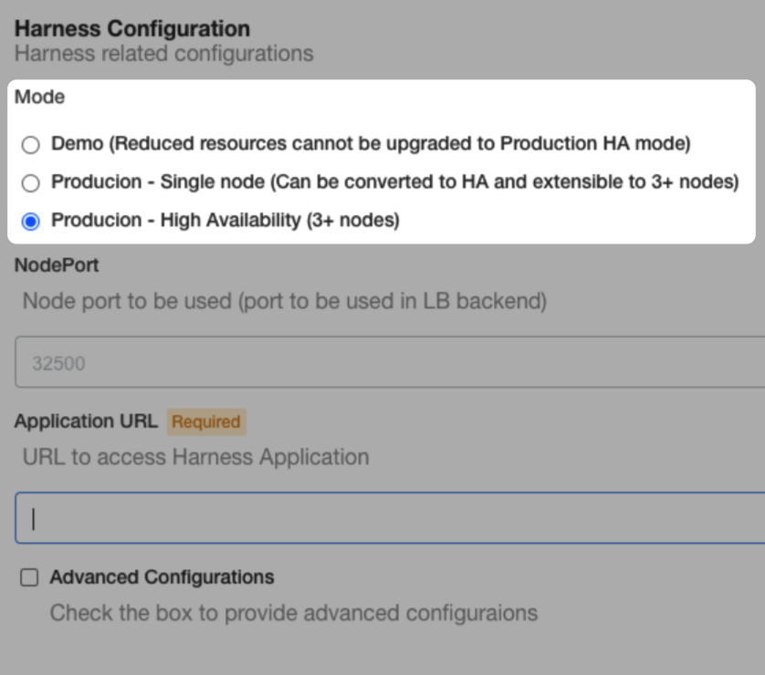
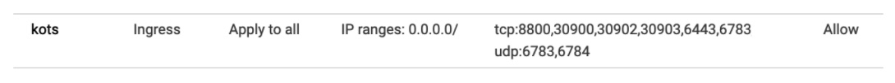
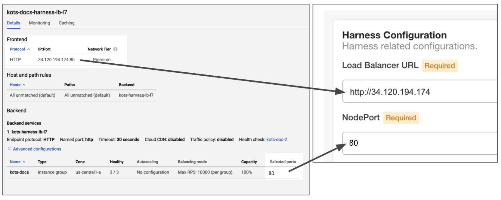

This document lists the infrastructure requirements for a **Self-Managed Enterprise Edition - Virtual Machine** installation.

The Virtual Machine option refers to installing the Self-Managed Enterprise Edition Kubernetes cluster on VMs.

First, you use the requirements below to bootstrap a Kubernetes cluster on your target VMs.

After you stand up the Kubernetes cluster, you use it to install Self-Managed Enterprise Edition - Virtual Machine on the configured cluster.

### Supported operating systems

* Ubuntu 18.04 (recommended)
* CentOS 7.4, 7.5, 7.6, 7.7
* RHEL 7.4, 7.5, 7.6, 7.7

### VM specifications

There are different VM specifications for production and development installations.

#### Number of VMs

The number of VMs depends on the configuration mode you select during installation:



* **Demo:** 1 VM.
* **Single node production:** 1 VM.
* **HA production mode:** 3 VMs.

You'll be able to add more nodes to the cluster later, if needed.

#### Production installation

Self-Managed Enterprise Edition - **NextGen** is installed as an application on an existing Self-Managed Enterprise Edition - **FirstGen** installation.

Below are the requirements for each microservice in each Self-Managed Enterprise Edition installation.

##### Self-Managed Enterprise Edition - FirstGen

VM Specifications: 15 cores, 30 GB memory, 400 GB disk space.

Here are the requirements for each microservice.


| **Microservice** | **Pods** | **CPU / Pod** | **Memory / Pod** | **Total CPU** | **Total Memory** |
| :-- | :-: | :-: | :-: | :-: | :-: |
| Manager | 2 | 2 | 4 | 4 | 8 |
| Verification | 2 | 1 | 3 | 2 | 6 |
| Machine Learning Engine | 1 | 8 | 2 | 8 | 2 |
| UI | 2 | 0.25 | 0.25 | 0.5 | 0.5 |
| MongoDB | 3 | 4 | 8 | 12 | 24 |
| Proxy | 1 | 0.5 | 0.5 | 0.5 | 0.5 |
| Ingress | 2 | 0.25 | 0.25 | 0.5 | 0.5 |
| TimescaleDB | 3 | 2 | 8 | 6 | 24 |
| KOTS Admin and Kubernetes Installations |   |   |   | 10 | 18 |
| **Total** |  |  |  | **43.5** | **83.5** |

##### Self-Managed Enterprise Edition - NextGen


| **Microservice** | **Pods** | **CPU / Pod** | **Memory / Pod** | **Total CPU** | **Total Memory** |
| :-- | :-: | :-: | :-: | :-: | :-: |
| Log Minio | 1 | 1 | 4Gi | 1 | 4Gi |
| Log service | 1 | 1 | 3Gi | 1 | 3Gi |
| SCM | 1 | 0.1 | 0.5Gi | 0.1 | 0.5Gi |
| Gateway | 2 | 0.5 | 3Gi | 1 | 6Gi |
| NextGen UI | 2 | 0.2 | 0.2Gi | 0.4 | 0.4Gi |
| Platform service | 2 | 1 | 3Gi | 2 | 6Gi |
| Test Intelligence | 2 | 1 | 3Gi | 2 | 6Gi |
| Access Control | 2 | 1 | 3Gi | 2 | 6Gi |
| CI Manager | 2 | 1 | 3Gi | 2 | 6Gi |
| NextGen Manager | 2 | 2 | 6Gi | 4 | 12Gi |
| Pipeline | 2 | 1 | 6Gi | 2 | 12Gi |
| **Total** |  **19** |  |  | **17.5** | **61.9Gi** |

#### Dev installation

VM Specifications: 10 cores, 16 GB memory, 100 GB disk space.

Here are the requirements for each microservice.

| **Microservice** | **Pods** | **CPU / Pod** | **Memory / Pod** | **Total CPU** | **Total Memory** |
| :-- | :-: | :-: | :-: | :-: | :-: |
| Manager | 1 | 2 | 4 | 2 | 4 |
| Verification | 1 | 1 | 3 | 1 | 3 |
| Machine Learning Engine | 1 | 3 | 2 | 3 | 2 |
| UI | 1 | 0.25 | 0.25 | 0.25 | 0.25 |
| MongoDB | 3 | 2 | 4 | 6 | 12 |
| Proxy | 1 | 0.5 | 0.5 | 0.5 | 0.5 |
| Ingress | 1 | 0.25 | 0.25 | 0.25 | 0.25 |
| TimescaleDB | 1 | 2 | 8 | 2 | 8 |
| KOTS Admin Pods |   |   |   | 10 | 17.75 |
| **Total** |  |  |  | **25** | **47.75** |

 

### Networking architecture

The following examples diagram illustrate the simple networking architecture for Self-Managed Enterprise Edition - Virtual Machine.

GCP Example:


AWS Example:


The following sections go into greater detail.

### Open ports for 3 VMs

* TCP ports 6443-6783
* UDP ports 6783 and 6784
* TCP port 80 for exposing Harness. Port 80/443 is used as the backend of the load balancer routing traffic to the VMs.
* TCP ports 30900-30905 for monitoring (Grafana Dashboards, Prometheus).
* TCP ports 9000 and 9879. These are required for Harness Self-Managed Enterprise Edition NextGen.
* The KOTS admin tool requires 8800.

For example, here is a GCP firewall rule that includes the required ports (80 is already open):



### Load balancer

There are two load balancers required for a Harness Self-Managed Enterprise Edition Virtual Machine installation.

#### Load balancer to Harness application

A load balancer routing all the incoming traffic to the port where Harness is exposed on all of the VM’s. Once you install Harness, this port will be used for accessing Harness Self-Managed Enterprise Edition.

* The load balancer can be any of L4 or L7.
* The load balancer should forward unencrypted traffic to the nodes.

Different cloud platforms have different methods for setting up load balancers and traffic routing.

For example, in GCP, you create an HTTP Load Balancer with a frontend listening on port 80 and a backend sending traffic to the Instance group containing your VMs on port 80/443.

Later, when you configure Harness Self-Managed Enterprise Edition, you will enter the frontend IP address in **Load Balancer URL** and the backend port 80/443 in the **NodePort** setting:



Typically, you will also set up DNS to resolve a domain to the frontend IP, and then use the domain name in **Load Balancer URL**.

##### gRPC and Load Balancer Settings

**If your load balancer does support HTTP2 over port 443**, when you install Harness Self-Managed Enterprise Edition NextGen you will set up gRPC settings:


Enter the following:

* **GRPC Target:** enter the load balancer hostname (hostname from the load balancer URL)

  **GRPC Authority:** enter `manager-grpc-<hostname>`. For example: `manager-grpc-35.202.197.230`.

**If your load balancer does not support HTTP2 over port 443** you have two options:

* If your load balancer supports multiple ports for SSL then add port 9879 in the application load balancer and target port 9879 or node port 32510 on the Ingress controller.
	+ **GRPC Target:** enter the load balancer hostname
	+ **GRPC Authority:** enter the load balancer hostname
* If your load balancer does not support multiple ports for SSL then create a new load balancer and target port 9879 or node port 32510 on the Ingress controller:
	+ **GRPC Target:** enter the new load balancer hostname
	+ **GRPC Authority:** enter the new load balancer hostname

#### In-cluster load balancer for high availability

A TCP forwarding load balancer (L4) distributing the traffic on port 6443. This will be used for Kubernetes cluster HA. The health check should be on port 6443, also.

The TCP load balancer you created will be selected when you install Harness using the KOTS plugin via the `-s ha` parameter:

```
$ curl -sSL https://k8s.kurl.sh/harness | sudo bash -s ha  
The installer will use network interface 'ens4' (with IP address '10.128.0.25')  
Please enter a load balancer address to route external and internal traffic to the API servers.  
In the absence of a load balancer address, all traffic will be routed to the first master.  
Load balancer address:
```
You will enter the IP address of your TCP load balancer.

For example, here is a GCP TCP load balancer with its frontend forwarding rule using port 6443:


When the kurl installation prompts you for the load balancer IP address, you will enter the load balancer IP and port 6443. For example `10.128.0.50:6443`.

See [HA Installations](https://kots.io/kotsadm/installing/installing-embedded-cluster/#ha-installations) from KOTS.

### User access requirements

For initial setup: sudo/root access is required.

### Network requirements

Add the following URLs to your allow list:

* kots.io — Kots pulls the latest versions of the kubectl plugin and Kots admin console.
* app.replicated.com — Kots admin console connects to check for the availability of releases according to your license
* proxy.replicated.com — Proxy your registry to pull your private images.

Outbound access to the following URLs:

* proxy.replicated.com​
* replicated.app
* k8s.kurl.sh​
* app.replicated.com

The outbound access is required for a **connected install only**. If you have opted for [Airgap mode](https://kots.io/kotsadm/installing/airgap-packages/), this is not required. 

If your cluster does not have direct outbound connectivity and needs a proxy for outbound connections, use these instructions: [https://docs.docker.com/network/proxy](https://docs.docker.com/network/proxy/) to set up a proxy on the node machines.

### Trusted certificate requirement for Harness Self-Managed Enterprise Edition

All connections to the Harness Manager can be secure or unencrypted according to the URL scheme you use when you configure the Load Balancer URL during installation (`https://` or `http://`):


For secure connections from any integration into the Harness Manager (Github Webhooks, etc), including the **Harness Delegate**, you must use a publicly trusted certificate.

Harness does not support self-signed certificates for connections to the Harness Manager.

For connections from the Harness Manager outbound to an integration, you can use a self-signed certificate. In this case, you must import the self-signed certificate into Harness Delegate's JRE keystore manually or using a Harness Delegate Profile.

### Install Harness Self-Managed Enterprise Edition

Now that you have set up the requirements, proceed with installation in [Self-Managed Enterprise Edition - Virtual Machine: Setup Guide](virtual-machine-on-prem-installation-guide.md).

