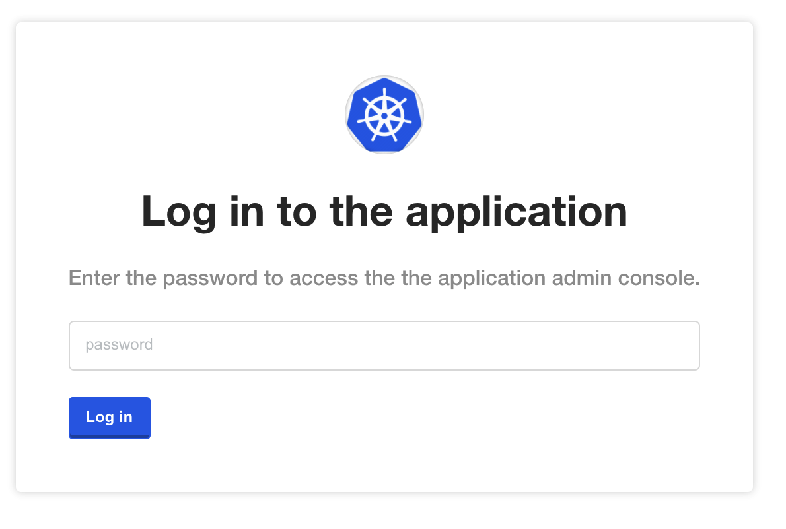
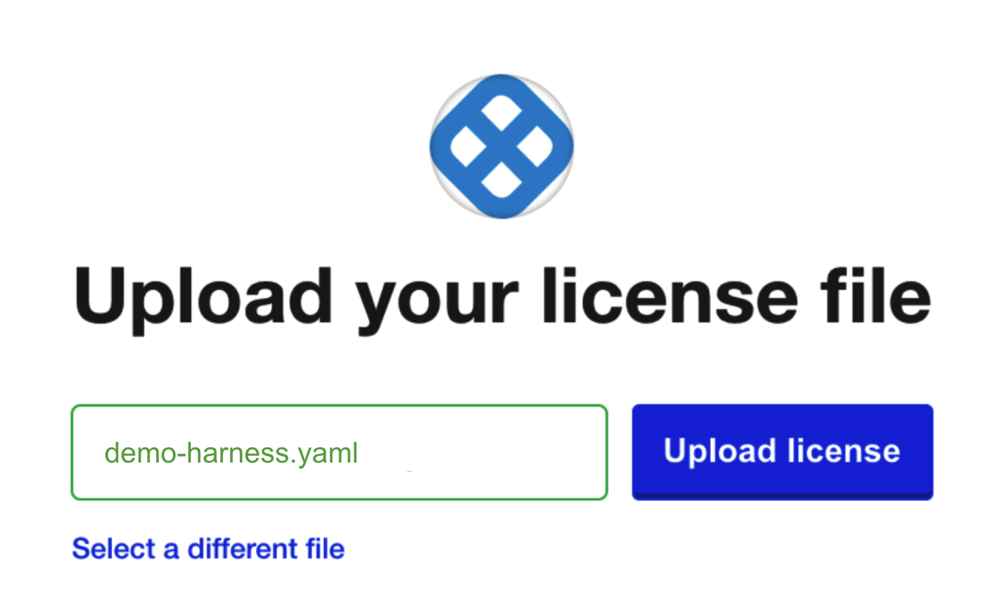
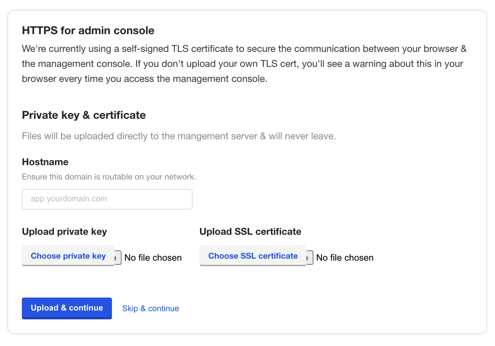
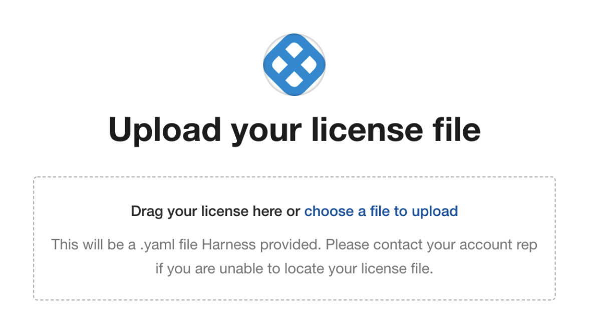
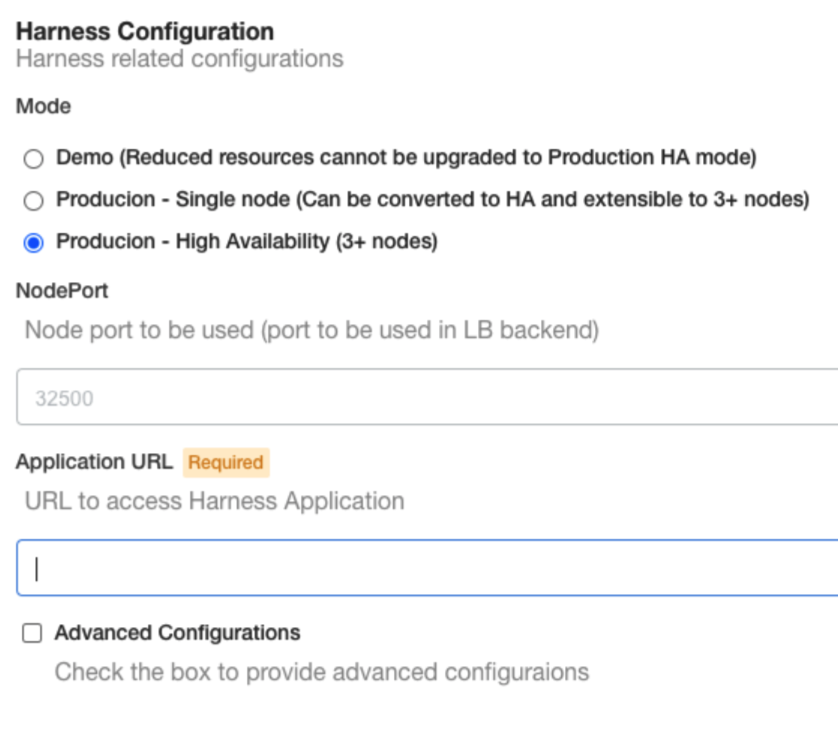
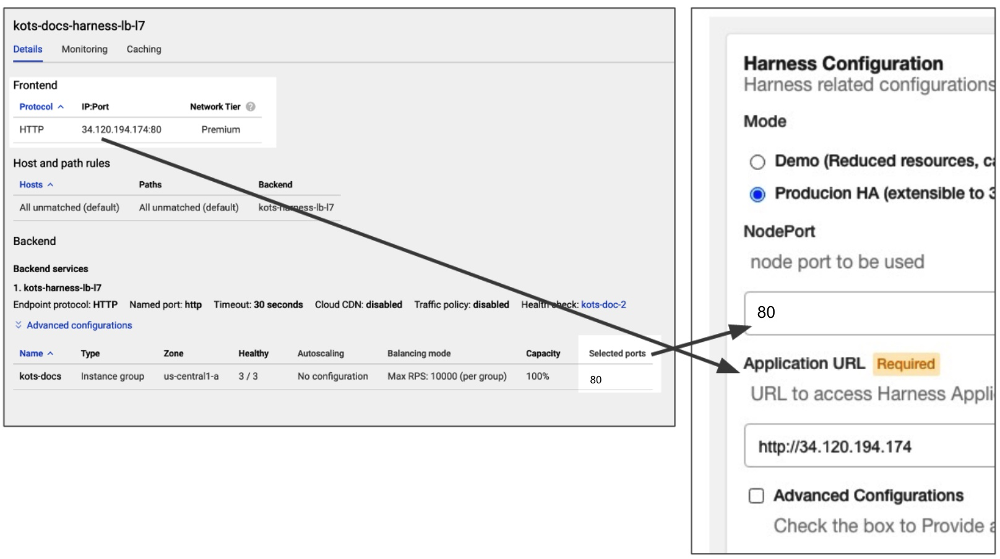
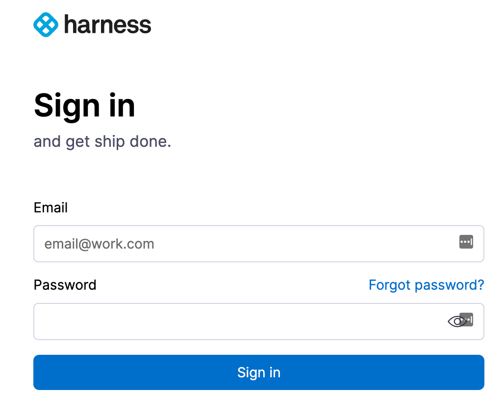
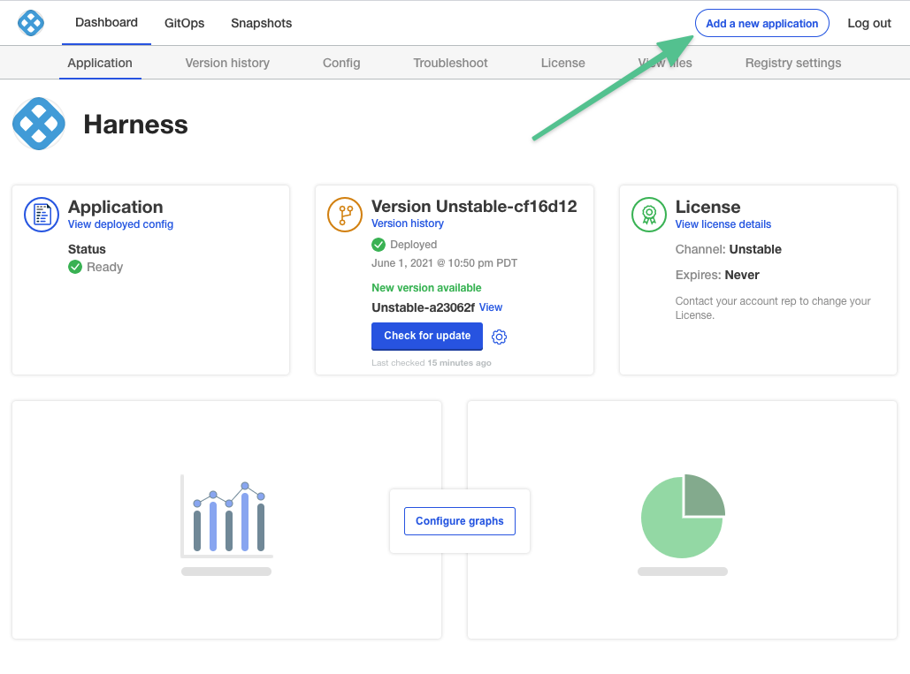
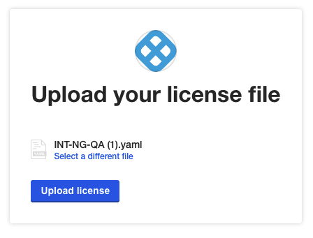

This topic covers installing Harness Self-Managed Enterprise Edition - Virtual Machine **NextGen** as a Kubernetes cluster embedded on your target VMs. 

To install Harness Self-Managed Enterprise Edition Virtual Machine **NextGen**, you install Harness Self-Managed Enterprise Edition Virtual Machine **FirstGen**, and then you install NextGen as an application. Installing Harness Self-Managed Enterprise Edition into an embedded Kubernetes cluster is a simple process where you prepare your VMs and network, and use the Kubernetes installer kURL and the KOTS plugin to complete the installation and deploy Harness. 

After you set up Harness on a VM, you can add additional worker nodes by simply running a command. Harness Self-Managed Enterprise Edition uses the open source Kubernetes installer kURL and the KOTS plugin for installation. See [Install with kURL](https://kurl.sh/docs/install-with-kurl/) from kURL and [Installing an Embedded Cluster](https://kots.io/kotsadm/installing/installing-embedded-cluster/) from KOTS.

### Harness Self-Managed Enterprise Edition NextGen installation options

How you install Harness Self-Managed Enterprise Edition NextGen will follow one of the use cases below:

#### NextGen on existing FirstGen VMs

In this scenario, you have an existing Harness Self-Managed Enterprise Edition FirstGen running and you want to add Harness NextGen to it.

You simply add Harness Self-Managed Enterprise Edition NextGen as a new application in your existing Harness Self-Managed Enterprise Edition FirstGen installation.

1. Open the FirstGen KOTS admin tool.
2. Install NextGen as a new application on existing FirstGen.
3. Upload the NextGen license file.
4. Use the exact same FirstGen configuration values for the NextGen configuration.

If you are using this option, skip to [Install NextGen on Existing FirstGen](#install-next-gen-on-existing-first-gen).

#### NextGen on new FirstGen VMs

In this scenario, you want to install FirstGen and NextGen on new VMs.

1. Set up your VMs according to the requirements specified in [Self-Managed Enterprise Edition - Virtual Machine: Infrastructure Requirements](virtual-machine-on-prem-infrastructure-requirements.md).
2. Install FirstGen.
3. Install NextGen as a new application on existing FirstGen.
4. Upload the NextGen license file.
5. Use the exact same FirstGen configuration values for the NextGen configuration.

If you are using this option, do the following:

1. Follow all of the FirstGen installation instructions beginning with [Step 1: Set up VM Requirements](#step-1-set-up-vm-requirements).
2. Follow the NextGen installation instructions in [Install NextGen on Existing FirstGen](#install-next-gen-on-existing-first-gen).

#### Legacy FirstGen not using KOTS

In this scenario, you have a legacy FirstGen installation that is not a KOTS-based installation.

This process will involve migrating your legacy FirstGen data to a new KOTS-based FirstGen and then installing NextGen.

1. Set up your VMs according to the requirements specified in [Self-Managed Enterprise Edition - Virtual Machine: Infrastructure Requirements](virtual-machine-on-prem-infrastructure-requirements.md).
2. Install FirstGen.
3. Migrate data to new FirstGen using a script from Harness Support.
4. Install NextGen as a new application on the new FirstGen.
5. Upload the NextGen license file.
6. Use the exact same FirstGen configuration values for the NextGen configuration.

If you are using this option, do the following:

1. Follow all of the FirstGen installation instructions beginning with [Step 1: Set up VM Requirements](#step-1-set-up-vm-requirements).
2. Migrate data to new FirstGen using a script from Harness Support.
3. Follow the NextGen installation instructions in [Install NextGen on Existing FirstGen](#install-next-gen-on-existing-first-gen).

### Step 1: Set up VM requirements

Ensure that your VMs meet the requirements specified in [Self-Managed Enterprise Edition - Virtual Machine: Infrastructure Requirements](virtual-machine-on-prem-infrastructure-requirements.md).

Different cloud platforms use different methods for grouping VMs (GCP instance groups, AWS target groups, etc). Set up your 3 VMs using the platform method that works best with the platform's networking processes.

### Step 2: Set up load balancer and networking requirements

Ensure that your networking meets the requirements specified in [Self-Managed Enterprise Edition - Virtual Machine: Infrastructure Requirements](virtual-machine-on-prem-infrastructure-requirements.md).

You will need to have two load balancers, as described in the [Self-Managed Enterprise Edition - Virtual Machine: Infrastructure Requirements](virtual-machine-on-prem-infrastructure-requirements.md).

One for routing traffic to the VMs and one for the in-cluster load balancer.

During installation, you are asked for the IP address of the in-cluster TCP load balancer first.

When you configure the Harness Self-Managed Enterprise Edition application in the KOTS admin console, you are asked for the HTTP load balancer URL.

### Option 1: Disconnected installation

Disconnected Installation involves downloading the Self-Managed Enterprise Edition - Virtual Machine archive file onto a jump box, and then copying and the file to each host VM you want to use.

One each VM, you extract and install Harness.

On your jump box, run the following command to obtain the Self-Managed Enterprise Edition - Virtual Machine file:

```
curl -LO https://kurl.sh/bundle/harness.tar.gz
```
Copy the file to a Harness host and extract it (`tar xvf harness.tar.gz`).

On the VM, install Harness:

```
cat install.sh | sudo bash -s airgap ha
```

This will install the entire Self-Managed Enterprise Edition Kubernetes cluster and all related microservices.

The `ha` parameter is used to set up high availability. If you are not using high availability, you can omit the parameter.

#### Provide load balancer settings

First, you are prompted to provide the IP address of the TCP Load Balancer for the cluster HA:

```
The installer will use network interface 'ens4' (with IP address '10.128.0.25')  
Please enter a load balancer address to route external and internal traffic to the API servers.  
In the absence of a load balancer address, all traffic will be routed to the first master.  
Load balancer address:
```
This is the TCP load balancer you created in [Self-Managed Enterprise Edition - Virtual Machine: Infrastructure Requirements](virtual-machine-on-prem-infrastructure-requirements.md).

For example, here is a GCP TCP load balancer with its frontend forwarding rule using port 6443:

Enter the IP address and port of your TCP load balancer (for example, `10.128.0.50:6443`), and press Enter. The installation process will continue. The installation process begins like this:

```
...  
Fetching weave-2.5.2.tar.gz  
Fetching rook-1.0.4.tar.gz  
Fetching contour-1.0.1.tar.gz  
Fetching registry-2.7.1.tar.gz  
Fetching prometheus-0.33.0.tar.gz  
Fetching kotsadm-1.16.0.tar.gz  
Fetching velero-1.2.0.tar.gz  
Found pod network: 10.32.0.0/22  
Found service network: 10.96.0.0/22  
...
```

#### Review configuration settings

Once the installation process is complete, KOTS provides you with several configuration settings and commands. Save these settings and commands.

* KOTS admin console and password:

  ```
  Kotsadm: http://00.000.000.000:8800  
  Login with password (will not be shown again): D1rgBIu21
  
  ```
If you need to reset your password, enter `kubectl kots reset-password -n default`. You will be prompted for a new password.

* Prometheus, Grafana, and Alertmanager ports and passwords:

  ```
  The UIs of Prometheus, Grafana and Alertmanager have been exposed on NodePorts 30900, 30902 and 30903 respectively.  
  To access Grafana use the generated user:password of admin:RF1KuqreN .
  ```

* kubectl access to your cluster:

  ```
  To access the cluster with kubectl, reload your shell:  
      bash -l
  ```

* The command to add worker nodes to the installation:

  ```
  To add worker nodes to this installation, run the following script on your other nodes:  
  
  curl -sSL https://kurl.sh/harness/join.sh | sudo bash -s kubernetes-master-address=10.128.0.24:6443 kubeadm-token=xxxxx kubeadm-token-ca-hash=shaxxxxxx kubernetes-version=1.15.3 docker-registry-ip=10.96.3.130
  ```

We will use this command later.

* Add master nodes:

  ```
  To add MASTER nodes to this installation, run the following script on your other nodes  
      curl -sSL https://kurl.sh/harness/join.sh | sudo bash -s kubernetes-master-address=34.71.32.244:6443 kubeadm-to  
  ken=c2yack.q7lt3z6yuevqlmtf kubeadm-token-ca-hash=sha256:9db504ecdee08ff6dfa3b299ce95302fe53dd632a2e9356c55e9272db7  
  2d60d1 kubernetes-version=1.15.3 cert-key=f0373e812e0657b4f727e90a7286c5b65539dfe7ee5dc535df0a1bcf74ad5c57 control-  
  plane docker-registry-ip=10.96.2.100
  ```

#### Log into the admin tool

In a browser, enter the Kotsadm link.

The browser displays a TLS warning.

Click **Continue to Setup**.

In the warning page, click **Advanced**, then click **Proceed** to continue to the admin console.

As KOTS uses a self-signed certification, but you can upload your own.

Upload your certificate or click **Skip and continue**.

Log into the console using the password provided in the installation output.



#### Upload your Harness license

Once you are logged into the KOTS admin console, you can upload your Harness license.

Obtain the Harness license file from your Harness Customer Success contact or email [support@harness.io](mailto:support@harness.io).

Drag your license YAML file into the KOTS admin tool:


Next, upload the license file:



Now that license file is uploaded, you can install Harness.

Go to [Step 3: Configure Harness](#step-3-configure-harness).

### Option 2: Connected installation

Once you have your VMs and networking requirements set up, you can install Harness.

Log into one of your VMs, and then run the following command:

```
curl -sSL https://k8s.kurl.sh/harness | sudo bash -s ha
```
This will install the entireSelf-Managed Enterprise Edition Kubernetes cluster and all related microservices.

The `-s ha` parameter is used to set up high availability.

#### Provide load balancer settings

First, you are prompted to provide the IP address of the TCP Load Balancer for the cluster HA:

```
The installer will use network interface 'ens4' (with IP address '10.128.0.25')  
Please enter a load balancer address to route external and internal traffic to the API servers.  
In the absence of a load balancer address, all traffic will be routed to the first master.  
Load balancer address:
```
This is the TCP load balancer you created in [Self-Managed Enterprise Edition - Virtual Machine: Infrastructure Requirements](virtual-machine-on-prem-infrastructure-requirements.md).

For example, here is a GCP TCP load balancer with its frontend forwarding rule using port 6443:

Enter the IP address and port of your TCP load balancer (for example, `10.128.0.50:6443`), and press Enter. The installation process will continue. The installation process begins like this:

```
...  
Fetching weave-2.5.2.tar.gz  
Fetching rook-1.0.4.tar.gz  
Fetching contour-1.0.1.tar.gz  
Fetching registry-2.7.1.tar.gz  
Fetching prometheus-0.33.0.tar.gz  
Fetching kotsadm-1.16.0.tar.gz  
Fetching velero-1.2.0.tar.gz  
Found pod network: 10.32.0.0/22  
Found service network: 10.96.0.0/22  
...
```

#### Review configuration settings

Once the installation process is complete, KOTS provides you with several configuration settings and commands. Save these settings and commands.

* KOTS admin console and password:

```
Kotsadm: http://00.000.000.000:8800  
Login with password (will not be shown again): D1rgBIu21
```

If you need to reset your password, enter `kubectl kots reset-password -n default`. You will be prompted for a new password.

* Prometheus, Grafana, and Alertmanager ports and passwords:

  ```
  The UIs of Prometheus, Grafana and Alertmanager have been exposed on NodePorts 30900, 30902 and 30903 respectively.  
  To access Grafana use the generated user:password of admin:RF1KuqreN .
  ```

* kubectl access to your cluster:

  ```
  To access the cluster with kubectl, reload your shell:  
      bash -l
  ```

* The command to add worker nodes to the installation:

  ```
  To add worker nodes to this installation, run the following script on your other nodes:  
  
  curl -sSL https://kurl.sh/harness/join.sh | sudo bash -s kubernetes-master-address=10.128.0.24:6443 kubeadm-token=xxxxx kubeadm-token-ca-hash=shaxxxxxx kubernetes-version=1.15.3 docker-registry-ip=10.96.3.130
  ```

We will use this command later.

* Add master nodes:

  ```
  To add MASTER nodes to this installation, run the following script on your other nodes  
      curl -sSL https://kurl.sh/harness/join.sh | sudo bash -s kubernetes-master-address=34.71.32.244:6443 kubeadm-to  
  ken=c2yack.q7lt3z6yuevqlmtf kubeadm-token-ca-hash=sha256:9db504ecdee08ff6dfa3b299ce95302fe53dd632a2e9356c55e9272db7  
  2d60d1 kubernetes-version=1.15.3 cert-key=f0373e812e0657b4f727e90a7286c5b65539dfe7ee5dc535df0a1bcf74ad5c57 control-  
  plane docker-registry-ip=10.96.2.100
  ```

#### Log into the admin tool

In a browser, enter the Kotsadm link.

The browser displays a TLS warning.


Click **Continue to Setup**.

In the warning page, click **Advanced**, then click **Proceed** to continue to the admin console.

As KOTS uses a self-signed certification, but you can upload your own.



Upload your certificate or click **Skip and continue**.

Log into the console using the password provided in the installation output.


#### Upload your Harness license

Once you are logged into the KOTS admin console, you can upload your Harness license.

Obtain the Harness license file from your Harness Customer Success contact or email [support@harness.io](mailto:support@harness.io).

Drag your license YAML file into the KOTS admin tool:



Next, upload the license file:


Now that license file is uploaded, you can install Harness.

#### Download Harness over the internet

If you are installing Harness over the Internet, click the **download Harness from the Internet** link.


KOTS begins installing Harness into your cluster.


Next, you will provide KOTS with the Harness configuration information (Load Balancer URL and NodePort).

### Step 3: Configure Harness

Now that you have added your license you can configure the networking for the Harness installation.



#### Mode

* Select **Demo** to run a Self-Managed Enterprise Edition in demo mode and experiment with it.
* Select **Production - Single Node** to run this on one node. You can convert to Production - High Availability later.
* Select **Production** - **High Availability** to run a production version of Self-Managed Enterprise Edition.

If you use **Production - Single Node**, you can convert to **Production - High Availability** later by doing the following:

1. In the KOTS admin console, go to **Cluster Management**.
2. Click **Add a node**. This will generate scripts for joining additional worker and master nodes.

For Disconnected (Airgap) installations, the bundle must also be downloaded and extracted on the remote node prior to running the join script.#### NodePort and application URL

Self-Managed Enterprise Edition - Virtual Machine requires that you provide a NodePort and Application URL.

1. In **Application URL**, enter the **full URL** for the HTTP load balancer you set up for routing external traffic to your VMs. 

  Include the scheme and hostname/IP. For example, `https://app.example.com`. 

  Typically, this is the frontend IP address for the load balancer. For example, here is an HTTP load balancer in GCP and how you enter its information into **Harness Configuration**.  

  If you have set up DNS to resolve a domain name to the load balancer IP, enter that domain name in **Application URL**.

2. In **NodePort**, enter the port number you set up for load balancer backend: **80**.

3. When you are done, click **Continue**.

#### Option: Advanced configurations

In the **Advanced Configurations** section, there are a number of advanced settings you can configure. If this is the first time you are setting up Self-Managed Enterprise Edition, there's no reason to fine tune the installation with these settings.

You can change the settings later in the KOTS admin console's Config tab:


##### Ingress service type

By default, nginx is used for Ingress automatically. If you are deploy nginx separately, do the following:

1. Click **Advanced Configurations**.
2. Disable the **Install Nginx Ingress Controller** option.

##### gRPC and load balancer settings

In **Scheme**, if you select HTTPS, the GRPC settings appear.


**If your load balancer does support HTTP2 over port 443**, enter the following:

* **GRPC Target:** enter the load balancer hostname (hostname from the load balancer URL)
* **GRPC Authority:** enter `manager-grpc-<hostname>`. For example: `manager-grpc-35.202.197.230`.

**If your load balancer does not support HTTP2 over port 443** you have two options:

* If your load balancer supports multiple ports for SSL then add port 9879 in the application load balancer and target port 9879 or node port 32510 on the Ingress controller.
	+ **GRPC Target:** enter the load balancer hostname
	+ **GRPC Authority:** enter the load balancer hostname
* If your load balancer does not support multiple ports for SSL then create a new load balancer and target port 9879 or node port 32510 on the Ingress controller:
	+ **GRPC Target:** enter the new load balancer hostname
	+ **GRPC Authority:** enter the new load balancer hostname

##### Log Service Backend

There are two options for **Log Service Backend**:

**Minio:** If you want to use the builtin [Minio](https://docs.min.io/docs/minio-quickstart-guide.html) log service then your load balancer needs to reach the Ingress controller on port 9000. Create a new load balancer and target port 9000 or node port 32507.

**Amazon S3 Bucket:** Enter the S3 bucket settings to use.

### Step 4: Perform preflight checks

Preflight checks run automatically and verify that your setup meets the minimum requirements.


You can skip these checks, but we recommend you let them run.

Fix any issues in the preflight steps.

### Step 5: Deploy Harness

When you are finished pre-flight checks, click **Deploy and** **Continue**.

Harness is deployed in a few minutes.

It can take up to 30 minutes when installing the demo version on a system with the minimum recommended specs.In a new browser tab, go to the following URL, replacing `<LB_URL>` with the URL you entered in the **Application URL** setting in the KOTS admin console:

`<LB_URL>/auth/#/signup`

For example:

`http://harness.mycompany.com/auth/#/signup`

The Harness sign up page appears.


Sign up with a new account and then sign in.



Your new account will be added to the Harness Account Administrators User Group.

See [Add and Manage User Groups](https://docs.harness.io/article/dfwuvmy33m-add-user-groups).

#### Future versions

To set up future versions of Self-Managed Enterprise Edition, in the KOTS admin console, in the **Version history** tab, click **Deploy**. The new version is displayed in Deployed version.


### Step 6: Add worker nodes

Now that Self-Managed Enterprise Edition is installed in one VM, you can install it on other VMs using the command provided when you installed Harness:

```
To add worker nodes to this installation, run the following script on your other nodes  
    curl -sSL https://kurl.sh/harness/join.sh | sudo bash -s kubernetes-master-address=10.128.0.24:6443 kubeadm-token=xxxxx kubeadm-token-ca-hash=shaxxxxxx kubernetes-version=1.15.3 docker-registry-ip=10.96.3.130
```

Run this on each VM in your group. The installation will begins something like this:

```
...  
Docker already exists on this machine so no docker install will be performed  
Container already exists on this machine so no container install will be performed  
The installer will use network interface 'ens4' (with IP address '10.128.0.44')  
Loaded image: replicated/kurl-util:v2020.07.15-0  
Loaded image: weaveworks/weave-kube:2.5.2  
Loaded image: weaveworks/weave-npc:2.5.2  
Loaded image: weaveworks/weaveexec:2.5.2  
...
```

When installation is complete, you will see the worker join the cluster and preflight checks are performed:

```
⚙  Join Kubernetes node  
+ kubeadm join --config /opt/replicated/kubeadm.conf --ignore-preflight-errors=all  
[preflight] Running pre-flight checks  
validated versions: 19.03.4. Latest  
 validated version: 18.09
```

The worker is now joined.

### Important next steps

**Important:** You cannot invite other users to Harness until a Harness Delegate is installed and a Harness SMTP Collaboration Provider is configured.

1. Install the Harness Delegate.

2. Set up an SMTP Collaboration Provider in Harness for email notifications from the Harness Manager.  
   Ensure you open the correct port for your SMTP provider, such as [Office 365](https://support.office.com/en-us/article/server-settings-you-ll-need-from-your-email-provider-c82de912-adcc-4787-8283-45a1161f3cc3).

3. [Add a Secrets Manager](https://docs.harness.io/article/bo4qbrcggv-add-secrets-manager). By default, Self-Managed Enterprise Edition installations use the local Harness MongoDB for the default Harness Secrets Manager. This is not recommended.

   After Self-Managed Enterprise Edition installation, configure a new Secret Manager (Vault, AWS, etc). You will need to open your network for the Secret Manager connection.

### Updating Harness

**Do not upgrade Harness past 4 major releases.** Instead, upgrades each interim release until you upgrade to the latest release. A best practice is to upgrade Harness once a month.Please follow these steps to update your Self-Managed Enterprise Edition installation.

The steps are very similar to how you installed Harness initially.

For more information, see [Updating an Embedded Cluster](https://kots.io/kotsadm/updating/updating-embedded-cluster/) from KOTS.

#### Disconnected (air gap)

The following steps require a private registry, just like the initial installation of Self-Managed Enterprise Edition.

##### Upgrade Harness

1. Download the latest release from Harness.
2. Run the following command on the VM(s) hosting Harness, replacing the placeholders:

   ```
   kubectl kots upstream upgrade harness \   
   --airgap-bundle <path to harness-<version>.airgap> \   
   --kotsadm-namespace harness-kots \   
   -n default
   ```

##### Upgrade embedded Kubernetes Cluster and KOTS

1. Download the latest version of Self-Managed Enterprise Edition:

   ```
   curl -SL -o harnesskurl.tar.gz https://kurl.sh/bundle/harness.tar.gz
   ```

2. Move the tar.gz file to the disconnected VMs.
3. On each VM, run the following command to update Harness Self-Managed Enterprise Edition:

   ```
   tar xzvf harnesskurl.tar.gz  
   cat install.sh | sudo bash -s airgap
   ```

#### Connected

The following steps require a secure connection to the Internet, just like the initial installation of Harness Self-Managed Enterprise Edition.

##### Upgrade Harness

* Run the following command on the VMs hosting Harness Self-Managed Enterprise Edition:

   ```
   kubectl kots upstream upgrade harness -n harness
   ```

##### Upgrade embedded Kubernetes cluster and KOTS

* Run the following command on the VMs hosting Harness Self-Managed Enterprise Edition:

  ```
  curl -sSL https://kurl.sh/harness | sudo bash
  ```

### Monitoring Harness

Harness monitoring is performed using the built in monitoring tools.

When you installed Harness, your were provided with connection information for Prometheus, Grafana, and Alertmanager ports and passwords:

```
The UIs of Prometheus, Grafana and Alertmanager have been exposed on NodePorts 30900, 30902 and 30903 respectively.  
To access Grafana use the generated user:password of admin:RF1KuqreN .
```
For steps on using the monitoring tools, see [Prometheus](https://kots.io/kotsadm/monitoring/prometheus/) from KOTS.

### License expired

If your license has expired, you will see something like the following:

Contact your Harness Customer Success representative or [support@harness.io](mailto:support@harness.io).

### Install NextGen on existing FirstGen

This section assumes you have a Self-Managed Enterprise Edition FirstGen installation set up and running following the step earlier in this guide (beginning with [Step 1: Set up VM Requirements](#step-1-set-up-vm-requirements)).

Now you can add Self-Managed Enterprise Edition NextGen as a new application to your FirstGen installation.

1. Log into your Self-Managed Enterprise Edition FirstGen KOTS admin tool.
2. Click **Config**.
3. Record all of the FirstGen settings. You will need to use these exact same settings when setting up Self-Managed Enterprise Edition NextGen.  
If you want to change settings, change them and then record them so you can use them during the NextGen installation.
4. Click **Add a new application**.



5. Add the Self-Managed Enterprise Edition NextGen license file you received from Harness Support, and then click **Upload license**.



6. Depending on whether your Self-Managed Enterprise Edition FirstGen installation is Disconnected or Connected, follow the installation steps described here:
	* [Option 1: Disconnected Installation](#option-1-disconnected-installation)
	* [Option 2: Connected Installation](#option-2-connected-installation)When you are done, you'll be on the **Configure HarnessNG** page. This is the standard configuration page you followed when you set up Self-Managed Enterprise Edition FirstGen in [Step 3: Configure Harness](#step-3-configure-harness).
7. Enter the exact same configuration options as your FirstGen installation.  
   Please ensure you include your **Advanced Configuration** settings.  
   Ensure you use the exact same **Scheme** you used in FirstGen (HTTP or HTTPS).  
   The **Load Balancer IP Address** setting does not appear because Self-Managed Enterprise Edition NextGen is simply a new application added onto Self-Managed Enterprise Edition FirstGen. NextGen will use the exact same **Load Balancer IP Address** setting by default.
8. Click **Continue** at the bottom of the page.  
Harness will perform pre-flight checks.
9. Click **Continue**.  
   Harness is deployed in a few minutes.  
   When Self-Managed Enterprise Edition NextGen is ready, you will see it listed as **Ready**:
10. In a new browser tab, go to the following URL, replacing `<LB_URL>` with the URL you entered in the **Application URL** setting in the KOTS admin console

   `<LB_URL>/auth/#/signup`

For example:

`http://harness.mycompany.com/auth/#/signup`

The Harness sign-up page appears.


Sign up with a new account and then sign in.

If you are familiar with Harness, you can skip [Learn Harness' Key Concepts](../../getting-started/learn-harness-key-concepts.md).

Try the [NextGen Quickstarts](../../getting-started/quickstarts.md).

### Notes

Self-Managed Enterprise Edition installations do not currently support the Harness Helm Delegate.

