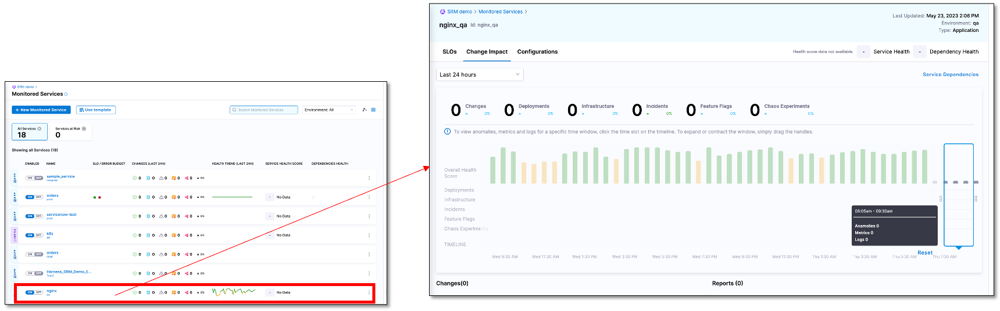

The Service Health dashboard enables you to observe and track the health of monitored services.

The Service Health dashboard helps you:

- Track the overall health of your services, spot anomalies, and take timely action.
- Track change events that impact your monitored service.
- Observe and analyze dependencies between applications, infrastructure, and data.
- View metrics to analyze patterns, historic trends, performance changes, and correlate the data over a period.
- View log data required for debugging issues.

To view the Service Health dashboard:

1. In your Harness project, navigate to the **Service Reliability Management** module, and then select **Monitored Services**.  
   A list of all monitored services appears.
2. Select the monitored service for which you want to see the health data.
3. Select the **Service Health** tab.  
   The Service Health dashboard appears.
   

The **Service Health** tab is divided into the following sections:

- Change summary 
- Overall health score timeline
- Changes list
- Service dependencies
- Metrics, logs, and errors

### Change summary 

The change summary displays the number of changes in deployments, infrastructure, and incidents for a specific time period. You can specify the time period for which you want to see the data. The available options are:

- Last 24 hours (default setting)
- Last 4 hours
- Last 3 days
- Last 7 days
- Last month

### Overall Health Score timeline

The overall health score timeline is a graphical overview of the health of a service over a specified time period. The graph is divided into time slots of equal length. The span of each division depends on the time period setting. The graph displays change in deployments, infrastructures, and feature flags. It also displays incidents. The graph helps you correlate data over a time period and analyze the impact of change on the reliability of the service.

Health scores range from 0 to 100. The total health score calculation is based on the following:

- Incidents
- Events associated with deployments
- Events associated with infrastructure changes

The Overall Health Score timeline has a time window that displays granular details such as health score, incident count, metrics, and logs for a specific time period on the graph. You can move the time window along the graph to choose a specific time period. You can change the time period by using the handles.

### Changes list

The **Changes** list provides a detailed breakdown of all the changes that occurred in deployment, infrastructure, and feature flags during the selected time period. It also displays the incidents from the incident management tool during the selected time period. You can see the following information in the **Chages** list:

- Deployments such as ECS, Kubernetes, and Helm from the Harness Deployment module.
- Infrastructure changes such as Kubernetes events, Terraform audit logs, MongoDB audit events, AWS CloudTrail, GCP audit logs, and Azure audit logs.
- Incidents from incident management tool such as PagerDuty.

### Service dependencies

The **Service Dependency** section graphically displays the dependencies between applications, infrastructure, and data.

You can get a quick overview of the service health by selecting a service.

### Metrics, logs, and errors

The **Metrics**, **Logs**, and **Errors** tabs display the metrics, log, and error data collected at regular intervals.

#### Metrics tab

The **Metrics** tab displays the metrics collected at regular intervals.

You can customize the metrics list using the following filters:

- **All Metrics**: Displays all the metrics captured by the health sources.
- **Anomalous Metrics**: Displays the anomalous metrics captured by the health sources.

:::info note
If you've set up Prometheus as the health source, clicking on a metric entry on the Service Health page takes you directly to the Prometheus metrics dashboard.
:::

#### Logs tab

You can drill down log data using the following filters:

- **Known**
- **Unknown**
- **Unexpected Frequency**

#### Errors tab

The **Errors** tab displays a list of all the events, exceptions, log events, HTTP errors, and custom errors. 

