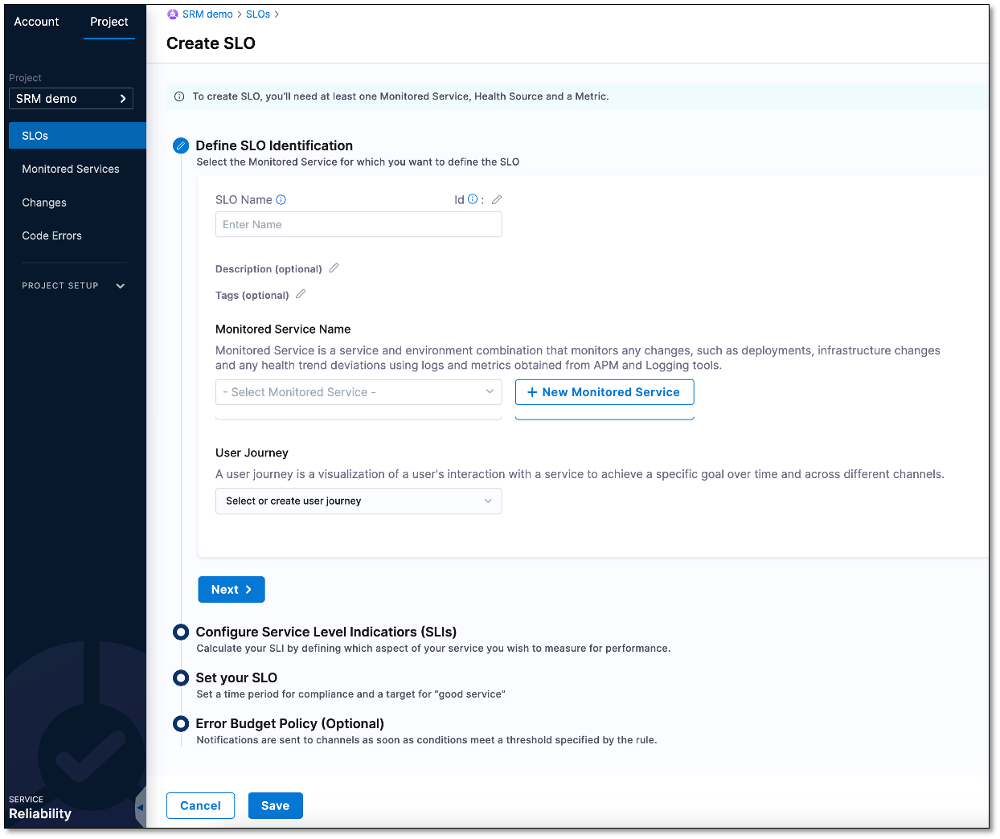
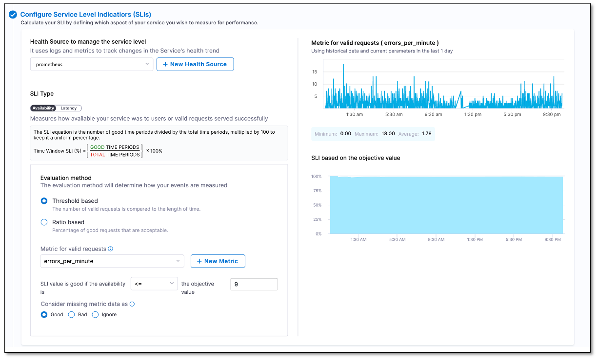
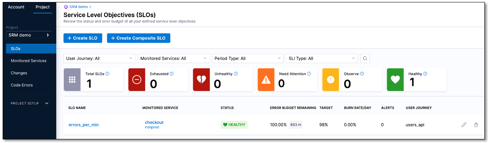

```mdx-code-block
import Tabs from '@theme/Tabs';
import TabItem from '@theme/TabItem';
```

A Service Level Objective (SLO) is a target for the level of service you aim to provide to your users or customers. It is typically defined as a measurable performance metric, such as availability or response time, and is used to set target expectations for how your service should perform. SLOs help in figuring out the acceptable level of downtime for a service. Each SLO is based on a performance metric called a Service Level Indicator (SLI).


## Prerequisites

- A Harness Delegate. Ensure that you have installed a Harness Delegate, and it can communicate with Harness, your health source, and change sources. For more information, go to [Get started with delegates](/docs/platform/2_Delegates/install-delegates/overview.md).
  
- An Organization in Harness. If you have not already created one, go to [Create organizations and projects](/docs/platform/organizations-and-projects/create-an-organization.md).

- A project in Harness. If you have not already created one, follow these steps.

<details>
<summary><b> Steps to create a project in Harness.</b></summary>

1. In Harness, select **Service Reliability** > **Create Project**.
   
2. On the **About the Project** page, do the following, and then select **Save and Continue**: 
   - **Name**: Enter a name for the project.
   - **Color**: Select a color theme for the project.
   - **Organization**: Select an organization for the project. If you don't yet have an organization in Harness, and want to learn how to create one, go to [Create a Harness Org](/docs/platform/organizations-and-projects/create-an-organization.md).
3. On the **Invite Collaborators (Optional)** page, in the **Invite People to Collaborate** field, add team members to the project.
4. In the **Role** field, assign a role to the collaborators.
5. Select **Add**.
6. Select **Save and Continue**.  
   Your project has been created.

</details>


- Health source connector. Ensure that your health source is connected to Harness. The health source can be a monitoring and logging system such as Prometheus. This enables Harness to collect health and performance metrics and monitor your SLO. For more information, go to [Connect to Monitoring and Logging Systems](/docs/platform/Connectors/Monitoring-and-Logging-Systems/connect-to-monitoring-and-logging-systems).

## Create a SLO

Here is the summary of steps involved creating a SLO:

- Define SLO Identification
- Configure Service Level Indicatiors (SLIs)
- CreateError Budget Policy (Optional)


### Define SLO Identification

In this section, you add a name for the SLO, create a monitored service, and select a user journey.


#### Add a name for SLO

To add a name for your SLO:

1. In your Harness project, navigate to the **Service Reliability** module, and then select **SLOs** > **+ Create SLO**.  
   The Create SLO page appears.

   

2. In the **SLO Name** field, enter a name for the SLO. For example, the "errors_per_min".
3. Optionally, you can add a description of the SLO in the **Description (Optional)** field. You can also attach a tag to the SLO. To attach a tag, select the pencil icon next to the **Tags (Optional)** field, type a tag name, and then press enter.


#### Create a monitored service

A monitored service helps you track and monitor your workload and deployment target. By collecting metrics from APM and logging tools, a monitored service enables the monitoring of your workload and deployment target. This data is then used to define and measure the SLO.

To create a monitored service:

1. Select **+ New Monitored Service**.  
   The Create a Monitored Service dialog appears.
2. From the **Create or Select a Service** dropdown list, select **+ Add New**.  
   The New Service dialog appears.
3. In the **Name** field, enter a name for the service. For instance, you could name it "checkout".
4. Optionally, you can add a description of the SLO in the **Description (Optional)** field. You can also attach a tag to the SLO. Select the pencil icon next to the **Tags (Optional)** field, type a tag name, and then press enter. 
5. Select **Save**.
6. From the **Create or select an Environment** dropdown, select **+ Add New**.  
   The New Environment dialog appears.
7. In the **Name** field, enter a name for the environment. For example, the “nonprod”.
8. Optionally, you can add a description of the environment in the **Description (Optional)** field. You can also attach a tag to the environment. Select the pencil icon next to the **Tags (Optional)** field, type a tag name, and then press enter.
9. Under **Environment Type**, select an environment. The available options are **Production** and **Non-Production**. For instance, you could select **Non-Production**.
10. Select **Save**.
11. In the **Create a Monitored Service** dialog, select **Save**.  
    The Monitored service appears in the **Monitored Service Name** field.
    
   :::info note
   Harness generates a monitored service name by combining the service and environment names. For example, if the service name is "checkout" and the environment name is "non-prod", the resulting name is "checkout_nonprod".
   :::


#### Select a user journey

1. From the **User Journey** dropdown list, select **+ Add New**.  
    The User Journey dialog appears.
2. In the **Name** field, enter a name for the user journey. For example, the “dev users".
3. Optionally, you can add a description of the user journey in the **Description (Optional)** field. You can also attach a tag to the user journey. Select the pencil icon next to the **Tags (Optional)** field, type a tag name, and then press enter.
3. Select **Save**.
4. Select **Next** to go to the **Configure Service Level Indicatiors (SLIs)** section.


### Configure Service Level Indicators (SLIs)
In this section, you add a health source to manage service level, select an SLI type, and configure the evaluation method.


#### Add a health source to manage service level

Health source is your APM or logging tool that you have connected with Harness. If you have not yet connected your APM or logging tool with Harness, go to [Connect to Monitoring and Logging Systems](/docs/platform/connectors/monitoring-and-logging-systems/connect-to-monitoring-and-logging-systems).

To add a health source:

1. Under **Health Source to manage the service level**, select **+ New Health Source**.  
   The Add New Health Source dialog appears.
2. In the **Define Health Source** tab, select your health source. For example, "Prometheus".
3. In the **Health Source Name** field, enter a name for the health source. For instance, "prometheus".
4. Based on the health source you have selected, you may need to select a **Connection Type**. For example, if you have selected Prometheus as health source, you may need to choose either **Prometheus** or **Amazon Web Services** as connection type.
5. Under the **Connect Health Source** section, click the **Select Connector** field.  
   Create or Select an Existing Connector dialog appears.
6. Choose your health source connector and select **Apply Selected**. For example, "Prometheus".
   
   :::info note
   Depending on the settings you configured when adding the connector to Harness, you may need to choose the connector from the **Project** tab, the **Organization** tab, or the **Account** tab.
   :::

7. Depending on the health source you choose, select either the **Metrics** or **Logs** option from the **Select Feature** field. The **Metric** or **Log** option may be preselected based on the health source you choose. For instance, if you choose **prometheus** as your health source, the **apm** option will be selected by default.
8. Select **Next**.


##### Configure metrics or logs

The configuration settings for health source metrics depend on the selected health source and feature. For instance, if you select **Prometheus** as your health source, you will need to configure following settings.


##### Define a query

1. In the **Query Specifications and Mapping** section, in the **Group Name** field, select **+ Add New**.  
   The New Prometheus Group Name dialog appears.
   
2. Enter a name for the group and select **Submit**. 

3. Expand **Build your Query** and do the following:
   
   - From the **Prometheus Metric** dropdown list, select a filter for metric.
   - From the **Filter on Environment** dropdown list, select a filter for environment.
   - (Optional) From the **Additional Filter (optional)** dropdown list, select additional filters to add to the service.
   - (Optional) From the **Aggregator (optional)** dropdown list, select an aggregator for the metric.

Once you select the desired values, a query is automatically generated and a sample metric graph is displayed. This helps to verify that the query has been constructed accurately.



4. Expand **Assign** to assign the metric to the following Harness services:
   
   - SLI
   - Service Health
   - Continuous Verification

5.  After completing the configuration of the health source, select **Submit** to save health source.
6.  Select **Next**.


#### Select SLI type

SLI is like a ruler or a tool that you use to measure your service's performance. It helps you determine how close or far you are from meeting your SLO so that you can take corrective action if necessary.

The initial step in configuring the SLIs is to select the metric type that will be used to measure the SLI. Choose one of the following options:

- **Availability**: Measures the proportion of time that a service is accessible and usable by end-users, expressed as a fraction or percentage of total time.
- **Latency**: Measures the amount of time it takes for a service to respond to a request, typically measured as the time between when the request was made and when a response was received.


#### Select evaluation method

Choose the evaluation method for measuring the events. Select one of the following options:

**Threshold based**: Measures the proportion of events that meet a specific threshold value. This method is useful for measuring service reliability and detecting potential issues when the SLI falls below a set threshold.  

For example, if you set a threshold of 99%, the SLI will measure the percentage of events that meet or exceed that level. If the SLI falls below the threshold, it indicates that there is an issue with the service.

**Ratio based**: Measures the percentage of successful requests out of the total requests. This method is useful for services where quality is measured by the number of successful transactions, such as web servers or databases.  

For example, if you set a criterion of 95% success rate for a service that handles 1000 requests per hour, the SLI will measure the percentage of successful requests out of the total requests received.

[Configure SLI](./static/configure-sli.png)

Based on the evaluation method you select, configure the following SLI settings:

<Tabs>
  <TabItem value="Threshold based" label="Threshold based" default>


1. Select a metric that you want to track.   
   A graph will be displayed showing the last 24 hours of data received from your health monitoring tool. The graph will also show the recommended minimum, maximum, and average values for the SLI parameter you are configuring, which can help you determine the appropriate value for your SLI.

   Suppose the recommended minimum value for latency is 10 milliseconds, the maximum value is 500 milliseconds, and the average value is 50 milliseconds. Based on this data, you can determine the appropriate ideal value for your SLI. For example, you may set the objective value for your SLI to be less than or equal to 100 milliseconds to ensure that the service is meeting the required level of latency performance.

2. Set the availability threshold to determine whether the SLI is considered acceptable or not. You can use one of the following operators from the **SLI value is good if the availability** dropdown list to determine the threshold:
   
   - **<**
   - **>**
   - **<=**
   - **>=**

   For example, select the **<=** operator from the dropdown list and enter 99.5 as the objective value. This means that the SLI will be considered good as long as its value is 99.5% or higher. If the SLI falls below this threshold, it indicates that the service is not meeting the required level of availability and needs to be improved.

3. In certain situations, a metric may deviate from its expected behavior and miss out on some data points. In such cases, Harness SRM allows you to interpret these undetected metric values from your Health Source as "Good", "Bad", or "Ignore". You can set this by selecting the appropriate value next to **Consider missing metric data as**. The available options are **Good**, **Bad**, and **Ignore**.
   
   For example, let's say you have configured an SLI based on availability metrics, and you notice that there is a gap in the data because the service was temporarily offline during that time. In this case, you can interpret that gap in the data as "Bad" because the service was not available to users during that time.
   
   On the other hand, if the gap in the data was due to an issue with your monitoring tool, you may choose to interpret those undetected metric values as "Ignore" because they do not accurately represent the service's availability.
   
   By interpreting undetected metric values as "Good", "Bad", or "Ignore", you can improve the accuracy of your SLIs and ensure that they are reflective of the actual performance of your service.


</TabItem>
  
<TabItem value="Ratio based" label="Ratio based">


1. From the Event type dropdown list, select the type of event that you want to measure. The following options are available:
   - Good
   - Bad
2. Select a metric from the dropdown list based on the event type you have chosen. The metric dropdown field that you see will vary depending on the event type selected. For example, if you have chosen the **Good** event type, you will see the **Metric for good requests** dropdown list, while if you have chosen the **Bad** event type, you will see the **Metric for bad requests** dropdown list.
3. From the **Metric for valid requests** dropdown list, select a metric for the valid requests.
 
 A graph will be displayed showing the last 24 hours of data received from your health monitoring tool. The graph will also show the recommended minimum, maximum, and average values for the SLI parameter you are configuring, which can help you determine the appropriate value for your SLI.

 4. From the **Good requests must be** dropdown list, select the appropriate operator and enter a corresponding value in the **% of valid requests** field for determining the SLI.
   Let's say you are measuring the SLI for a web service that handles user authentication requests. You want to ensure that at least 99% of authentication requests are successful. In this case, you would use the ratio-based SLI evaluation method and set the "Good requests must be" dropdown to ">=" (greater than or equal to) and enter 99 in the "% of valid requests" field. This means that the SLI will measure the ratio of successful authentication requests to total authentication requests, and the SLI will be considered good if the ratio is greater than or equal to 99%.
   

 </TabItem>
</Tabs>

### Set your SLO

In this section you configure the SLO.

To measure a SLO, you need to specify the time duration over which the target value for the SLI is evaluated. For example, if you want to measure the success rate of a web service for a week, you would set the compliance period to seven days. You would also set a target value for the success rate, such as 99%. This means that the service must have a success rate of 99% or higher over the specified period for the SLO to be considered met.

Configure the following settings to determine the compliance time period and target value for your SLO.

1. From the **Period Type** dropdown list, select a period type. The available options are **Rolling** and **Calendar**.
2. Depending on the period type you selected, choose the period length. For example, if you selected **Rolling** as the period type, you should select the number of days for the period length. If you selected **Calendar** as the period type, you should select the period length as either **Weekly**, **Monthly**, or **Quarterly**.


:::info
The "Rolling period" type calculates the compliance period based on the current time and the length of the period. For example, if you select a rolling period of seven days, the compliance period will always be the last seven days, regardless of the current date.

On the other hand, the "Calendar period" type sets fixed calendar periods for the compliance period, such as weekly, monthly, or quarterly. For example, if you select a monthly period length, the compliance period will always be the entire calendar month, regardless of when the measurement starts.
:::


### Save
Select **Save** to save the settings.
The SLO appears on the Service Level Objectives (SLOs) page.



Congratulations on successfully created your first SLO!

## Next steps

Learn how to view and monitor your SLO using the [SLO dashboard](./slo-dashboard.md).


