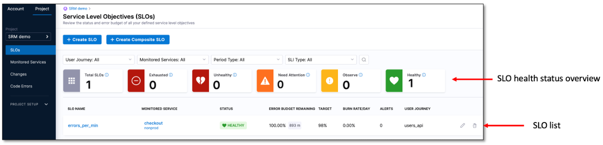
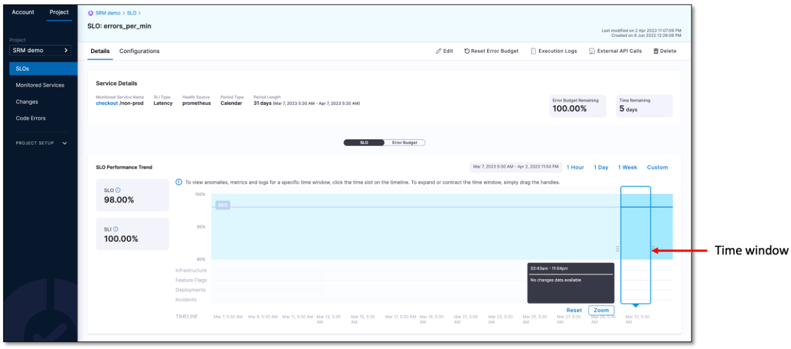
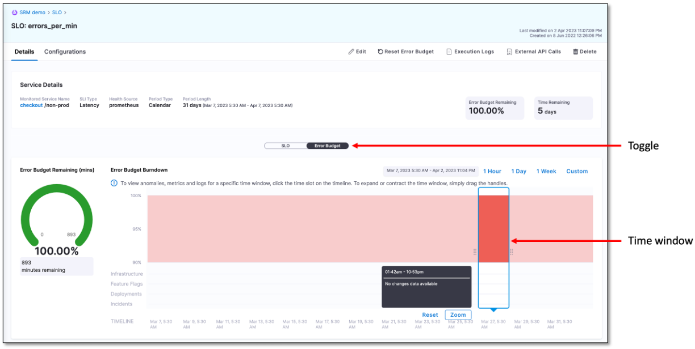

The SLO dashboard provides a centralized view to track, monitor, and manage all the SLOs set for your service, allowing you to easily gauge your service's overall health and performance.

## View SLO dashboard

To go to the SLO dashboard:

1. In your Harness project, navigate to the **Service Reliability Management** module, and then select **SLOs**.  
   The SLOs dashboard appears.

The SLO dashboard provides an at-a-glance summary of the health status of the SLOs by categorizing them into the following groups:  

- **Total SLOs**: total number of SLOs set for the service.
- **Exhausted**: number of SLOs which have exhausted their error budget.
- **Unhealthy**: number of SLOs which have a remaining budget between 0% and 25%.
- **Need Attention**: number of SLOs which have a remaining error budget greater than 25% but less than 50%.
- **Observe**: number of SLOs which have a remaining error budget greater than 50% but less than 75%.
- **Healthy**: number of SLOs which have a remaining error budget above 75%.

### SLO list

In addition to the health categorization, the dashboard displays a list of all SLOs, including the SLO name, service being monitored, status, remaining error budget, burn rate per day (that is, how quickly the error budget is being used up), alerts sent, and user journey selected.

:::info
Burn rate refers to the rate at which error budget is being used up.
:::

### SLO list filters

The dashboard shows a list of all SLOs by default, but you can filter the list based on their health status. To do this, simply select an SLO category tile. For example, to view SLOs that have exhausted their error budget, select the Exhausted tile. The list will update to show only the SLOs in that category.

### View SLOs attached to a monitored service

To view all the SLOs attached to a monitored service, simply select the monitored service name on the SLO list. This will open the Monitored Service dashboard, which lists all the SLOs associated with the selected monitored service.

### View SLO details and performance

To view details of a specific SLO's performance, simply click on the name of the SLO in the list.  
The SLO details page appears.

## SLO details page

The SLO details page displays configuration summary, performance trend chart, and error budget details for the selected SLO.

### SLO configuration summary

The SLO details page provides a summary of the selected SLO's configuration, which includes:

- **Monitored Service Name**: The name of the monitored service attached to the SLO.

- **SLI Type**: The type of SLI used to measure the SLO.

- **Health Source**: The source of health data used to calculate the SLO.

- **Period Type**: The type of time period used to calculate the SLO.

- **Period Length**: The length of the time period used to calculate the SLO.

- **Error Budget Remaining**: The amount of error budget that is still available for the SLO.

- **Time Remaining**: The amount of time remaining in the current period for the SLO.

### SLO performance trend chart

The SLO performance trend chart displays the percentage of SLO and SLI values, providing insight into how frequently the defined threshold has been exceeded. This enables you to assess whether the service met the expectations of most users in terms of reliability during a certain period.

To see the SLI assessment at different intervals, simply move the time window.

To customize the SLO performance trend chart for a specific time window, simply select the desired time slot option from the menu above the chart. You can choose from the following options:

- 1 Hour
- 1 Day
- 1 Week
- Custom

### Error budget details

To view the error budget details for the SLO, select the **Error Budget** toggle.  
The error budget dashboard appears displaying the following information:

- **Error Budget Remaining (minutes and percentage)**: A semi-circular donut chart that shows the remaining error budget in minutes and as a percentage. The calculation for this is based on the formula: Error Budget Remaining = Total Error Budget - Number of Bad Minutes.
  
- **Error Budget Burn Down**: This graph shows the rate at which your Error Budget is being used up over time. To see the error budget burn down at different intervals, simply move the time window.

Harness SRM generates an error budget automatically based on the SLO target and time window specified. The error budget represents the speed and quality obligations that your service must meet. In other words, it represents the amount of unreliability that you can afford before your SLO is breached.

To customize the burn down chart for a specific time window, simply select the desired time slot option from the menu above the chart. You can choose from the following options:

- 1 Hour
- 1 Day
- 1 Week
- Custom
