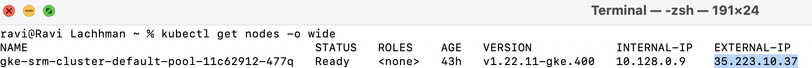
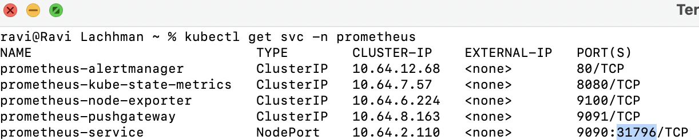
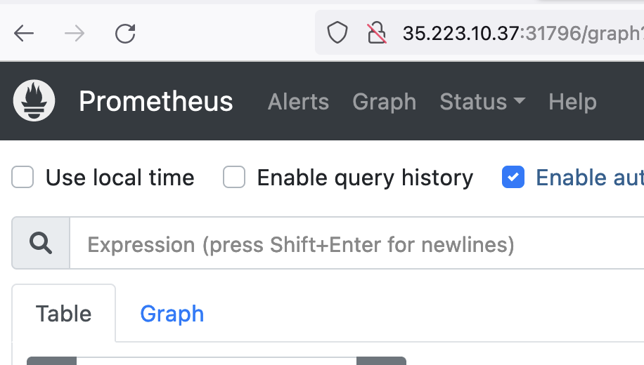
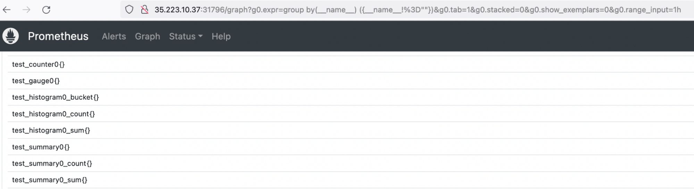
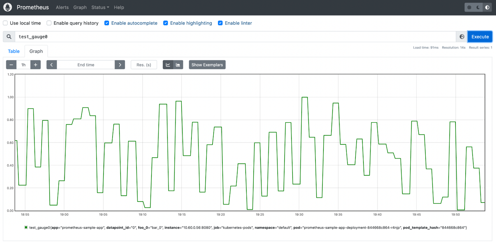
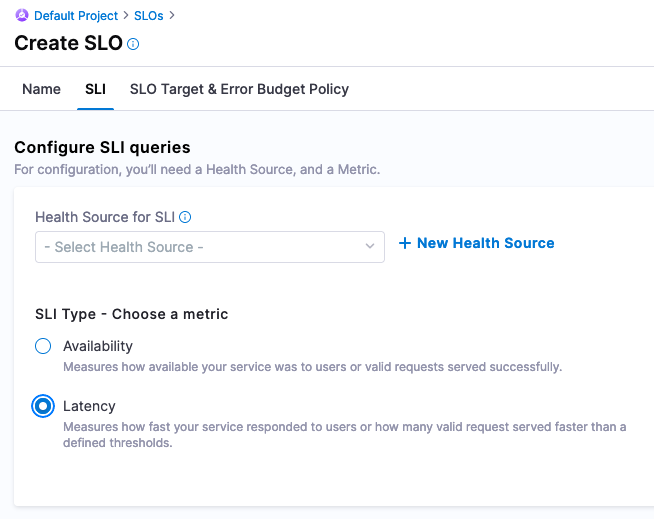
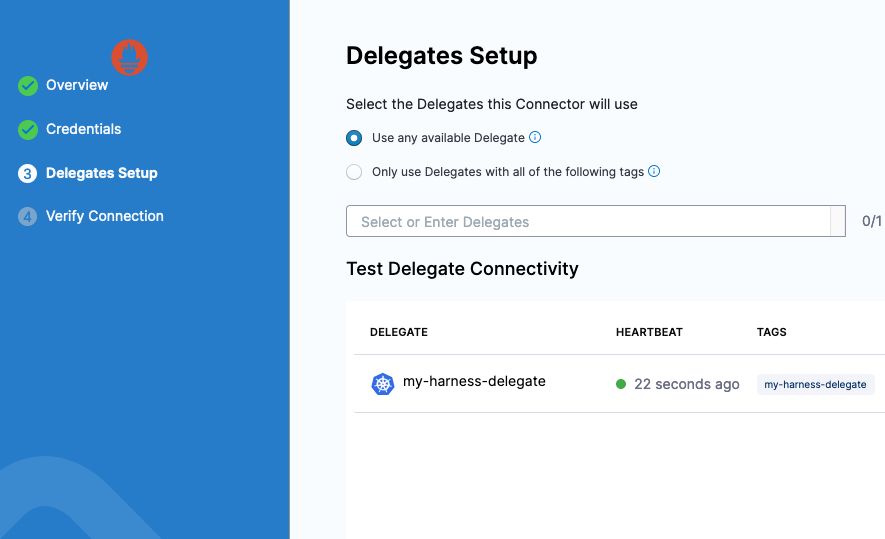
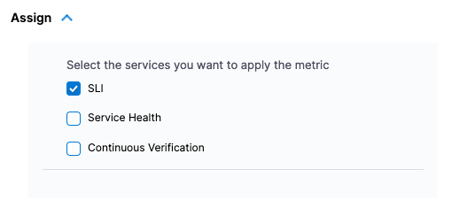
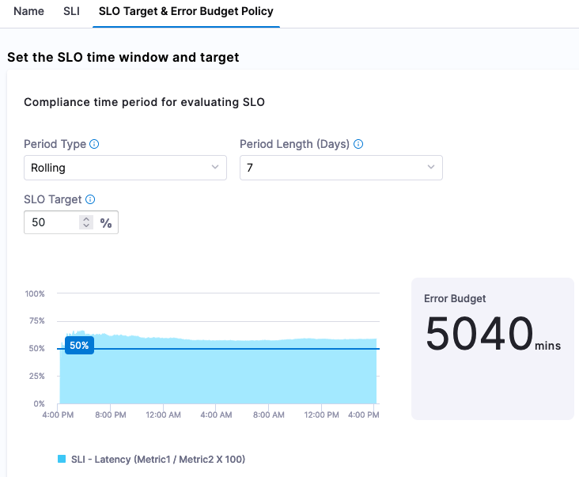
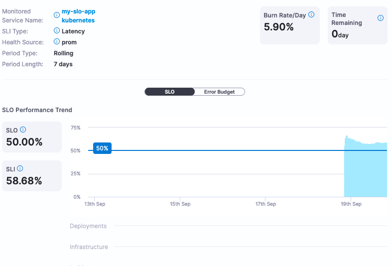

In information technology, the adage that you can not improve what you can't measure is true. Indicators and measurements of how well a system is performing can be represented by one of the Service Level (SLx) commitments. There is a trio of metrics, SLAs, SLOs, and SLIs, that paint a picture of the agreement made vs the objectives and actuals to meet the agreement. Focusing on the SLO or Service Level objectives, those are the goals to meet in your system.

Service Level Objectives are goals that need to be met in order to meet Service Level Agreements [SLAs]. Looking at Tom Wilkie's [RED Method](https://www.weave.works/blog/the-red-method-key-metrics-for-microservices-architecture/) can help you come up with good metrics for SLOs: requests, errors, and duration. Google's [Four Golden Signals](https://landing.google.com/sre/sre-book/chapters/monitoring-distributed-systems/) are also great metrics to have as SLOs, but also includes saturation.

For example, there might be an SLA defined by the business as "we require 99% uptime". The SLO to make that happen would be "we need to reply in 1000 ms or less 99% of the time" to meet that agreement.

## Manage and measure your SLOs

Drawing a conclusion can always be tricky especially if data is coming from different sources and services. If you had one and only one service in your organization, the amount of system and business knowledge about this one service would be easy to disseminate. Though that is not the case for any organization as the number of services increase and domain expertise does not stay within a singular individual.

A myth about SLOs is that they are static in nature. As technology, capabilities, and features change, SLOs need to adapt with them. In an age of dial up internet, the example SLO of "we need to reply in 1000ms or less 99% of the time" would be impossible. As cloud infrastructure and internet speeds increased over the decades, that SLO seems very possible.

SLIs are used to measure your SLOs. SLO Management would not be possible without including the SLIs. In the response example, the SLI would be an actual response time which the SLO tracks against. In the below example, we will be setting up an SLO and SLI.

## Get started with SLO management

The Harness Service Reliability Management module supports SLO Management. If you have not already, [sign up for a Harness SRM Account](https://harness.io/demo/srm), then use the following tutorial to try out SLO management using Prometheus metrics and Harness SRM.

This example uses [Prometheus](https://prometheus.io/), an open source monitoring solution, to intercept metrics from an example application. The Open Observability Group has an [example application](https://github.com/open-o11y/prometheus-sample-app) that can be deployed to Kubernetes that writes to Prometheus metrics.


### Install Prometheus

An easy way to install Prometheus on your Kubernetes cluster is to use [Helm](https://helm.sh/).

```
helm repo add prometheus-community https://prometheus-community.github.io/helm-charts

helm repo update

helm upgrade --install prometheus prometheus-community/prometheus \
--namespace prometheus --create-namespace
```

Once installed, there are a few ways to access your Prometheus Web UI. It is not recommended with workloads of substance to expose this to the public. For this example, you can expose this via [NodePort](https://kubernetes.io/docs/concepts/services-networking/service/).

```
kubectl expose deployment -n prometheus prometheus-server --type=NodePort --name=prometheus-service
```

With a NodePort, you access the Service deployed on the cluster via your browser with `node_public_ip:nodeport`.

To find your Kubernetes node's public (external) IP, run `kubectl get nodes -o wide`.



Then grab the NodePort by running `kubectl get svc -n prometheus`.



In this case, the `node_ip:nodeport` combo is `http://35.223.10.37:31796`.

:::note
If you are using a cloud rendition of Kubernetes e.g. EKS/GKE/AKS, by default your firewall might not allow for TCP traffic over NodePort range. Can open up specifically for each NodePort or give a range to cover all NodePorts; TCP ports 30000-32768.
:::



Now you are ready to deploy an application that writes to Prometheus.

### Deploy an application that writes to Prometheus

Following the [Open Observability Group's Sample Application](https://github.com/open-o11y/prometheus-sample-app), you can build from source or use an [already-built rendition that we have built for this example](https://raw.githubusercontent.com/harness-apps/developer-hub-apps/main/applications/prometheus-sample-app/prometheus-sample-app-k8s-deployment.yaml).

```
Kubectl apply -f https://raw.githubusercontent.com/harness-apps/developer-hub-apps/main/applications/prometheus-sample-app/prometheus-sample-app-k8s-deployment.yaml
```


With the application installed, now you can explore some metrics with Prometheus then wire those metrics to Harness.

### Prometheus metrics

Prometheus groups metrics in several ways. There are [four metric primitive types](https://prometheus.io/docs/concepts/metric_types/) that Prometheus supports. Querying these metrics are handled by Prometheus's query language, or [PromQL](https://prometheus.io/docs/prometheus/latest/querying/basics/).

If this is your first time delving into Prometheus or just want to find out more about what your applications are sending in, this [Prometheus Blog](https://promlabs.com/blog/2020/12/17/promql-queries-for-exploring-your-metrics) is a good resource to explore your metrics when the metric names are unknown. Below is a PromQL query to list all available metrics in your Prometheus instance.

```
group by(__name__) ({__name__!=""})
```

Running that query, you'll notice all four metric types are being written by the example application.



The `test_gauge0` metric is a good metric to take a look at. A [Gauge](https://prometheus.io/docs/concepts/metric_types/#gauge) in Prometheus is a metric that represents a singular numerical value. How the sample application is designed will increase and decrease the gauge counter over time, which if this was a real life gauge could represent something like memory pressure or response time.



With this metric, you are now able to start to manage this metric with Harness SRM.

## Create an SLO in SRM

Before you configure your service metrics/telemetry as SLOs in Harness SRM, you need:

* A [Harness account](https://harness.io/demo/srm).
* The default project that is created in your account automatically or another Harness project that you've created.
* A [Harness Delegate installed in your Kubernetes cluster](/docs/platform/delegates/install-delegates/install-delegate)

### Create an SLO

In the Harness Platform, go to the **Service Reliability** module and select **SLOs** in the default project (or another project of your choosing).

Select **Create SLO**, enter a name for the SLO, such as `myslo`.

Create a service to monitor. Name the service `my-slo-app`, set the environment to `kubenetes`, and then select **Save**.


When creating an SLO you can also create a journey that a user or system will be taking. You can create a User Journey called `myjourney`, and then select **Continue**.


### Configure SLI

Now you are ready to wire in the Service Level Indicator [SLI] from Prometheus that feed into this SLO. Since the `test_summary0_sum{}` metric has a consistent upward trend, this can be used to simulate a latency metric.

Under **Configure SLI queries**, set the **SLI Type** to **Latency**, and then select **New Health Source**.



Add a Prometheus Health Source, and name it `myprominstance`.


Create a Prometheus Connector named `kubernetesprom`.

In the connector's Credentials, enter the NodePort address or the address corresponding to how you exposed Prometheus's 9090 port.


In the connector's Delegates Setup, select a Harness Delegate to connect from Harness to your Prometheus instance. You can select any available Harness Delegate.



Select **Save** and wait while the connection test runs. Harness uses this connector to pull data from Prometheus Query as a Health Source.


After adding the connector to the Health Source, select **Next**. Using the query builder, the metric you want to focus on is `test_gauge0` and you want to filter it on the `app` field with the example app label, `prometheus-sample-app`. You can duplicate the filter on Environment and Service, since this is the only metric tracked in this example.

- **Prometheus Metric:** `test_gauge0`
- **Environment Filter:** `app:prometheus-sample-app`
- **Service Filter:** `app:prometheus-sample-app`


In the Assign section, select **SLI**.



Select **Save** and select the metrics powering the SLI. Taking a closer look at the sample Gauge in Prometheus, a sample of `0.60` seems to be a good midpoint on this metric's fluctuations. For this example, assume that this Gauge represents response time, and that a lower score is better.


When configuring the SLI, you can configure this as a **Threshold-based metric**. The **Objective Value** of what we are measuring is that a *good* score is *less than or equal to 0.60*. If data is missing in our Gauge, we can mark this as *bad*.

- Metric for valid requests: Prometheus Metric
- Objective Value: `0.60`
- SLI value is good if: `<=`
- Consider missing data: `Bad`


### Set SLO target

Finally, set up the SLO Target (based on the SLI) and [Error Budget](https://www.atlassian.com/incident-management/kpis/error-budget) (amount of time system can fail) Policy. For example, you can set a goal (or SLI) that 50% of requests need to be less than or equal to our Objective Value. Since we are setting 50% of the target, we are also stating that 50% of the week, if we set a rolling 7 day period, can be included in our Error Budget, which is indicated by Harness.



Now you have the ability to actively monitor and manage your SLOs. SLOs can be renegotiated much easier with Harness without having to calculate them.



If this SLO is too aggressive or too lenient, Harness can provide the actual service data to help make that determination. In this example, we set the SLO target at 50%, which is not a very good SLO. Changing the SLO target to be more aggressive, for example 99%, can be changed directly in the Harness SRM interface.


