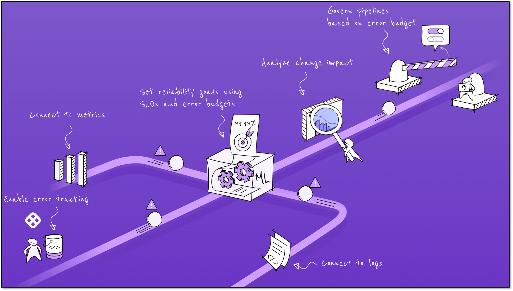

# SRM overview

Harness Service Reliability Management (SRM) helps you improve the reliability of applications and services by providing real-time insights into their performance, detecting anomalies, providing automated remediation, and enabling you to quickly identify and resolve issues.

The main features of SRM include:

- **Real-time monitoring and alerting:** Monitors the performance of your applications and infrastructure, providing real-time alerts when issues arise.

- **Performance Analytics:** Provides detailed analytics and insights into the performance of your applications and services. This enables you to identify trends and make data-driven decisions to optimize performance of applications and services.

- **User-friendly GUI and APIs:** SRM offers users the ability to define and configure Service Level Indicators (SLIs), Service Level Objectives (SLOs), and error budgets through a user-friendly GUI and APIs.

## Summary of SRM capabilities

The following table lists the main capabilities of SRM:

| Capability                                             | Description                                                                                                                                                                                                                                                                                                                    |
| :----------------------------------------------------- | :----------------------------------------------------------------------------------------------------------------------------------------------------------------------------------------------------------------------------------------------------------------------------------------------------------------------------- |
| Define and configure SLIs, SLOs, and error budgets     | You can set up reliability targets via a user-friendly GUI, or APIs. The GUI provides helpful information to make it easy for anyone to set up reliability metrics and objectives. You can set up reliability targets using templates or APIs to easily scale SLO management across any size organization.                     |
| Automatically track SLIs, SLOs, and error budgets      | This feature automates the tracking of all reliability targets set by you, eliminating the need for spreadsheets and manual tracking.                                                                                                                                                                                          |
| Integrations with leading observability solutions      | Setting up SLIs requires access to monitoring and observability data. Harness has out-of-the-box integrations with the leading vendors and open-source observability solutions to make it easy to ingest the necessary data.                                                                                                   |
| Integrates with Change and Incident Management Sources | This feature provides out-of-the-box integrations with many change and incident management data sources to provide a holistic view of changes.                                                                                                                                                                                 |
| Turns SLO data into service health indicators          | After creating SLOs and error budgets for applications, this feature provides alert notifications when error budgets are burning down and pose a risk to deployment activities. Harness classifies all services by the amount of error budget remaining and can alert users when these services are reaching unhealthy levels. |
| Change impact analysis                                 | This feature helps you application triage and root cause analysis by collecting data from all monitoring, observability, logging, change, and incident data sources. You can analyze the data for anomalies and patterns, and correlates the findings with SLO violations and changes in error budget.                         |
| Reliability guardrails integrated with CI/CD pipelines | Reliability guardrails enforce reliability policies. By adding these guardrails to CI/CD pipelines, you can automatically allow or deny new software deployments depending on the current state of the error budget to grant authority to the SLOs you worked so hard to configure.                                            |

## Further reading

- [Tutorials](/tutorials/manage-service-reliability)
- [Supported platforms and technologies](/docs/get-started/supported-platforms-and-technologies/#service-reliability-management)

## Next steps

- [Understand SRM concepts](/docs/service-reliability-management/get-started/key-concepts)

