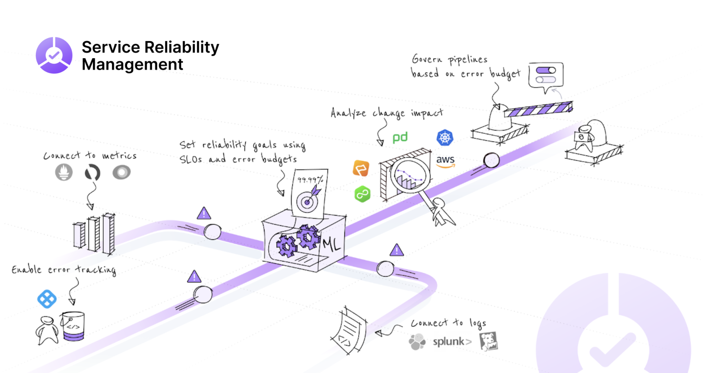

# SRM concepts

Harness Service Reliability Management (SRM) module helps engineering and DevOps teams to balance feature velocity and bug fixes along with the stability and reliability needs in a production environment.

Harness SRM enables teams to:

* Practice Service Level Objective (SLO) driven software delivery to ensure that users receive agreed-upon service levels.
* Maintain an equilibrium between innovation and delivery of reliable services with well-defined SLOs.
* Define service reliability goals in the form of SLOs and Error Budgets.
* Identify and rollback deployments, when it impacts SLOs or when the Error Budget gets depleted in production after rollout.
* Set reliability guardrails within the CI/CD Pipeline.
* Practice Shift left reliability in CI/CD Pipeline through SLO-driven governance policies as well as ML-powered service reliability checks.
* Identify and resolve bugs before they reach production, and cut down the feedback cycle.

Key capabilities of Harness SRM are:

* [SLO Management](../getting-started/create-first-slo.md)
* [Change Impact Analysis](../change-impact-analysis/change-impact-analysis.md)
* [Service Reliability Checks](/docs/continuous-delivery/verify/verify-deployments-with-the-verify-step.md)
* [SLO Driven Governance](..//slo-driven-deployment-governance.md)

This topic explains the basic concepts of Service Reliability Management (SRM).

### SLO

A Service Level Objective (SLO) is an agreed-upon objective or a reliability target value for a system's availability, measured by service level indicator (SLI) metrics. It is the minimum reliability level, in terms of customer expectations, that you expect a service to achieve most of the time. SLOs are reasonable approximation of user experiences which lets you discover the right balance between velocity and quality. For example, consider a scenario wherein a team is consistently meeting its reliability goals, it can increase its velocity of feature releases. However, if the goals are not being met, it results in outages, performance degradation, and so on. The team must then first work on stability and reliability needs before adding new features. SLOs help to balance the possible negative consequences and the lack of availability.

### SLI

SLIs or service level indicators are metrics that can be monitored and act as quantifiable indicators of user experience. These metrics measure the service’s behavior and are documented in service level agreements (SLAs). Some examples of SLIs are error rate, latency, availability, and system throughput. Harness SRM currently has two SLIs - Latency and Availability.

### Error Budget

An Error Budget is the measure of acceptable unreliability that a Service can afford before a customer is impacted. Developers can take more risks or make safer choices depending on whether the Service is within its budget. As long as the Service runs flawlessly, you can spend the Error Budget as you like, but the moment it meets, or exceeds the configured Error Budget, all the releases are frozen until the errors are reduced to a level that meets the contractual promises. Error Budget allows you to accommodate planned or unplanned downtime of a service that is unavoidable in practice.

### Remaining Error Budget

The remaining Error Budget is a measure of the risk that can be safely undertaken enabling you to decide the rate of deployment.

### User Journey

A user journey is a visualization of a user's interaction with a service to achieve a specific goal over time and across different channels. The potential customer touch points are logged and provide an essence of the whole experience from the user’s perspective. Creating a user journey enables you to:

* Map the relationship between a customer and an organization
* Identify points of friction and opportunities

### Monitored Services

A Harness Monitored Service is a Service and Environment combination that Harness monitors for:

* Any changes, such as deployments, infrastructure changes (Kubernetes events, auditing, etc), and incidents (PagerDuty)
* Any health trend deviations using logs and metrics obtained from APM and Logging tools respectively

### Health Source

A Health Source monitors changes in health trends of the Service using logs or metrics collected from an APM or logging tool.

Harness supported Health Sources:

* AppDynamics
* Prometheus
* Splunk
* Google Cloud Operations
* New Relic
* Datadog
* Dynatrace
* Splunk Observability
* SumoLogic
* AWS CloudWatch
* Loki

Harness offers support for all major APM vendors, but there are cases where a customized APM is needed. The [Custom Health Source](/docs/continuous-delivery/verify/configure-cv/verify-deployments-with-custom-health-metrics.md) lets you customize APMs of your choice.

### Change Source

A Change Source monitors change events related to deployments, infrastructure changes, and incidents. It derives specific data points about all the services and its components into a single place which can be simply parsed and analyzed. This enables you to immediately understand what's been changed, why it was changed, and when did the change occur across the board.

### Service Health

Service Health is basically the Health Score aggregated from multiple Health Sources. This helps you analyze the impact of an issue on your organization's business services and applications.

## Next steps

[Create your first SLO](/docs/service-reliability-management/getting-started/create-first-slo.md)
