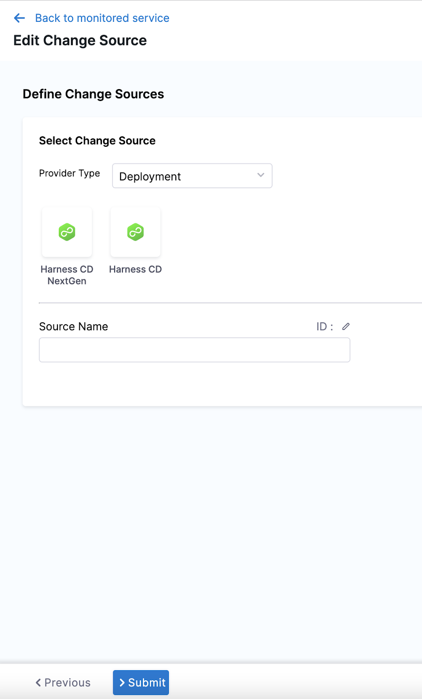
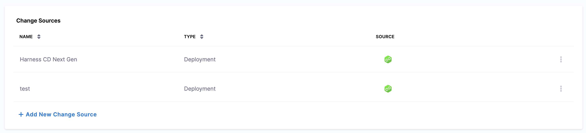
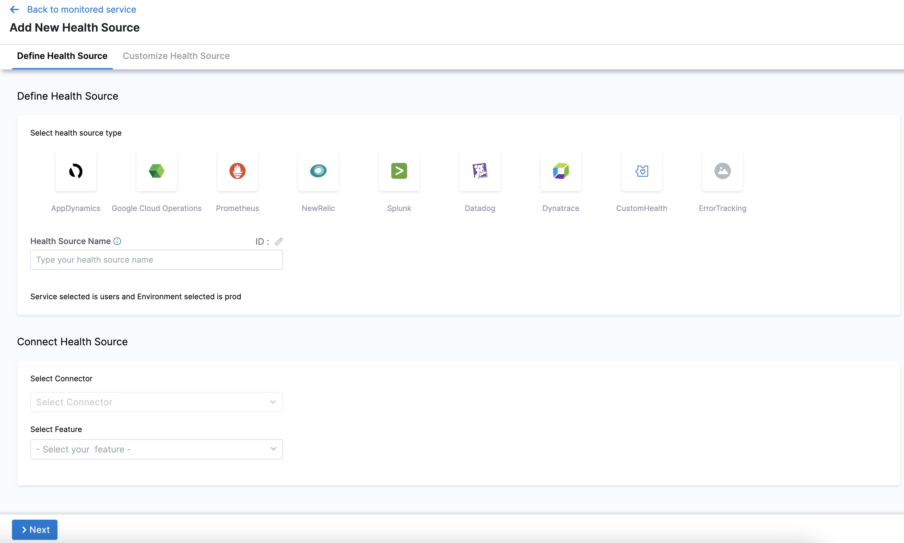

Harness change impact analysis helps you gain a single coherent perspective about what has changed, when it has changed, why it has changed, and the impact it has had on your Monitored Service. Identifying recent change events in your Service around the time when a critical performance change is observed, helps to quickly and accurately identify the root cause of the issue that led to SLO violations.

Change events represent service changes like deployments, infrastructure changes, and incidents. Change correlation enables you to:

* Correlate recent changes in your service and their broader impact on your service
* Triage the changes quickly and reduce downtime

This topic describes how you can correlate change events and understand their impact on a Monitored Service.

### Before You Begin

* [SLO Management Quickstart](slo-management-quickstart.md)

### Prerequisites

* Install a [Harness Kubernetes (K8S) Delegate](../../platform/2_Delegates/delegate-installation-overview.md) and ensure that this Delegate is able to communicate with Harness Manager. Also, the Delegate must be gRPC protocol enabled
* Ensure that the installed Delegate can communicate with the Health Source and Change Source

### Step 1: Add a New Monitored Service

In the Harness Project with the Service you want to monitor, navigate to the **Service Reliability Management** module.

Click **Monitored Services.**

Click **New Monitored Service**. The **Add New Monitored Service** settings appear.

You can also set up a Monitored Service in the [Verify step](../../continuous-delivery/cd-execution/cv-category/verify-deployments-with-the-verify-step.md#step-1-add-verify-step) in a CD stage.In **Overview**, in the **Service** tab, **Application** is selected by default in the **Type** field. You can also select **Infrastructure**.

In **Create or select a Service**, choose the Harness Service to be monitored from the list. Click **Add New** to create a new Service. A Service represents your microservices and other workloads.

In **Create or select an Environment**, choose the Environment where the Harness Service is deployed from the list. Click **Add New** to create a new Environment. Environment represents your deployment targets logically (QA, Prod, etc).

The **Monitored Service Name** field auto-populates the concatenation of the Harness Service and Environment names.

Click **Save**.

To define a Change source and a Health Source for the created Monitored Service perform the steps that follow.

### Step 2: Define a Change Source

A Change Source monitors change events related to deployments, infrastructure changes, and incidents.

Click **Add New Change Source** in the **Add New Monitored Service** settings. The Change Source settings appear.

Select **Deployment** in **Provider Type**. You can also select **Incident** in **Provider Type**.

Click **Harness CD NextGen**. You can also select **Harness CD**.

In **Source Name**, enter a name for the source.

Click **Submit**.

The Change Source gets listed in **Change Sources** section.

To add another Change Source, click **Add New Change Source**.

### Step 3: Define a Health Source

A Health Source monitors the health trends of the Monitored Service using logs or metrics collected from an APM or logging tool.

Click **Add New Health Source** in the **Add New Monitored Service** settings.

The **Add New Health Source** settings appear.

In **Select health source type**, select the desired Health Source type. For example AppDynamics.

In **Health Source Name**, enter a name for the Health Source.

Click **Select Connector**. In the **Connector** settings, select an existing Connector or click **New Connector** to create a new one. Harness uses Connectors to authenticate and perform operations with a 3rd party tool.

After selecting the connector, click **Apply Selected**. The Connector is added to the Health Source.

In **Select Feature**, select the APM or logging tool component to use. For example, if you select AppDynamics, **Application Monitoring** is selected by default.

Click **Next**.

The following options in **Customize Health Source** tab depend on the Health Source type you selected.

In **Find an AppDynamics application** select an application.

In **Find an AppDynamics tier** select a tier in the application environment.

In **Metric Packs**, select the metrics to be monitored. You can select Errors and Performance.

In **Custom Metrics**, click **Add Metric** to include additional metrics of your choice.

Click **Validation Passed** or **No Data** to see the data received from the tool.

Click **Submit**.

The Health Source is added to **Health Sources** section.

To add another Health Source, click **Add New Health Source**.

You can have more than one Health Source and Change Source defined for your Monitored Service.

Click **Save** at the top-right. The Monitored Service is added to the **Monitored Services** page.

The list displays details like name, SLO/Error Budget, change events, health trends, health score, Service dependency, and status of all Monitored Services. To gain more insights about the SLO, Service health, and configuration, click the name of the Monitored Service.

### Step 4: View Service Health

The Service Health dashboard in the **Service Reliability Management** (SRM) module enables you to observe and track the health of Monitored Services.

Using this dashboard you can:

* Track the overall health of your services, spot anomalies, and take timely action

* Track change events that impact your Monitored Service

* Observe and analyze dependencies between applications, infrastructure, and data

* View metrics to analyze patterns, historic trends, performance changes, and correlate factors of your services over a period.

* View log data that helps you debug and narrow down issues.

#### View Service Heath Trends

Perform the following steps to view the health trends of a service.

1. Open a Harness Project with the Service you want to monitor and navigate to the **Service Reliability Management** (SRM) module.

2. Click **Monitored Services**. You can see a list of Monitored Services.

3. Click the Monitored Service whose health is to be tracked. The SLO dashboard appears.

4. Select the **Service Health** tab. The **Service Health** dashboard is displayed.

5. Select **Time Range** to narrow your selection further based on pre-defined time range filters. You'll see that by default **Last 24 hours** is selected. Available options are:
  * Last 4 hours
  * Last 24 hours
  * Last 3 days
  * Last 7 days
  * Last month

The default time range is **Last 24 hours**. Once you have selected the **Time Range**, the data on the dashboard refreshes automatically with the latest data from the database.

#### View Overall Service Health Score

The **Overall Health Score** timeline provides a high level overview of the health of a service. You can hover over the timeline to view the latest health score along with date and time. The timeline is divided into equal-length time slots based on the selected time range.

The score is computed based on change events like deployments, infrastructure changes, and incidents associated with each of the service entities. The health score ranges between 0 to 100. Color-coded severity values are used to represent service health as shown below:

| **Severity** | **Color-Code** |
| --- | :---: |
| Healthy |  |
| Observe |  |
| Needs Attention |  |
| Unhealthy |  |
| N/A |  |

If the service health score is between 80 to 100, it indicates that the service is healthy. Any other value indicates that the service is impacted with several outages. The higher the health score, the healthier your service is.

#### View Service Health for a specific Time slot

To view the service health score for a specific time slot along with the count of anomalies, metrics, and logs, click the time slot on the **Health Score Timeline**. A time window gets selected which can be expanded or contracted as per your requirement.

Click **Reset** to return to the initial timeline data.

#### View Breakdown of Changes

In **Changes**, you can view breakdown of the following events:
* Deployments such as ECS, Kubernetes, and Helm from Harness CD Nextgen and Harness CD.

* Infrastructure changes such as [Kubernetes events](https://kubernetes.io/docs/reference/generated/kubernetes-api/v1.19/#event-v1-events-k8s-io), [Terraform audit logs](https://www.terraform.io/docs/enterprise/admin/logging.html#audit-logs), [MongoDB audit events](https://docs.mongodb.com/manual/reference/audit-message/#system-event-audit-messages), AWS CloudTrail, GCP audit logs and Azure audit logs.

* Incidents from PagerDuty

  

Click an event in **Changes** to drill down following details:

* Time: Date and time at which the event occurred

* Name: Name of the event

* Impact: Name of the impacted Monitored Service

* Source: Name of the source where the change originated

* Type: Change event type

Consider the following example of an infrastructure event.

You can see a summarized view of infrastructure event with the following details:

* Name of the Service, Environment, and Source

* Time and date at which the event was triggered

* View the YAML file of the event

* Compare the current and previous YAML file

* Health score timeline

#### View Service Dependency Graph and Metrics

In the **Service Dependency Graph**, you can view dependencies between applications, infrastructure, and data.

In **Metrics & Logs**, you can view metrics collected at regular intervals and log data.

You can further drill-down on metrics using the following filters:

| **Filter** | **Description** |
| --- | --- |
| All Metrics | Displays all the metrics retrieved by the Health Sources. |
| Anomalous Metrics | Displays the anomalous metrics retrieved by the Health Sources. |

You can also view the health data collected by a specific Health Source.

You can drill-down log data using the following filters:

| **Filter** | **Description** |
| --- | --- |
| All Events | Displays all log events. |
| Known Events | Displays only known log events. |
| Unknown Event | Displays unknown log events. |
| Unexpected Frequency | Displays log data with unexpected frequency. |

### Step 5: View Changes Overview

The **Changes** dashboard in the Service Reliability Management module (SRM) provides a quick overview of change events change events from multiple Change Sources. A Change Source is a combination of a Harness Service and associated Environment that monitors changes like deployments, infrastructure changes, and incidents. Change events are aggregated at one place, which enables you to understand how a certain change impacts the rest of the system. 

Using the **Changes** dashboard you can answer the following questions:

* What has changed in the system?

* When did it change?

* Why has it changed?

* What is the impact of the change on your system?

#### Track and Monitor Change Events

Perform the following steps to track and monitor change events:

1. Open a Harness Project with the service you want to monitor and navigate to the **Service Reliability Management** module.

2. Click **Changes**.

  The **Changes** dashboard is displayed.

  

  You can apply the following filters to narrow your selection further and retrieve the desired data. Each filter has one or more options you can choose from.

  | **Filter** | **Description** |
| --- | --- |
| **Time Range** | Filters the change events based on the selected time range. The available filters are **Last 4 hours**, **Last 24 hours**, **Last 3 days**, **Last 7 days**, and **Last month**.|
| **Services** | A Service represents your microservice and other workloads logically. Filter change events based on a single service or for any number of services. |
| **Environments** | Environments represent your deployment targets logically (QA, Prod, etc). Filter change events based on a single environment or any number of environments. |
| **Change Types** | Filters the change events based on the type of Change Source type. The available filters are **Deployment**, **Infrastructure**, and **Incidents**.|
| **Sources** | Filters the change events based on Change Sources. The available filters are **Harness CD NextGen**, **Harness CD**, **Kubernetes**, and **PagerDuty**.|

#### View Changes Timeline

The **Changes Timeline** provides an instant high-level overview of your Services. You can hover over the timeline to view the status of change events associated with deployment, infrastructure changes, and incidents. Each change event type is encoded with a specific color.

| **Change Event Type** | **Color Code** |
| --- | --- |
| Deployments |  |
| Incidents |  |
| Infrastructure |  |

To view the time, date, and number of change events that occurred in a specific time slot, click the desired time slot on the **Changes Timeline**. A time window gets selected, which can be expanded and contracted as per your requirement.

To return to the initial state, click **Reset** below the selected window on the **Changes Timeline**.

#### View Change Events

In **Changes**, you can view the list of all the change events along with the following details:
* **TIME** - Time at which the event occurred

* **NAME** - Name of the event

* **IMPACT** - Name of the impacted Monitored Service

* **SOURCE** - Name of the Change Source
* **TYPE** - Type of Change Source

#### View Change Event Details

Click an event in **Changes** to drill down to the following details:

  * Name of the Service, Environment, and Source

  * Time and date at which the event was triggered

  * YAML file for the event

  * Service Health Trend timeline displaying the the Health Score of the service

  

#### View Changes in YAML Format

Click **Show YAML Change** to compare the current and previous YAML files for the event.

  
