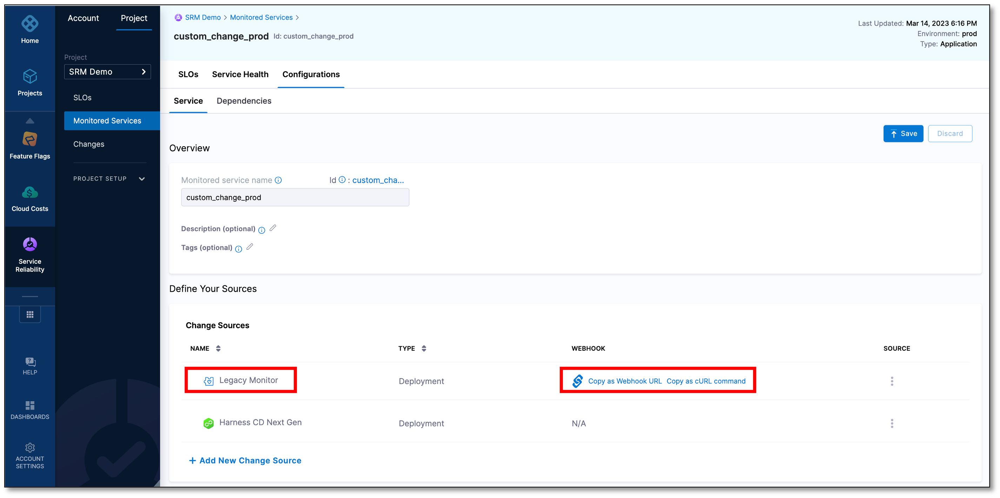
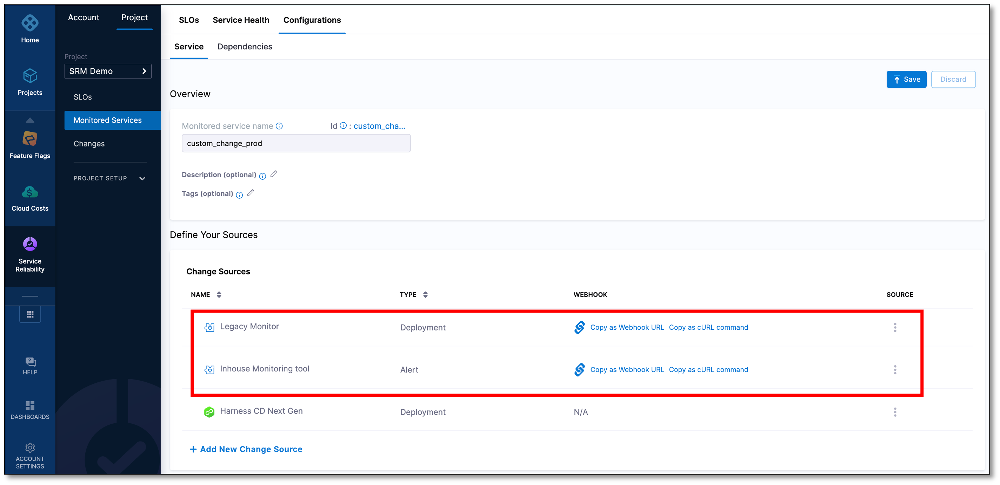

With Harness' custom change source feature, you can easily integrate a monitored service with any change monitoring tool that supports webhook URLs or cURL commands. 

You just need to add a custom change source to the monitored service and configure the change monitoring tool using the webhook URL or cURL commands.

## Add a custom change source

To add a custom change source to a monitored service:

1. In your Harness project, go to **Service Reliability** > **Monitored Services**.  
   A list of monitored services is displayed.
2. Locate the monitored service for which you want to add a custom change source, select the three vertical dots next to it, and then select **Edit service**.  
   The Configurations page appears.
3. Go to the **Service** tab, and in the **Define Your Sources** section, select **+ Add New Change Source**.  
   The Edit Change Source page appears.
4. From the **Provider Type** dropdown list, select the type of change source that you want to use. Following options are available:
   - **Deployments**
   - **Incident**
   - **Feature Flags**
8.  Select **Custom.** 
9.  In **Source Name**, enter a name for the custom change source. For example, "Legacy Monitor".
10. Select **Submit**.  
    The custom change source gets added to the monitored service. A webhook URL and cURL commands are generated.

    

## Copy webhook and cURL command

You need a webhook or cURL commands to configure your custom change source so that it can send events to the Harness monitored service.

To copy the webhook URL or cURL commands from the monitored service:
1. From the list of monitored services, select the monitored service to which you have added the custom change source, and then go to the **Configuration** tab.  
On the **Service** page, in the **Define Your Sources** section, you will see a list of change sources that have been added to the monitored service. The list also displays webhook URLs and cURL commands next to each change source.

2. Locate the custom change source that you want to configure, and then copy the webhook URL or cURL commands.

## Configure your change source

Based on how your change source works, configure it to send events to the Harness monitored service using a webhook URL or cURL commands.

The change events sent by your change monitoring system are displayed on the **Service Health** page of the Harness monitored service. This helps you identify recent change events in your service around the time performance deteriorated.

## Next steps

Use the [Service Health dashboard](change-impact-analysis-service-health-dashboard.md) and [Changes dashboard](change-impact-analysis-changes-dash-board.md) to correlate change events and understand their impact on the monitored service.