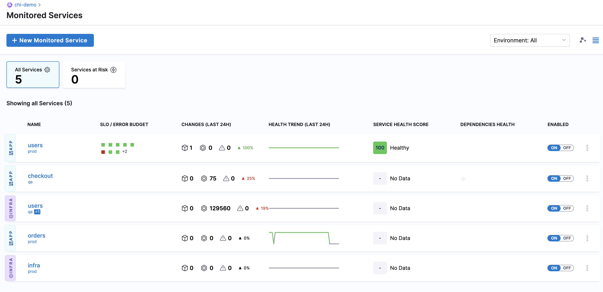

Service level objectives known as SLOs, in Harness Service Reliability Management (SRM), encapsulate realistically achievable performance goals for a Service and measure the reliability of the Service in production. SLOs help in figuring out the acceptable level of downtime for a Service. Each SLO is based on a performance metric called a service level indicator (SLI).

Reliability checks offered by Harness SRM at every stage of the software delivery pipeline help you track and analyze the reliability of a Service. This helps in identifying actionable remedies if a Service fails to meet expectations.

This quickstart walks you through the steps to create and manage an SLO.

### Objectives

You'll learn how to:

* Add a Monitored Service.
* Add a Health Source to monitor the health of your Monitored Service using logs and metrics.
* Add a Change Source to track change events.
* Create an SLO.
* Define and configure SLI Queries.
* Derive an Error Budget.

### Before You Begin

Harness Monitored Services, Change Sources, and Health Sources can be set up without any Harness deployments having been performed. If you already have Harness deployments in this Project, then you can use the Services and Environments from any of those deployments. 

If there are no deployments in your Harness account, we recommend that you first follow the steps in a CD Quickstart to perform a deployment: [Kubernetes CD Quickstart](../../continuous-delivery/onboard-cd/cd-quickstarts/kubernetes-cd-quickstart.md), [Helm CD Quickstart](../../continuous-delivery/onboard-cd/cd-quickstarts/helm-cd-quickstart.md), or [Kustomize Quickstart](../../continuous-delivery/onboard-cd/cd-quickstarts/kustomize-quickstart.md).

### Prerequisites

* Install a [Harness Kubernetes (K8S) Delegate](../../platform/2_Delegates/delegate-installation-overview.md) and ensure that, this Delegate is able to communicate with Harness Manager. Also, the Delegate must be gRPC protocol enabled.
* Ensure that the installed Delegate can communicate with the Health Source and Change Source.

### Step 1: Add a New Monitored Service

You can skip to [Step 4](slo-management-quickstart.md#step-4-create-an-slo) if you have already set up a Monitored Service.In the Harness Project with the Service you want to monitor, navigate to the **Service Reliability Management** module.

Click **Monitored Services.**

Click **New Monitored Service**. The **Add New Monitored Service** settings appear.

You can also set up a Monitored Service in the [Verify step](../../continuous-delivery/cd-execution/cv-category/verify-deployments-with-the-verify-step.md#step-1-add-verify-step) in a CD stage.In **Overview**, in the **Service** tab, **Application** is selected by default in the **Type** field. You can also select **Infrastructure**.

In **Create or select a Service**, choose the Harness Service to be monitored from the list. Click **Add New** to create a new Service. A Service represents your microservices and other workloads.

In **Create or select an Environment**, choose the Environment where the Harness Service is deployed from the list. Click **Add New** to create a new Environment. Environment represents your deployment targets logically (QA, Prod, etc).

The **Monitored Service Name** field auto-populates the concatenation of the Harness Service and Environment names.

Click **Save**.

To define a Change source and a Health Source for the created Monitored Service perform the steps that follow.

### Step 2: Define a Change Source

You can skip to [Step 4](slo-management-quickstart.md#step-4-create-an-slo) if you have already added a Change Source or Health Source for your Monitored Service.A Change Source monitors change events related to deployments, infrastructure changes, and incidents.

Click **Add New Change Source** in the **Add New Monitored Service** settings. The Change Source settings appear.

Select **Deployment** in **Provider Type**. You can also select **Incident** in **Provider Type**.

Click **Harness CD NextGen**. You can also select **Harness CD**.

In **Source Name**, enter a name for the source.

Click **Submit**.

The Change Source gets listed in **Change Sources** section.

To add another Change Source, click **Add New Change Source**.

### Step 3: Define a Health Source

A Health Source monitors the health trends of the Monitored Service using logs and metrics collected from an APM and log provider respectively.

Click **Add New Health Source** in the **Add New Monitored Service** settings.

The **Add New Health Source** settings appear.

In **Select health source type**, select the desired Health Source type. For example AppDynamics.

In **Health Source Name**, enter a name for the Health Source.

Click **Select Connector**. In the **Connector** settings, select an existing Connector or click **New Connector** to create a new one. Harness uses Connectors to authenticate and perform operations with a 3rd party tool.

	After selecting the connector, click **Apply Selected**. The Connector is added to the Health Source.

In **Select Feature**, select the APM or logging tool component to use. For example, if you select AppDynamics, **Application Monitoring** is selected by default.

Click **Next**.

The following options in **Customize Health Source** tab depend on the Health Source type you selected.

In **Find an AppDynamics application** select an application.

In **Find an AppDynamics tier** select a tier in the application environment.

In **Metric Packs**, select the metrics to be monitored. You can select Errors and Performance.

In **Custom Metrics**, click **Add Metric** to include additional metrics of your choice.

Click **Validation Passed** or **No Data** to see the data received from the tool.

Click **Submit**.

The Health Source is added to **Health Sources** section.

To add another Health Source, click **Add New Health Source**.

You can have more than one Health Source and Change Source defined for your Monitored Service.

Click **Save** at the top-right. The Monitored Service is added to the **Monitored Services** page.

The list displays details like name, SLO/Error Budget, change events, health trends, health score, Service dependency, and status of all Monitored Services. To gain more insights about the SLO, Service health, and configuration, click the name of the Monitored Service.

### Step 4: Create an SLO

In the Harness Project with the Service you want to monitor, navigate to the **Service Reliability Management** module.

Click **SLOs**. SLO is the target level of reliability for your service.

Click **Create SLO**. The **Create SLO** settings appear.

Creating an SLO involves the following steps:

1. Define an SLO
2. Configure SLI queries
3. Set SLO target and Error Budget policy

#### Define an SLO

In **Name** tab, in **SLO Name** enter a name for the SLO. For example Quickstart.

Click **Monitored Service**. Select the desired Monitored Service from the list. Click **New Monitored Service** to create a new one.

Click **User Journey.** Select a user journey from the list. To create a new user journey, click **Add New**.

The **User Journey** settings appear. A user journey is a sequence of tasks that are a part of the user experience to achieve a specific result. It visualizes how a user interacts with your product and allows you to understand a user’s point of view.

In **Name** enter a name for the user journey and click **Save**. For example, user\_journey\_quickstart.

Click **Continue**.

#### Configure SLI Queries

A Service Level Indicator (SLI) is a quantitative measure which defines if an SLO is being met and if the Service is working.

Click **Health Source for SLI**, and select the Health Source for which you want to define an SLO. To create a new Health Source, click **New Health Source**. A Health Source tracks changes in the health trends of a service. Tracking is done using logs or metrics collected from an Application Performance Management or logging tool.

In **SLI Type - Choose a metric**, select **Latency**. When you set **Latency** as an SLI, it indicates if the proportion of valid requests are served faster than the threshold. For this example, we are using a Latency SLI, but you can also choose Availability SLI which indicates if the valid requests are served successfully.

In **Pick metrics powering the SLI**, select **Threshold based.** The number of valid requests is compared to the time duration. You can also choose Ratio based which is the percentage of acceptable good requests.

In **Metric for valid requests**, select the metrics that will most accurately track the user experience. You can select metrics corresponding to the number of errors per minute. To create a new metric, click **New Metric**.

In **Objective Value**, specify the threshold value for your SLI. If your selected metric goes above or below this threshold, then that minute will be considered bad, and your SLI value will decrease.

In **SLI value is good if** drop-down, choose **<=** than objective value. This lets you define the SLI correlation with the **Objective Value**.

In **Consider missing metric data as**, select **Bad**. You can choose if the missing metric values are:

* **Good** - Indicates if the missing metric values are good.
* **Bad** - Indicates if the missing metric values are bad.
* **Ignore** - Indicates if the missing metric values can be ignored.

In some cases, a metric can deviate from expected behavior and miss out on data points. Harness SRM lets you interpret these undetected metric values from your Health Source as **Good**, **Bad**, or **Ignore**.Once you define all the fields, a graph is generated on the right-hand panel. The following graph shows the SLI trends over the last 24 hours by default.

Click **Continue**.

#### Set SLO Target and Error Budget Policy

SLO can be defined as a target percentage and Error Budget is 100% minus the target SLO. An Error Budget is automatically generated for each SLO, that indicates the speed and quality obligations that your services meet or, in other words, the unreliability that you can afford.

Compliance time period is the period over which you want to evaluate the SLO. There are two types of compliance period:

* Rolling - Measures compliance over the last *n* days. *n* refers to the Period Length in days which can be any value from 1 to 31.
* Calendar - Measures the compliance over a fixed time period.

For this example we are selecting **Calendar** in **Period Type**. The time window specifies the period for which the SLO runs its calculation. This helps to measure whether the reliability of a service during a given duration meets the expectations of most of its users. 

In **Period Length**, select **Monthly**. You can also select:

* Weekly
* Quarterly

In **Window ends (Day)**, select 31. You can choose any value between 1 to 31.

In **SLO Target**, enter 99. You can enter a value from 1 to 99.9. Once you set the SLO target and specify the time window, an Error Budget is automatically generated. The proportion of Error Budget consumed helps scale and identify incidents that demand closer investigation.

Click **Save**. The SLO gets published on the **SLOs** dashboard.

### Step 5: View Service Level Objectives

The **SLOs** (service level objectives) dashboard helps you track, manage, and monitor all the SLOs set for your service. It shows an aggregated view of overall organizational health.

#### View SLO Status

Perform the following steps to view the SLO status of your service:

1. Open a Harness Project with the Service you want to monitor, and navigate to the **Service Reliability Management** module.
2. Click **SLOs**. The **SLOs** dashboard is displayed. Only the Monitored Services for which SLOs are configured will show up on the dashboard.
3. You can apply the following filters to narrow your selection further and retrieve the desired SLO data. You'll see that by default **All** is selected for all the filters and each filter has one or more options you can choose from.

| **Filter** | **Description** |
| --- | --- |
| User Journey | A user journey can be defined as a sequence of tasks that are a part of the user experience to achieve a specific result. Filter the SLOs based on a specific User Journey or for all User Journeys. |
| Monitored Services | A Harness Monitored Service is a Service and Environment combination that Harness monitors. Filter the SLOs based on a single Monitored Service or all available Monitored Services in the drop. |
| Period Type | Filter the data based on the following time interval types: <ul><li> **Rolling** - Measures compliance over the last *n* days. *n* refers to the Period Length in days which can be any value from 1 to 31.</li><li> **Calendar** - Measures the compliance over a fixed time period.</li></ul>|
| SLI Type | Filter the data based on SLI types. <ul><li> **Availability** - Indicates if the valid requests are served successfully.</li><li> **Latency** - Indicates if the proportion of valid requests are served faster than the threshold.  A Service Level Indicator (SLI) in Harness can be defined as a quantitative measure that defines if an SLO is being met.</li></ul>|

#### Analyze SLO Status

You can analyze the SLO status by taking a look at the header section of the dashboard:
* **Total SLOs** - Total number of SLOs existing for all your services.
* **Healthy** - Number of SLOs for which the remaining Error Budget is above 75%.
* **Observe** - Number of SLOs for which the remaining Error Budget is greater than 50% but less than 75%.
* **Need** **Attention** - Number of SLOs for which the remaining Error Budget is greater than 25% but less than 50%.
* **Unhealthy** - Number of SLOs for which the remaining Error Budget is between 0 to 25%.
* **Exhausted** - Number of SLOs for which the remaining Error Budget is zero or less than zero.

#### View SLO Summary

You can view the summary of each SLO on the SLO card with the following details:
* **Monitored Service** - Shows the name of the Monitored Service, which is the Service and Environment combination that Harness monitors.
* **SLI Type** - It can be Latency or Availability. Latency indicates if a proportion of valid requests are served faster than the threshold. Availability indicates if valid requests are served successfully.
* **Health Source** - A Health Source is a combination of a Harness Service and the associated Environment that tracks changes in health trends of the service using logs or metrics collected from an APM or logging tool.
* **Period Type** - The time period type over which the SLO is defined. It can be Calendar or Rolling.
* **Period Length** - The time period for which the SLO runs its calculation.
* **Burn Rate/Day** - Rate at which the Error Budget is being consumed.
* **Time Remaining** - Time period for which a service can violate the allowed SLO.
* **SLO** - SLO status percentage.
* **SLI** - SLI status percentage.

#### View SLO Performance Trend

The **SLO performance Trend** shows you the SLO and SLI percentages, which helps you understand how often the set threshold has been breached. This enables you to analyze if the reliability of the service during a given period meets the expectations of most of the users. 

You can hover over the following graph to view the SLI evaluation at various time intervals.

#### View Error Budget Details

Click the **Error Budget** toggle to see the following details:
* **Error Budget Remaining (mins)** - The semi-circular donut chart shows the remaining Error Budget (in minutes and in percentage). It is calculated as follows:  
*Error Budget Remaining = Total Error Budget - Number of Bad Minutes.*
* **Error Budget Burndown** - Shows how fast your Error Budget is being used up.

Based on the SLO target and specified time window, Harness SRM automatically generates an Error Budget. This Error Budget indicates the speed and quality obligations that your service meets, or in other words, the unreliability you can afford before your SLO is breached.

#### Manage SLO and Error Budget Settings

Click the vertical ellipsis icon at the top-right of the SLO card to perform the following actions:

* **Edit** - Select this option if you want to edit or modify the SLO details.
* **Reset Error Budget** - When your Error Budget is nearly spent or is about to be exhausted, you can use this option to reset the Error Budget.  

	To reset the Error Budget, perform the following steps:
	1. Select **Reset Error Budget**. The **Reset Error Budget** setting appears. It shows you the actual Error Budget and the remaining Error Budget in minutes.

	

	2. In **Increase Error Budget** **by** you can enter the percentage value by which you want to increase or decrease the Error Budget. You can enter any value from 1 to 100.

	3. In **Reason** you can enter the purpose for changing the Error Budget.

	4. Click **Save**. The recalculated Error Budget appears in the **Error Budget Remaining** donut chart**.**

* **Delete** - If you select **Delete**, you will see a warning that you are about to remove the SLO.

Click **SLO** toggle to slide back to the SLO details.
