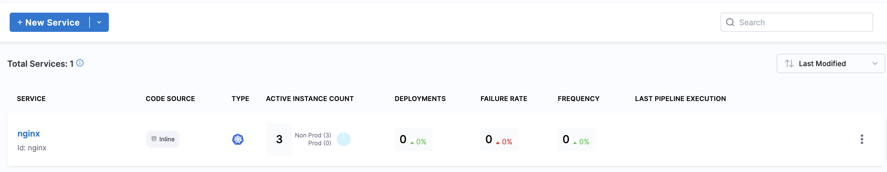
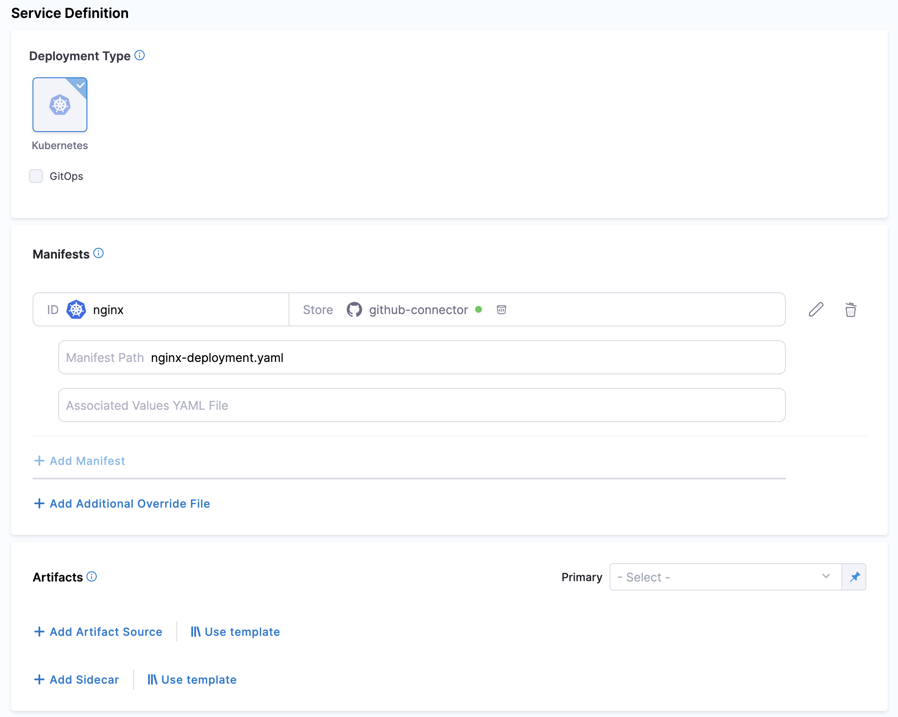
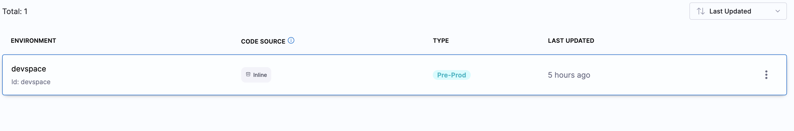
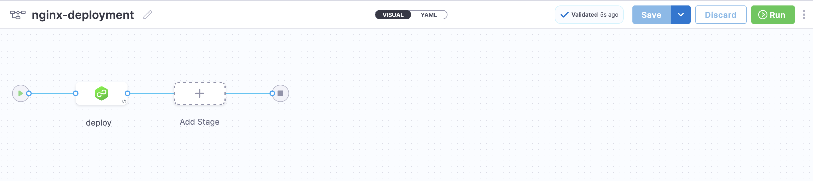
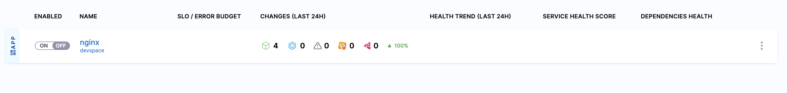
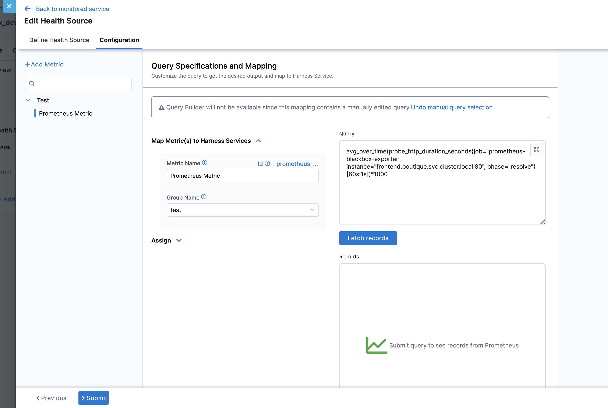
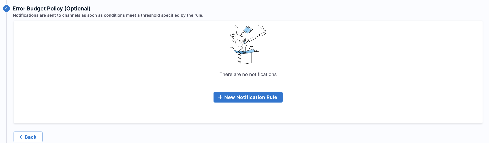
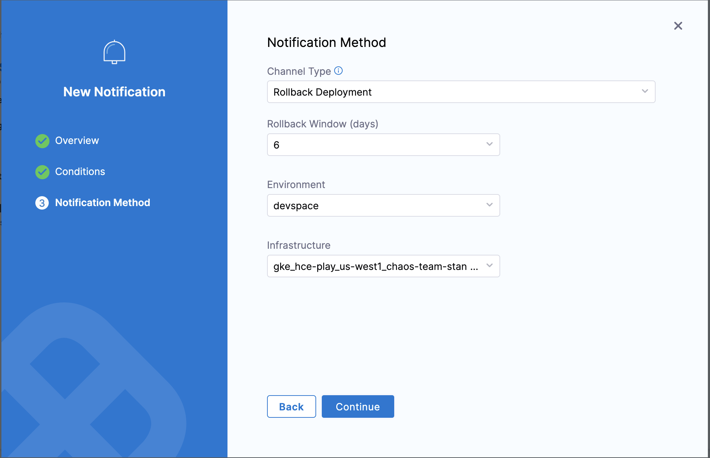
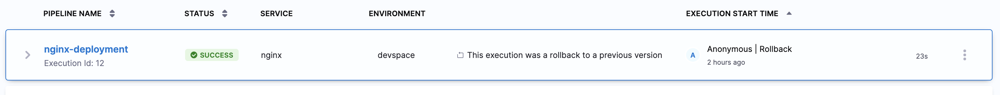

import AssignSLI from './static/assign-health-source.png';
import SetupSLO from './static/setup-slo.png';

Harness Service Reliability Management (SRM) allows you to configure Service Level Objectives (SLOs) to automatically rollback deployments when predefined conditions are breached (e.g., exceeding your error budget). This feature helps maintain service reliability by quickly reverting problematic deployments before they significantly impact your users.

With SLO-driven automated rollbacks, you can:

* Automatically roll back deployments when predefined conditions are breached
* Prevent service degradation by quickly reverting to a stable version
* Maintain error budgets by minimizing the impact of failed deployments
* Implement progressive delivery practices with safety mechanisms

This topic explains how to configure automated deployment rollbacks based on SLO violations in your Harness pipelines.

## Prerequisites

Before configuring automated deployment rollbacks with SLOs, ensure you have:

* [Configured your CD service](/docs/continuous-delivery/x-platform-cd-features/services/services-overview.md). Set up your CD service and provide the necessary deployment configuration. 

Here is an example of a sample NGINX Kubernetes Deployment:

  

  

* [Set up your CD Environment and Infrastructure](/docs/continuous-delivery/x-platform-cd-features/environments/create-environments.md). 
  Create the required environment and configure the underlying infrastructure for that environment.

  

* Set up your **Deployment Pipeline**.
  Utilize the previously created CD service and environment to configure your deployment pipeline.

  

## Configure automated rollbacks with SLOs

To set up automated rollbacks with SLOs, follow these steps:

### Step 1: Setup a monitored service

Create a monitored service using service and environment pair created above. For more information, see [Create a monitored service](/docs/service-reliability-management/monitored-service/create-monitored-service.md).

### Step 2: Configure health source

1. Define a [health source](/docs/service-reliability-management/monitored-service/health-source/prometheus.md) for your monitored service. Here's an example of how to configure a Prometheus query:

2. Assign SLIs to the health source by mapping the metrics to service level indicators:

### Step 3: Set up SLO

[Configure your SLO](/docs/service-reliability-management/slo/request-based-slo.md) using the monitored service and the Prometheus metric you've set up.

## Setup the rollback policy

As part of your error budget policy, you can add a rollback policy. 

To set up the rollback policy:

* Create a new **notification rule**.
* Select **Rollback Deployment** as the **Notification Method**.
* Specify the **Rollback Window**. This defines the valid time frame between a recent deployment and an SLO condition breach during which an automatic rollback will be triggered.
* Provide the **Environment** and **Infrastructure** details.

  :::note
  Providing the correct **Environment** and **Infrastructure** is crucial for a successful rollback.
  ::: 

  

* Create new notification rule, and select the Notification Method as **Rollback Deployment**, provide the rollback Window, this determines the validity of rollback if the SLO breaches the given condition. Provide the environment and Infrastructure. 

  

  :::info
  Providing correct Environment/Infrastructure is important to carry out the rollback successfully.
  ::: 

### Verifying rollback

If everything is configured correctly and your SLO notification conditions are met, you will observe that the deployment has been automatically rolled back.

## Related Content

For more information about SLOs and verification, see [Create and manage SLOs](/docs/service-reliability-management/get-started/create-first-slo) and [Verification overview](/docs/continuous-delivery/verify/verify-deployments-with-the-verify-step).
