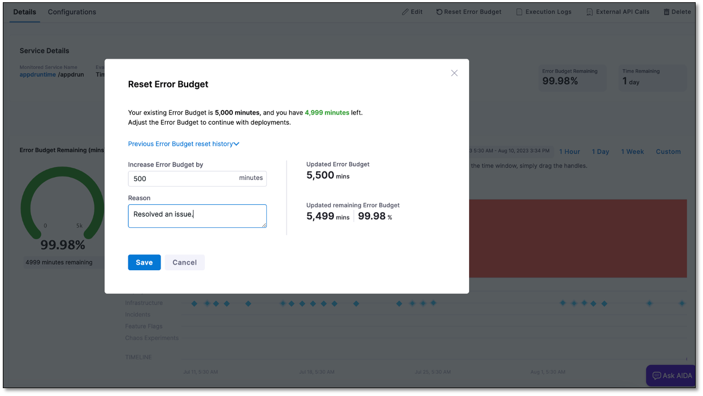

If you've exceeded your error budget due to an issue that has been resolved, it's important to reset the error budget to reactivate burn alerts.

You can perform an error budget reset for SLOs with a time period type set as Calendar by following these steps:

1. In your Harness project, navigate to **Service Reliability Management** > **SLOs**, and then select the SLO for which you need to reset the error budget.

2. On the **Details** tab, go to the **Error Budget** page, and then select **Reset Error Budget** at the top.
   
   :::info note
   The **Reset Error Budget** option is available only for SLOs with a time period type set to Calendar.
   :::

   The Reset Error Budget dialog appears. It displays the total error budget and the remaining error budget values. You can also review the reset history by expanding the **Previous Error Budget reset history** section.

   

3. Specify the number of minutes by which you want to extend the error budget, and provide a reason for this adjustment. The updated error budget and the remaining budget are displayed.

4. Select **Save**.  
   The error budget will be successfully reset. An icon appears on the error budget burndown chart, indicating the time when the error budget was reset. It may take up to 30 minutes for the reset icon to appear on the error budget burndown chart.