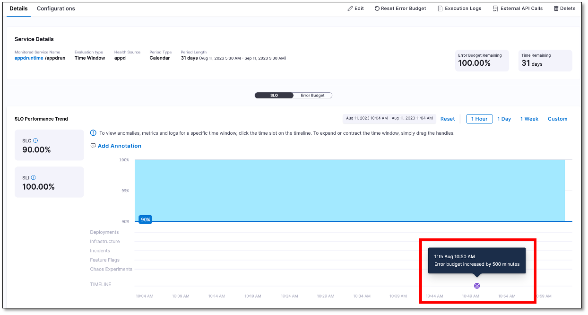

An error budget is linked to deployment policies, governing the release of new features. If unforeseen issues drain the error budget, the deployment policy halts additional releases. Yet, a critical new feature may demand deployment due to business needs. In such cases, an error budget reset helps by replenishing available time and allowing the release of critical features. The error budget reset capability enables teams to handle unforeseen situations, ensuring uninterrupted deployment of essential updates while maintaining the desired level of service reliability.

:::info note
You can only perform error budget resets on SLOs with the time period type configured as **Calendar**.
:::

To reset the error budget reset of an SLO:

1. In your Harness project, navigate to **Service Reliability Management** > **SLOs**, and then select the SLO for which you need to reset the error budget.

2. On the **Details** tab, select **Reset Error Budget** at the top.
   
   :::info note
   The **Reset Error Budget** option is available only for SLOs with the time period type configured as **Calendar**.
   :::

   The Reset Error Budget dialog appears. It displays the total error budget and the remaining error budget values. You can also review the reset history by expanding the **Previous Error Budget reset history** section.

   

3. Specify the number of minutes by which you want to extend the error budget, and provide a reason for this adjustment. The updated error budget and the remaining budget are displayed.

4. Select **Save**.  
   The error budget will be successfully reset. A marker appears on the SLO performance trend chart indicating the time when the error budget was reset. When you hover over the icon, error budget details are displayed. It may take up to 30 minutes for the reset icon to appear on the SLO performance trend chart.

   

   