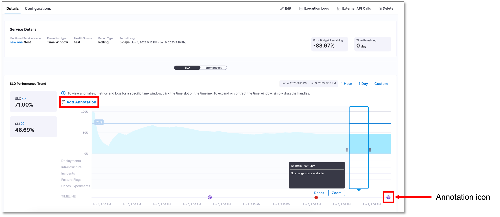
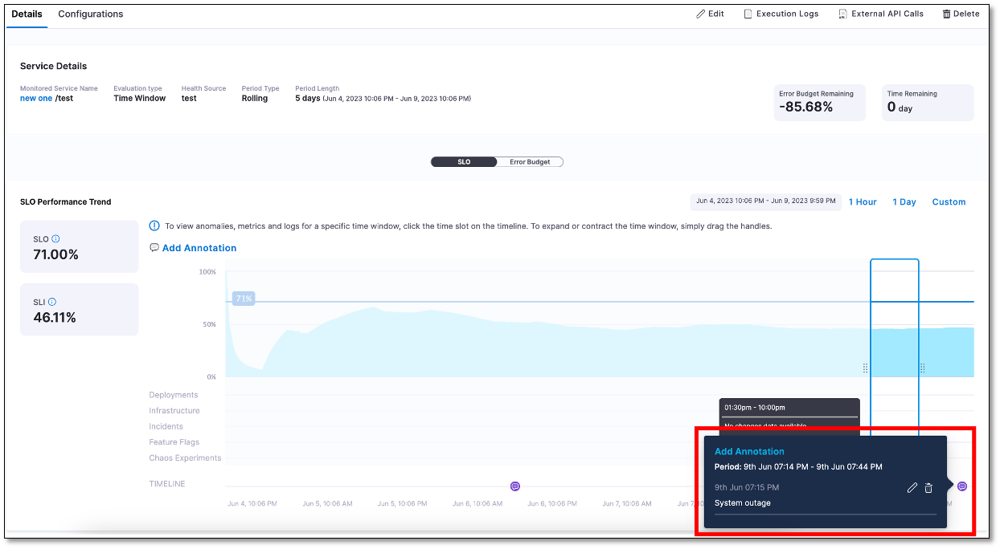

You can add annotations about specific events or changes that affect service performance and the error budgets.

## Add an annotation to SLO

To add an annotation:

1. In your Harness project, navigate to **Service Reliability Management** > **SLOs**, and then select the SLO in which you want to add an annotation.

2. On the SLO page, go to the **Details** tab and then select **Add Annotation**.

3. In the Add Annotation dialog, enter annotation details, select the start and end date and time, and then select **Save**.  
   
   The annotation appears as an icon on the timeline.

## View annotation details

Simply select an annotation on the timeline to view the details.

## Manage annotations

To edit or delete an annotation:

1. On the timeline, select the annotation.

2. Select the edit icon to change the details. Select the delete icon to delete the annotation.

