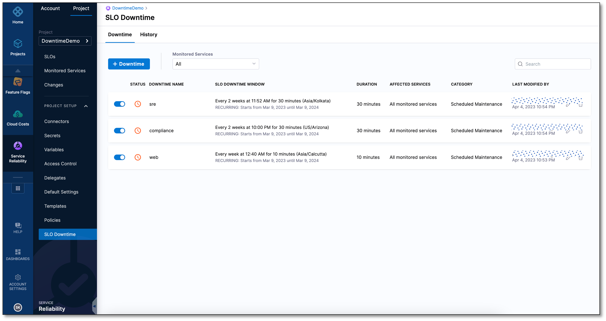
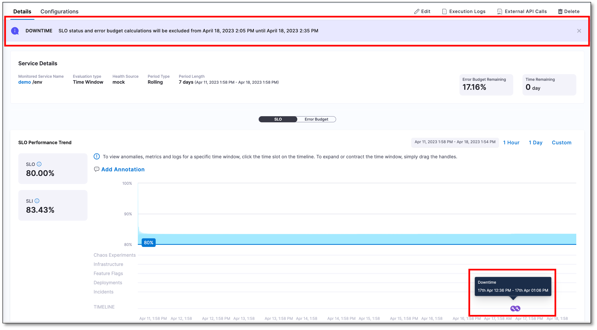

The SLO Downtime page displays a comprehensive list of all the SLO downtimes and also provides options to manage them.

:::info note
Currently, this feature is behind the feature flag `SRM_DOWNTIME`. Contact [Harness Support](mailto:support@harness.io) to enable the feature.
:::

## SLO downtime page

The SLO Downtime page displays information about all the configured SLO downtimes.

To view the SLO downtime list:

1. In your Harness project, navigate to the **Service Reliability Management** module, expand **PROJECT SETUP**, and then select **SLO Downtime**.  
   The SLO Downtime page appears.

   
   
On the SLO Downtime page, you can view a list of all your configured SLO downtimes. For each downtime, the page displays details such as its current status, name, window of time during which it applies, duration, affected services, downtime category, and the user who last modified the SLO downtime.

Based on the status of the SLO downtime, you may see one of the following icons as status:

| Icon                                                                  | Status                      |
| --------------------------------------------------------------------- | --------------------------- |
|  | SLO downtime is in progress |
|     | SLO downtime is scheduled |

You can filter the list using the **Monitored Services** filter.

## History page

The History page shows all the downtimes that have occurred in the past, including recurring SLO downtimes. For each downtime, the page displays details such as its name, start time, end time, duration, affected services, and downtime category.

To go to the History page, select the **History** tab.  

You can filter the list using the **Monitored Services** filter.

## Track past and upcoming downtimes of an SLO

To view the past and upcoming downtime of an SLO:

1. In your Harness project, navigate to the **Service Reliability Management** module and then select **SLOs**.  
   
2. On the SLO Downtime page, select the SLO for which you want to see the downtime details. The **SLO** and **Error Budget** tabs display the following SLO downtime information:

   - If there has been any downtime in the past, you will see a downtime icon  on the SLO performance trend chart. Click on the downtime icon to check when the downtime started and ended.
   
   - If there is an upcoming SLO downtime, you will see a banner at the top of the Details page with the start and end time details.

## Disable a SLO downtime

You can disable a SLO downtime using the toggle button next to it.

:::info note
When you create a new SLO downtime, it is automatically enabled by default.
:::

## Edit a SLO downtime

To edit a SLO downtime:

1. Select the pencil icon next to the SLO downtime that you want to edit.  
   The Edit SLO Downtime page appears.
2. Make desired changes to the SLO downtime configuration and select **Save** to save the changes.

## Delete a SLO downtime

To delete a SLO downtime, select the delete icon next to it, and, in the confirmation message that appears, select **Delete**.

