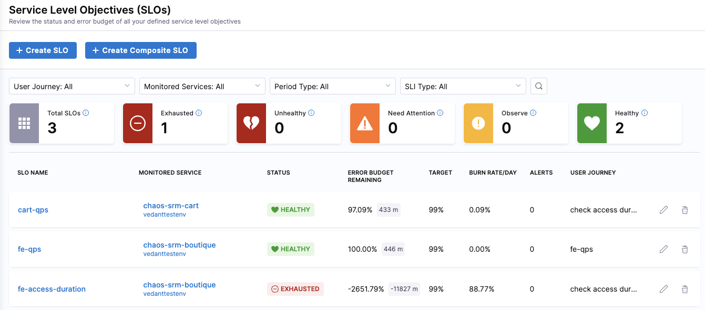
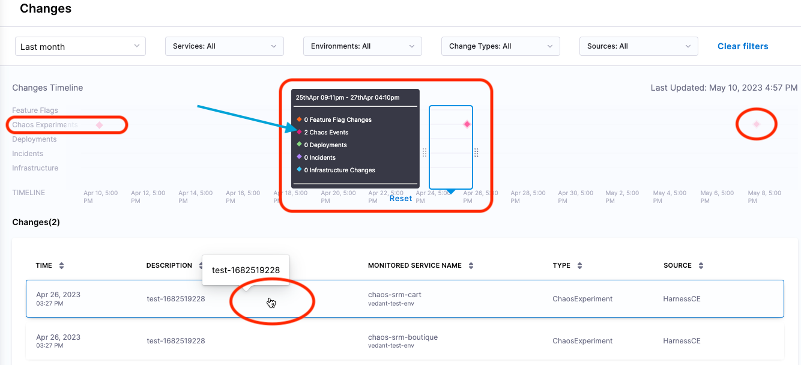

# Connect a chaos experiment to a monitored service

:::info note
This feature is currently behind two feature flags: `CHAOS_SRM_EVENT` and `SRM_INTERNAL_CHANGE_SOURCE_CE`. Contact [Harness Support](mailto:support@harness.io) to enable the feature.
:::

By connecting a Chaos Experiment to a monitored service, you can effectively monitor the impact of chaos faults on the health of the service. To do this, you connect any chaos fault within an experiment to monitored services.
For example, let's say you use SRM to monitor services and correlate change events to service health. Now you want to see how one or more chaos faults impact services in your target environment. By adding the target environment as one or more monitored services and linking faults to those services, you can see the impacts on service health in SRM when you run experiments containing those faults.

## Connect a fault to a monitored service

For detailed instructions on connecting a chaos fault to a monitored service, go to [Connect a fault to a monitored service](/docs/chaos-engineering/integrations/use-chaos-with-srm#connect-a-fault-to-a-monitored-service).

## Check the impact of a fault on a monitored service

Once you've connected faults to monitored services corresponding to your target environment, when you run the experiment(s) containing those faults, you can use the [**SRM SLOs**](/docs/service-reliability-management/getting-started/slo-dashboard) and [**Changes**](/docs/service-reliability-management/change-impact-analysis/change-impact-analysis-changes-dash-board) dashboards page to check the health of those services.

To check the impact of a fault on a monitored service:

1. In Harness, select **Service Reliability**.

	The [Service Level Objectives (SLOs) dashboard](/docs/service-reliability-management/getting-started/slo-dashboard) appears, listing SLOs, their associated monitored services, status, [error budget](/docs/service-reliability-management/getting-started/slo-dashboard#error-budget-details), etc.
	
	 

	Here you can find the monitored service(s) corresponding to your target environment.

1. Use the filters at the top to narrow down the list of SLOs.

	

2. Go to **Service Reliability > Changes** to get another view of the data.

	

	The top part of the [Changes dashboard](/docs/service-reliability-management/change-impact-analysis/change-impact-analysis-changes-dash-board) displays a Changes Timeline, including a separate line for **Chaos Experiments**. Chaos events along this timeline are indicated by diamond icons.

3. Use the filters at the top to narrow down the data, and then move the pointer to the diamond icons in the **Chaos Experiments** timeline to see chaos events at those points in time.

	For example, in the image above, the pointer is centered around one of the diamonds on the **Chaos Experiments** timeline, and there are two Chaos Events at that point in time. The corresponding events are also listed in the **Changes** section at the bottom of the page.

1. Below the timeline, in the Changes section, select a change event to see [SLO details](/docs/service-reliability-management/getting-started/slo-dashboard#slo-details-page).

	Here you can see performance trends and the error budget for the SLO, among other details. 

1. To go to the chaos experiment corresponding to this change event, select **View Chaos Experiment**.
