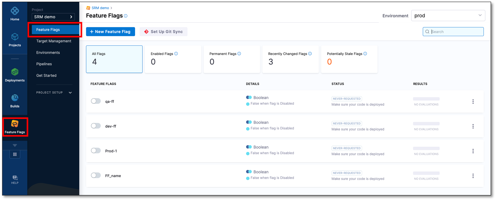
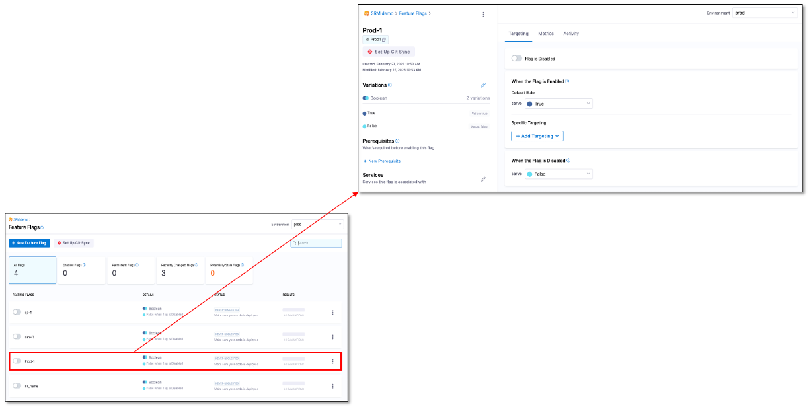
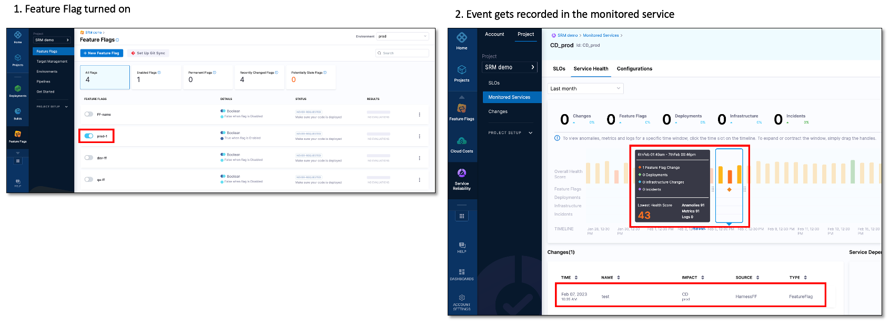

# Connect a feature flag to a monitored service

:::info note
Currently, this feature is behind the feature flag `SRM_CUSTOM_CHANGE_SOURCE`. Contact [Harness Support](mailto:support@harness.io) to enable the feature.
:::

Connecting a feature flag to a monitored service helps you monitor the impact of a change in the status of a feature flag on service health. The following steps explain how to connect a feature flag to a monitored service.

1. In your Harness project, navigate to the **Feature Flags** module, and then select **Feature Flags**.  
   A list of all your feature flags is displayed.

   

1. Select the feature flag that you want to connect to a monitored service.  
   The feature flag settings page appears.

   

2. In the **Services** section, select the pencil icon.  
   The Monitored Service dialog appears.
3. Select the monitored service to which you want to connect the feature flag. You can connect a single feature flag to multiple monitored services.

4. Select **Save**.  
   The feature flag gets connected to the monitored service that you selected.  
   
The monitored service that you selected appears in the **Services** section.

Whenever the feature flag is turned off or on, a change event is recorded in the Service Health page of the monitored service.

The following figure shows an event getting recorded on the Service Health page of the monitored service when the feature flag is turned on.

