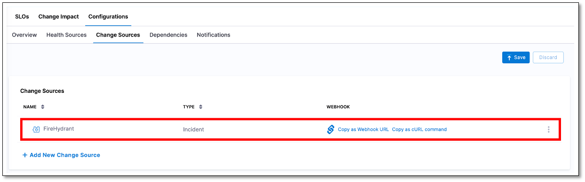

# FireHydrant change source

You can configure FireHydrant as a change source, enabling it to seamlessly send incident reports to Service Reliability Management (SRM) and trigger real-time alerts on a designated Slack channel. When FireHydrant's incident reports are sent to SRM, triggering Slack alerts, SRM provides health reports to the same Slack channel, enabling a real-time service health overview.

Configuring FireHydrant as a change source involves the following steps:

1. [Add FireHydrant as a custom change source in the Harness SRM monitored service and generate a webhook.](#add-fireHydrant-as-change-source)
   
2. [Integrate your Slack workspace with FireHydrant.](#add-slack-channels-to-the-firehydrant-runbook)
   
3. [Add Webhook Step to the Firehydrant runbook.](#add-webhook-step-to-the-firehydrant-runbook)
   
4. [Add Slack channels to the Firehydrant runbook.](#add-slack-channels-to-the-firehydrant-runbook)
   
5. [Declare an incident.](#declare-an-incident)


## Add FireHydrant as change source

To add FireHydrant as a change source to a monitored service:

1. In your Harness project, go to **Service Reliability** > **Monitored Services**.  
   A list of monitored services is displayed.

2. Locate the monitored service for which you want to add a custom change source, select the three vertical dots next to it, and then select **Edit service**.  
   The Configurations page appears.

3. On the **Configurations** page, go to the **Service** tab, and under **Define Your Sources**, select **+ Add New Change Source**.  

4. In the Edit Change Source page, under **Select Change Source**, choose **Incident** as **Provider Type**, and then select **Custom**.

5. Enter a name for the change source. For example, FireHydrant.

6.  Select **Submit**.  
    The custom incident change source gets added to the monitored service. A webhook URL and cURL commands are generated.

    


## Copy webhook URL

To configure your FireHydrant runbook for sending incident reports to a monitored service in SRM, you'll need to obtain a webhook from that specific SRM monitored service.

To copy the webhook URL from a monitored service:

1. From the list of monitored services, select the monitored service in which you have created the FireHydrant incident custom incident change source, and then go to the **Configuration** tab.  

2. On the **Configurations** page, go to the **Service** tab. In the **Define Your Sources** section, you will see a list of change sources that have been added to the monitored service. The list also displays webhook URLs and cURL commands next to each change source.

3. Locate the FireHydrant incident change source that you want to configure with the FireHydrant runbook, and then copy the webhook URL.


## Integrate Slack workspace with FireHydrant.

To enable FireHydrant to send incident reports to your designated Slack channels, you'll need to integrate your Slack workspace with FireHydrant. To learn how to integrate a Slack workspace with FireHydrant, go to [Integrating with Slack]( https://firehydrant.com/docs/integration-guides/integrating-with-slack/).


## Add Webhook Step to the Firehydrant runbook

You need to configure FireHydrant runbook so that it can send the incident reports to monitored service in Harness SRM.

To configure the runbook:

1. In your FireHydrant account, open the runbook you want to set up with Harness SRM monitored service.
   
2. Add a **Send Webhook** step with the following settings:
   
   - **Endpoint**: Paste the webhook URL you copied in Harness SRM monitored service. For example: `https://app.harness.io/cv/api/account/-xxxxxx12345xxxx/org/default/project/Demo/webhook/custom-change?monitoredServiceIdentifier=custom_change_prod&changeSourceIdentifier=Fire_Hydrant`
   
   - **HMAC Secret**: A short string to confirm the webhook's source from FireHydrant in your app.
   
   - **JSON Payload**: Use a JSON string in following format for transmitting data to your endpoint:
  

      ```
            {
            "eventIdentifier": "{{ incident.id }}",
            "user": "{{ incident.created_by.email }}",
            "startTime": "{{ incident.started_at | date: "%s" | times: 1000 }}",
            "endTime": "{{ incident.started_at | date: "%s" | times: 1000 }}",
            "eventDetail": {
               "description": "{{ incident.name }}",
               "externalLinkToEntity": "{{ incident.private_status_page_url }}",
               "name": "{{ incident.name }}",
               "webhookUrl": "<webhook url of your slack channel> "
            }
            }
      ```
  
   - JSON Headers: Input your Harness API Personal Account Token in the following format:
  

      ```
         {
         "X-API-KEY": "<your Harness API PAT key>"
         }
      ```

  
3. Select **Add Step** to save the runbook.

To learn more about adding a webhook step to a FireHydrant runbook, go to [Sending a webhook from a Runbook]( https://firehydrant.com/docs/configuring-firehydrant/sending-a-webhook-from-a-runbook/).


## Add Slack channels to the Firehydrant runbook

You need to include a **Notify Channel** step in FireHydrant runbook to enable FireHydrant to send incident notifications through Slack.

To add the Notify Channel step:

1. In your FireHydrant runbook, select **Add Step**.

2. Choose **Notify Channel** under **Slack**.

3. Enter the Slack channel names, separated by commas.

For more information on adding the **Notify Channel** step to your Firehydrant runbook, go to [Notifying a chatops channel]( https://firehydrant.com/docs/configuring-firehydrant/notifying-a-chatops-channel/).


## Declare an incident

When you declare an incident using FireHydrant and select the corresponding runbook, the following actions take place:

1. FireHydrant sends an incident alert directly to the Slack channel you've configured in the runbook.
   
2. Simultaneously, Harness SRM sends a comprehensive health report to the same Slack channel configured in the runbook.

This helps you receive incident alerts along with service health updates in your designated Slack channel.