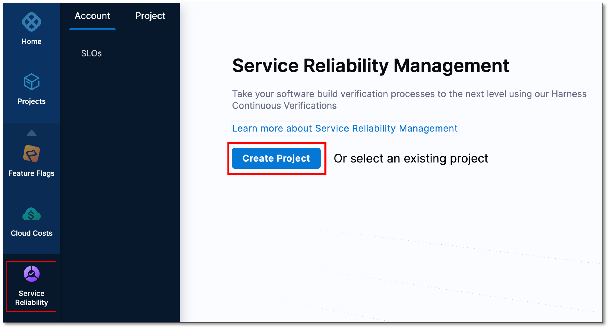
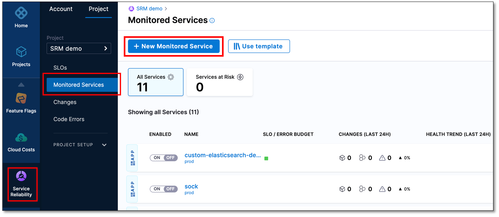
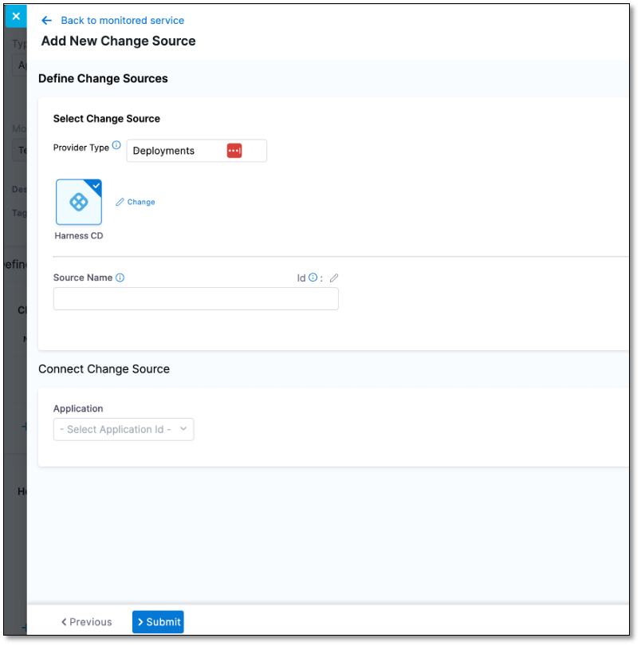
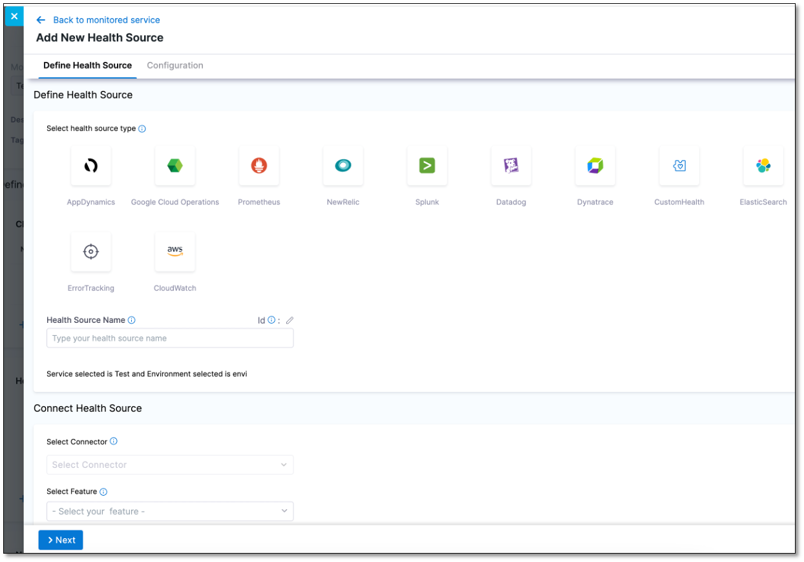
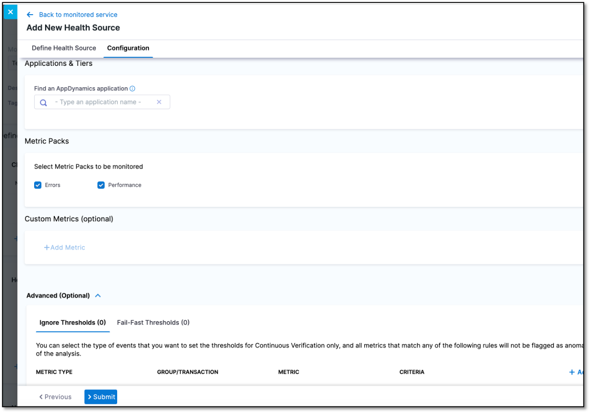
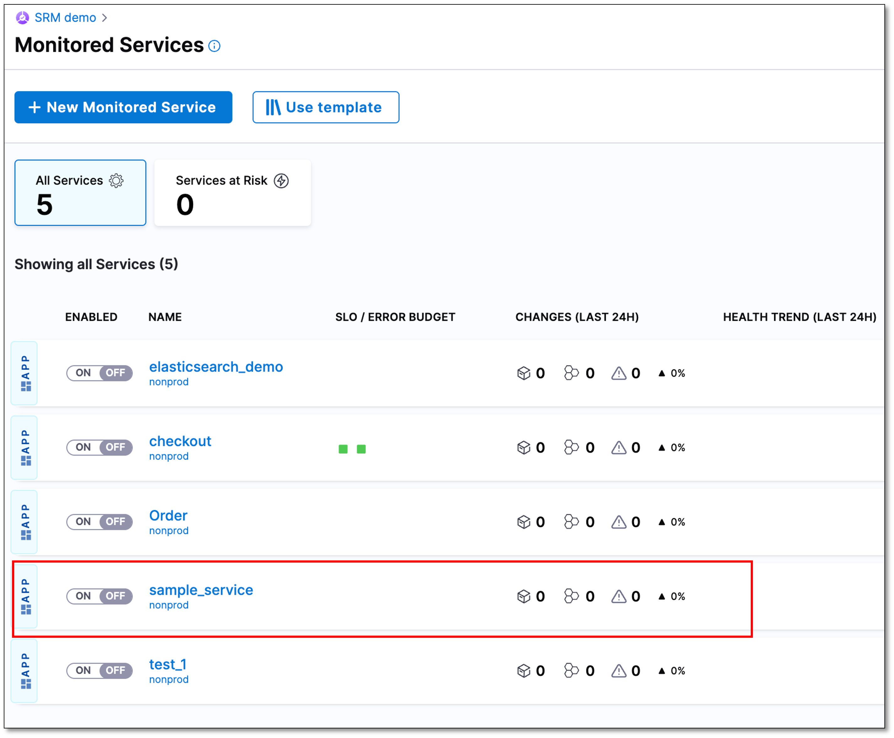

A monitored service in the context of the Harness platform is a combination of a Harness service and environment. This entity can be any type of workload that is able to be monitored, including microservices. Environments represent the deployment targets such as QA, production, or any other environment where the workload will be deployed. By connecting a monitored service to change sources and health sources, you can monitor the health of the service. 

The following steps explain how to create a monitored service in Harness.

## Prerequisites

- Ensure that you have installed a Delegate and it can communicate with Harness, the health source, and the change source. To learn more about delegates, go to [Get started with delegates](https://developer.harness.io/docs/category/delegate-concepts).
- Create an organization if you have not already created one. To learn more about organizations in Harness, go to [Create organizations and projects](https://developer.harness.io/docs/platform/organizations-and-projects/create-an-organization).

## Create a project
To create a project, perform the following steps:

1. In Harness, select **Service Reliability** > **Create Project**.
   
2. On the **About the Project** page, do the following, and then select **Save and Continue**: 
   - **Name**: Enter a name for the project.
   - **Color**: Select a color theme for the project.
   - **Organization**: Select an organization for the project. If you don't yet have an organization in Harness, and want to learn how to create one, go to [Create a Harness Org](https://developer.harness.io/docs/platform/organizations-and-projects/create-an-organization#step-1-create-a-harness-org).
3. On the **Invite Collaborators (Optional)** page, in the **Invite People to Collaborate** field, add team members to the project.
4. In the **Role** field, assign a role to the collaborators.
5. Select **Add**.
6. Select **Save and Continue**.  
   Your project is created.

## Create a monitored service

A monitored service is a logical entity that combines a Harness service and environment. The service could be a microservice or any other workload that can be monitored. Environments represent your deployment targets such as QA, prod, and so on.

The following steps explain how to create a monitored service in Harness.

### Navigate to the "Create new monitored service" page

To create a monitored service:

1. In your Harness project, navigate to the **Service Reliability** module, and then select **Monitored Services** > **+ New Monitored Service**.

The Create new monitored service page appears.

### Define the monitored service

1. In the **Overview** section, enter the following information:
    * **Type**: Select **Application**.
    * **Create or select a Service**: Do one of the following:
     
       * If the service that you want to monitor exists, select it.
       * If you want to create a service, select **+ Add New**, enter the following information, and then select **Save**. 
       
          *  **Name**: Enter a name for the service. For example, _sample_service_.
          *  **Description (Optional)**
          *  **Tag (Optional)** 
           
    * **Create or select an Environment**: Do one of the following:
     
       * If the environment that you want to monitor exists, select it.
       * If you want to create an environment, select **+ Add New**, enter the following information, and then select **Save**. 
       
          *  **Name**: Enter a name for the environment.
          *  **Description (Optional)**
          *  **Tag (Optional)** 
          *  **Environment Type**: Select an environment type. The available options are **Production** and **Non-Production**.

    Harness autopopulates the **Monitored Service Name** field by combining the service and environment names. This field is not editable.

### Add a change source

A change source monitors change events related to deployments, infrastructure changes, and incidents.  

In the **Change Sources** section, you can either edit an existing change source or create a new one.
 
To create a new change source, do the following:

1. Select **+ Add New Change Source**.  
   The Add New Change Source dialog appears.

     

2. In the **Provider Type** dropdown list, select the change source. Following are the available options:  

    - **Deployments**: You can choose **Harness CD** (Harness CD FirstGen) or **Custom**.  
  
        
      :::info note
         - SRM automatically captures change data from Harness CD NextGen by default. 
         
         - To learn about creating a custom deployment change source, go to [Custom deployment change source](/docs/service-reliability-management/monitored-service/change-source/custom-deployment-change-source).
      :::

    
    - **Incident**: Select the incident management tool that monitors your application. You can choose **PagerDuty** or **Custom**. To learn more about creating a custom incident change source go to [Custom Incident Change Source](https://developer.harness.io/docs/service-reliability-management/monitored-service/change-source/custom-incident-change-source).

3. In the **Source Name** field, enter a name for the change source.

4. In the **Application** dropdown list, select an application ID. This field is available if you select Harness CD in **Provider Type**.

The new change source appears in the **Change Sources** list.

### Add a health source

A health source monitors the health trends of the monitored service using logs or metrics collected from an Application Performance Monitoring (APM)or logging tool.

To add a new health source, do the following:  

1. Select **+ Add New Health Source**.  
   The Add New Health Source dialog appears.

   

2. In the **Select health source type** section, select the health source that monitors your service.
   
3. In the **Health Source Name** field, enter a name for the health source.
   
4. In the **Connect Health Source** section, do the following:
   1. **Select Connector**: Select a existing connector. Connectors contain the information that is necessary to integrate and work with your health source.
   2. **Select Feature**: Select the feature associated with the health source. The available features depend on the health source that you select. For example, if you select **SumoLogic**, the **SumoLogic Cloud Metrics** and **SumoLogic Cloud Logs** features become available. 

5. Select **Next**.
   
6. On the **Customize Health Source** tab, configure the health source settings. The settings that are displayed depend on the health source that you select in the **Define Health Source** tab.
   
   For example, if you select AppDynamics as the **Health Source Type**, then the following settings are displayed:

   - **Find an AppDynamics application**: Displays a list of applications associated with AppDynamics. Select the application you want.
   
   - **Find an AppDynamics tier**: Displays a list of tiers associated with the selected application. Select the application tier you want.
   
   - In the **Metrics Packs** section, select the metrics that you want to use for the health source. The options available are **Errors** and **Performance**.

    
   
7. Select **Submit**.  
   The new health source appears in the **Health Sources** list.
   
8.  In the upper-right corner select **Save**.  
    You can view the new monitored service in the **Monitored Services** list.

   

   Next steps

  To learn how to analyze the impact of changes on your monitored service, go to [Service health dashboard](../change-impact-analysis/change-impact-analysis-service-health-dashboard.md) and [Changes dashboard](../change-impact-analysis/change-impact-analysis-changes-dash-board.md).
    
