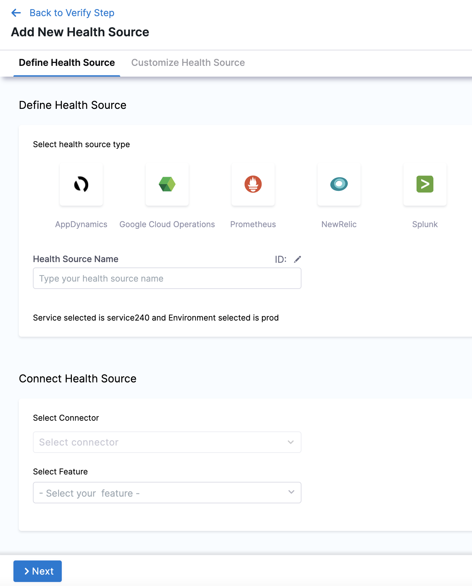
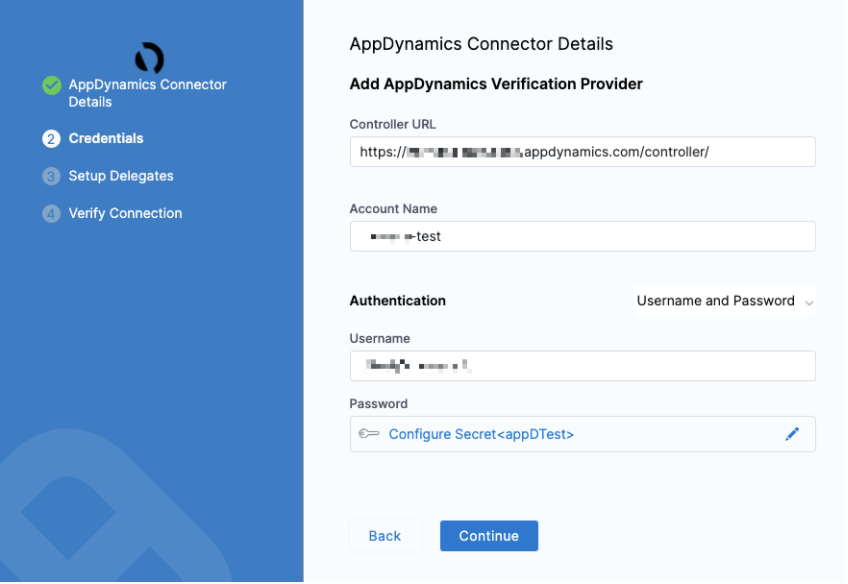
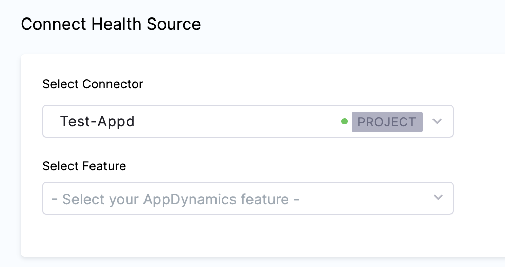
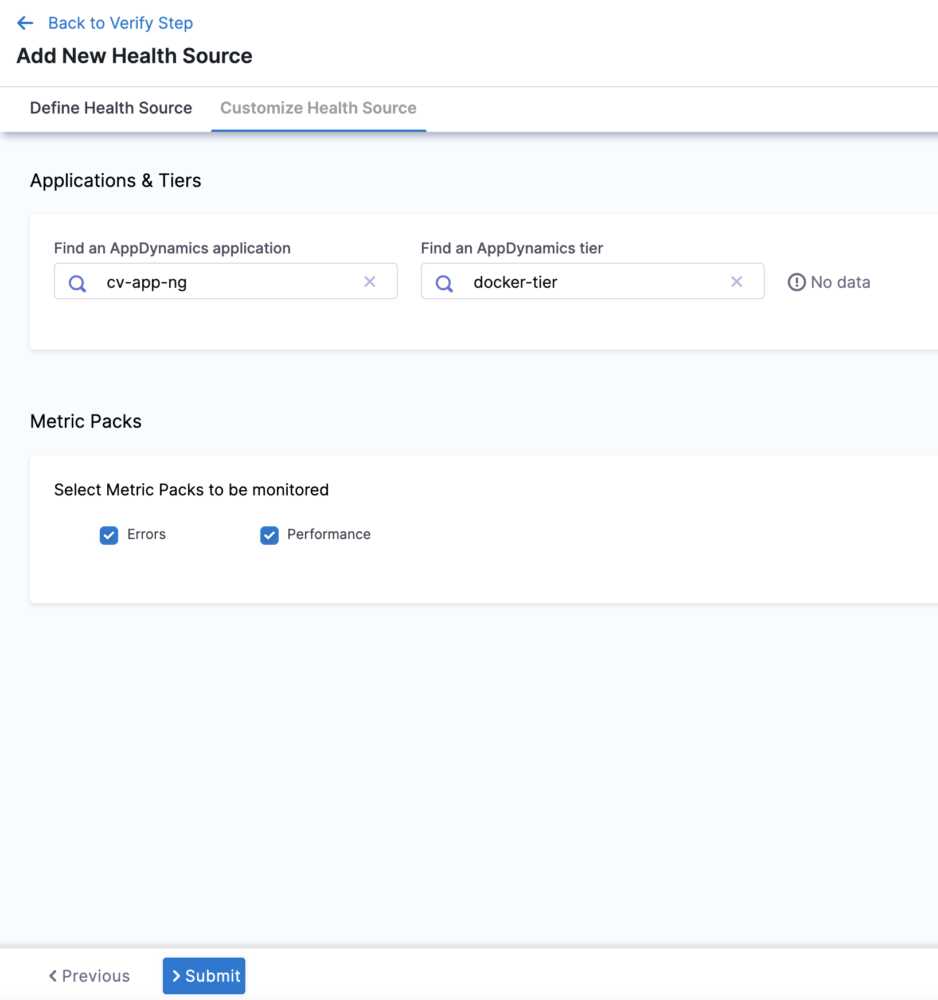
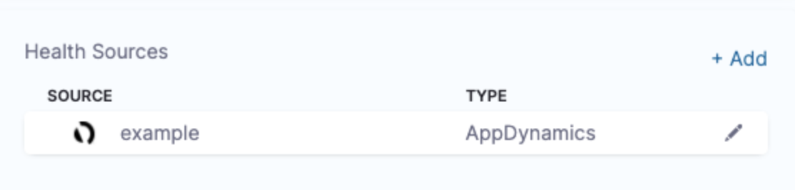

In Harness, a health source is a mapping that connects a Service in Harness to a service running in a deployment environment that is being monitored by an Application Performance Monitoring (APM) or logging tool. This mapping allows Harness to collect metrics and data from the APM or logging tool and use it to determine the health and status of the Service in Harness.

This topic describes how to set up AppDynamics as a health source in a monitored service.

## Prerequisites

- AppDynamics connector has been added to the Harness platform.
- A monitored service has already been created in the Harness SRM.

## Add AppDynamics health source

To add AppDynamics as a health source:

1. In your Harness project, go to **Service Reliability** > **Monitored Services**.  
   A list of monitored services is displayed.

2. Locate the monitored service for which you want to add a custom change source, select the three vertical dots next to it, and then select **Edit service**.  
   The Configurations page appears.

3. Go to the **Service** tab, and under **Define Your Sources**, select **+ Add New Health Source**.  

4. In **Select health source type**, select AppDynamics.

5. In **Health Source Name**, enter a name for the Health Source.

6. Under **Connect Health Source**, click **Select Connector**.

7. In **Connector** settings, you can either choose an existing connector or click **New Connector.**
   
   

8. Click **Apply Selected**. The Connector is added to the Health Source.

   

9. In **Select Feature**, select the APM or logging tool component to use.

10. Click **Next** and **Customize Health Source** settings appear.

   The subsequent settings in **Customize Health Source** depend on the Health Source Type you selected. You can customize the metrics to map the Harness Service to the monitored environment. In **Applications & Tiers**, enter the following details:

11. In **Find an AppDynamics application** enter the name of the application and select an option from the list.

12.  In **Find an AppDynamics tier** enter a tier name from which you want usage metrics, code exceptions, error conditions, or exit calls.

13. In **Metric Packs** select the metrics you want Harness to monitor. **Errors** and **Performance** are selected by default.

14. In **Custom Metrics (optional)**, click **Add Metric** to add any other metric to be monitored.
15. 12. In **Query Specifications and Mapping**, you can customize the query to get the desired output and map it to a Harness Service.
16. In **Map Metric(s) to Harness Services**, in **Metric Name** enter a name for the metric.
17. In **Group Name**, enter a group name of the metric.
18. In **AppDynamics Path**, you can either provide the complete metric path in **Specify a complete metric path**, or provide the base path of the AppDynamics metric in **Select the path from the AppD metric**.
19. In **Assign**, you can select the services for which you want to apply the metric. Available options are:
   * Continuous Verification
   * Health Score
   * SLI
20. In **Risk Category**, select a risk type from the list.
21. In **Deviation Compared to Baseline**, select one of the options based on the selected risk type.
22. Click **Submit**. The Health Source gets added the monitored service.

You can add multiple health sources.

