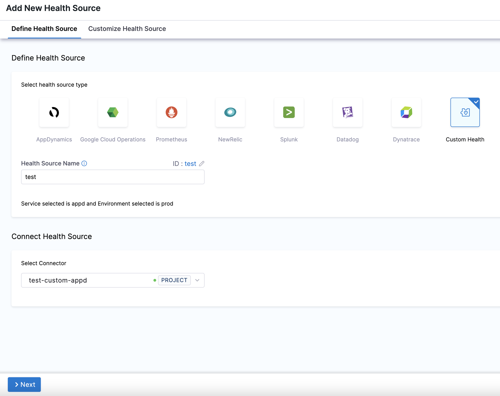
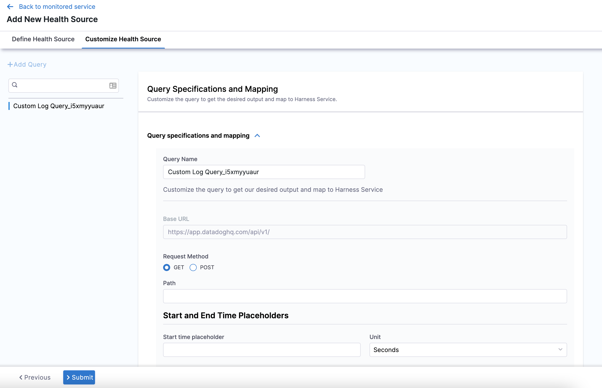
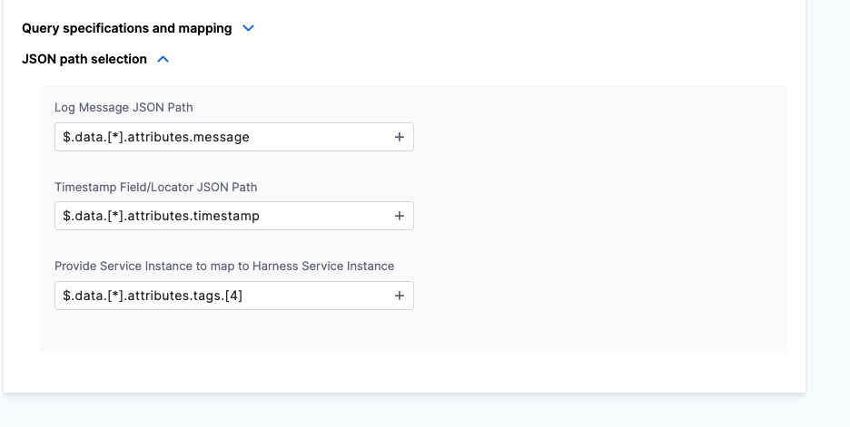

In Harness, a health source is a mapping that connects a Service in Harness to a service running in a deployment environment that is being monitored by an Application Performance Monitoring (APM) or logging tool. This mapping allows Harness to collect metrics and data from the APM or logging tool and use it to determine the health and status of the Service in Harness.

This topic describes how to set up a custom health source as a health source in a monitored service.

## Prerequisites

- A connector for the custom health source has been added to the Harness platform.
- A monitored service has already been created in the Harness SRM.

## Add custom health source

To add custom health as a health source:

1. In your Harness project, go to **Service Reliability** > **Monitored Services**.  
   A list of monitored services is displayed.

2. Locate the monitored service for which you want to add a custom change source, select the three vertical dots next to it, and then select **Edit service**.  
   The Configurations page appears.

3. Go to the **Service** tab, and under **Define Your Sources**, select **+ Add New Health Source**. 

4.  In **Select health source type**, select **Custom Health**.
5.  In **Health Source Name**, enter a name for the Health Source. For example Quickstart.
6. In **Connect Health Source**, click **Select Connector**.
7. In **Connector** settings, you can either choose an existing connector or click **New Connector.**
8. Click **Apply Selected**. The Connector is added to the Health Source.
9. In **Select Feature**, select the feature to be monitored. You can either select **Custom Health Metrics** or **Custom Health Logs**.
10. Click **Next**.

#### Option: Custom Health Metrics

11. If you select Custom Health Metrics, the **Customize Health Source** settings appear as:
   
   

12. Click **Map Metric(s) to Harness Services**.
13. In **Metric Name**, enter the name of the metric.
14. In **Group Name**, click **Add New** and enter a name for the metric group.
15. Click **Query specifications and mapping.**
16. In **Query Type** you can choose either **Service Based (used for Health Score and SLI)** or **Host Based (used for CV)**.
	If you select the query type as **Host Based** (Continuous Verification), the verification won't happen for SLI and Health Score (Service Based), and vice versa.
17. In **Request Method**, you can select **GET** or **POST**. If you select POST, you need to define the body format.
18. In **Path**, enter the complete path of the metric.
19. In **Start and End Time Placeholders**, enter the following:
	1. In **Start time placeholder**, enter the start time placeholder in the metric path.
	2. In **Unit**, select the preferred unit of measurement.
	3. In **End time placeholder**, enter the end time placeholder in the metric path.
	4. In **Unit**, select the preferred unit of measurement.
20. Click **Fetch Records** to retrieve records from the provided URL.
21. Click **Metric values and charts**.
22. In **Timestamp Format**, enter a static value in dd/mm/yy format.
23. Click **Assign**. Select the services for which you want to apply the metric. You can select **Health Score** or **SLI** or both options.
   The subsequent steps depend on the service you select in this step.1. In **Risk Category**, select a risk type. Available options for risk types are:
	* Errors
	* Infrastructure
	* Performance/Throughput
	* Performance/Other
	* Performance/Response Time
24. In **Deviation compared to Baseline**, select one of the options based on the selected risk type. Available options are:
	* **Higher value is higher risk** - Select this option if a high value of the selected risk type is a risk.
	* **Lower value is higher risk** - Select this option if lower value of the selected risk type is a risk.
25.  Click **Submit**.

## Option: Custom Health Logs

1. If you select Custom Health Logs, the **Customize Health Source** settings appear as:
   
   

2. Click **Query specifications and mapping**.
3. In **Query Name**, enter a name for the query. For example Custom Log Query.
4. In **Request Method**, you can select **GET** or **POST**. If you select POST, you need to define the body format.
5. In **Path**, enter the complete path of the metric. For example,`v2/logs/events/search`.
6. In **Start and End Time Placeholders**, enter the following:
	1. In **Start time placeholder**, enter the start time placeholder in the metric path. For example, start\_time.
	2. In **Unit**, select the preferred unit of measurement. For example, Milliseconds.
	3. In **End time placeholder**, enter the end time placeholder in the metric path. For example, end\_time.
	4. In **Unit**, select the preferred unit of measurement. For example, Milliseconds.
7. In **Body**, enter the request body. For example,`{"filter":{"query":","from":start_time,"to":end_time}}`.
8. Click **Fetch Records** to retrieve records from the provided URL.
   
   

9.  Once the response is retrieved, click **JSON path selection**.
	1. In **Log Message JSON path**, click the plus icon to select the path to the log message from the data source. For example,`$.data.[*].attributes.message`.
	2. In **Timestamp Field/Locator JSON** Path, click the plus icon to select the path to the log message from the data source. For example,`$.data.[*].attributes.timestamp`.
	3. In **Provide Service Instance to map to Harness Service Instance**, click the plus icon to select the Service instance from the data source. For example,`$.data.[*].attributes.tags.[4]`.

	

10.  Click **Submit**.  
    The custom health source gets added to the monitored service.

