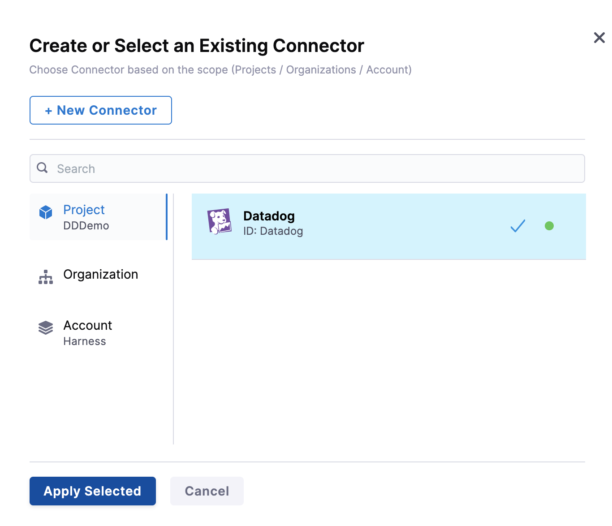
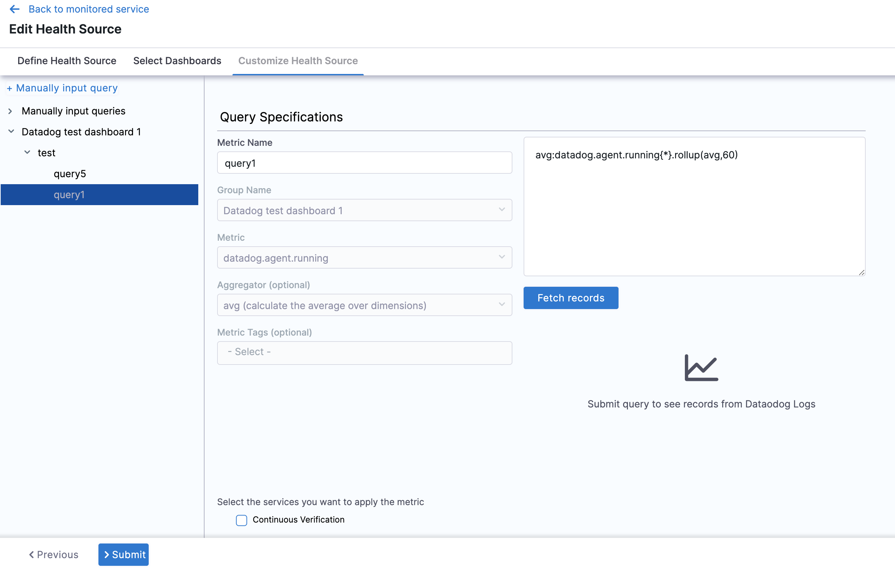

In Harness, a health source is a mapping that connects a Service in Harness to a service running in a deployment environment that is being monitored by an Application Performance Monitoring (APM) or logging tool. This mapping allows Harness to collect metrics and data from the APM or logging tool and use it to determine the health and status of the Service in Harness.

This topic describes how to set up Datadog as a health source in a monitored service.


## Prerequisites

- Datadog connector has been added to the Harness platform.
- A monitored service has already been created in the Harness SRM.

## Add Datadog health source

To add Datadog as a health source:

1. In your Harness project, go to **Service Reliability** > **Monitored Services**.  
   A list of monitored services is displayed.

2. Locate the monitored service for which you want to add a custom change source, select the three vertical dots next to it, and then select **Edit service**.  
   The Configurations page appears.

3. Go to the **Service** tab, and under **Define Your Sources**, select **+ Add New Health Source**.  

      

4. In **Select health source type**, select Datadog.

5. In **Health Source Name**, enter a name for the Health Source.

6. Under **Connect Health Source**, click **Select Connector**.

7. In **Connector** settings, you can either choose an existing connector or click **New Connector.**

      

8. Click **Apply Selected**. The Connector is added to the Health Source.

9. In **Select Feature**, select the Datadog feature to be used. You can choose **Cloud Metrics** or **Cloud Logs**.

      

10. Click **Next**.

The subsequent settings in **Customize Health Source** depend on the Health Source Type you selected. ### Option: Cloud Metrics

If you select **Cloud Metrics**, the **Select Dashboards** settings appear. It displays a list of Datadog dashboards.

      

11. Click the dashboards of your choice. If you don't have any preexisting dashboards or don't want to select the ones in the displayed result, click **Manually input query.**

12. Click **Next** and the **Customize Health Source** settings appear.

13. Select a query from the options displayed on the left side of setting panel. The specification of the selected query auto-populates in the fields under **Query Specifications**.

      

14. Click **Submit**. The Datadog health source gets added to the monitored service.

### Configure Datadog formulas as Harness queries

:::info note 

Currently,this feature is behind the feature flag SRM_DATADOG_METRICS_FORMULA_SUPPORT. Contact [Harness Support](mailto:support@harness.io) to enable the feature.

:::


In manual query mode, the Datadog metrics health source provides support for formulas.
These formulas follow a specific format: 

```Query a ; Query b ; Formula using a, b```

* Query a: "Query-with-a"
* Query b: "Query-with-a"
* The formula is "(a/b) * 100 - 5"

Let's consider an example to illustrate this:


```
kubernetes.cpu.usage{cluster-name:chi-play};kubernetes.memory.total{cluster-name:chi-play};(a/b) * 100 - 5
```


In the example above, 'a' and 'b' represent the respective queries:

* a = kubernetes.memory.usage{cluster-name:chi-play}
* b = kubernetes.memory.total{cluster-name:chi-play}

You can use multiple queries represented by alphabetical variables (example: a, b, c, and so on) in the final formula, but only one formula is allowed per query.


## Option: Cloud Logs

Select Cloud Logs and click **Next.** The **Customize Health Source** settings appear.

1. You can customize the metrics to map the Harness Service to the monitored environment in **Query Specifications and Mapping** settings.

2. Click **Map Queries to Harness Services** dropdown.

      

3. Enter a name for the query in **Name your Query**.

4. In **Log Indexes**, select a log index from the list.

5. In **Service Instance Identifier**, click the dropdown to select the path of the service instance.  
   
   Click **Submit**. The Datadog health source gets added to the monitored service.


