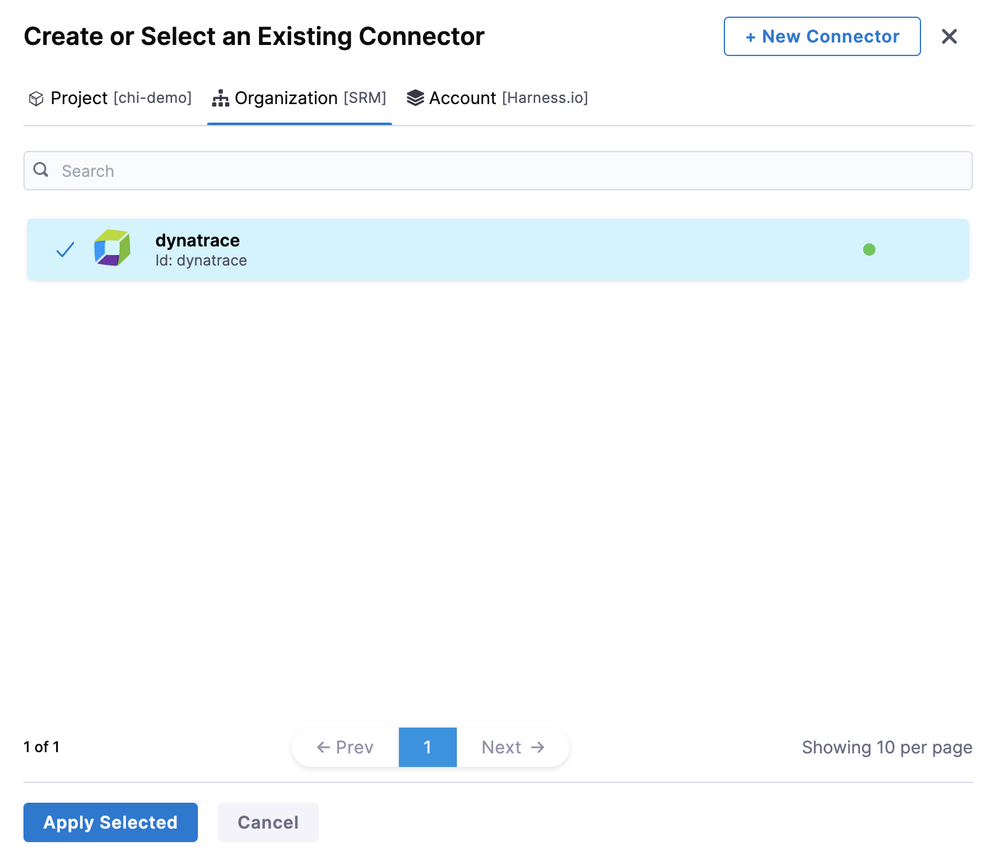

In Harness, a health source is a mapping that connects a Service in Harness to a service running in a deployment environment that is being monitored by an Application Performance Monitoring (APM) or logging tool. This mapping allows Harness to collect metrics and data from the APM or logging tool and use it to determine the health and status of the Service in Harness.

This topic describes how to set up Dynatrace as a health source in a monitored service.

## Prerequisites

- A monitored service has already been created in the Harness SRM.
  
- Dynatrace connector has been added to the Harness platform.

:::info
To allow Harness to access Dynatrace metrics through the Dynatrace API, you must label the metrics as [key requests](https://www.dynatrace.com/support/help/platform-modules/applications-and-microservices/services/analysis/monitor-key-requests).
:::

## Add Dynatrace health source

To add Dynatrace as a health source:

1. In your Harness project, go to **Service Reliability** > **Monitored Services**.  
   A list of monitored services is displayed.

2. Locate the monitored service for which you want to add a custom change source, select the three vertical dots next to it, and then select **Edit service**.  
   The Configurations page appears.

3. Go to the **Service** tab, and under **Define Your Sources**, select **+ Add New Health Source**. 

4. In **Select health source type**, select **Dynatrace**.
5. In **Health Source Name**, enter a name for the Health Source. For example Quickstart.
6. Under **Connect Health Source**, click **Select Connector**.
7. In **Connector** settings, you can either choose an existing connector or click **New Connector** to create a new **Connector.**
   
   

8. After selecting the connector, click **Apply Selected**. The Connector is added to the Health Source.
9. In **Select Feature**, a Dynatrace feature is selected by default.
10. Click **Next**. The **Customize Health Source** settings appear.
   
   The subsequent steps in **Customize Health Source** depend on the Health Source type you selected.
   
   
   	
11. In **Find a Dynatrace service**, enter the name of the desired Dynatrace service.
12. In **Select Metric Packs to be monitored,** you can select **Infrastructure** or **Performance** or both.
13. Click **Add Metric** if you want to add any specific metric to be monitored (optional) or simply click **Submit.**
14. If you click Add Metric, click **Map Metric(s) to Harness Services**.
15. In **Metric Name**, enter the name of the metric.
16. In **Group Name**, enter the group name of the metric.
17. Click **Query Specifications and mapping**.
18. In **Metric**, choose the desired metric from the list.
19. Click **Fetch Records** to retrieve data for the provided query.
20. In **Assign**, choose the services for which you want to apply the metric. Available options are:
	* Continuous Verification
	* Health Score
	* SLI
21. In **Risk Category**, select a risk type.
22. In **Deviation Compared to Baseline**, select one of the options based on the selected risk type.
    
23. Click **Submit**. The Dynatrace health source gets added to the monitored service.

You can add multiple health sources.

