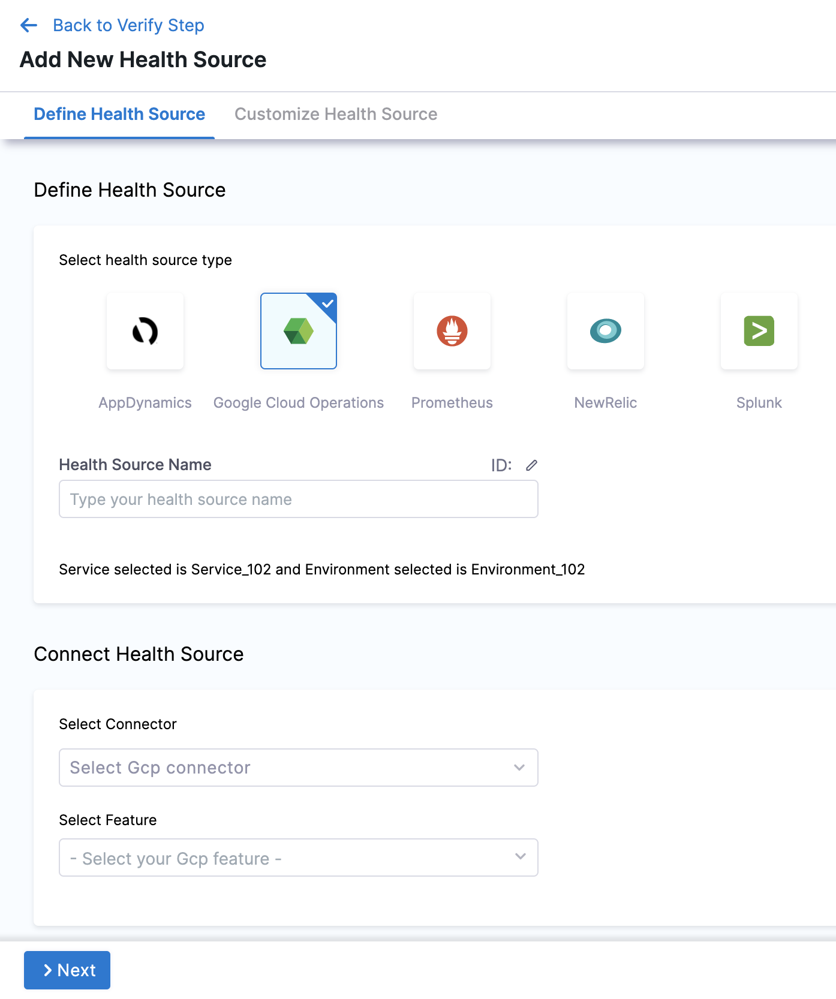

In Harness, a health source is a mapping that connects a Service in Harness to a service running in a deployment environment that is being monitored by an Application Performance Monitoring (APM) or logging tool. This mapping allows Harness to collect metrics and data from the APM or logging tool and use it to determine the health and status of the Service in Harness.

This topic describes how to set up Google Cloud Operations as a health source in a monitored service.

## Prerequisites

- Google Cloud Operations connector has been added to the Harness platform.
- A monitored service has already been created in the Harness SRM.

## Add Google Cloud Operations health source

To add Google Cloud Operations as a health source:

1. In your Harness project, go to **Service Reliability** > **Monitored Services**.  
   A list of monitored services is displayed.

2. Locate the monitored service for which you want to add a custom change source, select the three vertical dots next to it, and then select **Edit service**.  
   The Configurations page appears.

3. Go to the **Service** tab, and under **Define Your Sources**, select **+ Add New Health Source**.  

1. In **Select health source type**, select Google Cloud Operations.
   
   

2. In **Health Source Name**, enter a name for the Health Source.
3. Under **Connect Health Source**, click **Select Connector**.
4. In **Connector** settings, you can either choose an existing connector Gcp connector or click **New Connector.**
   

5. Click **Apply Selected**. The Connector is added to the Health Source.
6. In **Select Feature**, select the feature to be used.

The subsequent settings in **Customize Health Source** depend on the Health Source Type you selected. 

## Option: Cloud Metrics

1. Select Cloud Metrics and click **Next.** The **Select Dashboard** settings appear.
2. Click one or more dashboards from the displayed results. If you don't have any preexisting dashboards or don't want to select the ones in the displayed result, click **Manually input query.**
   
3. Click **Next** and the **Customize Health Source** settings appear.
4. Select a query from the options displayed on the left side of setting panel. The specification of the selected query auto-populates in the fields under **Query Specifications**.
   
5. In **Configure Risk Profile**, select one of the following risk types in **Risk Category**:
   
   | Risk Type | Type of Values | Deviation Type | Default Delta | Default Ratio |
   | --- | --- | --- | --- | --- |
   | Error | Web / Business transactions | Higher is bad | 0 | 0 |
   | Infrastructure | Cpu, memory .... | Higher and Lower is bad | 20 | 0.2 |
   | Performance/Other | Cpu, memory .... | Higher and Lower is bad | 20 | 0.2 |
   | Performance/Throughput | Web / Business transactions | Lower is bad | 20 | 0.2 |
   | Performance/Response time | Web / Business transactions | Higher is bad | 20 | 0.2 |

6. In **Deviation Compared to Baseline**, select one of the options based on the selected risk type.
7. Click **Submit**. The Google Cloud Operations health source gets added to the monitored service.

## Option: Cloud Logs

Select Cloud Logs and click **Next.** The **Customize Health Source** settings appear.

You can customize the metrics to map the Harness Service to the monitored environment in **Query Specifications and Mapping** settings.

1. Click **Map Queries to Harness Services** dropdown.
2. Enter a name for the query in **Name your Query**.
3. In **Query**, enter the query and click **Fetch Records.** The retrieved results appear in **Records**.
4. In **Identify Service Instance**, click the plus icon to select the path of the service instance.
5. In **Identify Message**, click the plus icon to select the message identifier.

Click **Submit**. The Google Cloud Operations health source gets added to the monitored service.

You can add multiple health sources.

