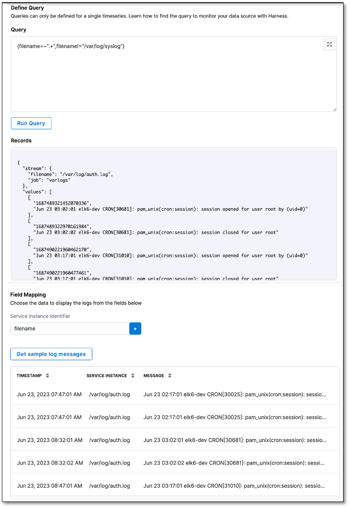

# Set up a Grafana Loki health source

```mdx-code-block
import Tabs from '@theme/Tabs';
import TabItem from '@theme/TabItem';
```

:::info note
Currently, this feature is behind the feature flag `SRM_ENABLE_GRAFANA_LOKI_LOGS`. Contact [Harness Support](mailto:support@harness.io) to enable the feature.
:::


In Harness, a health source refers to a mapping that establishes a connection between a service within Harness and a service operating in a deployment environment. This deployment environment is under the monitoring of an Application Performance Monitoring (APM) or logging tool. Through this mapping, Harness is able to gather metrics and data from the APM or logging tool, utilizing it to assess the health and status of the respective service within Harness.


## Prerequisites

- A Grafana Loki connector in the Harness platform. To learn how to add a Grafana Loki connector, go to [Add Grafana Loki](/docs/platform/Connectors/Monitoring-and-Logging-Systems/connect-to-monitoring-and-logging-systems#add-grafana-loki).

- A monitored service created in the Harness SRM. If you haven't yet created one, go to [Create a monitored service](/docs/service-reliability-management/monitored-service/create-monitored-service).


## Add Grafana Loki health source

To add Grafana Loki as a health source:

1. In your Harness project, go to **Service Reliability** > **Monitored Services**.  
   A list of monitored services is displayed.

2. Locate the monitored service for which you want to add a Grafana Loki health source, select the three vertical dots next to it, and then select **Edit service**.  
   The Configurations page appears.

3. Go to the **Service** tab, and under **Define Your Sources**, select **+ Add New Health Source**.
   
   The Add New Health Source page appears.


### Define a health source

In the **Define Health Source** tab of the Add New Health Source page, do the following: 

1. In **Select health source type**, select **GrafanaLoki**.
   
2. Enter a name for the health source.
   
3. Under **Connect Health Source**, select **Select Connector**.
   
4. In the Create or Select an Existing Connector dialog, select a Grafana Loki connector, and then select **Apply Selected**.

<details>
<summary><b>Follow these steps to create a new Grafana Loki connector.</b></summary>


1. In the Create or Select an Existing Connector dialog, select **+ New Connector**.
      
2. In the **Overview** tab, enter a name for the connector, an optional description, and a tag, and then select **Continue**. If you are going to use multiple providers of the same type, ensure you give each provider a different name.
 
3. In the **Headers** tab, enter the following, and select **Next**:
   
      - **Base URL** of your Grafana Loki account. By default, Grafana Loki exposes its API on the 3100 port without any authentication. 
  
      - Optionally, the **Key** and **Value** pair for the Grafana Loki log stream that you want to select in the query. For more information on the log stream selector and key-value pairs, go to [Log stream selector](https://grafana.com/docs/loki/latest/logql/log_queries/#log-stream-selector).
   
4. Optionally, in the **Parameters** tab, enter the **Key** and **Value** pair.
   
5. In the **Validation Path** tab, select either the **GET** or **POST** request method, and enter the **Validation Path**. If you select **POST**, you must also include the request body. 
   
   Here's an example of a validation path for a **GET** request: `loki/api/v1/labels`.
   
6. In the **Delegates Setup** tab, choose one of the following:

      - **Use any available Delegate**: Harness automatically assigns an available delegate.
      - **Only use Delegates with all of the following tags**: You can enter tags to ensure that Harness selects only the delegates that have been assigned those specific tags.
    
7. Select **Save** and **Continue**.  
   
      Harness verifies the connection. 
    
8.  Once the verification is successful, select **Finish**. The Grafana Loki connector is added to the list of connectors.

</details>
  

5.  After choosing the connector, select **Apply Selected**.

6.  In **Feature**, **Grafana Loki Logs** is selected by default.
    
7.  Select **Next**.  

    
### Define log configuration settings

1. In the **Configuration** tab of the Add New Health Source page, select **+ Add Query**.  
   
   The Add Query dialog appears.

2. Enter a name for the query and then select **Submit**.  
   
   The query that you added is listed under **Logs Group**. The query specification and mapping settings are displayed.
   These settings help you retrieve the desired logs from the Grafana Loki platform and map them to the Harness service. 


#### Define a query
   
1. In the **Query** field, enter a log query, and select **Run Query** to execute it.
   
    A sample record in the **Records** field. This helps you confirm the accuracy of the query you've constructed.
   
2. In the **Field Mapping** section, select **+** to map the **service instance identifiers** to select the data that you want to be displayed from the logs. For more information, go to [Service Instance Identifier (SII)](/docs/continuous-delivery/verify/cv-concepts/cvfg-cvng/#service-instance-identifier-sii).

3. Select **Get sample log messages**.  
   
   Sample logs are displayed that help you verify if the query is correct.

   <details>
   <summary><b>Sample log query</b></summary>

   Query for showing data from all filenames except syslog: `{filename=~".+",filename!="/var/log/syslog"}`

   

   </details>

4. Select **Submit**.  
   
   The Grafana Loki health source gets added to the monitored service. You can add multiple health sources.