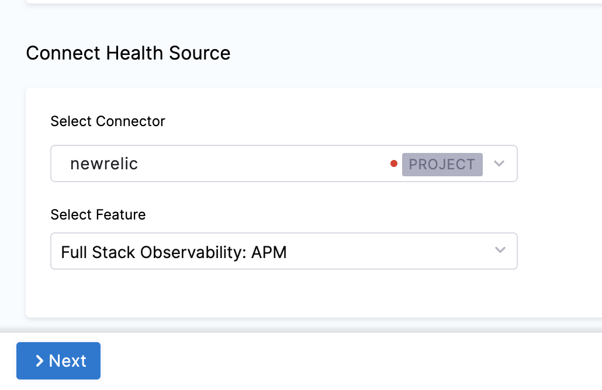

In Harness, a health source is a mapping that connects a Service in Harness to a service running in a deployment environment that is being monitored by an Application Performance Monitoring (APM) or logging tool. This mapping allows Harness to collect metrics and data from the APM or logging tool and use it to determine the health and status of the Service in Harness.

This topic describes how to set up New Relic as a health source in a monitored service.

## Prerequisites

- New Relic connector has been added to the Harness platform.
- A monitored service has already been created in the Harness SRM.

## Add New Relic health source

To add New Relic as a health source:

1. In your Harness project, go to **Service Reliability** > **Monitored Services**.  
   A list of monitored services is displayed.

2. Locate the monitored service for which you want to add a custom change source, select the three vertical dots next to it, and then select **Edit service**.  
   The Configurations page appears.

3. Go to the **Service** tab, and under **Define Your Sources**, select **+ Add New Health Source**.  
   
   
    
1. In **Select health source type**, select New Relic.
2. In **Health Source Name**, enter a name for the Health Source.
3. Under **Connect Health Source**, click **Select Connector**.
4. In **Connector** settings, you can either choose an existing connector or click **New Connector.**

    

5. Click **Apply Selected**. The Connector is added to the Health Source.
6. In **Select Feature**, select the NewRelic feature to be used.
    
    
    
7. Click **Next**. The **Customize Health Source** settings appear.
    The subsequent settings in **Customize Health Source** depend on the Health Source Type you selected. You can customize the metrics to map the Harness Service to the monitored environment. In Applications & Tiers, enter the following details:
8.  In **Find a New Relic application** type the name of an application.
9.  In **Find a New Relic tier** type a tier name from which you want usage metrics, code exceptions, error conditions, or exit calls.
10. In **Metric Packs** select the metrics you want Harness to use.
11. Click **Submit**. The New Relic health source gets added to the monitored service.

You can add multiple health sources.

