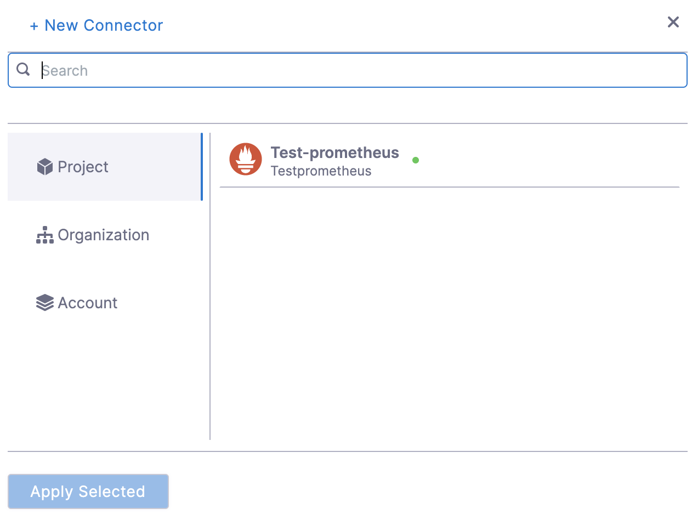
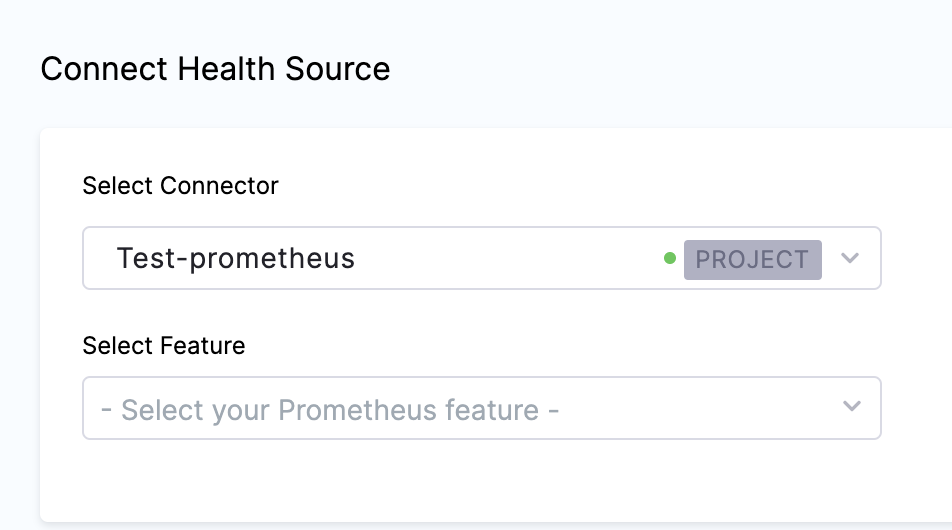
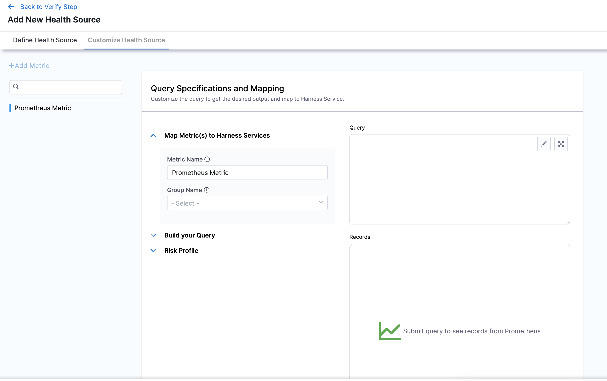

In Harness, a health source is a mapping that connects a Service in Harness to a service running in a deployment environment that is being monitored by an Application Performance Monitoring (APM) or logging tool. This mapping allows Harness to collect metrics and data from the APM or logging tool and use it to determine the health and status of the Service in Harness.

This topic describes how to set up Prometheus as a health source in a monitored service.

## Prerequisites

- Prometheus connector has been added to the Harness platform.
- A monitored service has already been created in the Harness SRM.

## Add Prometheus health source

To add Prometheus as a health source:

1. In your Harness project, go to **Service Reliability** > **Monitored Services**.  
   A list of monitored services is displayed.

2. Locate the monitored service for which you want to add a custom change source, select the three vertical dots next to it, and then select **Edit service**.  
   The Configurations page appears.

3. Go to the **Service** tab, and under **Define Your Sources**, select **+ Add New Health Source**. 

4. In **Select health source type**, select Prometheus.
5. In **Health Source Name**, enter a name for the Health Source.
6. Under **Connect Health Source**, click **Select Connector**.
7. In **Connector** settings, you can either choose an existing connector or click **New Connector.**
   
8. After selecting the connector, click **Apply Selected**. The Connector is added to the Health Source.
   
9. In **Select Feature**, select the Prometheus feature to be used.
10. Click **Next**. The **Customize Health Source** settings appear.

   The subsequent settings in **Customize Health Source** depend on the Health Source Type you selected. You can customize the metrics to map the Harness Service to the monitored environment.

   
   
11. In **Query Specifications and Mapping**, first click **Map Metric(s) to Harness Services**.
12. Enter the desired metric name in **Metric** **Name**.
13. Enter a name for the Prometheus group in **Group Name**.
14. Click **Build your Query** drop down.
15. In **Prometheus Metric**, select the Prometheus metric.
16. In **Filter on Environment**, select a filter.
17. In **Filter on Service**, select a filter. To add more filters, click **Additional Filter** which is optional.
18. To add an aggregator for the metric, click **Aggregator** which is also optional.
19. In **Assign**, you can select the services for which you want to apply the metric.
20. Click **Submit**. The Prometheus health source gets added to the monitored service.

You can add multiple health sources.

#### **Add Amazon Managed Service for Prometheus as health source**

:::note

Currently, this feature is behind the feature flag `SRM_ENABLE_HEALTHSOURCE_AWS_PROMETHEUS`. Contact [Harness Support](mailto:support@harness.io) to enable the feature.

:::

Harness now supports Amazon Managed Service for Prometheus as health source. To select Amazon Managed Service for Prometheus as health source:

1. In Health Sources, click **Add**.   
The Add New Health Source settings appear.
2. In **Select health source type**, select **Prometheus**.
3. In **Health Source Name**, enter a name for the Health Source.
4. Under **Connect Health Source** > **Via Cloud Provider**, select Amazon web services.
   
   

5. Under **Connect Health Source**, click **Select Connector**.
6. In **Connector** settings, you can either choose an existing connector or click **New Connector.**
7. In the **Select Feature** field, select the Prometheus feature that you want to use.
8. In the **Select AWS Region** field, select the appropriate region.
9. In the **Select Workplace Id** field, select the appropriate workplace id.
10. Click **Next**. The **Customize Health Source** settings appear.  
You can customize the metrics to map the Harness Service to the monitored environment in **Query Specifications and Mapping** settings. The subsequent settings in **Customize Health Source** depend on the Health Source Type you selected. Click **Map Queries to Harness Services** dropdown.
11. Click **Add Metric**.
12. Enter a name for the query in **Name your Query**.
13. Click **Select Query** to select a saved query. This is an optional step. You can also enter the query manually in the **Query** field.
14. Click **Fetch Records** to retrieve the details. The results are displayed under **Records.**

