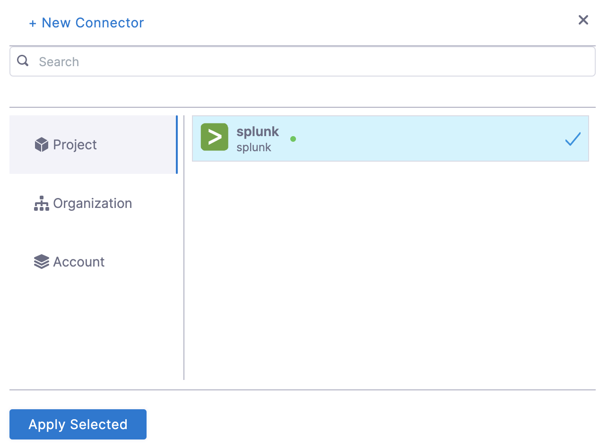

In Harness, a health source is a mapping that connects a Service in Harness to a service running in a deployment environment that is being monitored by an Application Performance Monitoring (APM) or logging tool. This mapping allows Harness to collect metrics and data from the APM or logging tool and use it to determine the health and status of the Service in Harness.

This topic describes how to set up Splunk as a health source in a monitored service.

## Prerequisites

- Splunk connector has been added to the Harness platform.
- A monitored service has already been created in the Harness SRM.

## Add Splunk health source

To add Splunk as a health source:

1. In your Harness project, go to **Service Reliability** > **Monitored Services**.  
   A list of monitored services is displayed.

2. Locate the monitored service for which you want to add a custom change source, select the three vertical dots next to it, and then select **Edit service**.  
   The Configurations page appears.

3. Go to the **Service** tab, and under **Define Your Sources**, select **+ Add New Health Source**.  
   
   

4. In **Select health source type**, select Splunk.
5. In **Health Source Name**, enter a name for the Health Source.
6. Under **Connect Health Source**, click **Select Connector**.
7. In **Connector** settings, you can either choose an existing connector or click **New Connector.**
   

8. Click **Apply Selected**. The Connector is added to the Health Source.
   
   

9. In **Select Feature**, select the Splunk feature to be used.
10. Click **Next**. The **Customize Health Source** settings appear.
   The subsequent settings in **Customize Health Source** depend on the Health Source Type you selected. You can customize the metrics to map the Harness Service to the monitored environment in **Query Specifications and Mapping** settings.
   
   

11. Click **Map Queries to Harness Services** dropdown.
12. Enter a name for the query in **Name your Query**.
13. Click **Select Query** to select a saved query. This is an optional step. You can also enter the query manually in **Query**.
14. Click **Fetch Records** to retrieve the details. The results are displayed under **Records.**
   

14. Once the records are fetched, click the plus icon in **Identify Service Instance** to select the path for service instance.
15. Click **Submit**. The Splunk health source gets added to the monitored service.

You can add multiple health sources.

