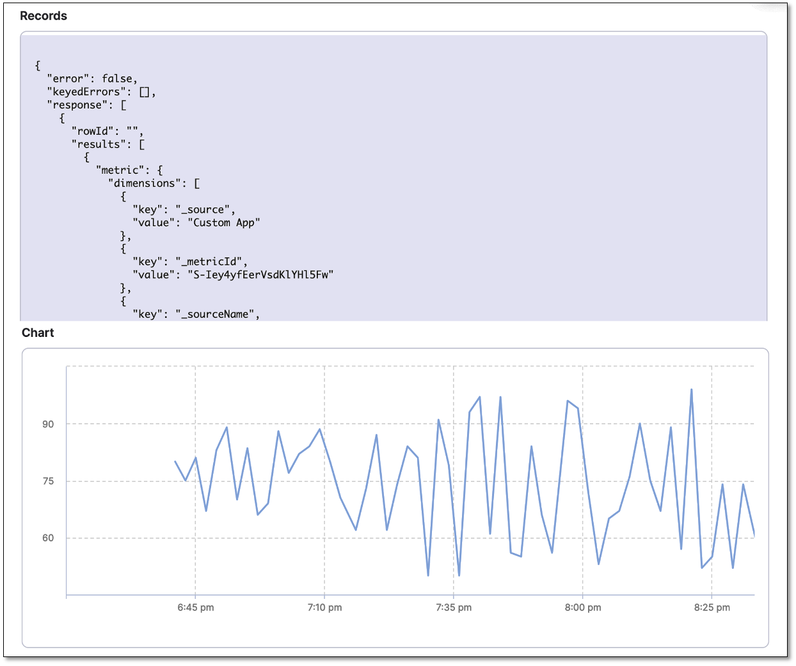
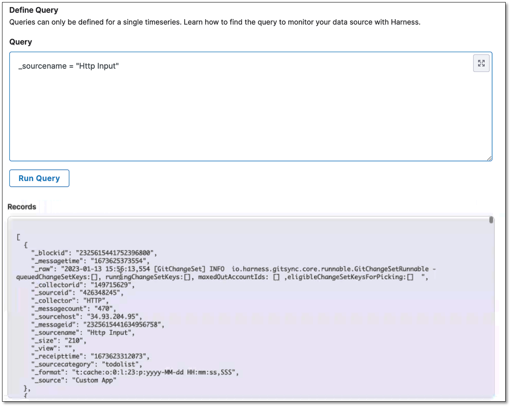

```mdx-code-block
import Tabs from '@theme/Tabs';
import TabItem from '@theme/TabItem';
```

:::info note
Currently, this feature is behind the feature flag `SRM_SUMO`. Contact [Harness Support](mailto:support@harness.io) to enable the feature.
:::


In Harness, a health source is a mapping that connects a Service in Harness to a service running in a deployment environment that is being monitored by an Application Performance Monitoring (APM) or logging tool. This mapping allows Harness to collect metrics and data from the APM or logging tool and use it to determine the health and status of the Service in Harness.

This topic describes how to set up Sumo Logic as a health source in a monitored service.


## Prerequisites

- Sumo Logic connector has been added to the Harness platform.
- A monitored service has already been created in the Harness SRM.


## Add Sumo Logic health source

To add Sumo Logic as a health source:

1. In the **Health Sources** section, select **+ Add**.
   The Add New Health Source dialog appears.
2. On the **Define Health Source** tab, do the following:
      1. In the **Define Health Source** section, select **SumoLogic** as health source type.
      2. In the **Health Source Name** field, enter a name for the health source.
      3. In the **Connect Health Source** section, select the **Select Connector**.  
     The Create or Select an Existing Connector dialog appears.
      1. Select a connector for the Sumo Logic health source and then select **Apply Selected**.  
     The selected connector appears in the **Select Connector** dropdown field.
      1. In the **Select Feature**, you can either select **SumoLogic Cloud Metrics** or **SumoLogic Cloud Logs**.
      2. Select **Next**.  
     The **Configuration** tab appears.


### Define metric and log configuration settings
   
   Perform the following steps based on the feature you have selected in the **Select Feature** field.

<Tabs>
  <TabItem value="Steps to configure SumoLogic Cloud Metrics" label="Steps to configure SumoLogic Cloud Metrics" default>

   
   1. On the **Configuration** tab, select **+ Add Metric**.  
   The Add Metric dialog appears.
   2. Enter the following information and then select **Submit**:  
      * **Metric name**: Enter a name for the metric. For example, Memory Metric.
      * **Group name**: If the group to which you want to add the metric already exists, select it.   
     If you want to create a new group, select **+ Add New**. In the Add Group Name dialog enter a group name, and then select **Submit**.
   3. In the Add Metric dialog, select **Submit**.   
   New group and metric are created. The query specifications and mapping settings are displayed. These settings help you get the desired metric data from the Sumo Logic platform and map it to Harness service. To learn about Sumo Logic metrics and queries, go to [https://help.sumologic.com/docs/metrics/](https://help.sumologic.com/docs/metrics/).


#### Define a query

   In the **Query** box, enter your metric query and then select **Run Query**.  
   Sample data is displayed in the **Records** box. The **Chart** box displays the graph corresponding to the sample data. This helps you verify if the query that you have built is correct.

   <details>
   <summary><b>Sample query for memory usage</b></summary>

   Query: `metric=memory`

   

   Disk usage records and chart being displayed for the query

   


   </details>

#### Assign services

In the **Assign** section, select the services to which you want to apply the Sumo Logic metric. Following options are available:
   * **Continuous Verification (Applied to the pipelines in the Continuous Deployment)**: Select this option to use the metric data in the Continuous Deployment pipeline to ensure that the deployed service is running safely and to perform automatic rollbacks. In addition, the metric will be used to apply machine learning in detecting and highlighting future deployment issues.
   * **Service Health**: Select this option to use the metric data to track the changes in the health trend of your monitored service.
   * **Service Level Indicator (SLI)**: Select this option to use the metric data to measure the SLI and obtain the performance of the service. 

#### Configure risk profile
If you select **Continuous Verification (Applied to the pipelines in the Continuous Deployment)** or **Service Health**, expand the section below and follow the instructions for configuring the risk profile.

<details>
<summary><b>Risk Profile settings</b></summary>


#### Risk Profile
  
:::note
The **Risk Profile** section is only visible if you have selected **Continuous Verification (Applied to the pipelines in the Continuous Deployment**) or **Service Health** in the **Assign** section.
:::

1. Under **Risk Category**, select one of the following options:
  - **Errors**
  - **Infrastructure**
  - **Performance/Throughput**
  - **Performance/Other**
  - **Performance/Response Time**

2. Under **Deviation Compared To Baseline**, select the following settings to measure your service's behavior and calculate deviations from the health source:

- **Higher counts = higher risk**
- **Lower counts = higher risk**

  Note that you can select multiple options.


#### Map service instance identifier

:::note
The **Map service instance identifier** section is only visible if you have selected **Continuous Verification (Applied to the pipelines in the Continuous Deployment**) in the **Assign** section.
:::

In **Service Instance Identifier (only needed for CV)**, specify the service instance identifier, which represents a dynamically created service that you deploy using Harness. The default value is `_sourceHost`.

#### Advanced (Optional)

:::note
The **Advanced (Optional)** section is only visible if you have selected **Continuous Verification (Applied to the pipelines in the Continuous Deployment**) in the **Assign** section.
:::

##### Ignore Thresholds

You can select the types of events for which you want to set thresholds in CV. Metrics that match the selected rules will not be flagged as anomalous, regardless of the analysis. 

To set the **Ignore Thresholds** for CV:

1. Go to the **Ignore Thresholds** tab and select the **+ Add Threshold** button.
2. From the **Metric** dropdown, select the desired metric for which you want to set the rule.
3. In the Criteria field, choose the type of criteria you want to apply for the threshold:
- **Absolute Value**: Select this option and enter the **Greater than** and **Lesser than** values.
- **Percentage Deviation**: Select this option and enter the **Lesser than** value.


##### Fail-Fast Thresholds 
You can select the type of events for which you want to set thresholds in CV. Any metric that matches the selected rules will be marked as anomalous and cause the Workflow state to fail.

To set fail-fast thresholds for CV, follow these steps:

1. Go to the **Fail-Fast Thresholds** tab and select the **+ Add Threshold** button.
2. From the **Metric** dropdown, select the desired metric for which you want to set the rule.
3. In the **Action** field, select what the CV should do when applying the rule:
- **Fail Immediately**
- **Fail after multiple occurrences**
- **Fail after consecutive occurrences**
4. In the Count field, set the number of occurrences. This setting is only visible if you have selected **Fail after multiple occurrences** or **Fail after consecutive occurrences** in the **Action** field. The minimum value must be two.
3. In the Criteria field, choose the type of criteria you want to apply for the threshold:
   
   - **Absolute Value**: Select this option and enter the **Greater than** and **Lesser than** values.
   - **Percentage Deviation**: Select this option and enter the **Lesser than** value.

</details>

</TabItem>
  
<TabItem value="Steps to configure SumoLogic Cloud Logs" label="Steps to configure SumoLogic Cloud Logs">

1. On the Configuration tab, select **+ Add Query**.  
   The Add Query dialog appears.
2. Enter a name for the query and then select **Submit**.  
   The Custom Queries settings are displayed. These settings assist in retrieving the desired logs from the Sumo Logic platform and mapping them to the Harness service. To learn about Sumo Logic logs, go to [https://help.sumologic.com/docs/search/](https://help.sumologic.com/docs/search/).

#### Define a query

1. In the **Query** field, enter the log query and select **Run Query** to execute it. This displays a sample record in the **Records** field, allowing you to confirm the accuracy of the query you've constructed.
2. In the **Field Mapping** section, select the **Service Instance Identifier** to display the logs, and then select **Get sample log messages**. Sample logs are displayed that help you verify if the query you built is correct.

<details>
   <summary><b>Sample log query</b></summary>

   Query: `_sourcename = "Http Input"`

   


   </details>


</TabItem>
</Tabs>


### Save the health source settings

1. After configuring all the settings, select **Submit**. The Sumo Logic health source gets added to the monitored service.


