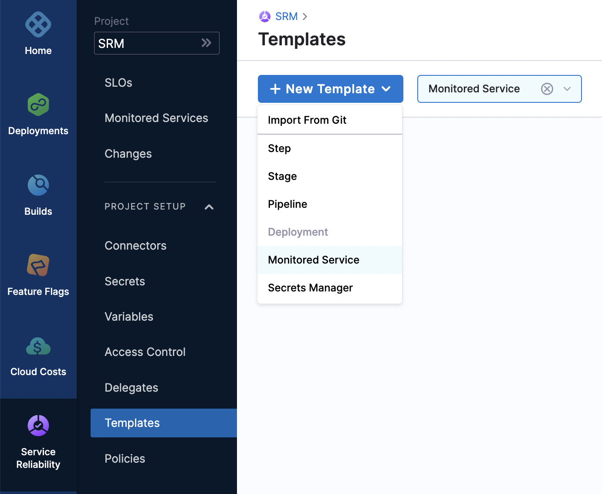
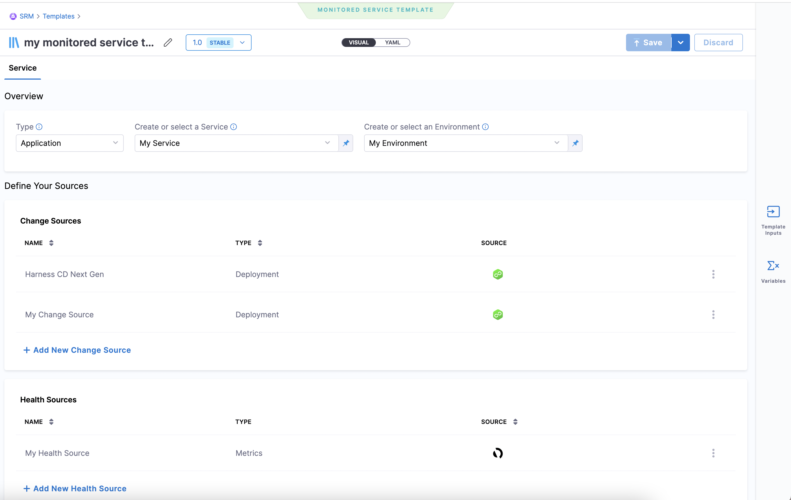

Monitored Service template is a predefined set of monitored service configuration settings. Templates remove the hassle of setting up the configuration every time you create a new monitored service. Templates improve productivity and bring in standardization.

Creating a monitored service template involves the following tasks:

* Creating a Monitored Service template
* Creating a Service
* Selecting a change source
* Selecting health source

Most of the configuration settings allow you to use either Fixed Values or Runtime Inputs.  

Fixed Values are the values that you enter while configuring the template. These configuration settings are applied to the monitored health service by default when you use this template.  

Runtime inputs are values that you are prompted to enter while using the template. When you set a field as Runtime input, it becomes a placeholder for values that you need to provide while using the template to create a monitored health service.  

For more information see [Fixed Values, Runtime Inputs, and Expressions](../../platform/20_References/runtime-inputs.md).

### Create a Monitored Service Template

1. In Harness, click **Site Reliability** > **Project Setup** > **Templates**.The Template page appears. Click **+ New Template**, and then select **Monitored Service**.

  

2. The Create New Monitored Service Template page appears.

3. Enter the following information and then click **Start**:
  * **Name**: Provide a name for the template.

    Note: Harness automatically allots a unique identifier, also known as Id for the Template. You can change the name any time, but the Id is immutable. You cannot modify the ID.
  * **Description (Optional)**: Enter a description for the template.
  * **Tags (Optional)**: You can assign a tag for the template. You can either assign an existing tag or create a new tag. You can assign multiple tags. Tags are metadata and they can contain any characters. Tags can be used to filter the templates. For example, you create a Tag called myTemplate and assign it two different templates. When you search using keyword myTemplate, it returns the two templates that have the tag myTemplate assigned to them.
  * **Version Label**: Enter a version for the template.
  * **Save To**: Select where you would like to save the template. You can save the template to an existing project, organization.

  The template is created, and the Service page appears.

  

### Create a Service

A Service is a logical representation of the environment and microservices that you want to monitor.

In the **Overview** section, do the following:

1. In the **Type** field, select a service type that you want to monitor. Available options are **Application** and **Infrastructure**.

1. In the **Create or Select a Service** field select a service.

  You can either select an existing service or create a new service to monitor. To create a new service:

  a. Click **+ Add New**.  
	The New Service dialog appears.

  b. Enter the following information, and then click **Save**:

    * **Name** : Enter a name for the service.  
    * **Description** (Optional)
    * **Tag** (Optional)

  The new service is created.

1. In the **Create or Select an Environment** field choose an environment in which Harness Service Reliability Management is deployed.  
Environments represent your deployment targets QA, Prod, and so on. When you add an Environment to a Monitored Service, it allows you to associate change records, actions, logs, metrics, and SLO’s to the respective service within its associated environment.  
You can either select an existing environment or create a new environment. To create a new environment:

  a. Click **+ Add New** in the drop-down list. The New Environment dialog appears.

  b. Enter the following information and then click **Save**:
   * **Name**: Enter a name for the service.
   * **Description** (Optional)
   * **Tag** (Optional)
   * **Environment Type**: The available options are Production and Non-Production.

  The new environment is created.

### Select a Change Source

Harness Monitored Service continuously monitors the health changes of your application and changes that occur in the environment on which the application is hosted.

You need to define the sources from which the Monitored Service can collect the application health data and the data of changes made to the environment. 

In the **Change Sources** section, select the environment for which you want to monitor the changes. You can either choose an existing change source or create a new change source.

To create new change source:

1. Click **+  Add New Change Source**  
The Add New Change Source dialog appears.

2. In the **Provider Type** field, select the source for which you want to monitor the changes. Following are the available options:  

  * **Deployment**: You can choose either Harness CD NextGen or Harness CD. If you choose Harness CD, then under the Connect Change Source section, select the Application which you want to monitor for changes.  
  * **Incident**: Select the incident management tool which monitors your application.

3. In the **Source Name** field, enter a name for the Source that you are creating.  
 The new change source appears in the Change Sources list.

### Select a Health Source

A health source is an APM or log provider using which the Harness Monitored Service collects the metrics and logs of your service. In the **Health Sources** section, select the health source which monitors the health of your service. You can either select an existing health source or create a new health source. To create a new health source:

1. Click **+ Add New Health Source**.  
The Add New Health Source dialog appears.

2. In the **Define Health Source** tab, select the health source that monitors your service.

3. Enter a name for the Health Source.

4. Select **Connector** and the **Feature** associated with the connector.  
Connectors contain the information necessary to integrate and work with your health source. The feature can be either metrics or logs.

5. Click **Next**.

6. In the **Customize Health Source** tab, under the **Applications & Sections** section, select the appropriate application and the tier.  
For example, if you have selected AppDynamics as the **Health Source Type**, the list of applications and tiers associated with AppDynamics are displayed in the **Find an AppDynamics application** and **Find an AppDynamics tier** fields.

7. In the **Metrics Packs** section, select the metrics that you want to use for the health source. The options available are **Errors** and **Performance**.

8. Click **Submit**.  
The new health source appears in the Health Sources list.

9. Click **Save** to save the settings.

  

  The Monitored Health Service template is now ready for use.

### Create a Monitored Service Using Template

You create a monitored service using a template. Template is a predefined set of configurations. To create monitored service using a template:

1. Click **Monitored Service** > **Use template**.

2. In the Templates page, select the template that you want to use.  
The preview of the selected template appears on the right.  
In the Details tab, you can see the following information:

  * Template type  
  * Description  
  * Tags associated with the template  
  * Template version  
  * Template input. The fields that you have configured as Runtime Input while creating the template are displayed here.  
  * YAML version of the template.  
  * List of monitored services that are referring to this template.  

  In the Activity Log tab, you can see the history of changes made to the template.
3. Select the template version that you want to use.
4. Click **Use Template**.  
The Monitored Service Input Set page appears. This page lists all the fields that you have configured as Runtime Input while creating the template. For example, if you had configured service and environment as runtime inputs, the **Create and Select or Service** and **Create or Select an Environment** fields appear in this page.
5. Enter the appropriate information if there are fields that require input.
6. Click **Submit**.  

  The monitored service is created and appears in the Monitored Services page.

### Modify a Monitored Service Created from a Template

Templates are a great way to create a new monitored service quickly. There can be situations during which you may want to modify the monitored service configuration that you created using a template. To modify a monitored service:

1. Click **Monitored Service**.  
List of all the monitored services is displayed.

2. Click the three vertical dots next to the monitored service that you want to modify and then click **Edit service**.  
The Configuration tab of the monitored service appears.

3. Make necessary changes to the monitored service configuration, and then click **Save**.
