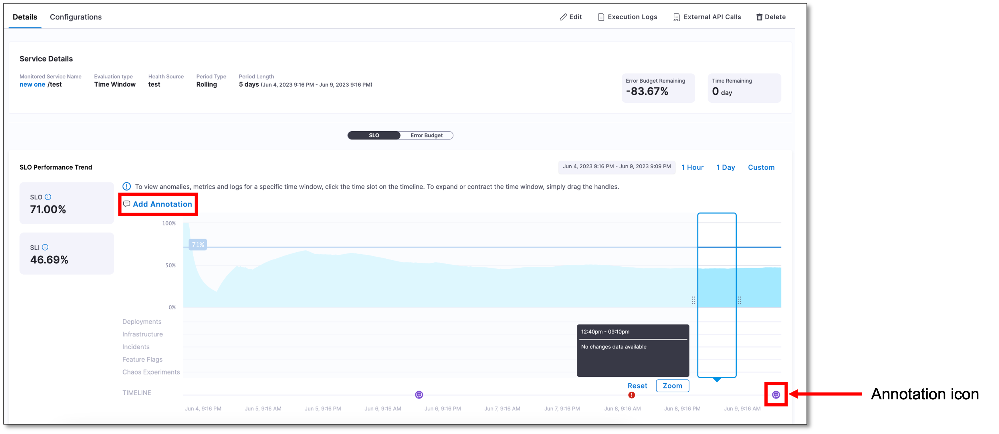
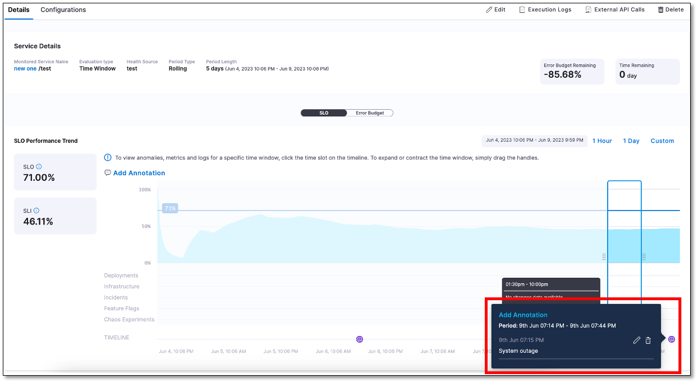

You can add annotations about specific events or changes that affect service performance and the error budgets. 

For example, if website response time suddenly increases due to a marketing campaign driving more visitors, you can add an annotation for that period explaining the service health degradation for that period. These notes help you understand why anomalies occur and act as a record for future reference.

Another example can be instances where a specific incident or deployment consumes a significant portion of the budget. For instance, when a critical bug causes a service outage for a few hours, you can add an annotation to indicate that a major incident occurred during that period, explaining the decrease in the budget.

In summary, the annotation feature allows you to add notes or comments about important events or changes in your services. These annotations help provide context, record significant incidents, and enhance the understanding of your system's performance over time.

Annotations bring several benefits to service monitoring and analysis:

- **Improved context**: Annotations provide important context for performance anomalies, helping us understand the reasons behind fluctuations.

- **Efficient analysis**: Annotations serve as a record of significant events, enabling us to analyze past incidents and their impact on service performance.

- **Effective collaboration**: Annotations facilitate communication among team members and stakeholders by creating a shared understanding of important events and changes.

## Add an annotation to SLO

To add an annotation:

1. In your Harness project, navigate to **Service Reliability Management** > **SLOs**, and then select the SLO in which you want to add an annotation.

2. On the SLO page, go to the **Details** tab and then select **Add Annotation**.

3. In the Add Annotation dialog, enter annotation details, select the start and end date and time, and then select **Save**.  
   
   The annotation appears as an icon on the timeline.

## View annotation details

Simply select an annotation on the timeline to view the details.

## Manage annotations

To edit or delete an annotation:

1. On the timeline, select the annotation.

2. Select the edit icon to change the details. Select the delete icon to delete the annotation.

