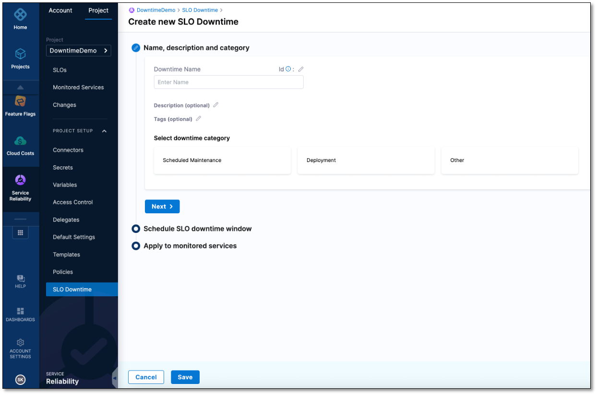

You can schedule SLO downtime windows to apply to specific services or all services.

:::info note
Currently, this feature is behind the feature flag `SRM_DOWNTIME`. Contact [Harness Support](mailto:support@harness.io) to enable the feature.
:::

## Create a new SLO downtime

To configure downtime for an SLO:

1. In your Harness project, navigate to **Service Reliability Management**, expand **PROJECT SETUP**, and then select **SLO Downtime**.  
   

2. In the SLO Downtime page, select **+ Downtime**.  

   

3. Enter a **name** for this SLO downtime, an optional **description**, optional **tags**, and select a **downtime category** such as **Scheduled Maintenance**.

4. Select **Next**.
   
5. In the **Schedule SLO downtime window** section, choose whether this SLO downtime is **ONE TIME** or **RECURRING**, select the **timezone**, and **start time**.
  
6. Based on the downtime type you select, complete the downtime schedule as follows.
   
   * **For ONE TIME:** Select a duration from the start time or a specific time.

   * **For RECURRING:** Select a duration, how often the downtime should repeat, and when the recurrence ends.

7. Select **Next**.

8. In **Apply to monitored services**, select specific monitored services or **Apply the downtime to all existing and future services**.  
   
   This SLO downtime applies only to the monitored services that you selected.

9. Select **Save**. 
    
   The SLO down appears on the SLO Downtime page.

## Next steps

[Manage SLO downtime.](./manage-slo-downtime.md)