You can use Harness governance to ensure that Harness entities like Pipelines meet specific compliance requirements when specific events happen (On Save, On Run, etc). Harness Governance uses OPA as the central service to store and analyze policies for the different entities and processes across the Harness platform.

SLO-driven governance policies ensure that Harness entities like SLOs (service level objectives) and Error Budgets meet specific compliance requirements when specific events happen (On Save, On Run, etc). These policies prevent Pipelines from deploying if:

* Configured SLO limit is breached for a given Harness Monitored Service
* SLO isn't configured for a Monitored Service
* Configured Error Budget has depleted

This topic walks you through the steps to use SLO-based policies to enforce Pipeline governance.

This topic is only meant to demonstrate how Pipeline governance works, so we use a simple Pipeline. OPA policies are written in the Rego policy language of the OPA. We'll provide the policy you'll need for this quickstart, but it's also a good idea to be familiar with Rego before writing or reading policies. See [OPA Policy Language](https://www.openpolicyagent.org/docs/latest/policy-language/) and the [Rego Cheatsheet](https://dboles-opa-docs.netlify.app/docs/v0.10.7/rego-cheatsheet/) for more information.


### How does Harness use OPA?

The Harness OPA server is an OPA server managed by Harness.

In Harness, you add Rego policies to a Policy Set and select the Harness entities for evaluation (e.g. Pipelines). At that point, the policies are configured on the Harness OPA Server via a Kubernetes ConfigMap.

When certain events happen (e.g. saving or running a Pipeline), Harness reaches out to the Harness OPA server to evaluate the action using the Policy Set.

### Step 1: Create a Project

In your Harness account, click **Home**.

Click **Projects.**

Click **New Project**.

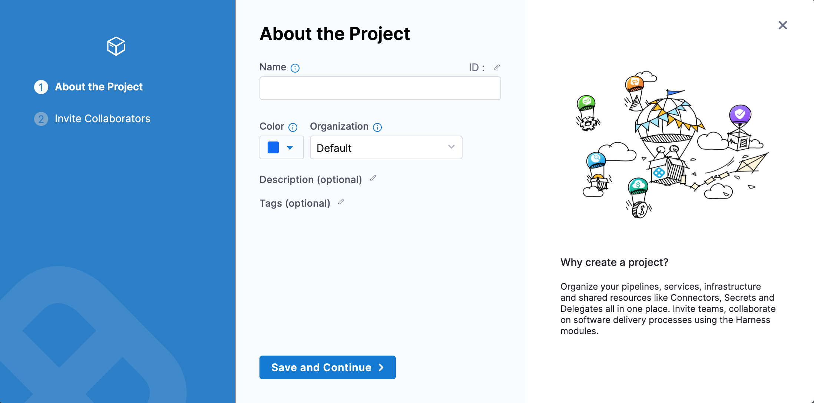

In **Name** enter a name for the Project. For example **Quickstart.**

Click **Save and Continue**.

In **Invite Collaborators**, click **Save and Continue**. You will automatically be added as a Project Admin.

Your new Project is created.

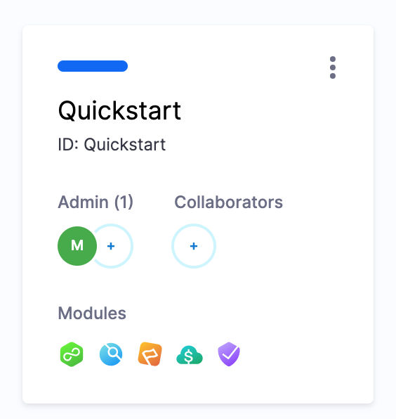

Next add a Pipeline that will be evaluated later using OPA policies.

### Step 2: Create a Pipeline

Open the new Harness Project you created and click **Deployments**.

Click **Pipelines**, and then click **Create a Pipeline**.

Name the Pipeline **Policy Example** and click **Start**.

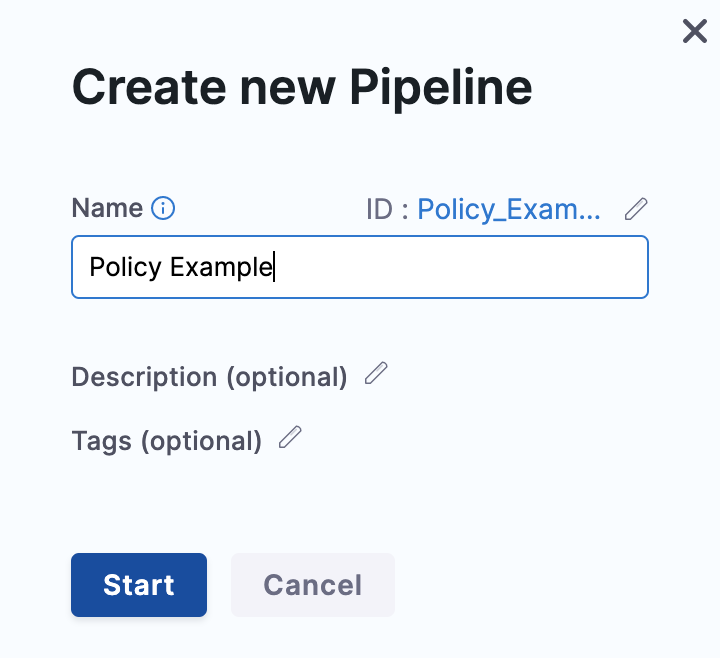

Click **Add Stage**. The **Select Stage Type** settings appear.

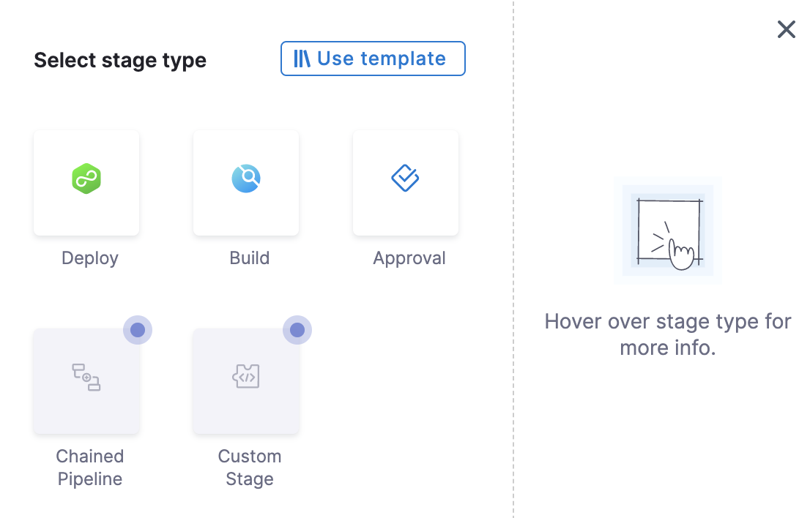

Select **Deploy**.

In **Stage Name** enter a name for the Stage. For example Quickstart.

Click **Set Up Stage**.

In **Specify Service**, either select a Service from the list or click **New Service** to create one.

In **Service Definition**, select the **Deployment Type**. For example Kubernetes.

Click **Next**.

In **Specify Environment**, either select an Environment from the list or click **New Environment** to create one.

In **Infrastructure Definition**, select the infrastructure type. For example Kubernetes.

In **Connector**, select an existing Connector or create a new one.

In **Namespace**, enter the target namespace. For example quickstart.

Click **Next**.

In **Execution Strategies**, select the desired strategy. For example **Rolling**.

Click **Use Strategy**.

Click **Save**. The Pipeline is now saved.

Next, we'll create an SLO policy for the Pipeline.

### Step 3: Create a Policy

Harness uses the [Rego policy language](https://www.openpolicyagent.org/docs/latest/policy-language/) for defining rules that are evaluated by the OPA engine. Basically, you use Rego to answer queries such as "does the Pipeline have an Approval step?" and so on. Your Harness Pipelines and entities might be created using the Harness UI or YAML, but your Rego policies will validate the JSON of your Pipelines or other entities.

Perform the following steps to create an SLO-based policy.

In the Harness Project, in **Project Setup**, click **Governance**.

Click **Policies**, and then click **New Policy**.

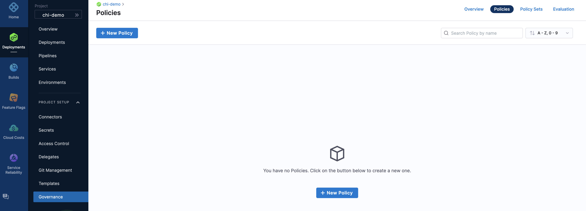

In **Name**, enter a name for the Policy. For example Quickstart.

The policy editor appears.

[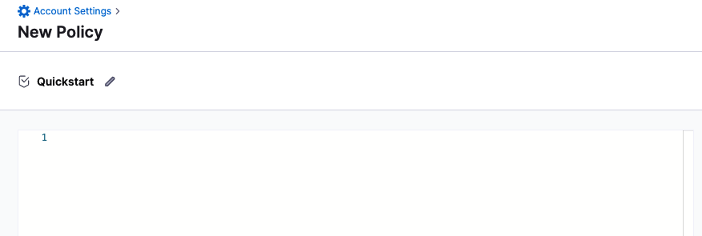](./static/slo-driven-deployment-governance-29.png)

You can create SLO-based policies using the following examples, or you can create your own set of policies:

* Example 1: If Environment is NON\_PROD and SLO is not configured.


```
package pipeline  

authorize = "allow" {  
    stage = input.pipeline.stages[_].stage  
    stage.type == "Deployment"                                                    # ... that are deployments  
    stage.spec.infrastructure.environment.type == "Production"  
} else = "deny" {  
    step = input.pipeline.stages[i].stage.spec                                                    
    step.sloPolicy.statusOfMonitoredService == "NOT_CONFIGURED"  
} else = "allow"  

deny ["SLO for the non prod env should be configured"]{  
  authorize == "deny"  
}
```
* Example 2: If Env is NON\_PROD and SLO is configured, but Error Budget is less than the configured percentage.


```
package pipeline  

authorize = "allow" {  
    stage = input.pipeline.stages[_].stage  
    stage.type == "Deployment"                                                    # ... that are deployments  
    stage.spec.infrastructure.environment.type == "Production"  
} else = "deny" {  
    step = input.pipeline.stages[i].stage.spec                                                    
    step.sloPolicy.sloErrorBudgetRemainingPercentage<50  
} else = "allow"  

deny["SLO error budget for the non prod env should be greater than 50"] {  
  authorize == "deny"  
}
```
* Example 3: If Environment is PROD and SLO is not configured.


```
package pipeline  

authorize = "allow" {  
    stage = input.pipeline.stages[_].stage  
    stage.type == "Deployment"                                                    # ... that are deployments  
    not stage.spec.infrastructure.environment.type == "Production"  
} else = "deny" {  
    step = input.pipeline.stages[i].stage.spec                                                    
    not step.sloPolicy.statusOfMonitoredService == "CONFIGURED"  
} else = "allow"  

deny ["SLO should be configured for the prod env"] {  
  authorize == "deny"  
}
```
* Example 4: If Environment is PROD and the SLO is configured, but Error Budget is less than configured percentage.


```
package pipeline  

authorize = "allow" {  
    stage = input.pipeline.stages[_].stage  
    stage.type == "Deployment"                                                    # ... that are deployments  
    not stage.spec.infrastructure.environment.type == "Production"  
} else = "deny" {  
    step = input.pipeline.stages[i].stage.spec                                                    
    step.sloPolicy.sloErrorBudgetRemainingPercentage<50  
} else = "allow"  

deny ["SLO for the prod env should be more than 50"] {  
  authorize == "deny"  

```
Consider the following example in which the policy applies an SLO limit:

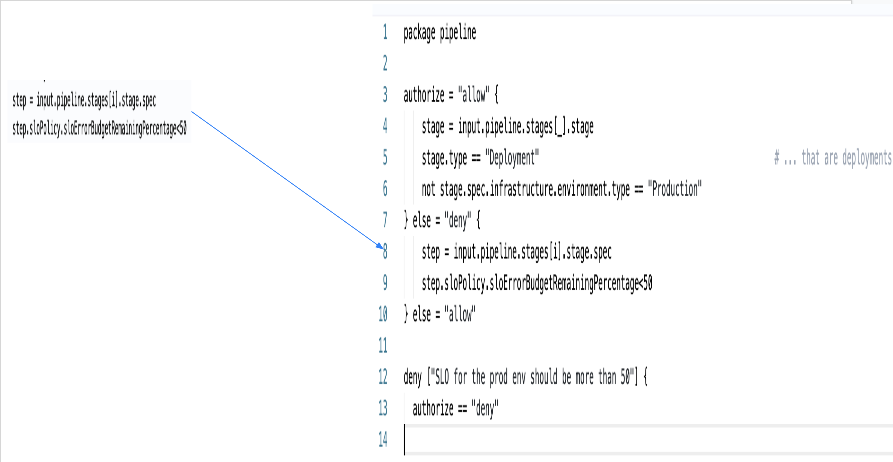

Once you have created the policy paste it in the editor.

Click **Save**.

### Step 4: Create a Policy Set

Policy Sets are groups of related policies. A single policy can be a member of many Policy Sets.

Click **Policy Sets**.

[](./static/slo-driven-deployment-governance-32.png)

In **Policy Sets**, click **New Policy Set**.

[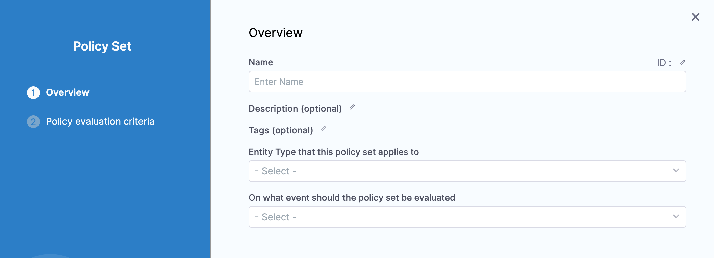](./static/slo-driven-deployment-governance-34.png)

In **Name**, enter a name for the policy set. For example **Quickstart**.

In **Entity Type that this policy set applies to**, select **Pipeline**. It is the Harness entity for the Policy Set

In **On what event should the policy set be evaluated**, select **On Run**. It is the event that triggers the evaluation.

Click **Continue**.

In **Policy evaluation criteria**, click **Add Policy**.

In **Policy to Evaluate**, select the **Quickstart** policy you created. Policies can be created at the Account, Org, and Project level.

In the drop-down next to the selected policy, select **Error and exit**. You can also select **Warn & Continue**.

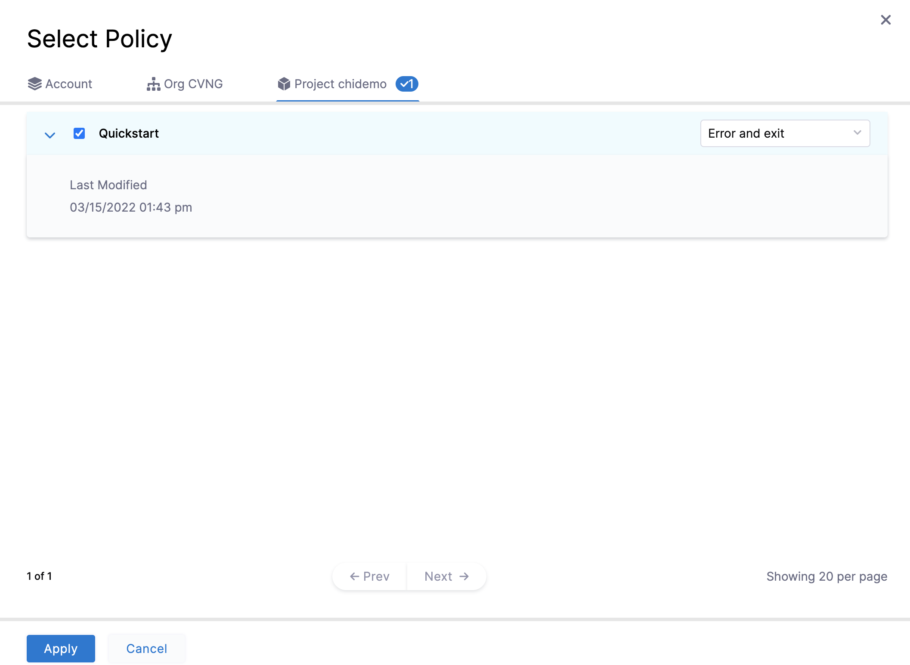

Click **Apply**.

Click **Finish**. The new Policy Set is listed.

Click **ENFORCED** to enforce the policy if not enabled already.

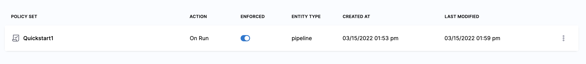

When you create Policy Sets they are applied to all matching entities (for example, Pipelines). Be careful that you do not create a Policy Set that might impact existing Pipelines unintentionally.

### Step 5: Evaluate a Pipeline on Run

Click **Pipelines** to navigate back to the Pipeline you created earlier.

Click **Run**, and then **Run Pipeline**.

The Policy Set is evaluated and the Pipeline execution fails.

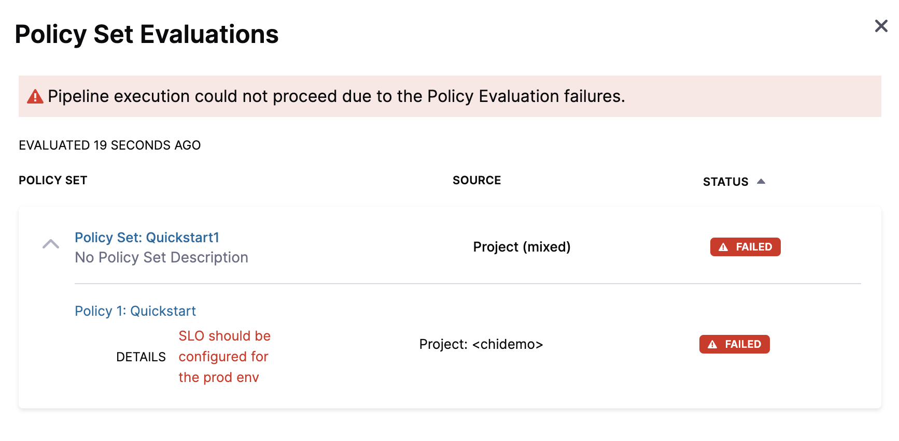

### Step 6: Configure an SLO and Rerun

When the Policy Set is evaluated, the Pipeline fails as SLO wasn't configured for the Monitored Service.

Now, [create an SLO](/docs/service-reliability-management/getting-started/create-first-slo) for the Monitored Service.

Once you have set an SLO, click **Run**, and then click **Run Pipeline**.

The Pipeline runs.

Let us review the policy evaluations now.

### Step 7: Review Policy Evaluations

You can review policy evaluations in the following ways.

#### Review in Pipeline Execution

On the Pipeline deployment summary (**Execution History**), click **Policy Evaluations**.

[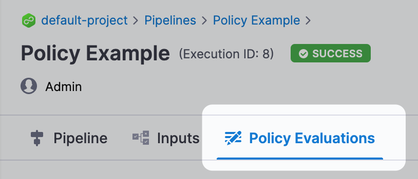](./static/slo-driven-deployment-governance-39.png)

Policy Set evaluations are listed.

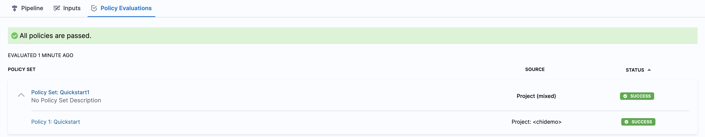

#### Review in Governance Overview

Click **Project Setup**, and then click **Governance**.

Click **Evaluations**.

[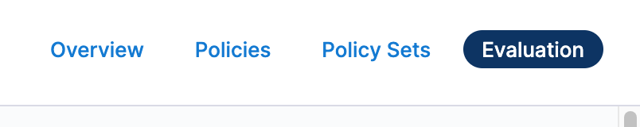](./static/slo-driven-deployment-governance-42.png)

You can see the evaluation you just performed:

[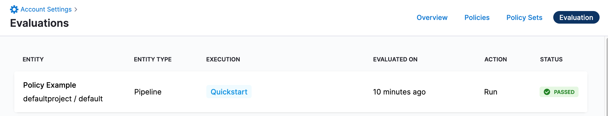](./static/slo-driven-deployment-governance-44.png)

### Summary

In this tutorial, you:

* Created an SLO policy in Harness
* Created a Policy Set from your new policy
* Ran a Pipeline that failed a policy evaluation
* Ran a Pipeline that passed a policy evaluation
* Reviewed policy evaluations for a Pipeline
