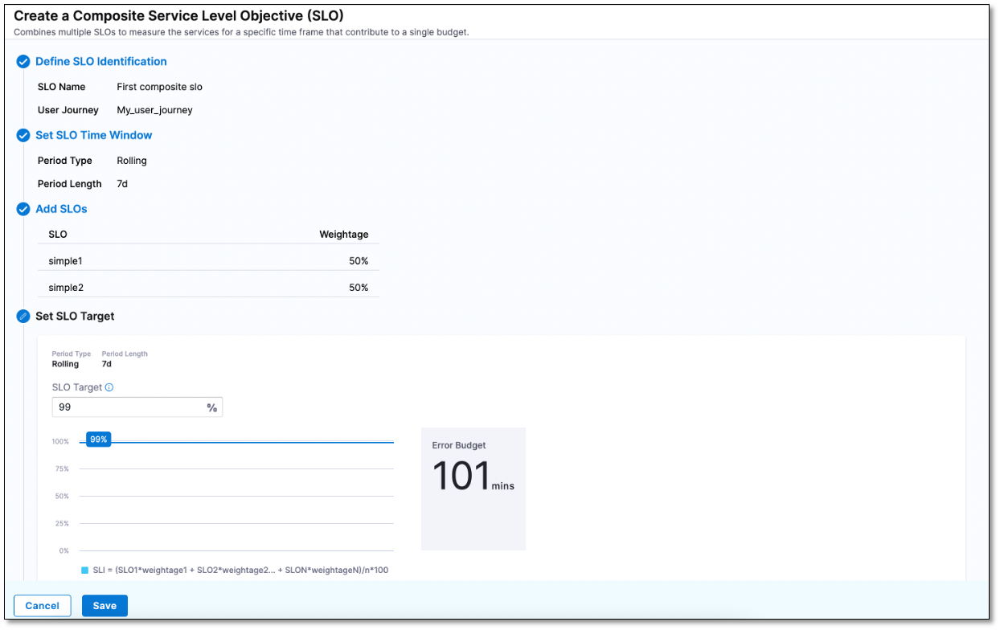

# Composite SLO

A composite SLO is a combination of two or more SLOs that provides a comprehensive view of the overall reliability, performance, and health of the application or service. It allows the creation of SLOs based on user journeys.

Consider this example: traditionally, you would configure one SLO for each microservice. By themselves, individual SLOs do not add up to indicate the overall health of the application. For overall health, you must combine the individual SLOs into a composite SLO.

## Key terminology

Following are the important terms that you should be aware of before creating your first Composite SLO.

### SLO target

A target percentage for the composite SLO over a specified period of time.

### Time window

Period of time in which the composite SLO is being measured. There are two types of time windows:

* Rolling - Measures the compliance from n days ago to now, where n ranges from 1 to 30 days.
* Calendar - Measures compliance periodically. For example, once a week.

### Error budget

The total amount of time that a service can be unreliable before it violates the SLO. An error budget is 1 - Target SLO of the service. For example, if your target SLO of your service is 99.9%, then the error budget is 1 - 99.9% = 0.1%

## Prerequisites

You should have at least two SLOs. The period type and the period length of these SLOs and the composite SLO that you want to create must match.

## Create a composite SLO

You can create a composite SLO at the project or account level. When you create a composite SLO at the account level, you can browse and select SLOs from all the projects that are a part of your account. When you construct a composite SLO at the project level, you can see and choose only the SLOs that are a part of the project.

### Navigate to the Create Composite SLO page

To create a composite SLO at account level  

* Select **Service Reliability** > **SLOs** > **+ Create Composite SLO**. 

    The Create a Composite Service Level Objective (SLO) page appears.

To create a composite SLO at project level

* Select **Service Reliability** > **SLOs** > **+ Create Composite SLO**. 

    The Create a Composite Service Level Objective (SLO) page appears.

The following sections explain how to create a composite SLO.

### Define SLO identification

In the **Define SLO** section, enter the following information and select **Next**:

* **SLO Name**: Enter a name for the composite SLO.
* **Description (Optional):** Select the pencil icon and enter a description for the composite SLO.
* **Tags (Optional)**: Select the pencil icon and assign a tag to the composite SLO. You can assign an existing tag or create a new tag.

  Tags are metadata and they can contain any character. You can use tags to filter composite SLOs. For instance, you tag two different composite SLOs with the same tag, say `myFirstCompositeSLO`. A search for `myFirstCompositeSLO` returns the two composite SLOs that have the tag `myFirstCompositeSLO` attached to them.

* **User Journey**: Select or create a new user journey.

    

### Set an SLO time window

In the **Set SLO Time Window** section, configure the following settings and then select **Next**. 

**SLO time window settings**

| Period Type                                                                            | Period Length                                                                                           |
| :------------------------------------------------------------------------------------- | :------------------------------------------------------------------------------------------------------ |
| **Rolling**: Measures compliance from n days ago to now, where n ranges from 1 to 30 days. | Specify the number of days. For example, 30 days.                                                       |
| **Calendar**: Measures compliance from date to date.                                      | Select a period to measure the composite SLO. The available options are Weekly, Monthly, and Quarterly.   If you select the Weekly or Monthly option, then in the Window Ends dropdown menu, specify when the compliance period should end. For instance:  - Day of the week on which the compliance period should end.  Example: Monday.  - Day of the month on which the compliance period should end.  Example: On the 1st day of the month. |

### Add SLOs

To choose the SLOs that you want to be part of the composite SLO, perform the following steps:

1. In the **Add SLOs** section, select **Add SLOs**.

    A list of SLOs appears.

    
    :::note

    Only SLOs that match the composite SLO in terms of period type and length are listed.
    
    :::

1. Choose the required SLOs from the list, and then select **Add**. You can add up to 20 SLOs to a composite SLO.

    The selected SLOs appear in the **Add SLOs** section.

1. (Optional) Modify the weight of the SLOs. By default, the weights of all SLOs are equal. When you modify a SLO's weight, the weight of the remaining SLOs also automatically changes. Check that the weights of the remaining SLO have been changed automatically before moving on to the next step.

1. Select **Next**.

### Set an SLO target

1. In the **Set SLO Target** section, in the **SLO Target** field, set a target value for the composite SLO, and then select **Next**.

    The SLO target value should be greater than 0 and less than 100. For example, 99.99%.

1. If you wish to configure the error budget policy, then select **Next**. Otherwise, select **Save** to save the settings.

    This completes the composite SLO creation. The composite SLO is added to the SLOs list on the **Service Level Objectives** page.

### Configure error budget policy (optional)

You can implement an error budget policy to notify team members when the composite SLO exceeds a certain threshold. To create an error budget policy: 

1. In the **Error Budget Policy (Optional)** section, select **+ New Notification Rule**.
   
   The New Notification page appears.
2. Enter a name for the notification rule and select **Continue**.

3. In the **Condition** dropdown menu, select an appropriate condition. You can set the following conditions:
    * **Error Budget remaining percentage**: Triggers an alert if the remaining error budget reaches the value that you specify. For example, if you specify a value of 10, an alert is sent when the error budget remaining is 10%
    
    * **Error Budget remaining minutes**: Triggers an alert if the error budget remaining minutes reaches the value that you specify. For example, trigger an alert if the remaining error budget minutes depletes to 500 minutes.
    
    * **Error budget Burn rate is above**: Triggers an alert if the error budget burn rate exceeds the value that you specify. If you select this option, you should also set the **Lookback Duration (min)** value. For example, trigger an alert if more than 10% of the error budget is burnt in the last 800 minutes.

    **Example**

    Suppose you have an SLO of 90% and your allocated error budget is 2160 minutes for a 30 day time period. You want to monitor the consumption and get alerted if one of the following occurs:

    * Error budget percentage reduces to 2%
    * Error budget reaches 863 minutes
    * Error budget burn rate crosses 2%

    
    The condition settings should then look similar to this:

    * Error Budget remaining percentage = 2
    * Error Budget remaining minutes = 863
    * Error Budget Burn Rate above = 2
4. In the **Notification Method** dropdown menu, select an alerting method.

    The following are the available notification methods and their settings:

    * **Slack**: Enter the Slack webhook URL.
    * **Email**: Enter the email addresses to which you want to send the alerts.
    * **PagerDuty**: Enter the PagerDuty key.
    * **Microsoft Teams**: Enter the Microsoft Teams webhook URL. You can add more than one webhook URL by selecting **+ Add**.

    You can send an alert to the user groups that are configured in Harness. To do this:
    
    1. Select the **Select User Group(s)** box. 
    
        The Select User Group(s) page appears. 
    
    2. Select the user groups that you want to alert. You can select user groups that are part of a **Project**, **Organization**, or **Account**.

    To create a new user group:

    1. Select **+ User Group**.
        
        The New User Group dialog appears.

    2. In **Name**, enter a name for the user group.
        
    3. (Optional) In **Description (Optional)**, select the pencil icon and enter a description.
        
    4. (Optional) In **Tags (Optional)**, select the pencil icon and assign a tag. 
        
    5. In **Add Users**, select users.
   
    6. Select **Save**.
        The new user group is added.
  

5. Select **Test** to check whether the alert is working properly.
6. Select **Finish**.

    The notification rule appears in the **Error Budget Policy (optional)** section.

7. Enable the notification rule to begin sending alerts.
8. Select **Save** to save the settings and close the New Notification page.
9.  Select **Continue**.
    
    The composite SLO is created and added to the list of SLOs on the Service Level Objective page.

  
