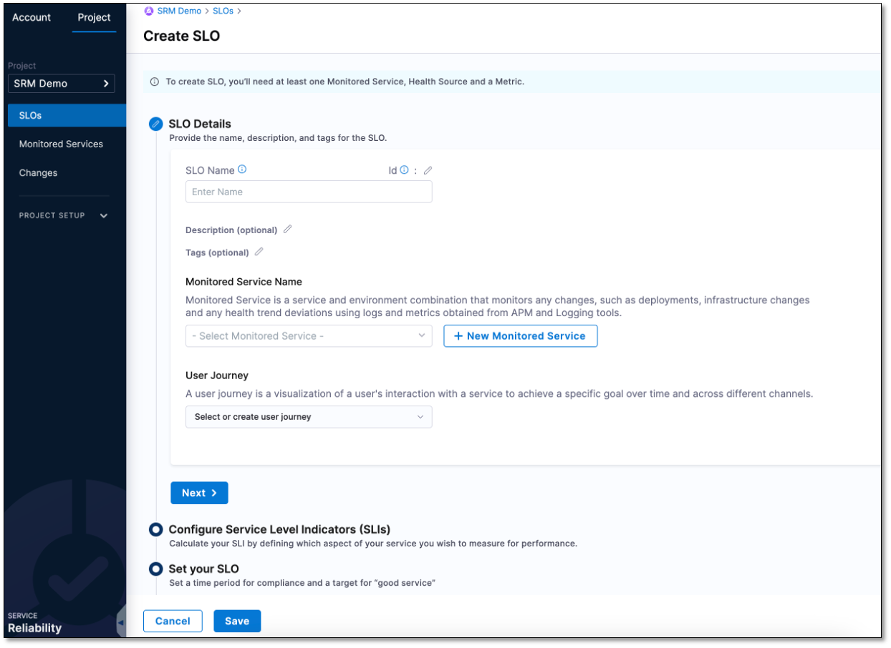
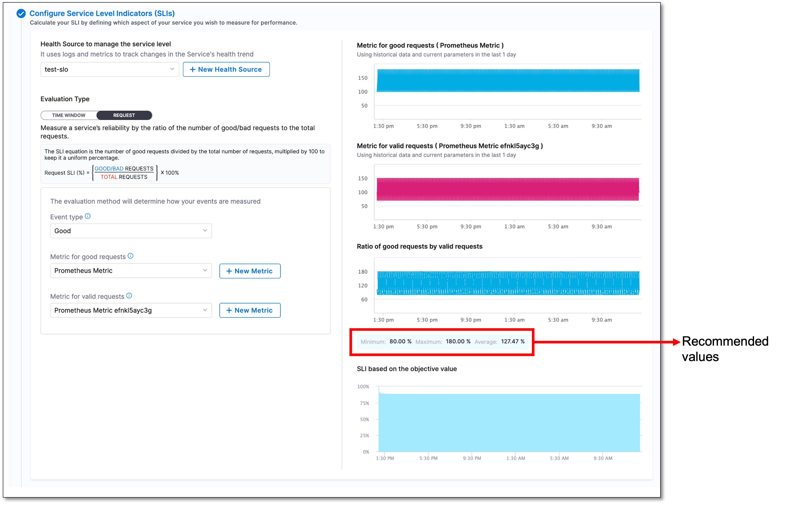

```mdx-code-block
import Tabs from '@theme/Tabs';
import TabItem from '@theme/TabItem';
```

:::info note
Currently, this feature is behind the feature flag `SRM_ENABLE_REQUEST_SLO`. Contact [Harness Support](mailto:support@harness.io) to enable the feature.
:::

A request-based Service Level Objective (SLO) uses a Service Level Indicator (SLI), which calculates the ratio of successful requests to the total number of requests. It tells you how well a service is performing based on the ratio of successful requests to the total number of requests.

Let's say you have a website that allows users to search for products. To measure the SLI, you would track the number of search requests that were completed successfully (example: the user received the search results) and divide it by the total number of search requests made.

For example, if you had 100 search requests and 95 of them returned the expected results, then the SLI would be 95/100 = 0.95 or 95%. This means that 95% of the search requests were successful.


## Prerequisites

- A Harness Delegate. Ensure that you have installed a Harness Delegate that can communicate with Harness, your health source, and change sources. For more information, go to [Get started with delegates](/docs/platform/2_Delegates/install-delegates/overview.md).
  
- An Organization in Harness. If you haven't already created one, go to [Create organizations and projects](/docs/platform/organizations-and-projects/create-an-organization.md).

- A project in Harness. If you haven't already created one, follow these steps.

<details>
<summary><b> Steps to create a project in Harness.</b></summary>

To create a project in Harness, do the following:

1. In Harness, select **Service Reliability** > **Create Project**.
   
2. On the **About the Project** page, do the following, and then select **Save and Continue**: 
   - **Name**: Enter a name for the project.
   - **Color**: Select a color theme for the project.
   - **Organization**: Select an organization for the project. If you don't yet have an organization in Harness, and want to learn how to create one, go to [Create a Harness Org](/docs/platform/organizations-and-projects/create-an-organization.md).
3. On the **Invite Collaborators (Optional)** page, in the **Invite People to Collaborate** field, add team members to the project.
4. In the **Role** field, assign a role to the collaborators.
5. Select **Add**.
6. Select **Save and Continue**.  
   Your project has been created.

</details>


- Health source connector. Ensure that your health source is connected to Harness. The health source can be a monitoring and logging system such as Prometheus. This enables Harness to collect health and performance metrics and monitor your SLO. For more information, go to [Connect to Monitoring and Logging Systems](/docs/platform/Connectors/Monitoring-and-Logging-Systems/connect-to-monitoring-and-logging-systems).

## Create a request-based SLO

To create a request based SLO, do the following:

1. In your Harness project, navigate to the **Service Reliability** module, and then select **SLOs** > **+ Create SLO**.  
   The Create SLO page appears.

   

### Enter SLO details

In the **SLO details** section, do the following:

1. Enter a name for the SLO, an optional **Description**, and a **Tag**. Select a **Monitored Service** and a **User Journey**, and then select **Next**.


### Configure Service Level Indicators (SLIs)

SLIs are tools you use to measure your service's performance. It helps you determine how close or far you are from meeting your SLO so that you can take corrective action if necessary.

In this section, you will configure a request-based SLI for your SLO. A request-based SLI is a measurement that tells you how well a service is performing based on the ratio of successful requests to the total number of requests.

To configure request-based SLIs, do the following:

1. Select a **Health Source to manage the service level**. If you haven't already added a health source, follow these instructions.

<details>
<summary><b> Steps to add a health source.</b></summary>

To add a health source, do the following:

1. Under **Health Source to manage the service level**, select **+ New Health Source**.  
   The Add New Health Source dialog appears.
2. In the **Define Health Source** tab, select your health source. For example, "Prometheus".
3. In the **Health Source Name** field, enter a name for the health source. For instance, "prometheus".
4. Based on the health source you have selected, you may need to select a **Connection Type**. For example, if you have selected Prometheus as health source, you may need to choose either **Prometheus** or **Amazon Web Services** as connection type.
5. Under the **Connect Health Source** section, click the **Select Connector** field.  
   The Create or Select an Existing Connector dialog appears.
6. Choose your health source connector and select **Apply Selected**. For example, "Prometheus".
   
   :::info note
   Depending on the settings you configured when adding the connector to Harness, you may need to choose the connector from the **Project** tab, the **Organization** tab, or the **Account** tab.
   :::

7. Depending on the health source you choose, select either the **Metrics** or **Logs** option from the **Select Feature** field. The **Metric** or **Log** option may be preselected based on the health source you choose. For instance, if you choose **prometheus** as your health source, the **apm** option will be selected by default.
8. Select **Next**.


##### Configure metrics or logs

The configuration settings for health source metrics depend on the selected health source and feature. For instance, if you select **Prometheus** as your health source, you will need to configure following settings.


##### Define a query

To define a query, do the following:

1. In the **Query Specifications and Mapping** section, in the **Group Name** field, select **+ Add New**.  
   The New Prometheus Group Name dialog appears.
   
2. Enter a name for the group, and then select **Submit**. 

3. Expand **Build your Query**, and do the following:
   
   - From the **Prometheus Metric** dropdown list, select a filter for metric.
   - From the **Filter on Environment** dropdown list, select a filter for environment.
   - (Optional) From the **Additional Filter (optional)** dropdown list, select additional filters to add to the service.
   - (Optional) From the **Aggregator (optional)** dropdown list, select an aggregator for the metric.

   Once you select the desired values, a query is automatically generated and a sample metric graph is displayed. This helps to verify that the query has been constructed accurately.


4. Expand **Assign** to assign the metric to the following Harness services:
   
   - SLI
   - Service Health
   - Continuous Verification

5.  After completing the configuration of the health source, select **Submit** to save health source.  
   
   The health source appears in the **Health Source to manage the service level** field.

6.  Select **Next**.

</details>

2. Select the **REQUEST** tab.

3. From the **Event type** dropdown list, select the type of event that you want to measure. The available options are **Good** and **Bad**.

4.  Select a metric from the dropdown list based on the event type you have chosen. The metric dropdown field varies depending on the event type selected. For example, if you have chosen the **Good** event type, you will see the **Metric for good requests** dropdown list, while if you have chosen the **Bad** event type, you will see the **Metric for bad requests** dropdown list.

5. From the **Metric for valid requests** dropdown list, select a metric for the valid requests.

:::info
When configuring SLIs, you will see a metric graph based on the last 24 hours of data received from your health monitoring tool. Additionally, the recommended minimum, maximum, and average values specific to the SLI parameter that you are configuring are also displayed. The metric graphs and accompanying suggested values help you determine the ideal percentage of valid requests for your SLI.
:::



### Set your SLO

To measure a SLO, you need to specify the time duration over which the target value for the SLI is evaluated. For example, if you want to measure the success rate of a web service for a week, you would set the compliance period to seven days. You would also set a target value for the success rate, such as 99%. This means that the service must have a success rate of 99% or higher over the specified period for the SLO to be considered met.

Configure the following settings to determine the compliance time period and target value for your SLO:

1. From the **Period Type** dropdown list, select a period type. The available options are **Rolling** and **Calendar**.

2. Depending on the period type you selected, choose the period length. For example, if you selected **Rolling** as the period type, you should select the number of days for the **Period Length**. If you selected **Calendar** as the period type, you should select the period length as either **Weekly**, **Monthly**, or **Quarterly**.


:::info
The **Rolling period** type calculates the compliance period based on the current time and the length of the period. For example, if you select a rolling period of seven days, the compliance period will always be the last seven days, regardless of the current date.

On the other hand, the **Calendar period** type sets fixed calendar periods for the compliance period, such as weekly, monthly, or quarterly. For example, if you select a monthly period length, the compliance period will always be the entire calendar month, regardless of when the measurement starts.
:::


### Save

Select **Save** to save the settings.  

The request-based SLO appears on the Service Level Objectives (SLOs) page.