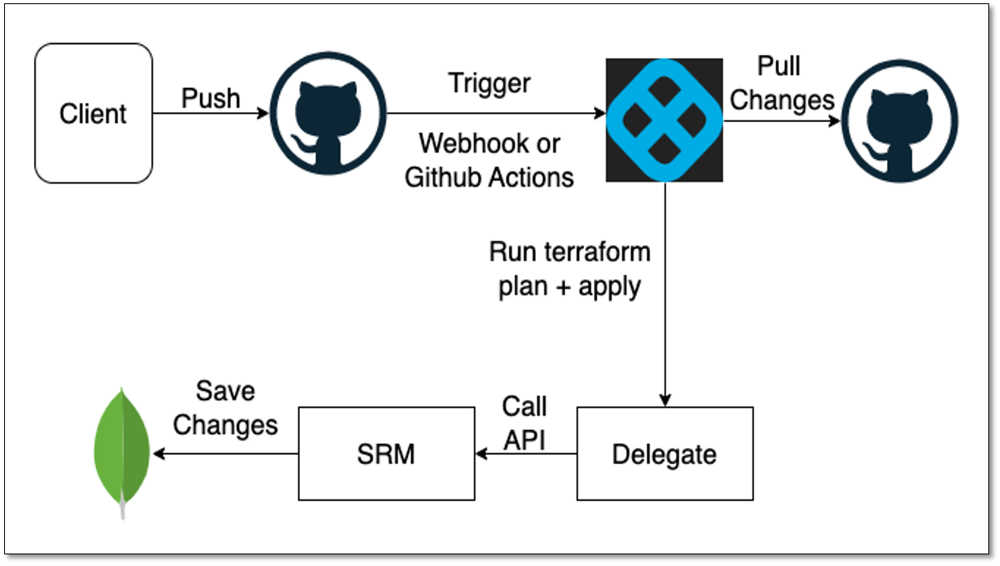

Harness provides tools such as [Git Experience](https://developer.harness.io/docs/platform/git-experience/git-experience-overview/) and Terraform, to help you manage entities using code. 

Using the SLO as code feature of Harness SRM, you can manage Service Level Objectives (SLOs) through code. SRM supports SLO as code for Terraform based entities. This means that the definition of the entity is stored in GitHub using Terraform based files.


## Prerequisites

- A Git repo with at least one branch.​
- A Git connector with a Personal Access Token (PAT) for your Git account.​

The following sections explain how to set up Terraform based entities to manage SLO as code.


## Set up a Git Repository in GitHub

Create a Git repository in GitHub. This repository must include a folder that contains all the necessary Terraform based files for creating a SLO. To see a sample folder that contains all the required entities in Terraform format, go to the [demo repository](https://github.com/deepakchhikara66/demo/tree/harness/harness/slo).

For detailed instructions on how to prepare files required for Terraform setup, go to [Harness Provider on Terraform](https://registry.terraform.io/providers/harness/harness/latest/docs). 


## Set up a Terraform compliant delegate

Set up Harness Delegate to run the Terraform setup for appling the changes.

In your Harness Delegate, run the following commands to install the libraries required for Terraform:

```
set +x
apt-get update
apt-get install wget
apt-get -y install git
wget https://releases.hashicorp.com/terraform/1.3.6/terraform_1.3.6_linux_amd64.zip 
apt-get install unzip
unzip terraform_1.3.6_linux_amd64.zip
cp terraform /usr/bin/
terraform --version
```


## Create a pipeline and add Terraform Plan step

To create a pipeline:

1. In Harness, go to your project > **Deployment** > **Pipelines**, and then select **+ Create a Pipeline**.
2. Add a custom stage.
3. Select **Add Step** and choose **Terraform Plan**.
4. Enter a name for the Terraform Plan
5. Enter a name for the **Provisioner Identifier** and add a **Secret**. 
   You will be asked for this secret when applying the Terraform Plan step.
6. In **Configuration File Repository**, select the GitHub repository that you created.
7. On the **Advanced** tab, select the delegate that you created as the default delegate for Terraform Plan.
8. Select **Apply Changes** to save and add the Terraform Plan step to the pipeline.


## Add Terraform Apply step

To add a Terraform Apply step:
In the custom stage, select **Add Step** and choose **Terraform Apply**.
Enter a name for the Terraform Apply step, select **Configuration Type**, and **Provisioner Identifier**.
In **Configuration File Repository**, select the GitHub repository that you created.
On the **Advanced** tab, select the delegate that you created as the default delegate for Terraform Plan.
Select **Apply Changes** to save and add the Terraform Plan step to the pipeline.

## Create a webhook trigger
To learn how to create a webhook trigger, go to [Trigger Deployments using Custom Triggers](https://developer.harness.io/docs/platform/triggers/trigger-deployments-using-custom-triggers/).


## Add a webhook to the GitHub repository

To add a webhook URL to a GitHub repository:

1. In your GitHub repository go to settings > webhooks.
2. Add a new webhook and paste the payload URL from that you copied in step 1.
3. Paste the secret created while setting up the trigger.
4. Select the event as **Just the push event** to trigger the webhook.
5. Save the webhook.
 

## Push changes to the repository

Push your changes to the GitHub repository to trigger a workflow for the pipeline. During the pipeline run, the Terraform Plan step fetches changes from GitHub and applies them to all updated entities. The changes can be creating a new entity, updating an existing entity, or deleting an existing entity. During the pipeline run, the Terraform Plan step fetches the latest changes from the repository and generates a plan for updating the infrastructure. The plan may include creating a new entity, updating an existing entity, or deleting an existing entity. 



