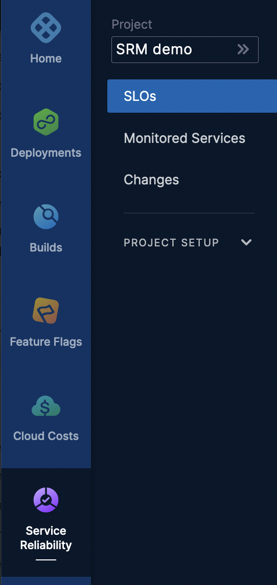
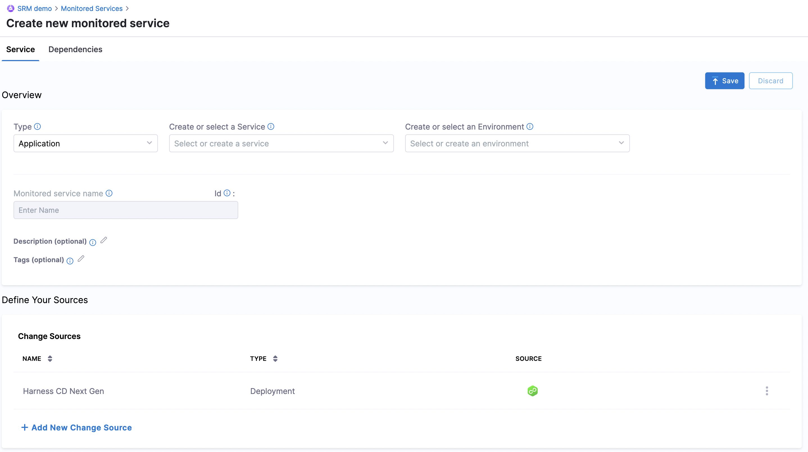
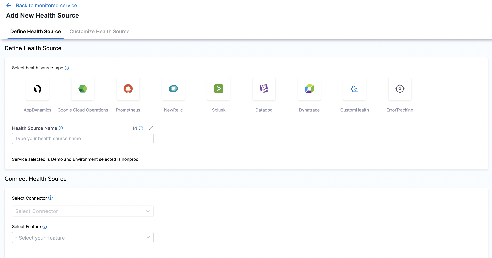
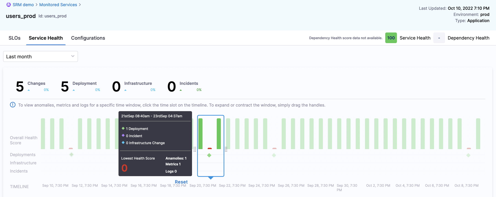
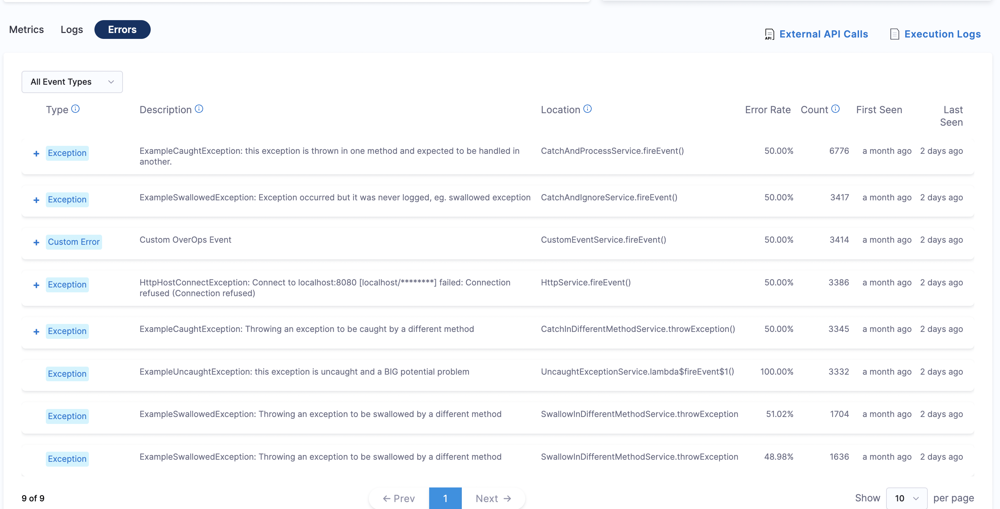
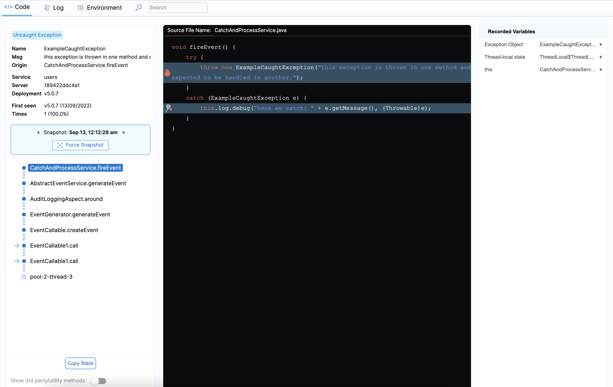

Error Tracking in the Harness [Service Reliability Management (SRM)](../../howtos-service-reliability-management/service-reliability-management-basics.md#sort=relevancy&f:@commonsource=[NextGen%20Docs]) module is a continuous reliability solution that enables you to identify, triage, and resolve errors in your Service. This helps to implement rapid code changes by ensuring that the code is always in a deployable state.

This topic walks you through the steps to add an Error Tracking Health Source in SRM to identify and detect errors in your Service.

### Why Do You Need Error Tracking?

As release velocity increases so does the risk to code quality. Using Harness Error Tracking you can:

* Identify and detect critical issues during each release, such as errors and slowdowns.
* Get to the root of errors and exceptions in production and staging environments.
* Get code-level visibility into your Java applications in testing and production.
* Automate issue root-cause analysis at runtime, eliminating the need to scan logs to identify critical errors.
* Analyze and determine the root cause of detected issues using the [Automated Root Cause (ARC)](error-tracking-in-srm.md#step-3-view-automated-root-cause-arc-screen) screen.
* Reduce mean time to resolution.

### Prerequisites

The Harness Error Tracking Agent is installed on a Java application to capture application code and variables.

**You must install an Error Tracking Agent to use Harness Error Tracking for your application or Service.**

Review the following to make sure that you have met the requirements to use Harness Error Tracking:

* [Compatibility and Requirements](install-the-error-tracking-agent.md#compatibility-and-requirements).
* [Install an Error Tracking Agent](install-the-error-tracking-agent.md).

### Step 1: Add a Monitored Service

In the Harness Project with the Service, you want to monitor, navigate to the **Service Reliability Management** module.

Click **Monitored Services.**

Click **New Monitored Service**. The **Create new monitored service** settings appear.

In **Overview**, **Application** is selected by default in the **Type** field. In **Create or select a Service**, choose the Harness Service to be monitored from the list. Click **Add New** to create a new Service. A Service represents your microservices and other workloads.

In **Create or select an Environment**, choose the Environment where the Harness Service is deployed from the list. Click **Add New** to create a new Environment. Environment represents your deployment targets logically (QA, Prod, etc).

The **Monitored Service Name** field auto-populates the concatenation of the Service and Environment names.

Click **Save**.

### Step 2: Add a Health Source

Click **Add New Health Source** in the **Add New Monitored Service** settings.

The **Add New Health Source** settings appear.

In **Select Health Source type**, select Error Tracking.

In **Health Source Name**, enter a name for the Health Source.

Click **Select Connector**. In the **Connector** settings, you can select an existing Connector or click **New Connector**. Harness uses Connectors to authenticate and perform operations with third-party tools. Connectors contain the information necessary to integrate and work with 3rd party tools. For more details, see [Connectors](/docs/category/connectors).

Click **New Connector**.

In **Name**, enter a name for the Connector. For example Quickstart.

Click **Continue**.

In **URL**, enter the URL needed for Error Tracking. For example, https://qa.harness.io/prod1/et for prod1.

In **Encrypted Key**, click **Create or Select a Secret**. You can either select an existing API Key or create a new Secret by clicking **New Secret Text**. Harness includes a built-in Secret Management feature that enables you to store encrypted secrets, such as access keys, and use them in your Harness Connectors and Pipelines. You can choose to use your own secrets management solution, or the built-in Harness Secrets Manager.  For more details, see [Secret Management Overview](../../../platform/6_Security/1-harness-secret-manager-overview.md#sort=relevancy&f:@commonsource=[NextGen%20Docs]).

Click **New Secret Text**.

In **Secret Name**, enter a name for the encrypted text.

In **Secret Value**, enter a value for the encrypted text. You can [create](../../../platform/4_Role-Based-Access-Control/7-add-and-manage-api-keys.md#create-personal-access-token) and [generate](../../../platform/4_Role-Based-Access-Control/7-add-and-manage-api-keys.md#generate-personal-access-token) an API Token from your user profile that allows you to make authorized API calls to Harness.

Click **Apply Selected**. The Connector is added to the Health Source.

Click **Next**.

### Step 3: Setup Delegates

The Harness Delegate is a service you run in your own environment, such as your local network, VPC, or cluster. The Delegate connects all of your artifact, infrastructure, collaboration, verification, and other providers with the Harness Manager. For more details, see [Delegates](/docs/category/delegates).

In **Delegates Setup**, you can either select **Connect via any available Delegate** or **Connect only via Delegates with all of the following tags** and choose an option from the list.

Click **Save and Continue**.

Once the verification is complete, click **Finish**.

The newly added Health Source is now listed under Health Sources.

Click **Save** to save this configuration.

### Step 4: Install an Error Tracking Agent

The Harness Error Tracking Agent is installed on a Java application to capture application code and variables. You must install an Error Tracking Agent to use Harness Error Tracking for your application or Service.

See [Install an Error Tracking Agent](install-the-error-tracking-agent.md).

### Step 5: View Automated Root Cause (ARC) Screen

Once the Error Tracking Health Source is added, you can view the identified errors on the **Overall Health Score** timeline, in the [Service Health dashboard](../../howtos-service-reliability-management/change-impact-analysis-quickstart.md#step-4-view-service-health).

1. Scroll up on the **Service Health** dashboard and then click the **Errors** tab. A list of all the identified errors appears.

  

2. Click any listed error to access the **Automated Root Cause** (ARC) screen. The ARC screen offers a powerful mechanism to get to the root of errors and exceptions in production and staging environments.

  

  The ARC screen provides the following details:

    * Origin of the error and the error message it throws.

    * Date on which the error was first identified and the number of times it appeared.

    * **Code** tab displays the complete stack trace and associated source code, causing the issue.

    * Highlights the line of code in the source code where the error occurred.

    * **Recorded Variables** displays the complete variable state from the moment the error occurred.

    * **Log** tab displays the log statements.

    * **Environment** tab displays the internal environment state at the moment when the error occurred, including memory usage (heap and non-heap), basic system information, CPU usage, and more.
