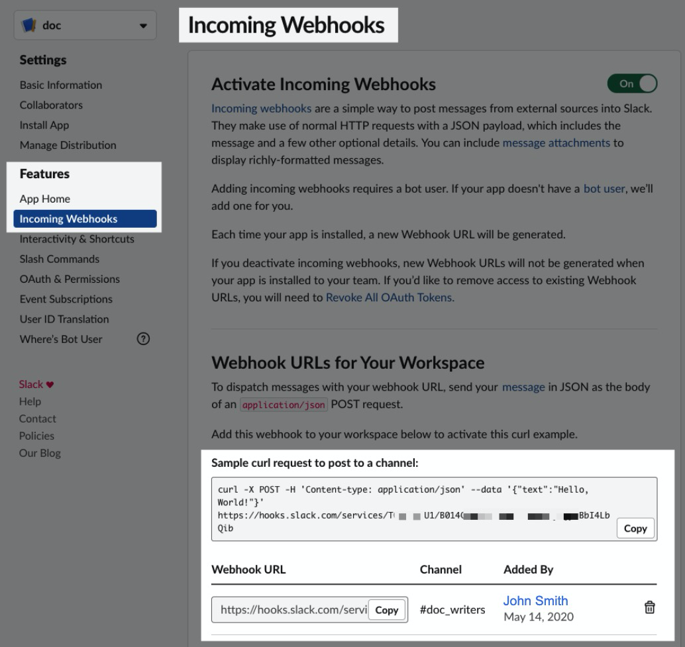
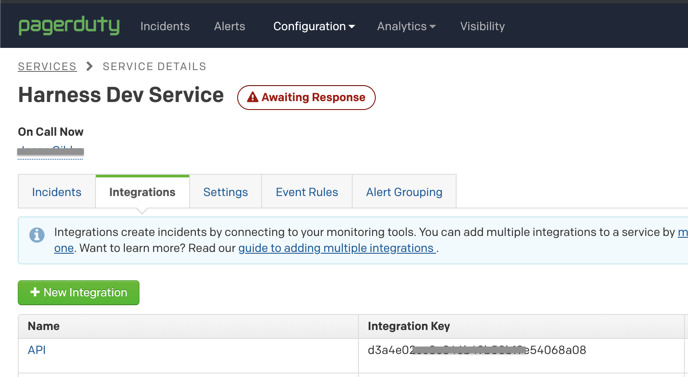

You can set notifications on Service Reliability Management (SRM) monitored services and Service Level Objectives (SLOs) and notify your team of changes to a Service's code, configuration, behavior, deployment, and infrastructure.

### Before You Begin

* [SLO Management Quickstart](../../howtos-service-reliability-management/slo-management-quickstart.md)
* [Service Reliability Management Basics](../../howtos-service-reliability-management/service-reliability-management-basics.md)

### Limitations

Currently, Service Reliability Management notifications support the following methods:

* Slack
* Email
* PagerDuty
* Microsoft Teams

### Step 1: Create Notification

You can create notifications for Monitored Services or SLOs.

First, ensure that you have a Monitored Service or SLO set up. 

See [SLO Management Quickstart](../../howtos-service-reliability-management/slo-management-quickstart.md).

<!-- 
Commenting out b/c the following link is causing build errors:
- On source page path = /docs/service-reliability-management/use-service-reliability-management/srm-notifications/:
   -> linking to ../continuous-delivery/onboard-cd/cd-quickstarts/ssh-ng.md (resolved as: /docs/service-reliability-management/use-service-reliability-management/continuous-delivery/onboard-cd/cd-quickstarts/ssh-ng.md)

-->

#### Monitored Services

Next, in **Service Reliability**, click **Monitored Services**.

Click a Service, and then, in the Service, click **Configurations**.

Click **New Notification Rule**.

The new rule settings appear.

Name the rule and click **Continue**.

#### SLOs

Next, in **Service Reliability**, click **SLOs**.

Click an SLO, and then, in the SLO, click **Configurations**.

Click **SLO Target & Error Budget Policy**, and then click **New Notification Rule**.

### Step 2: Notification Conditions

You can set up notification conditions to only notify team members when there is a specific type of change.

#### Monitored Services

In **Conditions**, select one or more of the following.

When you select multiple conditions, an OR operator appears. OR means a notification is sent when any of the conditions are met.

When you are done, click **Continue**.

##### Change Impact

Select a change type (Deployment, Infrastructure, Incident), health score threshold, and Duration.

##### Health Score

Select a threshold and duration.

##### Change Observed

Select a change type (Deployment, Infrastructure, Incident).

#### SLOs

In Conditions, select one or more of the following.

When you select multiple conditions, an OR operator appears. OR means a notification is sent when any of the conditions are met.

##### Error Budget remaining percentage

Enter the remaining Error Budget percentage.

The percentages are categorized like this:

* **Healthy** - Number of SLOs for which the remaining Error Budget is above 75%.

* **Observe** - Number of SLOs for which the remaining Error Budget is greater than 50% but less than 75%.

* **Need** **Attention** - Number of SLOs for which the remaining Error Budget is greater than 25% but less than 50%.

* **Unhealthy** - Number of SLOs for which the remaining Error Budget is between 0 to 25%.

* **Exhausted** - Number of SLOs for which the remaining Error Budget is zero or less than zero.

##### Error Budget remaining minutes

Enter the remaining Error Budget minutes.

Error Budget remaining minutes are calculated as below:

*Error Budget Remaining = Total Error Budget - Number of Bad Minutes.*

##### Error Budget Burn Rate is above

A Burn Rate is the rate at which the Error Budget is being consumed.

Enter a baseline Burn Rate percentage.

### Option: Slack

For Slack notifications, you simply create a webhook in Slack and paste it into the **Slack Webhook URL** setting in the Notification Rule.

Follow the steps in Slack documentation for creating a Slack app, selecting your channel, and creating a webhook: [Sending messages using Incoming Webhooks](https://api.slack.com/messaging/webhooks).

When you are done, you'll have a webhook that looks something like this:

Copy the webhook.

Paste the Webhook into **Slack Webhook URL**.

### Option: Email

For email notifications, simply type in the email addresses that you want to notify.

Enter multiple addresses as a comma-separated list. For example, `john.doe@example.io,qateam@example.io`.

### Option: PagerDuty

For PagerDuty notifications, enter the key for a PagerDuty Account/Service to which Harness can send notifications.

You can copy/paste this key from PagerDuty's **Configuration** > **Services** > **Service Details** dialog > **Integrations** tab, as shown below.

For details, see PagerDuty's documentation on [Creating Integrations](https://support.pagerduty.com/docs/services-and-integrations).

### Option: Microsoft Teams

For Microsoft Teams notifications, you enter in the Webhook URL for your Microsoft Teams Channel in **Microsoft Teams Webhook URL**.

You create a channel connector in Microsoft Teams to generate the Webhook Harness needs for notification.

In Microsoft Teams, right-click the channel where you want to send notifications, and select **Connectors**.

In **Connectors**, locate **Incoming Webhook**, and click **Configure**.

In **Incoming Webhook**, enter a name, such as **Harness**.

Right-click and save the Harness icon from here:

Click **Upload Image** and add the Harness icon you downloaded.

Next, you'll create the Webhook URL needed by Harness.

In your Microsoft Teams Connector, click **Create**. The Webhook URL is generated.

Click the copy button to copy the Webhook URL, and then click **Done**.

The channel indicates that the Connector was set up.

In Harness, in **Notification Method** settings, enter the Webhook URL for your Microsoft Teams Channel in **Microsoft Teams Webhook URL**.
