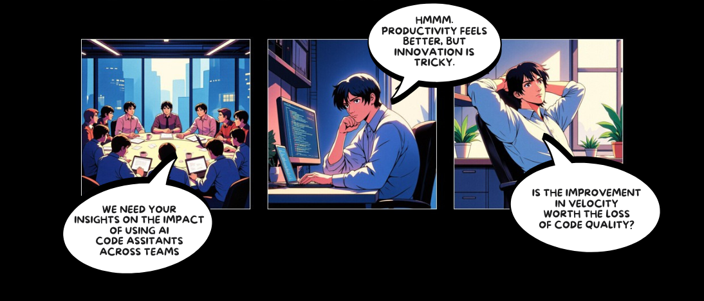
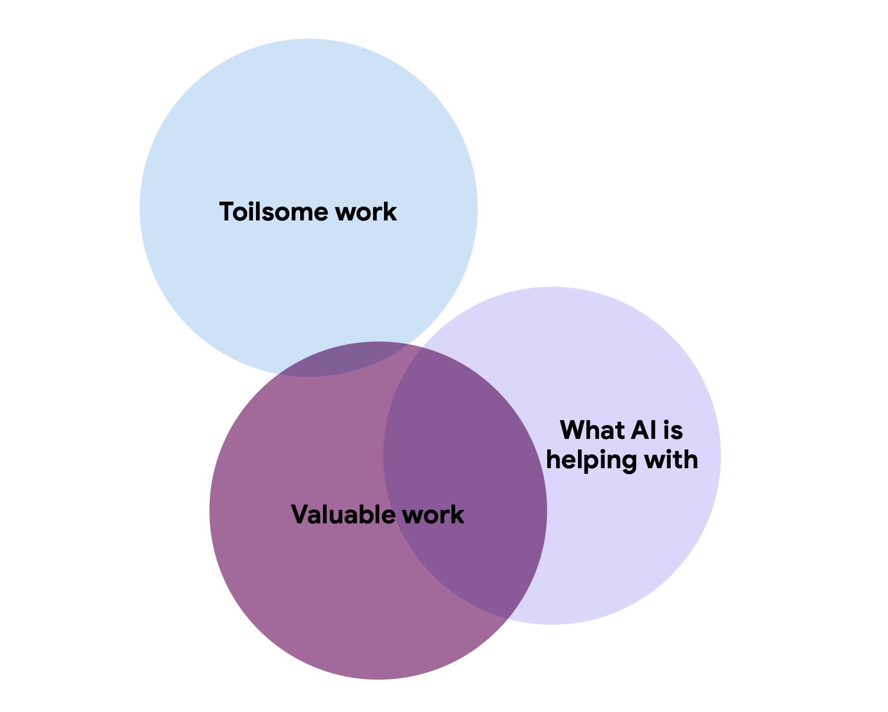
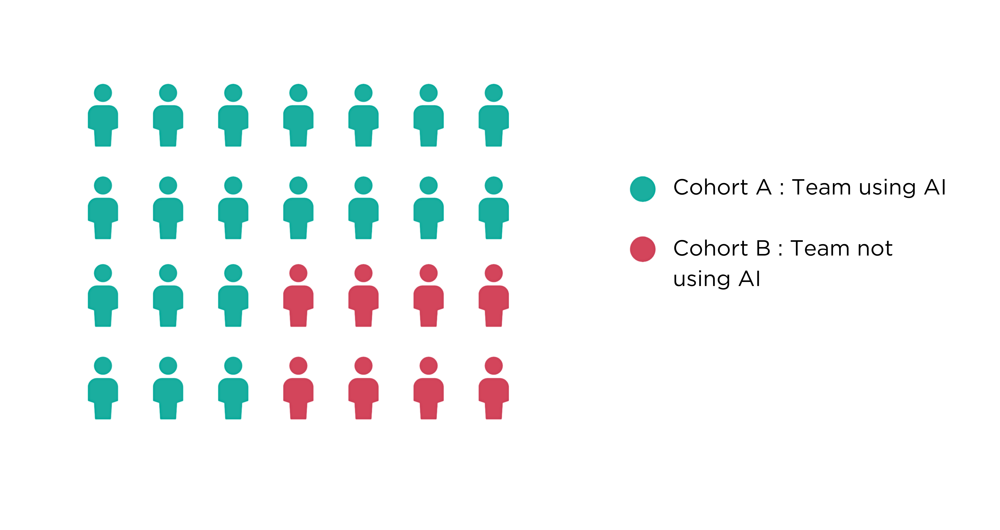

AI-powered productivity tools help development teams by automating repetitive coding tasks and assisting with code generation. However, measuring the impact of these tools on productivity is still a challenge for many organizations.
Harness Software Engineering Insights provides AI Productivity Insights, offering a set of data-driven metrics and reports to help evaluate how AI tools affect development team performance.

## The why & how of measuring AI productivity

As more engineering teams adopt AI tools, it becomes important to track the impact before and after implementation.
AI code assistants do more than generate code—they can influence development speed, code quality, and the overall developer experience.
Their usage also introduces changes to the traditional development process and team dynamics.

Research, such as the findings in the [DORA Accelerate State of DevOps report](https://cloud.google.com/devops/state-of-devops), suggests that AI adoption can lead to notable improvements, including:

* 7.5% increase in documentation quality
* 3.4% increase in code quality
* 3.1% improvement in code review speed
* 1.8% decrease in code complexity

These improvements indicate that AI helps reduce bottlenecks in code review and approval processes while enhancing documentation and codebase quality. However, the report also highlights concerns around over-reliance on AI, suggesting that faster reviews and approvals may not always guarantee better processes. Harness SEI helps organizations navigate these challenges by providing objective AI productivity insights.

Harness AI Productivity Insights offers two types of analysis to help track and measure AI adoption impact:

* [Sentiment Analysis](/docs/software-engineering-insights/ai-productivity-insights/sentiment-analysis)
* [Sentiment & Qualitative Analysis](/docs/software-engineering-insights/ai-productivity-insights/sentiment-and-qualitative-analysis)

The choice of analysis depends on your organization's AI adoption stage and the level of detail required in measuring AI productivity.

## Key concepts

### Sentiment analysis

[Sentiment analysis](/docs/software-engineering-insights/ai-productivity-insights/sentiment-analysis) focuses on understanding how developers feel about using AI code assistants. It helps capture feedback on aspects such as ease of use, satisfaction, productivity, and innovation.
This method relies on surveys to gather opinions and track developer sentiment across various areas like efficiency and overall experience.

### Sentiment & qualitative analysis

This [report](/docs/software-engineering-insights/ai-productivity-insights/sentiment-and-qualitative-analysis) tracks how AI code assistants affect software teams by analyzing both hard metrics (like code quality and delivery speed) and developer feedback. Integrated with source code systems, it answers one question: *Does AI actually help teams ship better software faster?*

With SCM integrations, this approach provides a detailed report on how AI tools impact team performance. It measures productivity improvements, evaluates code quality, and gathers feedback on AI usage.
By combining both qualitative data and sentiment analysis, organizations can gain a clearer picture of benefits and challenges with AI adoption.

### Cohorts

Cohorts are just groups we compare to see how AI tools affect teams. Every report requires you to create two cohorts i.e. split teams into two clear groups:

* Group A: Teams using AI code assistants
* Group B: Teams not using AI

By comparing these groups side-by-side, we measure what actually changes when teams adopt AI.

## See also

* [Generate the sentiment analysis report](/docs/software-engineering-insights/ai-productivity-insights/sentiment-analysis)
* [Generate the sentiment & qualitative analysis report](/docs/software-engineering-insights/ai-productivity-insights/sentiment-and-qualitative-analysis)
* [AI Insights (Dashboards)](/docs/software-engineering-insights/ai-productivity-insights/dashboards/ai-overview-dashboard)