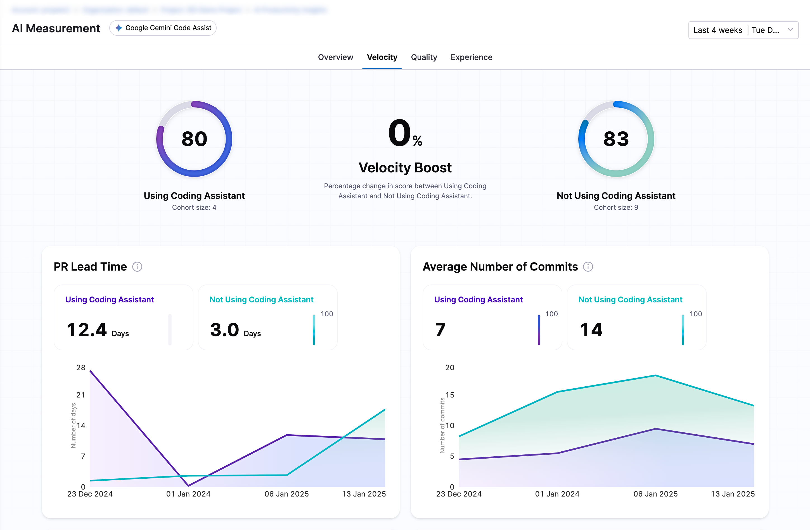
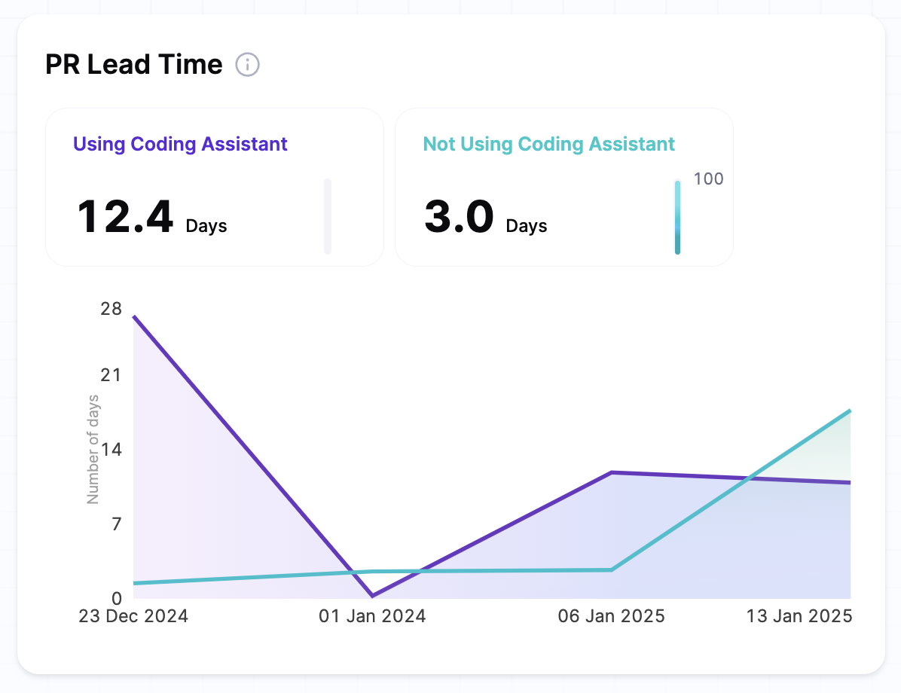
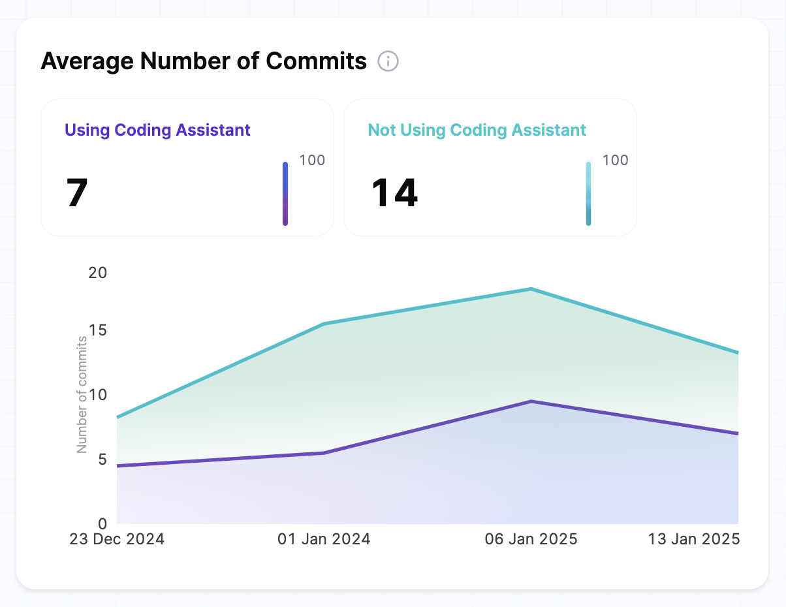

The AI Insights velocity dashboard presents a side-by-side comparison of velocity between teams using AI and those not using AI. It provides a detailed view of your development team’s speed and efficiency, helping you track progress across key metrics such as PR Lead Time, commit frequency, and code volume.

### Velocity metrics

* **PR Lead Time:** Measures the time taken from opening a pull request to merging it. A shorter PR lead time indicates faster code review and integration, leading to quicker feature delivery and fewer bottlenecks.
* **Commit Frequency:** Tracks how often developers commit code. Higher commit frequency suggests an active development cycle, enabling incremental progress and quicker identification of issues.
* **Code Volume:** Evaluates the amount of code added, modified, or removed. Monitoring code volume helps understand workload distribution and identify trends in development activity.



## Velocity boost

The Velocity Boost represents the percentage change in the overall velocity score when comparing teams using AI coding assistants versus those who aren't. This metric helps quantify the productivity improvement AI tools bring to your development process.

Velocity Boost is calculated by comparing the average velocity scores between two cohorts:

* **Cohort A:** Developers not using AI tools.
* **Cohort B:** Developers using AI tools.

The Velocity Score is derived from the weighted average of the following five metrics:

* PR Lead Time
* Average Commits
* Average PRs Created
* Average PRs Merged
* Average New Lines

The five metrics listed above play a key role in determining a team’s overall velocity score. Each metric reflects a different aspect of productivity, and their combined insights help measure the overall impact of AI tools on the development process.

## PR lead time

This metric measures the average time for a Pull Request from creation to merge.
Shorter lead times indicate more efficient workflows, enabling teams to deliver code faster and minimize bottlenecks. For example, teams using AI tools is expected to experience significantly reduced lead times, reflecting the enhanced productivity and support provided by AI-powered coding assistants.

The widget displays the current averages for both the cohorts i.e. teams using AI tools compared to those not using them. 
It also includes trend lines that show daily changes in lead time over the specified time period, in terms of number of days taken to complete a PR.



### Scoring & calculation

For each cohort (e.g., teams using AI tools versus those not using AI tools), PR Lead Time is calculated by averaging the time taken for all PRs merged within a specific time period. 

The formula for calculating the **Average PR lead time** in this case follows these steps:

If calculating the **average PR lead time per week**, the formula is:

$$
\text{Average PR Lead Time per Week} = \frac{\sum (\text{PR Lead Time per Week})}{\text{Number of Weeks in the selected time period}}
$$
  
* **PR lead time per week** = The average lead time for all PRs merged within a specific week.  
* **Number of weeks in the selected time period** = The count of complete weeks within the selected period.

**Example Calculation (Weekly):**  
Given the following weekly data:

| Week  | PRs Merged | PR Lead Time (Avg per Week) |
|-------|------------|----------------------------|
| Week 4 (Jan 22-28) | 3          | 4 days                         |
| Week 5 (Jan 29-5)  | 4          | 5 days                         |
| Week 6 (Feb 6-12)  | 5          | 6 days                         |

The average PR lead time is calculated as:

```ssh
Average PR lead time = 15 days / 3 weeks = 5 days per week
```

### How to interpret

#### Comparison between AI vs Non-AI Assistants

* If teams using AI tools have significantly shorter PR lead times, this suggests that AI-assisted development may be contributing to more efficient workflows, reducing bottlenecks in the review and merge process.
* If teams without AI assistants have shorter lead times, it may indicate that:
  * Developers using AI-generated code are spending more time reviewing and iterating before submitting a PR.
  * The AI-generated code is complex or error-prone, requiring more time to resolve before merging.

#### Productivity trends over time

* If the lead time for AI-assisted teams continues to decrease over time, it may suggest that the AI tools are becoming more effective in supporting faster development cycles.
* A increasing trend in lead time for AI-assisted teams may indicate challenges with AI-generated code quality or integration with existing workflows, potentially slowing down the PR process.

#### Impact of AI on PR review efficiency

Shorter PR lead times indicate quicker feedback loops, improving overall development efficiency.
However, it's essential to consider factors such as the complexity of the PRs, review quality, and team collaboration practices. If AI-assisted developers have shorter PR lead times but encounter more revisions, it may suggest that while the tool supports faster submissions, the code quality might not be as polished, requiring additional review cycles.

## Average number of commits

The average number of commits measures the average number of code commits made by each developer during a specific period. This metric provides insights into development activity and contribution frequency over time.

The velocity dashboard presents this metric using trend lines that compare the commit activity of teams using AI coding assistants versus those who are not. The Y-axis displays the volume of commits, allowing you to track patterns and fluctuations in activity across the monitored period.



### Scoring & calculation

This metric is derived using the following formula:

$$
\text{Average Commits (Weekly)} = \frac{\text{Total Number of Commits in the Week}}{\text{Number of Developers in the Cohort}}
$$

* **Total number of commits in the week**: The sum of all commits made by the cohort during the week.
* **Number of developers in the cohort**: The total number of active developers in the cohort during the same week.

$$
\text{Average Commits (Overall)} = \frac{\sum \left( \text{Average Commits for Each Week} \right)}{\text{Number of Weeks}}
$$

* **Sum of average commits for each week**: The total of weekly averages calculated for each week.
* **Number of weeks**: The total number of weeks in the selected period.

### How to interpret

A higher commit frequency often indicates a more active and engaged development team. Stable or increasing trends suggest consistent productivity and effective workflows. Teams using AI tools may show variations in commit patterns, as AI-assisted coding can lead to more consolidated or optimized commits.

However, the focus should not solely be on the number of commits. Consistency and the context of the commits, such as their impact on the codebase and alignment with sprint goals, are equally important.

## Average number of PRs

This metric measures the productivity of developers by calculating the average number of pull requests (PRs) created by each developer in a cohort during a specific time period. This metric helps you analyze developer efficiency by tracking how frequently developers are submitting code changes for review. By comparing PR trends across cohorts — those using AI coding assistants versus those who are not — organizations can evaluate whether AI tools contribute to increased code submissions, faster development cycles, and improved collaboration.

### Scoring & calculation

This metric is calculated on a weekly basis and aggregated over the total number of weeks for comparative analysis.

```math
\text{Average PRs per Week} = \frac{\text{Total Number of PRs in Week}}{\text{Number of Developers in Cohort}}
```

* Total number of PRs: Total pull requests submitted by the cohort in a given week.
* Number of developers: Count of active developers in the cohort during the period.

### How to interpret

#### Comparison between AI vs Non AI assistants

* If developers using AI code assistants have a higher average number of PRs per week, this suggests that AI-assisted coding helps improve developer efficiency.
* If developers without AI assistants have a higher PR rate, it may indicate that:
  * The AI-generated code requires more review and iteration.
  * Developers using AI assistants are less confident in pushing changes into a pull request for peer review compared to developers not using AI.

#### Productivity trends over time

* If the gap between AI-assisted and non-AI-assisted developers is increasing, it may suggest that AI tools are becoming more effective over time.
* A converging trend may indicate that AI assistance is helpful but does not drastically change the overall number of PRs per developer.

#### Impact of AI on PR quality

More PRs does not always mean better productivity — factors such as PR size, review times, and merge rates should also be considered.
If AI-assisted developers submit fewer but higher - quality PRs, it could mean that AI is helping streamline workflows but reducing unnecessary or fragmented PRs.

## Average number of merges

This metric measures the average number of pull request (PR) merges per developer for each cohort over a specific time period. It helps track how frequently code changes are merged into the main codebase, reflecting the team's ability to review and integrate changes.

### Scoring & calculation

#### Average number of merges (per developer in cohort per week)

```math
\text{Average Merges per Week per Developer} = \frac{\text{Total Number of PR Merges in Week}}{\text{Number of Developers in Cohort}}
```

#### Average merges per week per developer (Overall)

$$
\text{Average Merges per Week per Developer (Overall)} = \frac{\sum \left( \text{Average Merges for Each Week} \right)}{\text{Number of Weeks}}
$$

### How to interpret

#### Comparison between AI vs Non AI assistants

* If developers using AI tools have a higher average number of merges per week, it suggests that AI-assisted development is enabling faster integration of code, helping teams move quicker through the review and merge process.
* If developers without AI tools have a higher average number of merges, it could indicate that the AI-generated code requires more iterations or review cycles before merging, slowing down the process.

#### Impact of AI on merge frequency

A higher number of merges typically indicates an efficient workflow, but it's important to consider whether AI is helping developers merge smaller, high-quality changes more often or if developers are merging more frequently due to better code generation, resulting in fewer revisions.

## Average new lines

This metric measures the average number of new lines of code added to the codebase by each developer in a cohort over a specific period. It tracks the volume of new code being written by the team, indicating how much new functionality or changes are being contributed to the codebase.

### Scoring & calculation

#### Average number of new lines (per developer in cohort per week)

```ssh
Average new lines per week per developer = Number of developers in cohort / Total number of new lines in week
```

#### Average new lines per week per developer

```ssh
(Sum of average new lines for each week) / (Number of weeks)
```

### How to interpret

#### Comparison between AI vs Non-AI assistants

* An increasing number of new lines for AI-assisted teams shows that AI tools are accelerating code development.
* If non-AI developers add more new lines, it could suggest AI-generated code is more efficient, or that AI developers are making smaller, iterative changes that require fewer new lines.

#### Impact of AI on code contributions

More new lines typically mean more development, but it’s important to understand whether using AI code assistants are adding quality code with fewer lines, or simply increasing code volume without improving the overall code quality.