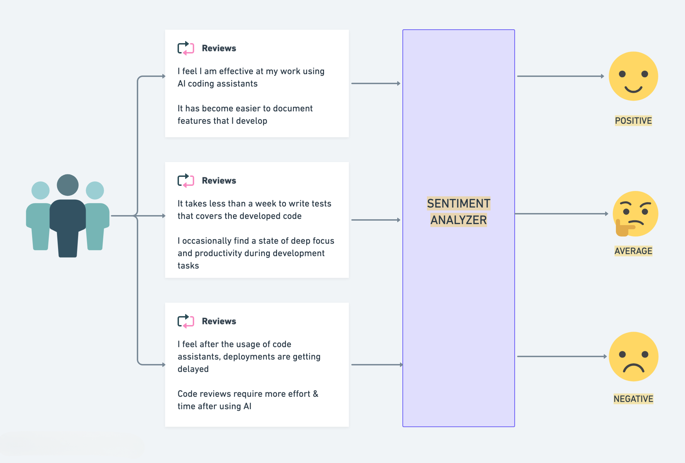
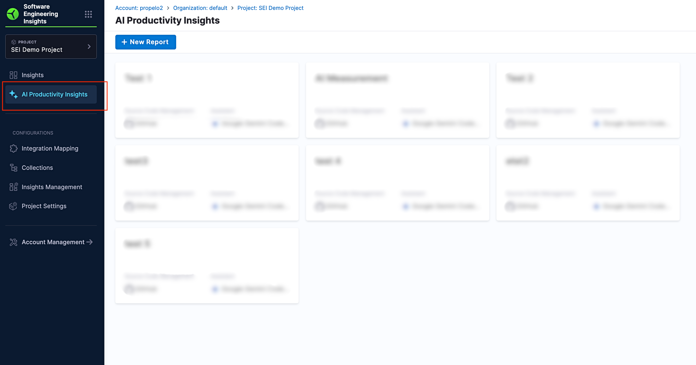
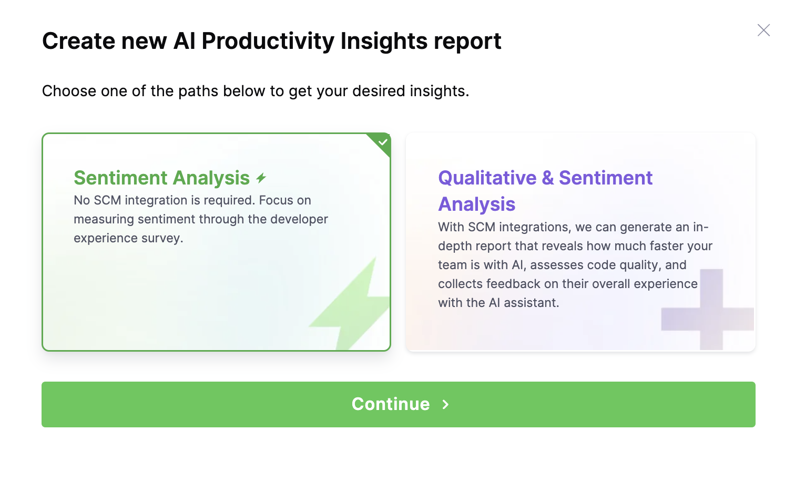
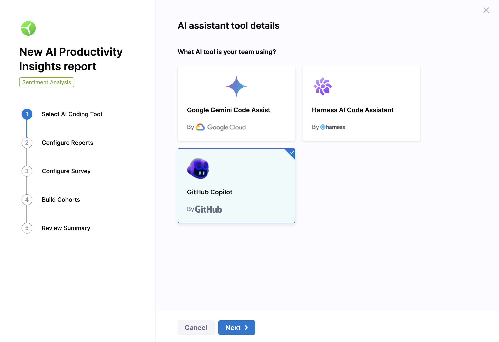
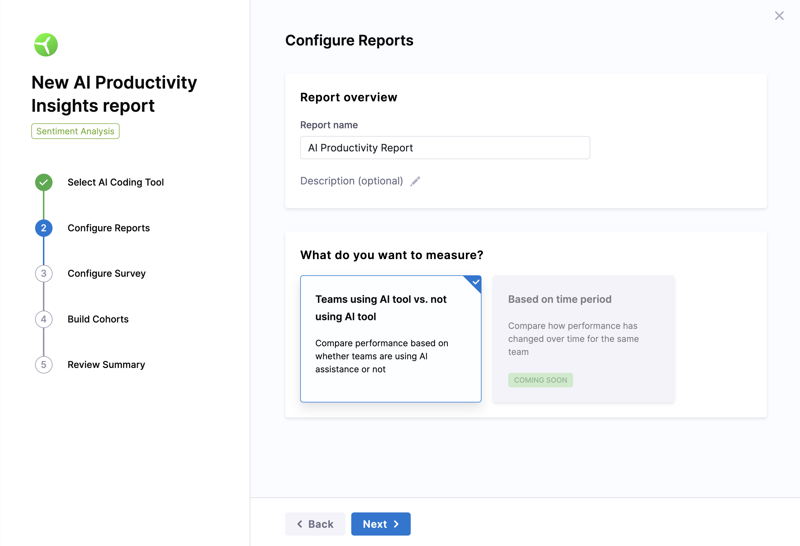
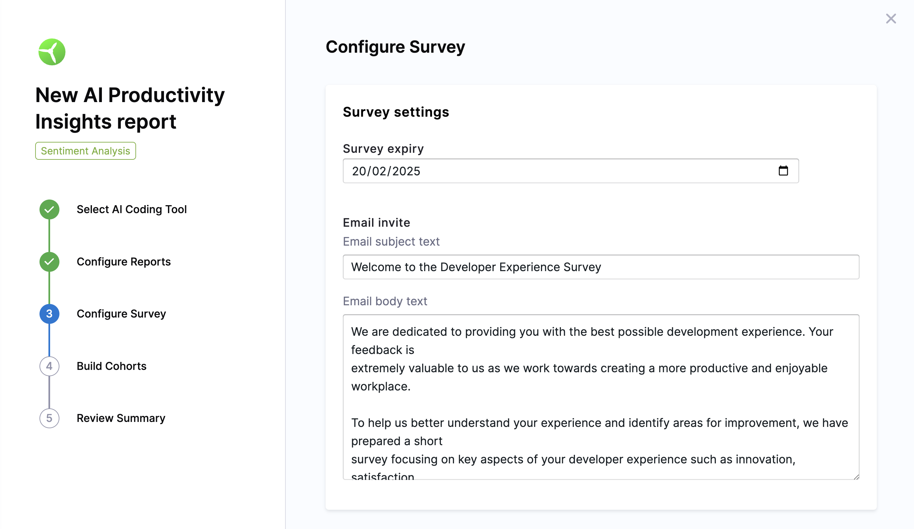
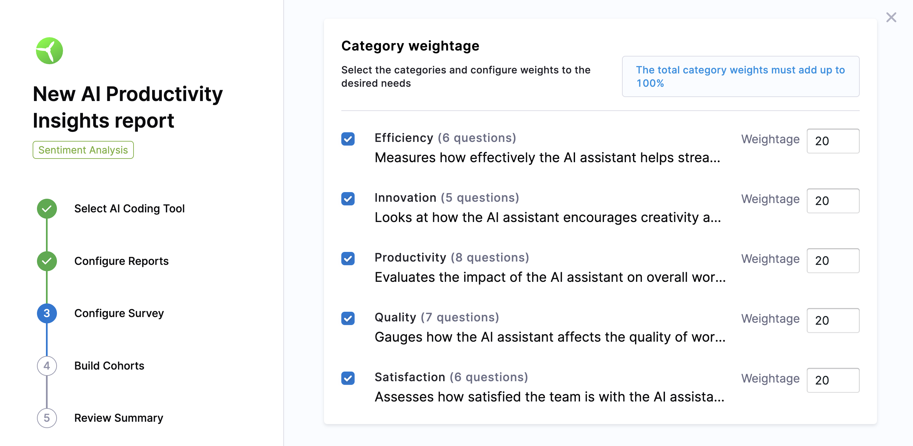
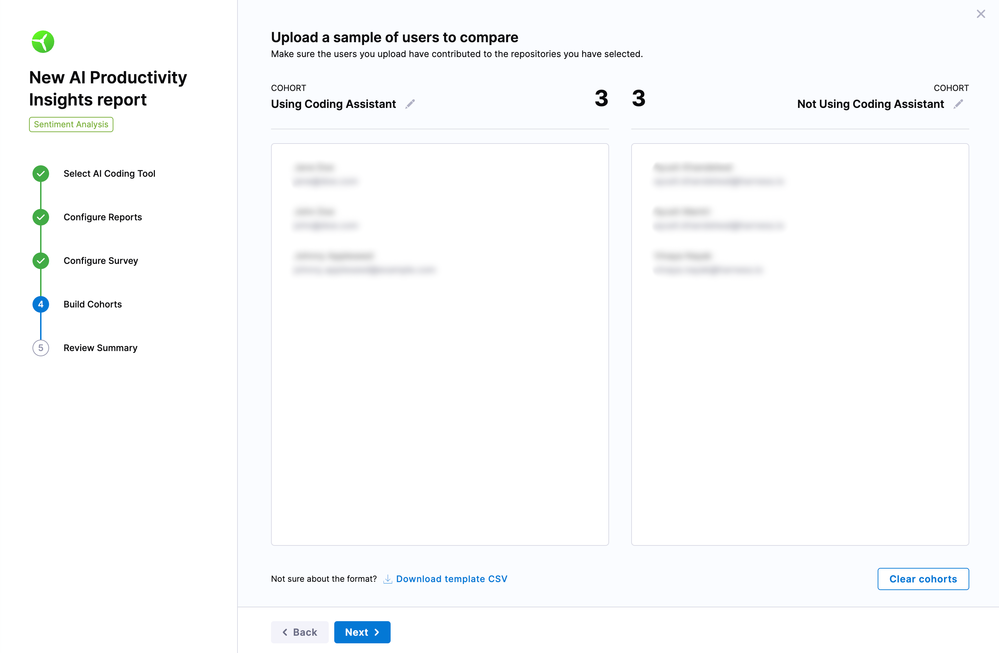
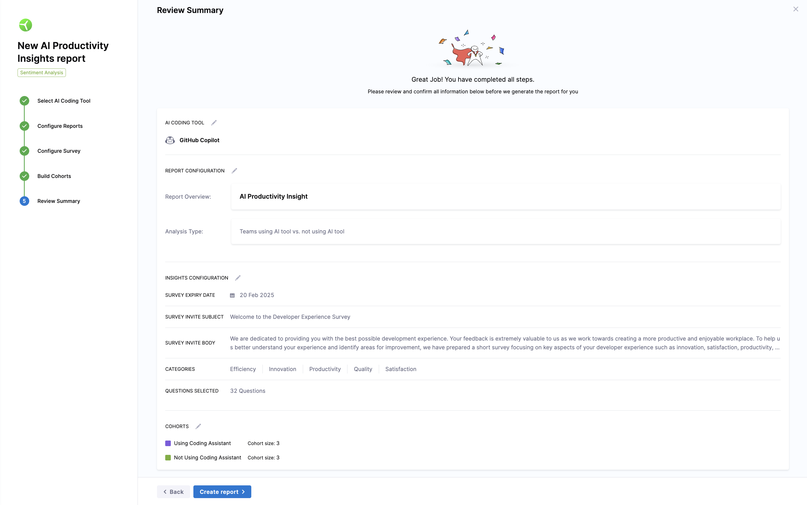
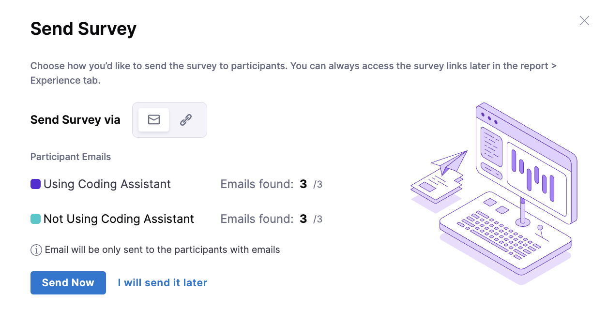

Sentiment analysis evaluates the perceptions and feelings of developers toward the developer experience where AI code assistants may impact.It helps measure aspects like ease of use, satisfaction, productivity, and innovation.

This approach focuses on gathering sentiment insights about the developer experience through surveys. It captures developers opinions on the developer experience in productivity, efficiency, innovation etc

## When to use

Use sentiment analysis in the following situations:

* **Early stages of AI tool adoption:** When your team is just starting to use AI tools and you want to gauge how developers are responding to them.
* **Quick feedback loops:** When you need to quickly assess how AI tools are impacting your developers' experience and performance.
* **Lightweight assessments:** When you prefer a simple, quick way to evaluate how developers perceive the AI tools, rather than detailed, time-consuming studies.

## Generate the report

* Go to the **AI Productivity Insights** section in the left menu of your Harness project. 

* Choose **Sentiment Analysis** as the report type and click **Continue.**  

### Step 1: Choose your AI Tool

Choose the AI coding tool that your team is using.

* Google Gemini Code Assist
* Harness AI Code Assistant
* GitHub Copilot

### Step 2: Configure the report settings

* Give the report a name.  
* Define what you want to measure:  
  * **AI vs Non-AI Teams:** Compare performance between teams that use AI tools and those that do not. This analysis helps identify the tangible benefits AI tools bring to the development process.
  * Note that the support for assessing how the performance of the same team changes over a specified time period, such as before and after implementing an AI tool is currently not available but will be added in the future.

### Step 3: Set up the survey

Set up the survey to collect feedback based on selected categories.  

* **Survey Expiry:** Set a deadline (e.g., January 12, 2025) for participants to complete the survey.  
* **Customize the email header and body or keep it as is.**  

> **Email Invite Subject:**  
> *"Welcome to the Developer Experience Survey."*  
>  
> **Email Invite Body:**  
> *We are dedicated to providing you with the best possible development experience. Your feedback is extremely valuable to us. This survey focuses on innovation, satisfaction, productivity, and efficiency. Your responses are confidential and will guide improvements. Please take a moment to complete the survey. Thank you!*  

### Step 4: Select categories for analysis

Categories are various aspects of sentiment analysis such as Impact, Efficiency, Productivity etc. Each category has a set of default questions that will be sent out as part of the survey.

Configure categories to reflect your priorities. Assign a total weight of 100% across all categories. The assigned weight will be considered while calculating the category scores as well as the overall productivity boost.

| **Category**   | **Weightage** | **Purpose**                                             |
|---------------|--------------|---------------------------------------------------------|
| Efficiency    | e.g., 20%     | Measures the impact of AI on task streamlining.         |
| Innovation    | e.g., 20%     | Evaluates how AI fosters creativity and solutions.      |
| Productivity  | e.g., 20%     | Assesses overall work output with AI tools.             |
| Quality       | e.g., 20%     | Examines code and workflow quality improvements.        |
| Satisfaction  | e.g., 20%     | Measures developer happiness with AI tools.             |

For detailed instructions on setting up the survey, refer to the **Developer Experience Survey** guide.  

### Step 5: Add participants and build cohorts

Group participants into the following categories:  

* **Using AI Tools:** Developers actively using AI tools like GitHub Copilot or Harness AI Code Assistant.
* **Not Using AI Tools:** Developers not using any AI assistance tools.

#### Upload cohort details

Use a CSV to upload participant information such as name and email. Use the provided template if you are unsure about formatting.
Note that email is optional and if provided the email will be used to send out the survey in the respective emails.

### Step 6: Review and confirm the configuration

Before proceeding, check the following:  

* Ensure the selected categories and questions are correct.  
* Participants can be distributed across groups without strict requirements.  

Click **Create Report** once ready.  

### Step 7: Send the survey

Distribute the survey using the following methods:  

* **Send Now:** Email the survey to participants immediately.  
* **Send Later:** Save the survey link for manual distribution at another time.  

